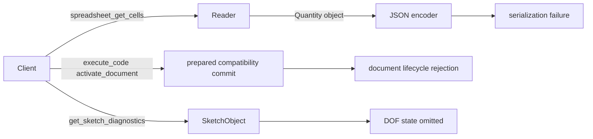
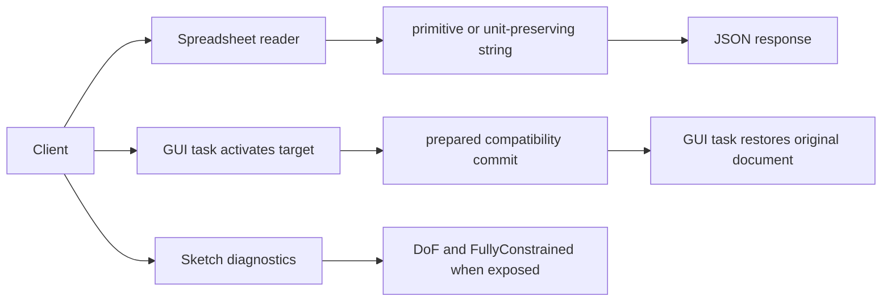
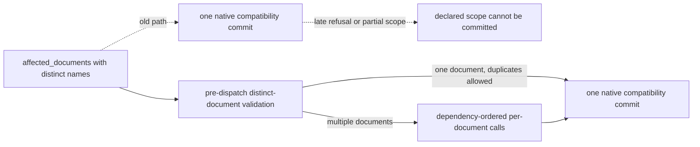
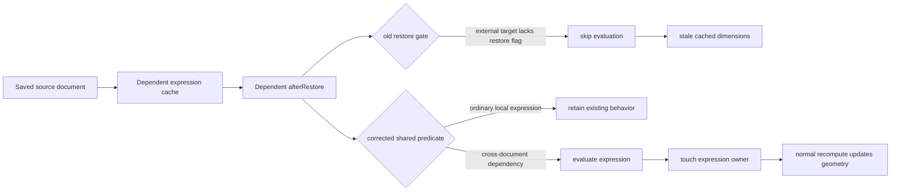
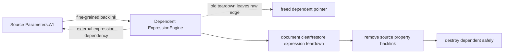
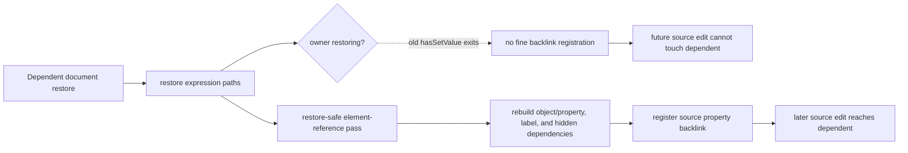
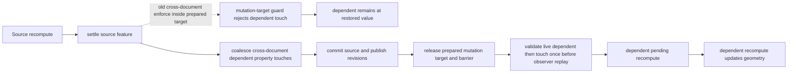
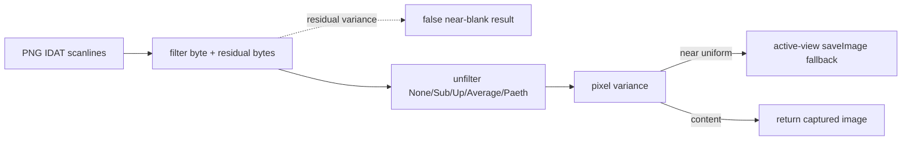
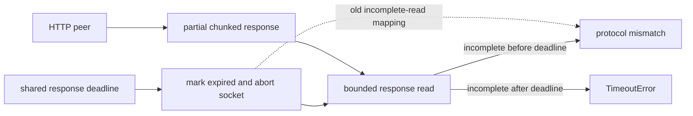
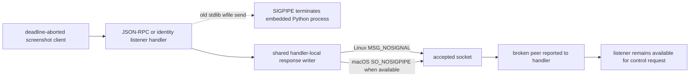

# Chair MCP current-branch fixes

This change keeps inspection data serializable, reports the Sketcher solver's
actual fields, and places GUI document focus outside the native mutation
boundary.





















The reader retains FreeCAD quantity units by returning their string form. The
diagnostic response omits unavailable solver fields instead of manufacturing a
zero value. PNG blank detection reconstructs 8-bit non-interlaced grayscale,
truecolor, grayscale-alpha, and RGBA scanlines before measuring variance.

On restore, ordinary local expressions retain existing restore behavior. An
expression whose resolved dependency belongs to another document is evaluated,
so a changed source cannot leave dependent geometry at its serialized value.
Closing that dependent also unregisters its fine-grained property backlink from
the still-open source before destruction, so a later source edit cannot visit a
freed expression owner. Restoring an expression now rebuilds the same property
backlinks after its restore-safe element-reference pass, so later source edits
continue to propagate after a clear/restore cycle.

A malformed chunked response remains a protocol error when the peer closes it
immediately. When the transport's own deadline aborts a stalled partial read,
the response instead reports a timeout, preserving the caller's recovery
classification.

The listeners keep the host process's SIGPIPE disposition intact. Their shared
response writer applies the platform socket suppression only to listener
headers, error responses, and bodies, so an abandoned screenshot response
becomes a normal request failure and the listener can continue serving control
traffic.

Each live `execute_code` mutation has one native compatibility commit, so its
scope is limited to one distinct document. Callers must update cross-document
dependencies in dependency order. Existing-object dynamic-property restrictions
remain intentional; create a compatible object with the required schema rather
than modifying an arbitrary existing object's property schema.

## CHAIR-07 assembly link replay touch

GDB v9 proved the defect window is `Gui::LinkView::onLinkedUpdateData` at
`ViewProviderLink.cpp:1543`, not `LinkBaseExtension::extensionExecute`. During
deferred collaboration notification replay, the GUI link observer must not call
`_LinkTouched.touch()` after eager recompute has already settled the links.

```mermaid
sequenceDiagram
 participant Commit as Compatibility commit
 participant Rec as Eager recompute
 participant Barrier as finishCollaborationCommitNotificationBarrier
 participant Replay as Deferred ObjectChanged
 participant Slot as Gui::Document::slotChangedObject
 participant LV as LinkView::onLinkedUpdateData
 participant Link as App::Link _LinkTouched
 Commit->>Rec: execute graph; links settle
 Rec->>Barrier: committed=true; barrier already down
 Barrier->>Replay: collaborationReplayingNotifications=true
 Replay->>Slot: signalChangedObject(linked body, non-Output)
 Slot->>LV: ViewProvider updateData
 Note over LV,Link: Old: Property::touch after execute leaves Touch/Enforce
 Note over LV,Link: New: skip App-dirtying touch while replaying; signal-only tree notify
```

Composer patch applied in worktree
`C:\Users\Rchie\Music\FreeCADModeling\FreeCAD-wt-chair07`; GUI gtests added in
`tests/src/Gui/CollaborationLinkReplayGuard.cpp`. Luna v12 gtests passed
(replay 3/3, compatibility 18/18, domain 34/35 with the pre-existing FBO skip).
Luna run17 passed the producer gate (`live_ready=true`, links Up-to-date, no
extra recompute). Sol verified that run; fixture `verdict: "reproduced"` is
the ~25.5s latency classifier, not the producer defect.
