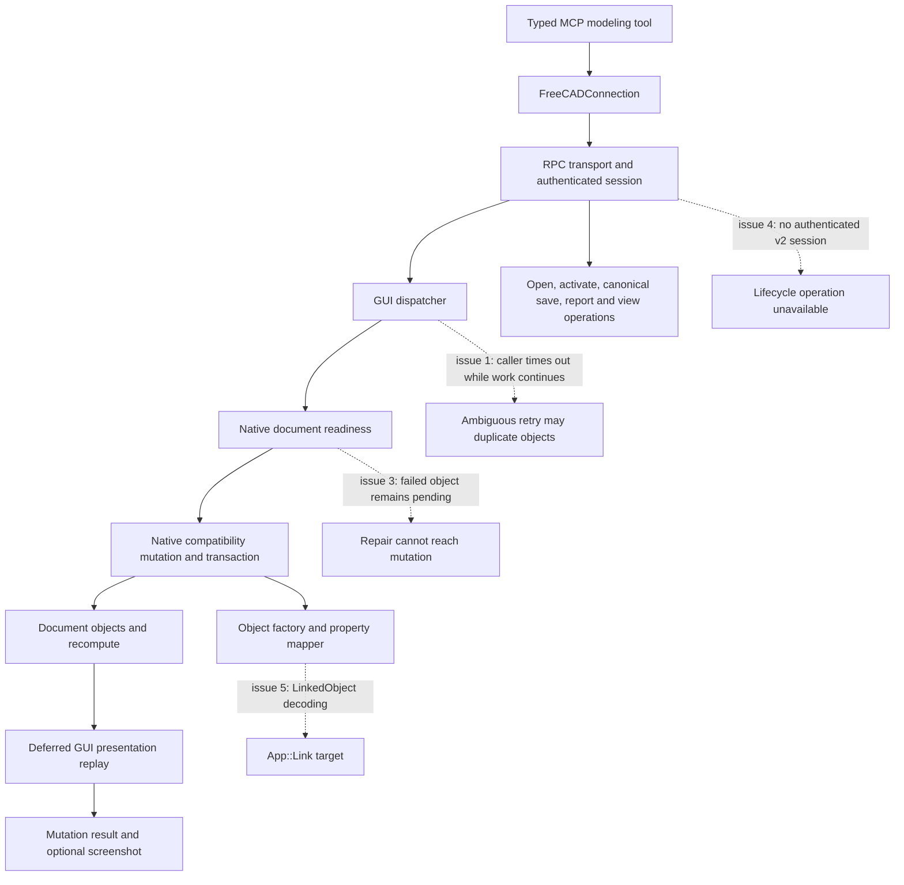
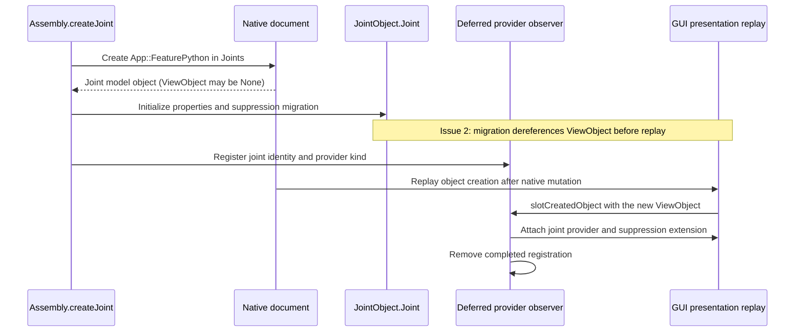
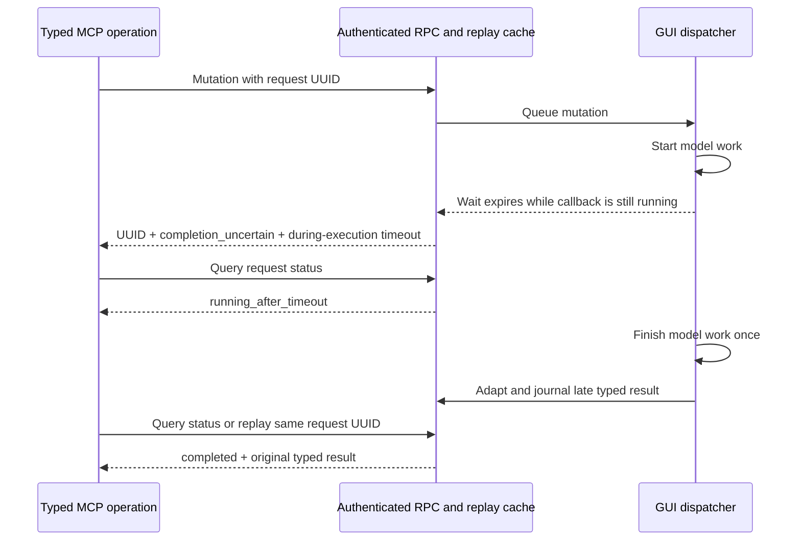
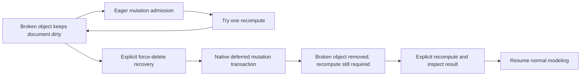
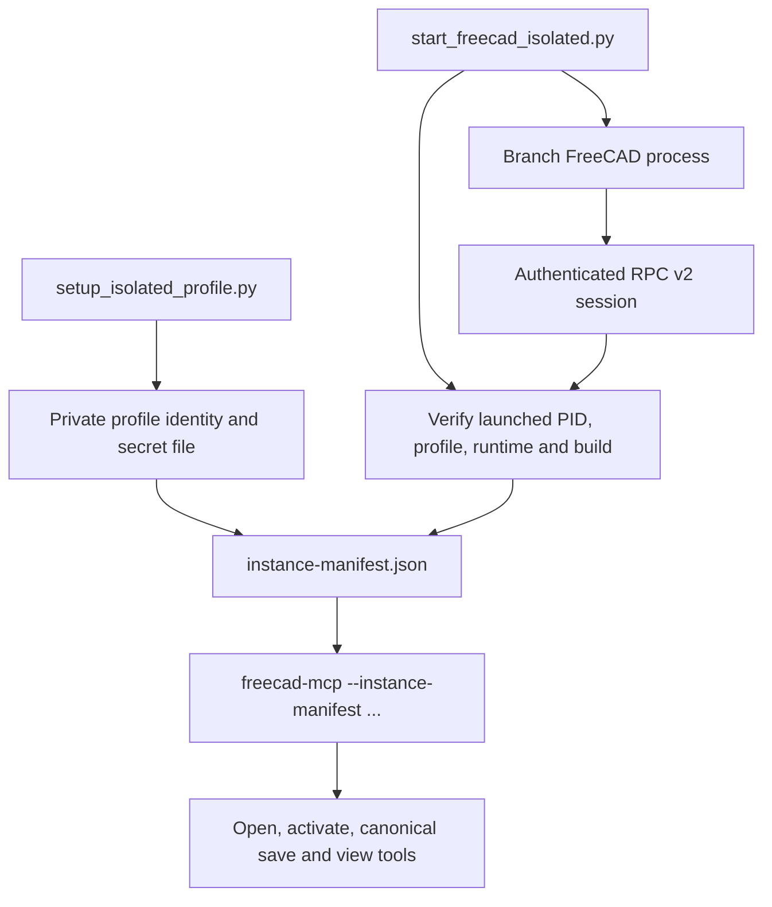

# Chair MCP modeling and recovery architecture

This overview follows the five chair-modeling reports in `.idea` on branch
`integrate/change-aware-save-mcp-autonomy`. Progress and validation evidence are
recorded in [the issue ledger](../.idea/issue_progress.md).

## Request and mutation path



The native FreeCAD collaboration service owns document mutation. Authentication
identifies the RPC caller; the retired Python lease tools do not replace native
document authority. Presentation can be delivered after the model commit, so
`App.GuiUp` does not imply a new object's `ViewObject` already exists.

## Joint creation and deferred presentation



Model initialization now tolerates a missing view object. The observer attaches
the correct joint or grounded-joint provider when presentation becomes available.
Registrations retain object identity so a reused name cannot receive a stale
provider. Failed initialization removes the partial joint and its registration;
object/document deletion also clears pending registrations. This prevents the
reported failed constructor from creating the invalid state in issue 3.

## Timeout and late-result recovery



The RPC handler finishing with a timeout is distinct from the GUI callback
finishing. Status must reflect active uncertain work first, then the late result.
The late result must also use the same typed response adapter as an on-time
result; a raw callback boolean or list is not a valid replacement for a typed
object or feature response. Replaying the same authenticated request UUID reads
the stored result and must not run the model callback again.

Authenticated inflight identity supplies the late-result journal context even
though the native mutation path no longer creates a legacy lease context.
Generated sketch operations use the `execute_code` response finalizer for both
normal and late results. Cancellation retains precedence over late success.
The regression injects a short timeout into the real RPC/GUI-dispatch/client path;
it verifies one execution and a recoverable typed result. The original large
chair's execution time has not been reproduced or benchmarked.

## Recovery admission



The existing eager coordinator refuses preexisting recompute work because its
recompute scope belongs to the current transaction. A failed object can never
satisfy that prerequisite. Recovery therefore needs an explicit operation that
uses the native deferred policy, followed by recompute. Transaction, pause,
quarantine, poison, and active recompute checks still apply.

`delete_object(..., force=True)` selects this narrow recovery policy and returns
`recompute.policy = "deferred_recovery"` with `recompute.required = true`.
Both on-time and recovered late responses retain that instruction. Ordinary
deletion keeps eager recompute admission. A native regression removes a dirty,
invalid link, recomputes, and verifies that normal modeling can resume.

## Typed link properties

The property mapper now resolves string values for `App::PropertyLink` and
`App::PropertyXLink` through the owning document before assigning them. This
covers `App::Link.LinkedObject` without relying on a property-name allowlist.
A missing target raises an error within the native creation transaction, which
rolls back the partial object.

## Model result versus presentation result

Create, edit, generated sketch code, and sketch deletion can finish their model
transaction before a screenshot is captured. Screenshot exceptions now preserve
the successful model result and add a presentation warning. Server-side deferred
object presentation failures receive the same treatment. Returning a generic
mutation failure at this point invites duplicate objects when the caller retries.
This additional finding is tracked as issue 6.

## Authenticated lifecycle setup



The regular `start_freecad.py` launcher historically enables addon autostart
without provisioning an authenticated instance manifest. A successful ping or
legacy modeling call therefore does not establish readiness for authenticated
lifecycle tools. The repository already has a separate profile setup and
launcher that prove the exact process before the MCP client connects. Secrets
stay in the profile file and are not passed as command-line values.

The root launcher now exposes that setup directly:

```sh
python start_freecad.py --authenticated-isolated --freecad /absolute/path/to/FreeCAD
```

After readiness verification, the launcher prints the exact `uv run --directory
... freecad-mcp --instance-manifest ...` command for the MCP configuration. The
legacy launcher labels its unauthenticated mode and points to this option.

## Code map

| Responsibility | Location |
| --- | --- |
| Public Assembly joint creation | `src/Mod/Assembly/Assembly/api.py` |
| Joint migration and presentation | `src/Mod/Assembly/JointObject.py` |
| GUI request lifecycle | `tools/mcp/freecad-mcp/addon/FreeCADMCP/dispatch/` |
| Native mutation admission and execution | `tools/mcp/freecad-mcp/addon/FreeCADMCP/rpc_server/methods/cad_methods_ops/` |
| RPC session setup | `tools/mcp/freecad-mcp/addon/FreeCADMCP/rpc_server/server_lifecycle_ops/v2_session.py` |
| Object creation and property decoding | `tools/mcp/freecad-mcp/addon/FreeCADMCP/rpc_server/object_factory.py`, `property_mapper.py` |
| MCP tool result and screenshot handling | `tools/mcp/freecad-mcp/src/freecad_mcp/operations/core_ops/object_ops.py` |

The diagrams describe the reported failure paths and implemented recovery flow.
Final regression results are recorded in the issue ledger.
