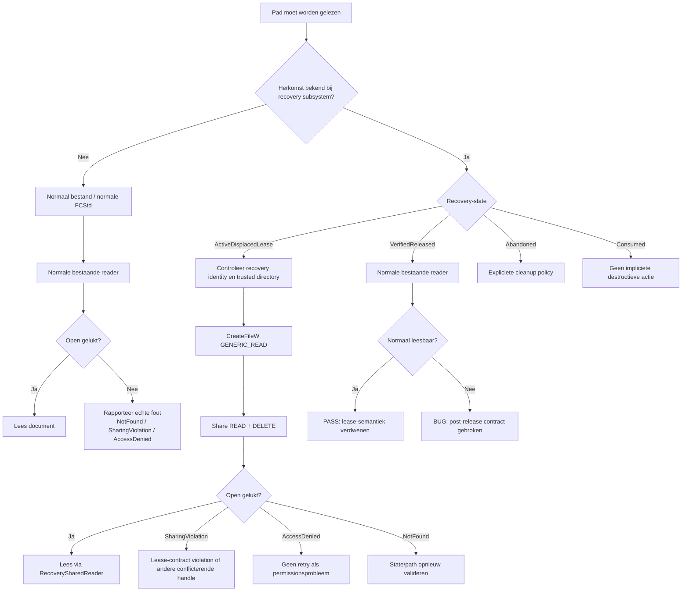

# Windows `FILE_SHARE_DELETE` voor FreeCAD-recovery: onderzoek, ontwerp en validatie

## Executive summary

De kernconclusie is dat het beschreven Windows-gedrag **geen indicatie is dat `.displaced`-bestanden verdwenen, corrupt of intrinsiek onleesbaar zijn**. Het is een normale consequentie van Win32 share-mode-contracten. Wanneer FreeCAD een intern recoverybestand openhoudt met `DELETE`-access, moet iedere later geopende handle in zijn `dwShareMode` expliciet toestaan dat een reeds bestaande handle `DELETE`-access heeft. Een gewone reader die dat niet doet, kan daarom `ERROR_SHARING_VIOLATION` krijgen. Microsoft documenteert bovendien expliciet dat `DELETE`-access zowel verwijderen als hernoemen omvat. citeturn18search10turn18search12

Het belangrijkste ontwerpresultaat van dit onderzoek is iets subtielers dan simpelweg “voeg overal `FILE_SHARE_DELETE` toe”:

> **Gebruik `FILE_SHARE_DELETE` alleen aan de reader-kant van een expliciet intern recoverypad, en maak de actieve recovery-lease zelf een `DELETE`-only handle met `FILE_SHARE_READ`, niet met `FILE_SHARE_DELETE`.**

Dat levert op Windows een bijzonder nuttig contract op:

```text
FreeCAD lease:
    desired access = DELETE
    share mode     = FILE_SHARE_READ

speciale recovery-reader:
    desired access = GENERIC_READ
    share mode     = FILE_SHARE_READ | FILE_SHARE_DELETE
```

Deze combinatie slaagt omdat de lease lezen toestaat en de reader de bestaande `DELETE`-access toestaat. Tegelijkertijd kan een **nieuwe** externe handle met `DELETE`-access niet worden geopend, omdat de lease zelf geen `FILE_SHARE_DELETE` aanbiedt. Een nieuwe writer wordt eveneens geweigerd omdat de lease geen `FILE_SHARE_WRITE` aanbiedt. De reeds bestaande FreeCAD-handle heeft daarentegen zijn `DELETE`-recht al verkregen en kan dat recht gebruiken voor een rename of disposition via diezelfde handle. Daarmee krijg je precies de gewenste asymmetrie: **readers mogen observeren, maar FreeCAD behoudt als leasehouder de exclusieve nieuwe delete/rename-authoriteit.** Dit volgt rechtstreeks uit de bilaterale access/share-regels van `CreateFile`. citeturn18search10turn18search12turn24search0turn24search5

Dit patroon is niet exotisch. Git implementeert op Windows bewust een eigen `open()`-laag omdat de CRT onvoldoende controle over `FILE_SHARE_DELETE` geeft; de Git-bron noemt delete-sharing expliciet noodzakelijk om bestanden te kunnen unlinken of vervangen terwijl een ander proces ze open heeft. libuv wijkt om dezelfde reden bewust af van CRT-semantiek en opent normale bestanden standaard met `FILE_SHARE_READ | FILE_SHARE_WRITE | FILE_SHARE_DELETE`. CPython documenteert exact het spiegelbeeld van het FreeCAD-probleem bij `NamedTemporaryFile`: een file geopend met `DELETE`/delete-on-close kan alleen opnieuw worden geopend door een reader die eveneens delete sharing toestaat. .NET heeft hetzelfde probleem en de .NET-maintainer adviseert expliciet `FileShare.Delete` op de tweede handle. citeturn23view0turn17view0turn19search1turn21search0

Tegelijkertijd laat Chromium zien waarom een **globale wijziging van alle readers** geen goed ontwerp is: Chromium kent een “share all”-patroon waar delete sharing gewenst is, maar zijn gewone `ReadFile` opent op Windows nog steeds met alleen `FILE_SHARE_READ | FILE_SHARE_WRITE`. Met andere woorden: share policy hoort bij de semantiek van de call-site, niet bij “alle bestanden op Windows”. citeturn19search0turn23view1

Voor FreeCAD betekent dit concreet:

1. normale gebruikersdocumenten (`.FCStd`) blijven op het bestaande normale I/O-pad;
2. alleen een door de recovery-subsystem als **interne, actief geleasede** `.displaced` geïdentificeerde file gaat naar een `RecoverySharedReader`;
3. de owner-lease wordt na het schrijven/verifiëren teruggebracht tot een `DELETE`-only handle met `FILE_SHARE_READ`;
4. rename/delete tijdens de lease gebeurt zo veel mogelijk **via de bestaande owner-handle** (`SetFileInformationByHandle`), zodat FreeCAD niet eerst zijn eigen exclusiviteit hoeft op te geven;
5. na lease-release moet dezelfde recoveryfile aantoonbaar weer via de gewone reader kunnen worden geopend;
6. een geverifieerde recoveryfile mag nooit onder een impliciete `FILE_FLAG_DELETE_ON_CLOSE`- of destructor-policy blijven vallen;
7. een destructor van een gepubliceerd/gevalideerd recoveryobject moet uitsluitend resources sluiten en **nooit impliciet het recoverybestand verwijderen**.

Microsoft beschrijft dat een delete-on-close-bestand pas werkelijk verdwijnt na het sluiten van de relevante handles en dat een file die als deletion-pending geldt andere openpogingen kan blokkeren. Ook kan een eenmaal met `FILE_FLAG_DELETE_ON_CLOSE` geopende handle niet veilig als algemene “tijdelijk maar misschien later bewaren”-constructie worden behandeld. Daarom raad ik aan het lifecycleconcept “recovery candidate” volledig te scheiden van een algemene `ScopedTempFile`. citeturn18search2turn18search14

De Windows-tests moeten vervolgens niet vragen: **“kan ieder bestaand bestand altijd met `std::ifstream` worden geopend?”**, maar:

> **“is dit een normaal gebruikersbestand, een intern bestand in een actieve delete-lease, of een vrijgegeven/gepubliceerd recoverybestand, en gedraagt iedere toestand zich volgens zijn eigen contract?”**

Mijn aanbeveling is daarom om Part 3 inderdaad geblokkeerd te houden totdat ten minste de actieve-lease-reader, exclusieve delete/rename-authoriteit, post-release normale leesbaarheid én destructor-retentie op echte Windows-handles groen zijn.

Voor de FreeCAD-specifieke migratie is één beperking belangrijk: de upstream-bron bevat op de onderzochte snapshot wel expliciete recoverycomponenten zoals `src/App/RecoverySnapshot.cpp`, `src/Gui/DocumentRecovery.cpp` en `src/Gui/AutoSaver.cpp`, maar de precieze `.displaced`-implementatie waarop jouw probleem betrekking heeft is op basis van de beschikbare upstream-index niet voldoende vastgesteld. De patches hieronder zijn daarom bewust **architecturale/pseudo-patches** en geen claim dat de genoemde regels één-op-één overeenkomen met jouw branch. fileciteturn1file0L1-L4 fileciteturn1file1L6-L10 fileciteturn10file1L6-L10

## Wat Windows daadwerkelijk afdwingt

De meest relevante Win32-parameter is niet alleen `dwDesiredAccess`, maar de combinatie van `dwDesiredAccess` en `dwShareMode` voor **iedere gelijktijdig open handle**. Microsoft documenteert dat een nieuwe `CreateFile` faalt met `ERROR_SHARING_VIOLATION` wanneer de gevraagde access en bestaande share-modes niet compatibel zijn; de share-instellingen blijven van kracht totdat de betreffende handle wordt gesloten. `FILE_SHARE_DELETE` staat toe dat een andere handle delete-access vraagt, waarbij Microsoft expliciet vermeldt dat delete-access ook rename-operaties omvat. citeturn18search10turn18search12

Conceptueel kun je de Windows-check als twee richtingen zien. Voor iedere bestaande handle \(H_e\) en een nieuwe handle \(H_n\) moet gelden:

```text
DesiredAccess(new)      ⊆ ShareMode(existing)
DesiredAccess(existing) ⊆ ShareMode(new)
```

waarbij we alleen naar de drie relevante categorieën `READ`, `WRITE` en `DELETE` kijken. Dit is een vereenvoudigd model van de access/share-check, maar het verklaart precies het waargenomen FreeCAD-gedrag. citeturn18search12

Stel dat FreeCAD dit doet:

```text
H_owner:
    desired = DELETE
    share   = READ
```

en daarna komt een conventionele reader:

```text
H_normal_reader:
    desired = READ
    share   = READ
```

De eerste richting is in orde:

```text
reader wants READ
owner shares READ
=> OK
```

maar de tweede richting niet:

```text
owner already has DELETE
reader does not share DELETE
=> ERROR_SHARING_VIOLATION
```

Dat is dus **niet** hetzelfde als `ERROR_FILE_NOT_FOUND`.

De correcte interne reader is:

```text
H_recovery_reader:
    desired = READ
    share   = READ | DELETE
```

Nu zijn beide checks compatibel:

```text
reader wants READ  -> owner shares READ    -> OK
owner has DELETE   -> reader shares DELETE -> OK
```

Tegelijkertijd kan een derde partij niet zomaar een tweede delete-handle verkrijgen:

```text
H_attacker_or_other_deleter:
    desired = DELETE
```

want:

```text
deleter wants DELETE
owner shares only READ
=> ERROR_SHARING_VIOLATION
```

Het cruciale onderscheid is daarom:

> `FILE_SHARE_DELETE` **geeft de reader zelf geen `DELETE`-recht**. Het zegt alleen dat de reader het bestaan of de toekomstige werking van een delete-capabele handle niet blokkeert.

De toegang die een handle zelf krijgt staat in `dwDesiredAccess`; de share mode regelt welke accesscategorieën door gelijktijdige handles mogen bestaan. Dat onderscheid is precies waarom de voorgestelde constructie read-only toegang kan combineren met exclusieve owner-authoriteit. citeturn18search5turn18search12

### Het gewenste leasecontract

De beste vorm is een tweefasenmodel.

Tijdens het **produceren** van de snapshot heeft FreeCAD tijdelijk write-access nodig. Die writer moet zijn werk afmaken, flushen, de snapshot laten verifiëren en vervolgens sluiten. Daarna wordt een afzonderlijke **leasehandle** geopend die alleen nog `DELETE` nodig heeft.

```cpp
HANDLE acquireRecoveryDeleteLease(const wchar_t* path)
{
    return ::CreateFileW(
        path,
        DELETE,                 // owner authority: rename/delete
        FILE_SHARE_READ,        // readers toegestaan; geen nieuwe writer/delete owner
        nullptr,                // niet-inheritable handle
        OPEN_EXISTING,
        FILE_ATTRIBUTE_NORMAL,
        nullptr);
}
```

Dit ontwerp is beter dan een permanente handle met bijvoorbeeld `GENERIC_READ | GENERIC_WRITE | DELETE`. Als de leaseowner ook `GENERIC_WRITE` zou vasthouden, dan moet **iedere latere reader** namelijk `FILE_SHARE_WRITE` aanbieden om de reeds bestaande write-access compatibel te maken. Daardoor wordt de share-policy onnodig breed. Het reduceren van de ownerhandle tot alleen `DELETE` maakt het contract veel eenvoudiger en beter afdwingbaar. De bilaterale share-regels zijn dezelfde die Microsoft voor `CreateFile` documenteert. citeturn18search10turn18search12

De interne recovery-reader wordt dan:

```cpp
HANDLE openDisplacedForRead(const wchar_t* path)
{
    return ::CreateFileW(
        path,
        GENERIC_READ,
        FILE_SHARE_READ | FILE_SHARE_DELETE,
        nullptr,
        OPEN_EXISTING,
        FILE_FLAG_SEQUENTIAL_SCAN,
        nullptr);
}
```

**Bewust ontbrekend:** `FILE_SHARE_WRITE`. De actieve ownerlease laat toch geen nieuwe writer toe, en er is geen reden om de speciale reader breder te maken dan het contract vereist.

De normale reader blijft onaangeraakt:

```cpp
std::ifstream openNormalDocument(const std::filesystem::path& path)
{
    return std::ifstream(path, std::ios::binary);
}
```

Daarmee wordt `.FCStd` niet afhankelijk van recovery-specifieke Windows-semantiek.

### Rename en delete moeten de bestaande authority-handle gebruiken

Microsoft biedt `SetFileInformationByHandle` met onder meer `FileRenameInfo` en `FileDispositionInfo`. Voor delete-disposition moet de handle met `DELETE`-access zijn geopend; op het lagere Windows-filesystemniveau vereist rename eveneens `DELETE`-access op het te hernoemen bestand. citeturn24search0turn24search5

Dat is voor dit ontwerp belangrijk. Een slechte implementatie zou zijn:

```text
owner houdt exclusieve DELETE-lease
        |
        +--> owner sluit lease
        |
        +--> MoveFileEx(path, newPath)
```

Tussen `CloseHandle` en `MoveFileEx` ontstaat dan een nieuw race-window: precies op het moment dat de exclusiviteit wordt opgegeven kan een ander proces de file openen.

Beter is conceptueel:

```text
owner heeft H_owner met DELETE
        |
        +--> SetFileInformationByHandle(H_owner, FileRenameInfo, ...)
```

zodat de rename-authoriteit via de reeds verkregen handle wordt uitgeoefend. `SetFileInformationByHandle` ondersteunt hiervoor `FileRenameInfo`; de concrete rechten en doel-directoryrechten moeten bij de uiteindelijke implementation worden gevalideerd. citeturn18search1turn24search5

Voor verwijdering is het eenvoudige equivalent:

```cpp
bool markForDeletion(HANDLE owner)
{
    FILE_DISPOSITION_INFO info{};
    info.DeleteFile = TRUE;

    return ::SetFileInformationByHandle(
               owner,
               FileDispositionInfo,
               &info,
               sizeof(info)) != FALSE;
}
```

Een belangrijk recovery-ontwerpverschil is echter dat dit **alleen** bij een expliciete discard/cleanup-operatie mag gebeuren, nooit automatisch omdat een C++ recoveryobject uit scope gaat.

### `DELETE_ON_CLOSE` is hier de verkeerde lifecycle-primitief

Microsoft beschrijft dat delete/disposition een file kan markeren voor verwijderen en dat de daadwerkelijke verwijdering afhankelijk is van openstaande handles. De `FILE_DISPOSITION_INFO`-documentatie merkt bovendien op dat het terugzetten van de disposition geen effect heeft wanneer de handle met `FILE_FLAG_DELETE_ON_CLOSE` werd geopend. citeturn18search2turn18search14

Dat maakt:

```cpp
FILE_FLAG_DELETE_ON_CLOSE
```

geschikt voor **echt wegwerpbare temporary files**, maar ongeschikt als eenzelfde bestand later kan worden gepromoveerd tot een waardevolle geverifieerde recovery snapshot.

Het recoveryconcept moet daarom gescheiden worden:

```text
ScopedTempFile
    -> altijd disposable
    -> delete-on-destruct/delete-on-close mag logisch zijn

RecoveryArtifact
    -> kan user data worden
    -> nooit impliciet delete-on-close
    -> expliciete state transitions
```

### Handle inheritance

Een recoverylease die per ongeluk naar een child process wordt geërfd kan veel langer blijven bestaan dan de C++-owner denkt. Windows-handle-inheritance vereist zowel een inheritable handle als een procescreatie waarbij inheritance wordt toegestaan; inherited handles verwijzen naar hetzelfde kernelobject. citeturn18search11turn18search13turn18search18

Daarom moet de recoverylaag handles niet-inheritable maken. `nullptr` voor `lpSecurityAttributes` is de eenvoudige normale keuze; als defense-in-depth kan de implementatie bovendien expliciet controleren/clearen:

```cpp
::SetHandleInformation(
    handle,
    HANDLE_FLAG_INHERIT,
    0);
```

Een child-process-test hoort dit contract later expliciet te bewijzen.

Het totale beslismodel is dan:



## Patronen uit echte Windows-applicaties en libraries

De survey laat twee duidelijke families zien.

De eerste familie behandelt delete-sharing als onderdeel van een **brede Unix-achtige open-policy**: Git, libuv en historisch OpenJDK zijn daar voorbeelden van. De tweede familie gebruikt delete-sharing **selectief**: Chromium heeft zowel share-all-opens als gewone readers zonder delete-sharing, terwijl SQLite juist bewust een ander lockingmodel gebruikt. Die variatie is een sterk argument om FreeCAD niet met één globale Win32 share policy op te zadelen.

| Applicatie / library | Aangetroffen Windows-patroon | Temp/recovery/rename-strategie | Relevantie voor FreeCAD |
|---|---|---|---|
| **Git / Git for Windows-codepad** | Git implementeert een eigen Windows `open()` omdat `_wopen`/`_wsopen` onvoldoende controle geeft over `FILE_SHARE_DELETE`. De huidige code opent bestaande files met `FILE_SHARE_READ | FILE_SHARE_WRITE | FILE_SHARE_DELETE`. citeturn23view0 | De bron motiveert delete-sharing expliciet vanuit het kunnen unlinken of renamen van open files. citeturn23view0 | Bijna één-op-één precedent voor een kleine Win32-specifieke readerlaag boven de CRT. |
| **libuv / Node.js-ecosysteem** | libuv gebruikt voor reguliere Windows-opens standaard alle drie share flags; alleen een expliciete exclusive-lockoptie zet share mode op nul. citeturn17view0 | Een tijdelijke open kan `FILE_FLAG_DELETE_ON_CLOSE` toevoegen en vraagt dan tevens `DELETE`-access. citeturn17view0 | Bewijst dat een cross-platform library bewust de CRT-share defaults kan omzeilen om Unix-achtige delete-while-open-semantiek te krijgen. |
| **Chromium / Chrome** | Chromium definieert `kFileShareAll = READ | WRITE | DELETE` en gebruikt delete-sharing op specifieke Windows-paths. Tegelijkertijd opent de gewone `ReadFile` helper momenteel met `FILE_SHARE_READ | FILE_SHARE_WRITE`, dus zonder delete. citeturn19search0turn23view1 | Chromium heeft daarnaast expliciete replace/delete helpers en retrylogica voor bepaalde delete-operaties. citeturn19search0 | Sterk argument voor **policy per use-case** in plaats van `FILE_SHARE_DELETE` globaal aan alle FreeCAD-readers toevoegen. |
| **SQLite** | De Windows VFS gebruikt voor de normale database-open `FILE_SHARE_READ | FILE_SHARE_WRITE`; een expliciete `exclusive`-optie kan share mode op nul zetten. citeturn20search0 | Deleteable temporary files krijgen `FILE_ATTRIBUTE_TEMPORARY`, hidden en `FILE_FLAG_DELETE_ON_CLOSE`. citeturn20search0 | Belangrijk tegenvoorbeeld: delete-sharing is geen universele “best practice”. SQLite combineert zijn eigen lockingprotocol met andere sharekeuzes. |
| **CPython** | Bij Windows `NamedTemporaryFile(delete=True)` resulteert de temporary-open in `DELETE`, `FILE_SHARE_DELETE` en delete-on-close; een tweede normale `open()` deelt delete niet en krijgt daardoor een sharing violation. citeturn19search1 | Het officiële CPython-issue beschrijft dat heropenen wel kan wanneer de tweede open óók delete-sharing aanbiedt. citeturn19search1 | Dit is praktisch exact het probleem dat de FreeCAD-test moet modelleren. |
| **.NET `System.IO`** | Een `FileStream` met `DeleteOnClose` kan een tweede reader blokkeren wanneer die alleen `ReadWrite` deelt. Een .NET-maintainer geeft als oplossing `FileShare.Delete` op de tweede reader. citeturn21search0 | Delete-on-close blijft aan de eigenaar gekoppeld; alle gelijktijdige handles moeten compatibele share-modes hebben. citeturn21search0 | Onafhankelijke bevestiging van de CPython/FreeCAD-semantiek op een andere runtime. |
| **OpenJDK NIO, WindowsChannelFactory-lijn** | De Windows-channelimplementatie initialiseert `shareRead`, `shareWrite` en `shareDelete` op true; `NOSHARE_READ/WRITE/DELETE` kan ze individueel uitschakelen. De resulting share mask bevat dus standaard `FILE_SHARE_DELETE`. citeturn22search1turn23view2 | `DELETE_ON_CLOSE` wordt afzonderlijk naar `FILE_FLAG_DELETE_ON_CLOSE` gemapt. citeturn22search1 | Laat zien hoe een high-level API share-policy expliciet als onderdeel van zijn Windows backend modelleert. De geraadpleegde code is een OpenJDK-bronlijn; voor een specifieke moderne JDK-release moet dit opnieuw per release worden geverifieerd. |
| **Microsoft Word / Office** | Microsoft documenteert voor Word een afzonderlijke tijdelijke “owner file” (`~$...`) wanneer een bestaand document wordt geopend. De publieke supportdocumentatie specificeert daarbij niet de onderliggende `CreateFile` share flags. citeturn15search3 | Office bewaart daarnaast AutoRecover-data en toont Document Recovery na een onverwachte afsluiting. citeturn15search6 | Architecturaal relevant: lock/ownership-metadata en recoverydata zijn verschillende concepten. Exacte Win32 share flags zouden bij gesloten Office-code speculatie zijn en worden hier daarom niet verzonnen. |

Een belangrijke methodologische conclusie is dus dat het niet verantwoord zou zijn om voor Dropbox, OneDrive, Adobe of Autodesk zonder broncode of expliciete leveranciersdocumentatie precieze `CreateFile`-flags te claimen. Hun producten kunnen waarneembaar rename-, sync- en recoverygedrag vertonen, maar daaruit volgt niet betrouwbaar welke `dwShareMode` voor iedere interne file wordt gebruikt. Voor deze survey zijn daarom liever acht gevallen met controleerbaar primair of officieel bewijs gebruikt dan een langere lijst met reverse-engineering-gissingen.

### Wat de acht voorbeelden gezamenlijk zeggen

**Git is het sterkste precedent voor de readerlaag.** Git constateert letterlijk in zijn bron dat de gewone Windows CRT-interfaces onvoldoende controle geven om `FILE_SHARE_DELETE` aan te zetten en implementeert daarom een eigen `CreateFileW`-pad, waarna de native handle met `_open_osfhandle` weer aan hoger gelegen C-code kan worden aangeboden. citeturn23view0

Die architectuur kan FreeCAD vrijwel conceptueel kopiëren:

```text
high-level parser
      |
      v
RecoveryInput
      |
      v
CreateFileW(... FILE_SHARE_DELETE ...)
      |
      v
RAII HANDLE
      |
      +--> custom streambuf / read adapter
      |
      +--> eventueel CRT-adapter indien bestaande API dat vereist
```

**CPython en .NET vormen het sterkste foutmodel.** Beide laten zien dat de fout ontstaat omdat de eigenaar delete-access heeft terwijl de tweede open geen delete-sharing aanbiedt. Dat is precies waarom de fout niet als “bestand ontbreekt” mag worden geïnterpreteerd. citeturn19search1turn21search0

**Chromium is het sterkste argument tegen een globale patch.** Dezelfde grote Windows-codebase kent zowel delete-sharing als gewone read helpers zonder delete-sharing. Dat maakt het plausibeler en onderhoudbaarder om de semantiek in een expliciete `RecoveryIO`-API te stoppen. citeturn19search0turn23view1

**SQLite is het belangrijkste negatieve voorbeeld.** De aanwezigheid van `FILE_SHARE_DELETE` is op zichzelf niet “beter”; de juiste share mode hangt af van het gewenste concurrency- en durabilitymodel. SQLite gebruikt voor zijn eigen Windows VFS read/write sharing en aanvullende database-lockingmechanismen, en gebruikt delete-on-close specifiek voor disposable temporary files. citeturn20search0

**Office laat ten slotte zien waarom “owner/lease” en “recovery artifact” conceptueel uit elkaar moeten blijven.** Word heeft een tijdelijke owner-indicator naast zijn recoverymechanisme; een recoverybestand is niet simpelweg hetzelfde als de lockfile. citeturn15search3turn15search6

## Aanbevolen FreeCAD-tussenlaag

Ik zou de component niet `FileShareDeleteHelper` noemen. Dat maakt een Windows-mechanisme tot de publieke abstrahering. Beter is bijvoorbeeld:

```text
App::RecoveryIO
```

met Windows als backenddetail.

De kernregels van de API zijn:

- **caller provenance bepaalt het bestandstype**, niet alleen de extensie;
- een normaal `.FCStd` krijgt nooit automatisch speciale sharing;
- een `.displaced` krijgt speciale sharing alleen wanneer het recovery-subsystem bevestigt dat het om een intern artifact in `ActiveLease` gaat;
- na `VerifiedReleased` gaat het bestand weer via de normale reader;
- een verified artifact krijgt een persistente `Keep`-retention state vóór de ownerlease wordt losgelaten;
- lease-handle en reader-handle zijn afzonderlijke RAII-objecten;
- destructor van de lease sluit alleen de handle;
- file deletion is een expliciete named operation, geen verborgen RAII-bijwerking.

### Voorgestelde interface

| API | Belangrijkste parameters | Semantiek | Resultaat/fouten |
|---|---|---|---|
| `classify(path, context)` | path, recovery token/context | Bepaalt `UserDocument`, `ActiveDisplaced`, `VerifiedRecovery`, `Unknown` | `ArtifactClass` |
| `openNormalRead(path)` | path | Bestaande normale FreeCAD-reader | `Ok`, `NotFound`, `SharingViolation`, `AccessDenied`, `IoError` |
| `openRecoveryRead(ref)` | trusted `RecoveryRef` | Windows: `GENERIC_READ`, share `READ|DELETE`; niet-Windows: normale read backend | idem + `IdentityMismatch`, `InvalidState` |
| `acquireDeleteLease(ref)` | verified internal artifact | Windows: `DELETE`, share `READ` | `RecoveryDeleteLease` |
| `renameThroughLease(lease, target)` | lease, target | Rename via bestaande authority-handle waar platform dit ondersteunt | `Ok`, `TargetExists`, `AccessDenied`, `SharingViolation`, `IoError` |
| `markVerifiedKeep(artifact)` | mutable artifact state | Maakt retention non-destructive vóór publish/release | `Ok`, `InvalidState` |
| `releaseLease(lease)` | owner lease | Sluit authority-handle; daarna gewone opens verwacht | `Ok` |
| `discardRecovery(artifact)` | expliciete caller-intentie | Enige normale weg naar destructive cleanup van recoverycandidate | `Ok` of concreet Win32 error |

Een mogelijke C++-vorm, zonder te veronderstellen dat de FreeCAD-branch al C++23 `std::expected` gebruikt:

```cpp
namespace App::RecoveryIO {

enum class ArtifactKind {
    UserDocument,
    ActiveDisplaced,
    VerifiedRecovery,
    Unknown
};

enum class ErrorCode {
    NotFound,
    SharingViolation,
    AccessDenied,
    IdentityMismatch,
    InvalidState,
    InvalidPath,
    IoError
};

struct Error {
    ErrorCode code;
    unsigned long nativeError = 0;   // GetLastError() op Windows
    std::string operation;
};

struct FileIdentity {
    std::uint64_t volumeSerial = 0;
    std::array<std::byte, 16> fileId{};
};

struct RecoveryRef {
    std::filesystem::path path;
    FileIdentity expectedIdentity;
    ArtifactKind kind;
};

class ReadHandle {
public:
    ReadHandle() noexcept = default;
    ReadHandle(const ReadHandle&) = delete;
    ReadHandle& operator=(const ReadHandle&) = delete;
    ReadHandle(ReadHandle&&) noexcept;
    ReadHandle& operator=(ReadHandle&&) noexcept;
    ~ReadHandle();

    std::size_t read(std::span<std::byte>);
    bool valid() const noexcept;

private:
#ifdef _WIN32
    HANDLE handle_ = INVALID_HANDLE_VALUE;
#else
    // bestaande platformrepresentatie
#endif
};

class DeleteLease {
public:
    DeleteLease(const DeleteLease&) = delete;
    DeleteLease& operator=(const DeleteLease&) = delete;
    DeleteLease(DeleteLease&&) noexcept;
    ~DeleteLease();  // uitsluitend CloseHandle; nooit impliciete delete

    Result<void, Error> renameTo(const std::filesystem::path&);
    Result<void, Error> discardExplicitly();

private:
#ifdef _WIN32
    HANDLE handle_ = INVALID_HANDLE_VALUE;
#endif
    FileIdentity identity_;
};

Result<ReadHandle, Error> openRecoveryRead(const RecoveryRef&);
Result<DeleteLease, Error> acquireDeleteLease(const RecoveryRef&);

} // namespace App::RecoveryIO
```

### Classificatie mag niet alleen op `.displaced` steunen

Dit is belangrijk voor security én correctheid:

```cpp
if (path.extension() == ".displaced")
    usePrivilegedRecoverySemantics();
```

is te zwak.

Een gebruiker of ander proces kan immers een willekeurig bestand die suffix geven. De speciale API verleent weliswaar geen `DELETE`-access aan de reader, maar extensiegebaseerde dispatch maakt de security- en lifecyclegrens onnodig onduidelijk.

Beter:

```text
RecoverySnapshotManager creëert artifact
        |
        +--> genereert RecoveryRef
        |       path
        |       recovery-id
        |       file identity
        |       lifecycle-state
        |
        +--> alleen RecoveryRef kan openRecoveryRead() aanroepen
```

Windows biedt hiervoor een bruikbare identity-primitief: `FILE_ID_INFO` bevat een volume-serienummer en 128-bit file-id; Microsoft beschrijft de combinatie als geschikt om te bepalen of twee handles op dezelfde machine hetzelfde bestand vertegenwoordigen. citeturn24search1

Daarmee kan het patroon worden:

```cpp
auto h = CreateFileW(...);

FILE_ID_INFO id{};
if (!GetFileInformationByHandleEx(
        h,
        FileIdInfo,
        &id,
        sizeof(id))) {
    // concrete fout
}

if (!matches(expectedIdentity, id)) {
    CloseHandle(h);
    return IdentityMismatch;
}
```

Dit verkleint een klassiek TOCTOU-probleem: eerst een path classificeren en daarna aannemen dat hetzelfde path nog steeds naar dezelfde file wijst.

Voor aanvullende pathvalidatie kan een op handle gebaseerde final-path-check worden gebruikt. `GetFinalPathNameByHandleW` geeft de volledig opgeloste file path terug en resolveert bijvoorbeeld symbolic-link targets. citeturn24search10

### Readeradapter naar bestaande C++-code

Als de huidige FreeCAD-parser een `std::istream&` verwacht, is het verleidelijk om na `CreateFileW` meteen `_open_osfhandle` te gebruiken. Git gebruikt precies zo'n bridge van Win32 `HANDLE` naar CRT file descriptor. citeturn23view0

Een FreeCAD-implementatie heeft twee opties.

De eenvoudigste lange-termijnoptie is een kleine `std::streambuf` boven `ReadFile`:

```cpp
class Win32ReadStreamBuf final : public std::streambuf {
public:
    explicit Win32ReadStreamBuf(HANDLE handle)
        : handle_(handle)
    {
        setg(buffer_.data(), buffer_.data(), buffer_.data());
    }

protected:
    int_type underflow() override
    {
        DWORD count = 0;
        if (!::ReadFile(
                handle_,
                buffer_.data(),
                static_cast<DWORD>(buffer_.size()),
                &count,
                nullptr)) {
            return traits_type::eof();
        }

        if (count == 0)
            return traits_type::eof();

        setg(buffer_.data(),
             buffer_.data(),
             buffer_.data() + count);

        return traits_type::to_int_type(*gptr());
    }

private:
    HANDLE handle_;
    std::array<char, 64 * 1024> buffer_{};
};
```

De tweede optie is een CRT-bridge:

```cpp
int fd = _open_osfhandle(
    reinterpret_cast<intptr_t>(handle),
    _O_RDONLY | _O_BINARY);
```

maar dan moeten handle-ownership en de verantwoordelijkheid voor `_close` versus `CloseHandle` extreem duidelijk zijn. Git lost dit bewust op in één compacte adapterlaag. citeturn23view0

Mijn voorkeur voor FreeCAD is een native `HANDLE`-RAII-object plus `streambuf`, omdat daarmee Win32 ownership niet via meerdere runtime-abstraheringen loopt.

### Lifecycle van het recoveryartifact

De state machine moet expliciet zijn:

```text
Creating
   |
   v
Written
   |
   v
Verified
   |
   +----------------------+
   |                      |
   v                      v
ActiveDisplacedLease    Abandoned
   |                      |
   |                      +--> explicit cleanup
   v
PublishedKeep
   |
   v
LeaseReleased
   |
   +--> recovery file survives object destruction
   |
   v
Consumed / explicit user cleanup
```

De cruciale invariant:

```cpp
if (state >= PublishedKeep)
    destructor_must_not_delete = true;
```

Ik zou die invariant zelfs nog sterker maken:

> **`RecoveryArtifact::~RecoveryArtifact()` doet nooit filesystem deletion.**

In plaats daarvan:

```cpp
artifact.discardExplicitly();
```

voor een bewuste cleanup.

Daarmee wordt de gevaarlijkste categorie regressie onmogelijk: een nieuw codepad vergeet een “keep” boolean te zetten en de destructor verwijdert vervolgens een geldige recoveryfile.

### Sequence van write naar veilige read en publish

```mermaid
sequenceDiagram
    participant S as RecoverySnapshotManager
    participant W as Snapshot writer
    participant L as DeleteLease
    participant R as RecoverySharedReader
    participant K as Windows kernel / filesystem
    participant P as Recovery publisher

    S->>W: Maak interne .displaced
    W->>K: Create/write snapshot
    W->>K: Flush + close write handle
    S->>S: Verifieer snapshot

    S->>K: CreateFileW(DELETE, FILE_SHARE_READ)
    K-->>S: owner lease handle
    S->>L: Bewaar DELETE-only lease

    R->>K: CreateFileW(GENERIC_READ, READ|DELETE)
    K-->>R: read handle toegestaan

    Note over L,R: Reader verleent geen DELETE-recht;<br/>hij blokkeert de reeds bestaande DELETE-owner alleen niet.

    R->>K: ReadFile(...)
    K-->>R: recoverydata

    P->>L: renameTo(final recovery path)
    L->>K: SetFileInformationByHandle(FileRenameInfo)
    K-->>L: rename resultaat

    S->>S: state = PublishedKeep
    S->>L: releaseLease()
    L->>K: CloseHandle(owner lease)

    Note over S,K: Vanaf dit punt bestaat geen actieve delete-lease meer.

    P->>K: gewone normale reader openen
    K-->>P: open moet normaal slagen

    S->>S: RecoveryArtifact destructor
    Note over S: Alleen resources opruimen;<br/>geen DeleteFile / delete-on-close.
```

### Foutafhandeling

Een sharing violation mag nooit als “file missing” worden genormaliseerd.

Een passende mapper is:

```cpp
Error mapWin32Error(DWORD e, std::string operation)
{
    switch (e) {
    case ERROR_FILE_NOT_FOUND:
    case ERROR_PATH_NOT_FOUND:
        return {ErrorCode::NotFound, e, std::move(operation)};

    case ERROR_SHARING_VIOLATION:
        return {ErrorCode::SharingViolation, e, std::move(operation)};

    case ERROR_ACCESS_DENIED:
        return {ErrorCode::AccessDenied, e, std::move(operation)};

    default:
        return {ErrorCode::IoError, e, std::move(operation)};
    }
}
```

Microsoft documenteert `ERROR_SHARING_VIOLATION` expliciet als het resultaat van conflicterende share/access-combinaties. citeturn18search12

Retries moeten zeer beperkt blijven. Chromium gebruikt bijvoorbeeld voor bepaalde delete-operaties expliciete retrylogica omdat transient file-systeminteractie op Windows kan voorkomen, maar dat rechtvaardigt geen ongerichte retryloop rond elke recovery-open. citeturn19search0

Aanbevolen beleid:

```text
NotFound
    -> niet retryen, behalve één state-refresh bij een bekende interne rename transition

SharingViolation + ActiveDisplaced + special reader
    -> contract violation; maximaal korte bounded transition retry
       indien de writer -> lease overgang nog bezig kan zijn

SharingViolation + normale FCStd
    -> direct rapporteren
    -> GEEN automatische recovery-reader proberen

AccessDenied
    -> direct rapporteren
    -> geen privilege elevation of retry

IdentityMismatch
    -> hard fail
    -> nooit “dan toch maar lezen”
```

### Alternatieven

| Mechanisme | Enforcement | Voordelen | Nadelen | Advies |
|---|---|---|---|---|
| **Native handle-based lease met `CreateFile`** | Windows kernel/filesystem share checks | Geen stale lockfile; werkt interprocess; rename/delete-authoriteit direct gekoppeld aan echte filehandle | Windows-specifieke backend nodig; share matrix moet exact kloppen | **Aanbevolen** |
| **Custom kernel/minifilter-driver** | Kernel-mode | Maximale controle over filesystem-I/O | Driver signing, privilege, onderhoud, security attack surface, deploymentcomplexiteit | **Niet doen** voor dit probleem |
| **Lockfile naast recoveryfile** | Alleen coöperatieve user-space conventie | Simpel, portable, inspecteerbaar | Stale locks na crash; verhindert Explorer/ander proces niet; lockfile en data kunnen uit sync raken | Alleen metadata, niet authority |
| **Named mutex** | Kernel object, maar niet file-sharing enforcement | Goede procescoördinatie op één Windows-host | Een proces dat mutex negeert kan file nog steeds openen; naam/ACL/session-problemen; koppeling aan path/identity moet apart | Eventueel aanvullende coördinatie |
| **Opportunistische open + retries** | Geen ownershipmodel | Kan korte AV/indexer/transitieconflicten absorberen | Maskeert echte share-policybugs; latency; race blijft bestaan | Alleen begrensde fallback |
| **Globaal alle readers `FILE_SHARE_DELETE` geven** | Windows share checks | Eenvoudig technisch | Verandert semantiek van alle FreeCAD-files; minder duidelijke invarianten; mogelijk onverwacht gedrag van save/replace-code | **Afwijzen** |
| **Speciale reader alleen voor active `.displaced`** | Windows share checks + recovery state | Minimale blast radius; normale `.FCStd` onveranderd; gemakkelijk testbaar | Kleine middleware/backend nodig | **Aanbevolen** |

De gewenste architectuur is dus strikt genomen **user-space code die kernel-enforced file-sharing gebruikt**. Er is geen custom kernelcomponent nodig.

## Teststrategie en Windows-CI

De tests moeten drie zaken onafhankelijk bewijzen:

```text
A. Windows sharing semantics zijn wat wij denken dat ze zijn.
B. De FreeCAD middleware routeert de juiste artifact-state naar de juiste reader.
C. De lifecycle verwijdert geen geverifieerde user data.
```

Het is belangrijk deze niet in één gigantische end-to-end-test samen te voegen. Anders geeft één fout nauwelijks informatie of het om Windows sharing, classificatie of recovery lifecycle gaat.

### Deterministische basisfixture

Maak in de Windows-tests een kleine helper die **zelf** de owner lease creëert:

```cpp
HANDLE lease = CreateFileW(
    path.c_str(),
    DELETE,
    FILE_SHARE_READ,
    nullptr,
    OPEN_EXISTING,
    FILE_ATTRIBUTE_NORMAL,
    nullptr);

ASSERT_NE(lease, INVALID_HANDLE_VALUE);
```

Daarmee weet de test exact welk contract actief is.

Voor de negatieve readercase is een expliciete Win32-open betrouwbaarder dan aannemen dat iedere toekomstige MSVC/STL-versie `std::ifstream` intern altijd identieke share flags gebruikt:

```cpp
HANDLE ordinary = CreateFileW(
    path.c_str(),
    GENERIC_READ,
    FILE_SHARE_READ,        // bewust GEEN FILE_SHARE_DELETE
    nullptr,
    OPEN_EXISTING,
    FILE_ATTRIBUTE_NORMAL,
    nullptr);

EXPECT_EQ(ordinary, INVALID_HANDLE_VALUE);
EXPECT_EQ(GetLastError(), ERROR_SHARING_VIOLATION);
```

Daarnaast moet natuurlijk ook het **daadwerkelijke bestaande FreeCAD normale readerpad** worden getest, omdat dat het regressiecontract van het product is.

### Concrete testmatrix

| Test | Setup | Actie | Verwachte uitkomst |
|---|---|---|---|
| `NormalFcstd_IsNormallyReadable` | gewone `.FCStd`, geen lease | bestaande normale reader | **PASS**, inhoud klopt |
| `ActiveDisplaced_OrdinaryWin32ReadConflicts` | `.displaced`, owner=`DELETE/share READ` | reader=`READ/share READ` | **FAIL met `ERROR_SHARING_VIOLATION`** |
| `ActiveDisplaced_ProductionNormalReaderDoesNotMasqueradeAsMissing` | actieve lease | bestaande normale FreeCAD-reader | indien deze faalt: status = sharing violation, **niet NotFound** |
| `ActiveDisplaced_RecoveryReaderSucceeds` | actieve lease | `openRecoveryRead()` | **PASS**, bytes exact |
| `RecoveryReader_DoesNotGrantWrite` | lease + recovery-reader open | derde handle vraagt `GENERIC_WRITE` | **sharing violation** |
| `Lease_BlocksSecondDeleteOwner` | ownerlease actief | derde handle vraagt `DELETE` | **sharing violation** |
| `Owner_CanRenameThroughExistingLease` | ownerlease + recovery-reader | owner rename via leasehandle | **PASS** |
| `OpenReader_RemainsBoundToSameObjectAcrossOwnerRename` | reader al open | owner rename; reader leest verder | readerhandle blijft bruikbaar volgens het gekozen Windows-contract; test byte-inhoud |
| `ReleasedRecovery_IsNormallyReadable` | lease eerst actief, daarna close | gewone FreeCAD-reader | **PASS** |
| `VerifiedArtifact_SurvivesDestructor` | `markVerifiedKeep()`, lease vrij | recoveryobject destruct | bestand bestaat en normale read **PASS** |
| `VerifiedArtifact_SurvivesProcessExit` | child produceert/publisht verified recovery | child clean exit | bestand blijft bestaan |
| `Crash_DropsLeaseButDoesNotDeleteCandidate` | child houdt lease; parent forceert procesexit | parent opent file | lease verdwijnt doordat OS handles sluit; recoverycandidate blijft wanneer geen delete-on-close is gebruikt. Windows sluit proceshandles bij procesbeëindiging. citeturn18search6 |
| `ExplicitDiscard_RemovesUnpublishedArtifact` | unverified artifact | `discardExplicitly()` | file verdwijnt volgens cleanupcontract |
| `DestructorNeverDeletesVerifiedAfterMove` | verified + move semantics C++ | moved-from en moved-to destructors | file blijft bestaan; geen dubbele cleanup |
| `IdentityMismatch_IsRejected` | geregistreerde identity A, path vervangen door file B | recovery read | **IdentityMismatch** |
| `WrongDirectory_DisplacedSuffixGetsNoPrivilege` | willekeurige `foo.displaced` buiten recoverydir | generic open | geen special recoverypath |
| `LeaseHandle_IsNotInherited` | parent ownerlease; child process gestart | parent sluit lease | child houdt lease niet onbedoeld vast |
| `ConcurrentReaders_AllSucceed` | één lease, meerdere threads/processen | N recovery-readers | alle reads **PASS** |
| `ConcurrentWriter_IsRejected` | actieve lease | writer opent tijdens reads | **sharing violation** |
| `ErrorMapping_DistinguishesMissingSharingAccess` | drie afzonderlijke fixtures | open | drie afzonderlijke `ErrorCode`s |
| `ReleasedState_NeverUsesSpecialReader` | lifecycle=`VerifiedRecovery/Released` | open | instrumentatie bewijst normale readercall |

### De exclusiviteitsproef is essentieel

Een test die alleen bewijst:

```text
speciale reader kan lezen
```

is onvoldoende.

Je moet ook bewijzen:

```text
speciale reader kan lezen
EN
onafhankelijke deleter kan geen DELETE-handle krijgen
EN
onafhankelijke writer kan geen WRITE-handle krijgen
EN
bestaande owner kan via zijn leasehandle wel rename/delete-authoriteit uitoefenen
```

Anders kan een “fix” per ongeluk bestaan uit:

```cpp
FILE_SHARE_READ | FILE_SHARE_WRITE | FILE_SHARE_DELETE
```

aan **alle** handles geven, waarmee de leesbug verdwijnt maar het oorspronkelijke exclusiviteitsdoel verzwakt.

### Post-release moet bewust de gewone reader gebruiken

De test moet niet dit doen:

```cpp
releaseLease();
EXPECT_TRUE(openRecoveryRead(path));
```

want daarmee bewijs je niet de eis die jij formuleerde.

De belangrijke test is:

```cpp
releaseLease();

std::ifstream input(path, std::ios::binary);
ASSERT_TRUE(input.is_open());
```

of, nog beter, exact de normale FreeCAD `.FCStd`/recovery-loader die buiten de actieve intern-state wordt gebruikt.

### Destructor-test moet de bytes controleren

Alleen:

```cpp
EXPECT_TRUE(std::filesystem::exists(path));
```

is zwak.

Beter:

```cpp
std::vector<std::byte> expected = makeKnownSnapshot();

{
    RecoveryArtifact artifact = ...;
    artifact.markVerifiedKeep();
}
// destructor heeft gedraaid

ASSERT_TRUE(std::filesystem::exists(path));

auto actual = readWithNormalReader(path);
EXPECT_EQ(actual, expected);
```

Daarmee detecteer je niet alleen deletion, maar ook truncate/replace-fouten.

### Multi-process boven alleen multi-thread

De Windows sharing manager werkt weliswaar ook tussen handles binnen hetzelfde proces, maar voor een realistische recoverytest is een helperproces waardevol:

```text
freecad-filelease-test-owner.exe
freecad-filelease-test-reader.exe
```

Synchroniseer ze met een Windows event, pipe of ander expliciet IPC-mechanisme:

```text
parent creates file
parent launches owner
owner signals LEASE_ACQUIRED
parent launches reader
reader performs assertion
parent signals RELEASE
owner closes handle
reader/parent performs post-release assertion
```

Geen:

```cpp
Sleep(500);
```

om te “hopen” dat de lease inmiddels bestaat. Dat creëert CI-flakiness en test scheduling in plaats van file semantics.

### CI

Ik zou Windows-CI ten minste als afzonderlijke verplichte gate behandelen:

```text
windows / Debug / file-sharing tests
windows / Release / file-sharing tests
```

en daarnaast één volledige recovery-integrationjob.

De testbinary moet bij een failure loggen:

```text
path
artifact state
desired access
share mode
Win32 GetLastError()
file identity
lease state
thread/process id
```

maar geen retries gebruiken om deterministische sharing-testfouten groen te poetsen.

Een handige testhelper:

```cpp
std::string describeWinError(DWORD code)
{
    // FormatMessageW wrapper
}
```

zorgt dat CI niet alleen:

```text
expected true, got false
```

maar bijvoorbeeld:

```text
CreateFileW recovery reader failed:
  error = 32 (ERROR_SHARING_VIOLATION)
  desired = GENERIC_READ
  share = FILE_SHARE_READ | FILE_SHARE_DELETE
  lease = Active
```

laat zien.

Part 3 zou op basis van jouw eis dus afhankelijk moeten zijn van minimaal:

```text
normal-read
active-lease-negative-normal-open
active-lease-positive-special-open
exclusive-delete-authority
owner-rename
post-release-normal-open
verified-destructor-survival
identity/TOCTOU
```

## Migratie naar FreeCAD en voorgestelde patches

De geïndexeerde upstream FreeCAD-tree heeft afzonderlijke recoverycomponenten in onder meer `RecoverySnapshot.cpp`, `DocumentRecovery.cpp` en `AutoSaver.cpp`. De precieze `.displaced`-implementatie uit jouw branch is echter niet uit de beschikbare upstream-snippets af te leiden, dus onderstaande call-sites moeten bij toepassing tegen jouw concrete branch worden gematcht. fileciteturn1file0L1-L4 fileciteturn1file1L6-L10 fileciteturn10file1L6-L10

De verandering moet klein blijven:

```text
src/
  Base/
    RecoveryFileIO.h
    RecoveryFileIO.cpp
    RecoveryFileIOWin.cpp
  App/
    RecoverySnapshot.cpp
  Gui/
    DocumentRecovery.cpp
    AutoSaver.cpp
```

of volgens de bestaande FreeCAD moduleconventies een soortgelijke indeling.

### Platformonafhankelijke façade

```diff
+ // RecoveryFileIO.h
+ namespace App::RecoveryIO {
+
+ enum class ArtifactKind {
+     UserDocument,
+     ActiveDisplaced,
+     VerifiedRecovery
+ };
+
+ enum class ReadPolicy {
+     Normal,
+     ActiveRecoveryLease
+ };
+
+ Result<InputStream, Error>
+ openForRead(const RecoveryRef& ref, ReadPolicy policy);
+
+ Result<DeleteLease, Error>
+ acquireDeleteLease(const RecoveryRef& ref);
+
+ }
```

Op niet-Windows-platforms hoeft `ActiveRecoveryLease` niet noodzakelijk afwijkende native sharing te betekenen:

```diff
+ #ifndef _WIN32
+ return openUsingExistingFileReader(ref.path);
+ #endif
```

Hierdoor blijft het recoveryconcept cross-platform terwijl alleen de backend Windows-specifiek is.

### Windows-specialisatie

```diff
+ // RecoveryFileIOWin.cpp
+ static Result<UniqueHandle, Error>
+ openActiveDisplacedRead(const std::filesystem::path& path)
+ {
+     HANDLE h = ::CreateFileW(
+         path.c_str(),
+         GENERIC_READ,
+         FILE_SHARE_READ | FILE_SHARE_DELETE,
+         nullptr,
+         OPEN_EXISTING,
+         FILE_FLAG_SEQUENTIAL_SCAN,
+         nullptr);
+
+     if (h == INVALID_HANDLE_VALUE)
+         return unexpected(mapWin32Error(
+             ::GetLastError(),
+             "open active displaced recovery"));
+
+     return UniqueHandle(h);
+ }
```

### Leasehandle reduceren tot `DELETE`

Een belangrijker patch dan de reader zelf kan de ownerkant zijn.

**Niet ideaal:**

```cpp
GENERIC_READ | GENERIC_WRITE | DELETE
```

lang vasthouden.

**Aanbevolen:**

```diff
  Result<DeleteLease, Error> acquireDeleteLease(...)
  {
+     // Writer/verifier moet vóór dit punt gesloten zijn.
      HANDLE h = ::CreateFileW(
          path.c_str(),
-         GENERIC_READ | GENERIC_WRITE | DELETE,
-         FILE_SHARE_READ | FILE_SHARE_WRITE,
+         DELETE,
+         FILE_SHARE_READ,
          nullptr,
          OPEN_EXISTING,
          FILE_ATTRIBUTE_NORMAL,
          nullptr);
```

Waarom dit zo belangrijk is:

```text
owner desired WRITE
    -> elke reader moet FILE_SHARE_WRITE bieden

owner desired alleen DELETE
    -> reader hoeft alleen FILE_SHARE_DELETE te bieden
```

Dat maakt de capabilitygrens veel scherper.

### Recovery call-site

Conceptueel zal ergens nu iets bestaan als:

```diff
- std::ifstream stream(displacedPath, std::ios::binary);
- if (!stream)
-     return RecoveryError::Missing;
+ auto result = RecoveryIO::openForRead(
+     recoveryRef,
+     ReadPolicy::ActiveRecoveryLease);
+
+ if (!result) {
+     switch (result.error().code) {
+     case ErrorCode::SharingViolation:
+         return RecoveryError::SharingConflict;
+     case ErrorCode::NotFound:
+         return RecoveryError::Missing;
+     case ErrorCode::AccessDenied:
+         return RecoveryError::PermissionDenied;
+     default:
+         return RecoveryError::IoFailure;
+     }
+ }
```

Dit voorkomt de semantisch gevaarlijke transformatie:

```text
open failed
  =>
file missing
```

### Normale document-call-sites juist niet wijzigen

Dit is een expliciete non-patch:

```diff
  std::ifstream openDocument(...)
  {
-     return RecoveryIO::openWithWindowsDeleteSharing(path);
+     return std::ifstream(path, std::ios::binary);
  }
```

Oftewel: de normale `.FCStd`-loader blijft buiten de recovery-uitzondering.

### Publicatie van geverifieerde recovery

De lifecyclepatch moet de keep-state **vóór** resource release vastleggen:

```diff
  verifySnapshot(artifact);

+ artifact.markVerifiedKeep();

  auto renameResult =
      artifact.deleteLease().renameTo(recoveryPath);

  if (!renameResult)
      return renameResult.error();

+ artifact.markPublished();

  artifact.deleteLease().release();
```

Niet:

```cpp
releaseLease();
renameByPath();
markKeep();
```

want dan zitten er zowel race-windows als destructor-windows tussen.

### Destructor

Een riskante legacyvorm is:

```cpp
RecoveryArtifact::~RecoveryArtifact()
{
    if (!keep_)
        std::filesystem::remove(path_);
}
```

De aanbevolen vorm:

```diff
  RecoveryArtifact::~RecoveryArtifact()
  {
-     if (!keep_)
-         remove(path_);
+     // Resource cleanup only.
+     // Recovery-data deletion is altijd een expliciete operation.
  }
```

en:

```cpp
Result<void, Error> RecoveryArtifact::discardExplicitly()
{
    if (state_ == State::PublishedKeep)
        return unexpected(ErrorCode::InvalidState);

    // Expliciete deletion via lease of normale cleanup.
}
```

Daarmee wordt “geverifieerde file per ongeluk verwijderd door destructor” niet alleen getest maar architecturaal moeilijker te veroorzaken.

### Rename-call-site

Indien de branch tijdens de actieve lease momenteel path-based rename doet:

```diff
- std::filesystem::rename(displacedPath, publishedPath);
+ auto rc = lease.renameTo(publishedPath);
```

De concrete Win32-backend kan `SetFileInformationByHandle(..., FileRenameInfo, ...)` gebruiken. Microsoft ondersteunt `FileRenameInfo` in `SetFileInformationByHandle`; rename vereist delete-authoriteit op de source file. citeturn24search0turn24search5

### Compatibility rollout

Ik zou dit in drie stappen landen.

Eerst alleen observability en foutmapping:

```text
SharingViolation != NotFound
```

Daarna de speciale reader:

```text
ActiveDisplaced -> RecoverySharedReader
```

en pas daarna de ownerlease aanscherpen naar:

```text
DELETE-only + FILE_SHARE_READ
```

Dat verkleint de kans dat één patch tegelijkertijd read-, save-, rename- en cleanupgedrag verandert.

Een tijdelijke feature flag kan voor debugging nuttig zijn:

```text
RecoveryWin32ShareDeleteReader = true
```

maar de uiteindelijke semantiek hoort geen gebruikersinstelling te zijn; het is een correctness-invariant van het Windows-backend.

## Security, data-integriteit en prioritaire bronnen

Het grootste integriteitsrisico is niet `FILE_SHARE_DELETE` zelf, maar een verkeerde interpretatie ervan.

### `FILE_SHARE_DELETE` is geen capability grant

Nogmaals: de reader krijgt:

```text
desired = READ
```

en dus geen delete capability. Zijn:

```text
share = DELETE
```

is toestemming aan een andere/eerdere handle om delete-access compatibel te laten zijn. Microsoft maakt dit onderscheid in de `CreateFile` access/share-documentatie. citeturn18search5turn18search12

De security review moet dus niet vragen:

```text
"Waarom geven we de reader delete permissions?"
```

want dat gebeurt niet.

De juiste vraag is:

```text
"Welke andere handles mogen tijdens deze reader bestaan?"
```

### Exclusiviteit komt van de owner-sharemode

Dit is waarschijnlijk de belangrijkste designinvariant van het hele voorstel:

```cpp
owner:
    desired = DELETE
    share   = FILE_SHARE_READ
```

en niet:

```cpp
owner:
    desired = DELETE
    share   = FILE_SHARE_READ | FILE_SHARE_DELETE
```

Bij de tweede vorm zou een volgende delete-handle in beginsel niet door de owner-sharepolicy worden uitgesloten. Bij de eerste wel, terwijl de speciaal ontworpen reader nog steeds compatibel kan zijn. Dit volgt uit de bilaterale `CreateFile`-check. citeturn18search10turn18search12

### TOCTOU

Dit patroon is onvoldoende:

```text
1. check extension
2. check exists()
3. later open(path)
```

Tussen stap 2 en 3 kan de directory-entry veranderen.

De robuustere volgorde is:

```text
1. recovery subsystem levert expected identity
2. CreateFileW()
3. valideer de GEOPENDE handle
4. lees vanaf dezelfde handle
```

`FILE_ID_INFO` biedt hiervoor volume-serial plus een 128-bit file-id waarmee handles op dezelfde machine kunnen worden vergeleken. citeturn24search1

Voor recovery directories moet de applicatie daarnaast vermijden dat een willekeurig extern pad als intern artifact kan worden geïnjecteerd. De resolved final path kan via de handle worden gecontroleerd; `GetFinalPathNameByHandleW` resolveert onder meer symbolic-linkdoelen. citeturn24search10

### Geen privilege escalation

De reader heeft alleen:

```text
GENERIC_READ
```

nodig en de ownerlease alleen:

```text
DELETE
```

voor zijn specifieke authorityfunctie. Er is geen reden om voor dit probleem administratorrechten, `SeBackupPrivilege` of een kernel driver te introduceren.

### Geen `FILE_FLAG_DELETE_ON_CLOSE` voor recovery candidates

Dit verdient een harde code-reviewregel.

```text
Recovery candidate die user data kan worden
    !=
Disposable tempfile
```

Microsoft maakt duidelijk dat delete-on-close en disposition de lifecycle van de file aan handle closure koppelen. citeturn18search2turn18search14

Daarom:

```cpp
static_assert(
    RecoveryArtifact does not use FILE_FLAG_DELETE_ON_CLOSE
);
```

niet letterlijk als C++-assert, maar wel als architecture invariant.

### Geen inheritable lease

Een gelekte ownerhandle in een child process kan de lease kunstmatig verlengen. Windows inherited handles verwijzen naar hetzelfde kernelobject; procescreatie kan inheritable handles doorgeven wanneer inheritance actief is. citeturn18search11turn18search18

Dus:

```text
Recovery lease handle:
    non-inheritable
```

en een echte child-process-test daarvoor.

### Crashgedrag

Het gewenste crashgedrag is juist een voordeel van een native handlelease:

```text
proces crasht
    ->
Windows sluit proceshandles
    ->
DELETE-authority lease eindigt
    ->
file blijft staan
```

mits de file **niet** deletion-pending of delete-on-close is gemaakt. Microsoft documenteert dat open handles bij procesbeëindiging door het systeem worden gesloten en dat delete-on-close/deletion disposition afzonderlijke deletionsemantiek hebben. citeturn18search6turn18search2

Dat is voor recovery veel geschikter dan een lockfile die na een crash stale kan blijven liggen.

### Netwerkfilesystems

De primaire target voor deze implementatie zou lokale Windows-storage moeten zijn. Windows file APIs ondersteunen veel van deze concepten ook op moderne SMB-varianten, maar netwerkfilesystemgedrag, failover en third-party filesystemdrivers verdienen een afzonderlijke compatibilitysuite voordat daar dezelfde recoverygaranties voor worden geclaimd. Microsoft vermeldt bijvoorbeeld expliciete SMB/ReFS-support voor verschillende file operations, maar remote/open-handle-situaties kunnen aanvullende sharing constraints opleveren. citeturn18search2turn18search6

Voor de eerste acceptance criteria zou ik daarom vastleggen:

```text
required:
    Windows + lokaal ondersteund filesystem

separate compatibility:
    SMB/network recovery directory
    third-party sync filesystem
    cloud placeholder/reparse-point paths
```

Chromium behandelt cloud placeholders bijvoorbeeld expliciet afwijkend en gebruikt in sommige van die paden een open met delete-sharing, wat onderstreept dat cloud-backed paths niet automatisch equivalent zijn aan een gewone lokale file. citeturn19search0

### Eindbeoordeling

De oorspronkelijke probleemstelling is technisch consistent met Win32:

```text
file bestaat
+
FreeCAD owner heeft DELETE
+
reader deelt DELETE niet
=
sharing violation
```

en niet:

```text
sharing violation
=
file verdwenen
```

De aanbevolen oplossing is evenmin:

```text
zet FILE_SHARE_DELETE overal aan
```

maar:

```text
NORMAL USER FILE
    |
    +--> bestaande normale reader

INTERNAL .displaced + ACTIVE LEASE
    |
    +--> recovery-specific reader
            desired READ
            share READ | DELETE

RECOVERY OWNER LEASE
    |
    +--> desired DELETE
    +--> share READ
    +--> geen WRITE
    +--> geen toekomstige DELETE owner
    +--> rename/delete via bestaande handle

VERIFIED / LEASE RELEASED
    |
    +--> gewone reader moet opnieuw werken

VERIFIED ARTIFACT DESTRUCTOR
    |
    +--> CloseHandle / memory cleanup
    +--> NOOIT impliciete file deletion
```

De externe precedenten ondersteunen precies deze scheiding. Git bewijst dat een custom `CreateFileW`-reader gerechtvaardigd kan zijn wanneer de CRT de gewenste delete-sharing niet kan uitdrukken. CPython en .NET bewijzen het specifieke sharing-violationmechanisme. Chromium bewijst dat sharing policy use-case-specifiek hoort te zijn. libuv toont dat volledige controle over Win32 share modes een normale portabilitytechniek is. SQLite laat zien dat delete-sharing niet globaal moet worden verheven tot regel. Office laat zien dat ownership- en recoveryconcepten niet hetzelfde hoeven te zijn. citeturn23view0turn19search1turn21search0turn23view1turn17view0turn20search0turn15search3

**Mijn technische go/no-go-criterium voor Part 3 is daarom: NO-GO totdat de Windows-suite expliciet bewijst dat alle vier kerninvarianten tegelijk gelden:**

```text
normale .FCStd
    -> gewone reader PASS

actieve interne .displaced lease
    -> gewone reader sharing conflict
    -> speciale FILE_SHARE_DELETE reader PASS

lease vrijgegeven
    -> gewone reader PASS

geverifieerde recovery
    -> destructor / procescleanup verwijdert hem NIET
```

en daarbovenop moet de exclusiviteitstest bewijzen dat de nieuwe speciale reader niet toevallig de deur opent voor een tweede writer of delete-owner.

**Prioritaire bronvolgorde voor implementatie en review:**

| Prioriteit | Bron | Waarom |
|---|---|---|
| **Hoogst** | Microsoft `CreateFile` / share-mode-documentatie citeturn18search10turn18search12 | Normatieve basis voor het hele access/sharecontract |
| **Hoogst** | Microsoft `SetFileInformationByHandle` en rename/delete-documentatie citeturn18search1turn24search0turn24search5 | Basis voor owner-handle rename/delete |
| **Hoog** | Git `compat/mingw.c` citeturn23view0 | Beste real-world precedent voor een eigen `CreateFileW`-laag met `FILE_SHARE_DELETE` |
| **Hoog** | libuv Windows `fs.c` citeturn17view0turn17view2 | Zeer duidelijke implementatie van share-all en delete-on-close |
| **Hoog** | CPython `NamedTemporaryFile` Windows-issue citeturn19search1 | Exacte verklaring van “DELETE-owner + gewone reader = sharing violation” |
| **Hoog** | .NET runtime issue over `DeleteOnClose` / `FileShare.Delete` citeturn21search0 | Onafhankelijke bevestiging van hetzelfde mechanisme |
| **Middel/hoog** | Chromium Windows file utilities citeturn19search0turn23view1 | Bewijs dat delete-sharing bewust per use-case wordt gekozen |
| **Middel/hoog** | SQLite Windows VFS citeturn20search0 | Belangrijk tegenvoorbeeld en temporary-file-strategie |
| **Middel** | OpenJDK WindowsChannelFactory-bronlijn citeturn22search1turn23view2 | Voorbeeld van share-policy als expliciet backendconcept |
| **Middel** | Microsoft `FILE_ID_INFO` / final-path APIs citeturn24search1turn24search10 | Hardening tegen path races en verkeerde artifact-classificatie |
| **Context** | Microsoft Word owner/recoverydocumentatie citeturn15search3turn15search6 | Architecturale scheiding van ownershipmetadata en recovery |
| **FreeCAD integratiepunten** | Upstream `RecoverySnapshot`, `DocumentRecovery`, `AutoSaver` fileciteturn1file0L1-L4 fileciteturn1file1L6-L10 fileciteturn10file1L6-L10 | Plaatsen die tegen de concrete branch moeten worden gevalideerd vóór een echte patch |