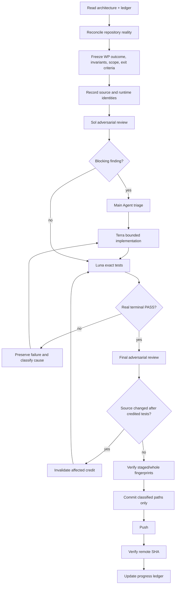

# FreeCAD Reality-Aware Autonomous Engineering Progress and Execution Plan

## 1. Purpose

This document defines how Cursor, GPT/Codex, or an equivalent main engineering agent should implement the FreeCAD reality-aware autonomous engineering architecture using specialized subagents.

The process is based on an evidence-driven engineering workflow:

```text
Human engineer
      ↓
Main Agent / Orchestrator
      ↓
Adversarial Review
      ↓
Bounded Implementation
      ↓
Exact Testing
      ↓
Final Review
      ↓
Identity Check
      ↓
Commit + Push
      ↓
Progress Ledger
```

The workflow exists to reduce false confidence, uncontrolled scope, stale evidence, self-review bias, and accidental commits of code that was not actually tested.

Process is subordinate to engineering signal. If subagent ceremony begins producing more bookkeeping risk than useful independence, the orchestrator may simplify the mechanism while preserving the functional gates and separation of responsibilities.

### Program status

```text
ARCHITECTURE: GO (frozen)
EXECUTION PLAN: GO (sequence corrected)
OVERALL: GO once WP00 contract exists — this document IS the corrected route
```

The destination architecture is accepted and frozen. This document is no longer NO-GO. The previous execution route is what was rejected: it drove through walls (stub solver, rich ontology, generic preflight, and fat dynamics before a real isolated kinematics proof).

Implementation still starts at RA-WP00 (contract, reuse map, identity ADR, non-goals, MVVS/VS01 acceptance). That is correct sequencing, not a remaining NO-GO on this plan. Do not start RA-WP00 until the human authorizes implementation.

---

## 2. Human Authority

The human remains final engineering authority.

The human owns:

- target architecture;
- non-negotiable invariants;
- work-package boundaries when architectural judgment is required;
- accepted design trade-offs;
- risk decisions;
- release authority;
- changes to the frozen architecture;
- authorization for autonomy levels that can mutate the live model.

Agents may recommend. They do not redefine success silently.

---

## 3. Agent Roles

Use the same logical roles whether the main environment is Cursor or GPT/Codex.

```text
Human Engineer
      │
      ▼
Main Agent / Orchestrator
      │
      ├──────────────► Sol / Reviewer
      │                    │
      │                    ▼
      │               findings only
      │
      ├──────────────► Terra / Implementer
      │                    │
      │                    ▼
      │               bounded changes
      │
      ├──────────────► Luna / Test Observer
      │                    │
      │                    ▼
      │               test evidence
      │
      └──────────────► Integrator when required
                           │
                           ▼
                    shared-file integration
```

The names are roles, not model requirements. Cursor may use its subagent system; GPT/Codex may use available specialized agents. The authority model stays the same.

---

## 4. Main Agent / Orchestrator

The main agent owns continuity.

Responsibilities:

- read the architecture plan and progress ledger first;
- inspect actual repository state;
- identify the current work package;
- freeze package scope;
- record source identity;
- dispatch bounded subagent tasks;
- triage findings;
- prevent agents from expanding scope;
- reconcile changed files;
- run or supervise integration;
- verify evidence;
- verify source fingerprints;
- commit classified paths only;
- push;
- verify remote SHA;
- update the progress ledger.

The orchestrator must not treat a subagent report as proof. It independently checks the evidence required by the package.

---

## 5. Sol — Adversarial Reviewer

Sol is read-only unless explicitly assigned a separate review artifact.

Sol attacks claims, not style.

Questions include:

- Does this implementation preserve every frozen invariant?
- Is there a bypass around DCS/DCC?
- Can simulation reach or mutate live document state, including live `Placement`?
- Can a detached worker receive a live pointer?
- Can stale World Configuration, snapshot, or episode output be accepted?
- Can identity be lost across serialization?
- Is an observation being confused with design truth?
- Is a World Configuration being confused with a World State Frame?
- Is a candidate overlay being confused with committed `DesignRevision`?
- Is Candidate v1 anything other than a property/parameter overlay?
- Does a calibration proposal enter DCS/DCC as a design commit?
- Is a stub or reference solver being treated as first simulation proof?
- Is rich ontology, generic preflight, or observations being built before RA-VS01?
- Is failure reported as success?
- Is there a synchronous fallback that defeats isolation?
- Are unsupported cases rejected clearly?
- Does the test actually prove the claim?
- Is a test fixture weaker than production behavior?
- Is cleanup/shutdown proven?

Output:

```text
Finding ID
Severity
Claim attacked
Evidence
Why it matters
Minimal required correction
Files/symbols involved
```

Sol does not implement its own accepted findings.

---

## 6. Terra — Bounded Implementer

Terra receives only accepted findings or a clearly bounded work-package implementation task.

Terra must receive:

- objective;
- frozen invariants;
- exact allowed file scope;
- explicit forbidden files/areas where needed;
- acceptance tests;
- known findings;
- source identity.

Terra may:

- implement;
- add/update tests within scope;
- report blockers.

Terra may not:

- approve its own result;
- weaken tests to obtain green;
- silently change architecture;
- commit;
- push;
- broaden the work package without authorization.

If a required change crosses the frozen boundary, Terra stops and reports the boundary conflict.

---

## 7. Luna — Test Observer

Luna executes the exact test packet.

Luna reports facts rather than verdicts.

Required output:

```text
command
working directory
environment/runtime identity
start/end or duration
numeric exit code
tests selected
passed
failed
errors
skipped
stdout/stderr references
artifacts
cleanup state
```

Luna must not reinterpret:

```text
"mostly passed"
```

as:

```text
PASS
```

Only real terminal results count.

A test observer does not decide release readiness.

---

## 8. Integrator

Use a separate integrator only when parallel workstreams must touch shared files or require coordinated merge/reconciliation.

The integrator:

- receives completed bounded branches/diffs;
- resolves shared-file changes;
- does not invent new architecture;
- runs integration-specific checks;
- hands the integrated candidate back to adversarial review and testing.

Do not create an integrator merely because more agents look impressive in a diagram.

---

## 9. Work-Package Execution Loop

Every work package follows this loop:



A package may require multiple Sol/Terra/Luna iterations. Retained failed evidence is not deleted merely because a later iteration passes.

---

## 10. Source Identity Rules

Before credited review/testing, record as applicable:

- parent repository HEAD;
- upstream/remote parent identity;
- nested MCP HEAD;
- nested upstream identity;
- parent gitlink identity;
- tracked candidate path list;
- diff fingerprint;
- relevant binary fingerprints;
- Docker image digest;
- solver/runtime version;
- schema version.

The core question is:

> Did we commit the exact source that was reviewed and tested?

If the answer cannot be proven, the package is not ready.

A changed fingerprint invalidates only the test/review credit actually affected by that changed source. Do not rerun unrelated expensive gates for theatrical purity.

---

## 11. Progress Ledger

Maintain one machine-readable or strict Markdown ledger.

Minimum columns:

| Field | Meaning |
|---|---|
| WP | Work-package ID |
| Goal | Bounded deliverable |
| Status | Not Started / Active / Blocked / Review / Testing / Pushed/Done |
| Source | Parent/nested/gitlink identities |
| Scope | Exact governed paths |
| Sol | Latest review result |
| Terra | Latest implementation iteration |
| Luna | Latest test iteration |
| Tests | Exact credited packets |
| Fingerprint | Reviewed/tested source identity |
| Commit | Local committed SHA |
| Remote | Verified pushed SHA |
| Evidence | Artifact/result locations |
| Remaining | Exact unresolved work |

Never use prose like "basically done" as a status.

---

# 12. Program Work Packages

The program below is the authorized dependency order. Follow this sequence. Do not follow the older WP02 → WP03 → WP05 → stub WP06 → fat WP08 route.

Terminology freeze, matching the architect-reviewed overview in the architecture plan:

| Concept | Meaning |
|---|---|
| **World Configuration** | Which design, observations, environment, calibration and candidate are being considered |
| **Immutable Snapshot** | Frozen solver-ready representation of that configuration |
| **World State Frame** | Complete physical state at one instant `t` |
| **Simulation Episode** | Evolution of those states through time |
| **Predictions** | Engineering information derived from the episode |

`WorldRevision` as a single world clock is retired; that name now means World Configuration / `WorldConfigurationId`. Older drafts used **World State Frame** for the revision-tuple composition; that meaning is now World Configuration. World State Frame is physical state at time `t`, not `App::Document` and not a snapshot dump.

Work packages unpack boxes from that overview. They must not put GeometryJobManager, Ondsel, Coin3D, FEM, or result-store internals onto the overview.

Calibration proposals do not go through DCS/DCC. Stale rejection stays split: design mutation proposals bind `DesignRevision` (DCC stale); evidence-based proposals also bind World Configuration and/or Episode (engineering stale).

### Sequence correction

The destination is unchanged. The previous execution route built rich semantics, observations, a generic preflight package, a stub/reference orchestrator, and gravity/force/motor/reactions before a real isolated solver produced frames. That route is superseded.

The corrected route proves:

```text
design → snapshot → isolated actual Ondsel kinematics → frames → candidate overlay → set-property proposal
```

Hard-coded environment and no observations are sufficient for that proof. Observations, rich ontology, standalone preflight, true dynamics, trajectory contact, off-document FEM, Coin3D playback, calibration, and AutoCurtains come after it.

### Authorized early sequence

```text
RA-WP00
Architecture contract
Repository reuse map
Identity ADR
Explicit non-goals
MVVS acceptance definition
        │
        ▼
RA-WP01
Persistent design/object/occurrence identity
DesignRevision
WorldConfiguration identity
Save/reload/copy semantics
        │
        ▼
RA-WP02A
Minimal semantic identity
object / occurrence / joint relationships only
        │
        ▼
RA-WP04A
Minimal immutable assembly snapshot
geometry
placements
joints
required solver properties
no observations yet
        │
        ▼
RA-VS01
FIRST REAL VERTICAL SLICE
isolated actual Ondsel kinematics
1-DOF mechanism
no live Placement writeback
SnapshotId
EpisodeId
Frame(t0)...Frame(tN)
minimal result store
        │
        ▼
RA-WP07A
Reuse static interference on snapshot
        │
        ▼
RA-WP13A
Parameter candidate overlays
Candidate A / Candidate B
simulate and compare
        │
        ▼
RA-WP14A
Design Proposal
DesignRevision stale check
DCS → DCC
set-property first
        │
        ▼
RA-WP03
Observations
ObservationRevision
uncertainty / provenance
        │
        ▼
RA-WP12A
Reality Comparator
        │
        ▼
RA-WP02B
Thin richer Semantic API
        │
        ▼
RA-WP08B
Dynamics research
        │
        ├── prove Ondsel dynamics
        └── or select another backend
        │
        ▼
RA-WP09
trajectory collision/contact
        │
        ▼
RA-WP10
off-document FEM
        │
        ▼
RA-WP11
Coin3D playback
        │
        ▼
RA-WP12B
Calibration
        │
        ▼
RA-WP15
AutoCurtains
        │
        ▼
RA-WP16
qualification
```

### Superseded / split / reordered IDs

Do not implement the old bodies of these packages. A reader who starts RA-WP02, RA-WP05, stub RA-WP06, or fat RA-WP08 is on the rejected route.

| Old ID | Disposition |
|---|---|
| **RA-WP02** (functional role/type system, bearing/shaft/fastener ontology) | **Superseded / split.** First: **RA-WP02A** (object / occurrence / joint + provenance only). Richer Semantic API is **RA-WP02B**, after RA-WP12A and before dynamics research. |
| **RA-WP03** (observations) | **Reordered later.** After RA-WP14A. Not required to prove design → snapshot → isolated sim → frames → candidate → comparison. |
| **RA-WP04** (snapshot including observations/calibration capture) | **Narrowed to RA-WP04A.** Geometry, placements, joints, required solver properties. No observations. |
| **RA-WP05** (request/scenario/output schemas and solver capability negotiation before a real solver) | **Superseded as a pre-solver package.** Minimal preflight lives **inside RA-VS01**, driven by actual Ondsel/isolation failures. Expand to standalone **RA-WP05B** later only if warranted. |
| **RA-WP06** (solver-independent orchestrator with a deterministic stub/reference backend first) | **Superseded / merged into RA-VS01.** A fake solver proving types compile is forbidden as the first simulation proof. Episode machinery is born with actual isolated Ondsel. |
| **RA-WP07** (clearance, joint-limit, motion-envelope API in one package) | **Narrowed to RA-WP07A.** Wrap existing static interference on the snapshot. Trajectory contact is RA-WP09. |
| **RA-WP08** (gravity, force/torque, motor, reactions as initial physics) | **Split.** Isolated kinematics is **RA-VS01** (formerly RA-WP08A). True dynamics are **RA-WP08B** research after richer semantics. |
| **RA-WP11** (normalized store + Coin3D in one package) | **Split.** Minimal result store is inside **RA-VS01**. Coin3D playback remains **RA-WP11**, later. |
| **RA-WP12** (goal + reality + calibration in one package) | **Split.** Candidate A/B comparison is **RA-WP13A**. Reality Comparator is **RA-WP12A**. Calibration is **RA-WP12B**, not through DCC. |
| **RA-WP13** (typed candidate mutations in general) | **Narrowed to RA-WP13A.** Candidate v1 = property/parameter overlay only. |
| **RA-WP14** | **Narrowed to RA-WP14A.** Design Proposal → set-property first → DCS/DCC, `DesignRevision` stale. |
| **RA-WP15** | **Reordered later.** AutoCurtains closed-loop demonstrator after calibration. The first 1-DOF proof is RA-VS01, not this package. |

---

## RA-WP00 — Architecture Contract, Reuse Map, and VS01 Acceptance

### Goal

Freeze the implementation contract, repository reuse map, identity ADR, explicit non-goals, and MVVS/VS01 acceptance definition before any engine is written.

This package produces **no simulation engine**.

### Deliverables

- architecture plan treated as frozen, including the overview and the World Configuration / World State Frame / Episode / Predictions split;
- identity ADR: `DocumentId`, `ObjectId`, `OccurrenceId`, `DesignRevision`, `WorldConfigurationId`; `ObservationRevision` named but not implemented here; retirement of single-scalar `WorldRevision`; split stale-rejection rules (A5);
- persistence split recorded: FCStd = design + IDs/refs; sidecar = observations, snapshots, episodes, results, high-rate telemetry;
- repository reuse map for:
  - DCS / DCC (sole live mutation path);
  - GeometryJobManager (isolation/job machinery; off the overview);
  - GeometryArchive (detached capture patterns; simulation schema remains a distinct domain);
  - Ondsel (intended first isolated kinematics reuse; off the overview);
  - InterferenceScan (later static wrap in RA-WP07A);
  - existing FEM (document-oriented; later off-document research, not a peer of Motion);
  - MCP non-goals: public `execute_code` is not the Reality-Aware mutation or simulation path; I7 in-place `restore` is not the snapshot, candidate, or episode path;
- ownership map and current parent/nested identities;
- test baseline of existing relevant paths (compile/import; no new solver);
- package ledger created;
- explicit non-goals (below);
- **MVVS / RA-VS01 acceptance definition.** Do not invent a named repo model file. The fixture is:

```text
bounded 1-DOF grounded revolute or slider
prescribed motion
isolated actual Ondsel kinematics
no live Placement writeback
SnapshotId + EpisodeId + Frame(t0)...Frame(tN)
hard-coded environment
no observations
```

### Explicit non-goals (this package and the path through RA-VS01)

- cameras, vision, or ObservationRevision implementation;
- AutoCurtains as the first slice;
- MCP `execute_code` as the engineering API;
- I7 in-place restore as snapshot/candidate/episode machinery;
- Coin3D or live `Placement` playback as the episode result path;
- stub orchestrator or stub/reference solver;
- bearing / shaft / fastener / support ontology;
- generic preflight schema engine before a real backend;
- gravity / force / torque / motor / physical reactions as first physics;
- FEM, GeometryJobManager, Ondsel, or Coin3D drawn onto the overview.

### Required review

Sol attacks:

- accidental second mutation authority, including the semantic layer as a live-edit path;
- overlap with existing collaboration components;
- hidden assumptions about object identity;
- incorrect ownership of simulation vs design state;
- World State Frame treated as a revision-tuple composition;
- `WorldRevision` kept as a single world clock;
- calibration proposals routed through DCC;
- FEM drawn or scoped as a peer of Motion;
- a stub solver smuggled in as “temporary first backend”;
- MVVS defined as a specific missing CAD file.

### Exit criteria

- no unresolved architecture blocker;
- reuse map and identity ADR exist;
- VS01 acceptance is defined without inventing a repo fixture file;
- baseline compiles/tests of existing product paths where this package touches them;
- RA-WP01 is bounded enough to begin;
- this package implemented no solver, orchestrator, or ontology.

---

## RA-WP01 — Persistent Identity, DesignRevision, World Configuration

### Goal

Persist the identities and revision semantics required by World Configurations, snapshots, and later agent decisions.

### Scope

Implement or formalize:

- document identity;
- stable object identity;
- assembly occurrence identity;
- `DesignRevision` as metadata of `App::Document`, published on DCC commit;
- World Configuration identity / citation (design + default/empty observations + environment + calibration + optional candidate). This is composition identity, not a geometry object;
- retirement of single-scalar `WorldRevision` as the world clock;
- split stale-reference rules: design mutation proposals bind `DesignRevision` (DCC stale);
- save / reload / copy / save-as semantics.

Do not implement:

- World State Frame (physical state at `t`, later with results);
- `ObservationRevision` store (RA-WP03);
- semantic type/role ontology (not even in RA-WP02A beyond joint relationships);
- a World Configuration as one scalar clock.

### Critical invariants

- revisions are semantic, not FCStd dirty flags;
- `DesignRevision` is not `ObservationRevision` and is not `WorldConfigurationId`;
- process-local collaboration indexes are not `DesignRevision` and not World Configuration;
- DCC-stale proposals can be detected from `DesignRevision`;
- identity survives detached capture;
- copy/save-as semantics are explicit;
- FCStd holds design plus IDs/refs; snapshots, episodes, and results are sidecar.

### Tests

- create/delete/replace;
- undo/redo;
- save/reload;
- copy/save-as;
- assembly occurrence changes;
- detached round trip;
- DCC-stale rejection when `DesignRevision` moved.

### Exit

A World Configuration citation and a `DesignRevision` can be attached to every later snapshot and proposal. Camera readings, if they exist later, do not advance `DesignRevision`. Observation append is not in this package.

**Depends on:** RA-WP00.

---

## RA-WP02A — Semantic v0 (identity and joints only)

### Goal

Thin semantic identity over FreeCAD objects. Not a live-mutation authority. Not a bearing/fastener/support ontology.

### Deliverables

```text
RA-WP02A Semantic v0
    ObjectId
    OccurrenceId
    Joint relationship
    source FreeCAD reference
    provenance
```

No functional role/type system yet. No bearing, shaft, fastener, support, actuator, load, or sensor ontology.

### Tests

- stable lookup of object / occurrence;
- joint relationship traversal;
- deleted/stale entity handling;
- provenance retained;
- no independent live geometry authority.

### Exit

An assembly used by RA-WP04A can name objects, occurrences, and joints without inventing engineering taxonomy.

**Depends on:** RA-WP01.

**Supersedes** the old RA-WP02 body. Do not implement old RA-WP02.

---

## RA-WP04A — Minimal Immutable Assembly Snapshot

### Goal

Create deterministic simulation input from a World Configuration without leaking live pointers and without capturing observations.

World Configuration identity remains the composition from RA-WP01. This package captures a snapshot *of* that configuration. It does not invent World State Frame as a geometry object or as a revision-tuple dump.

### Deliverables

- immutable snapshot: geometry, placements, joints, required solver properties;
- snapshot citation of source `WorldConfigurationId` and `DesignRevision` at capture;
- dependency capture and assembly topology needed by isolated kinematics;
- versioned snapshot schema and integrity checks;
- TOCTOU revalidation that live `DesignRevision` still matches the configuration.

Do not capture observations, camera data, or calibration time series. Environment may be default or hard-coded. Do not list `WorldStateFrame` as a snapshot-capture deliverable.

### Critical review targets

- pointer leakage;
- TOCTOU revision gaps;
- stale capture acceptance;
- treating a World Configuration citation as a mesh/archive;
- oversized/unbounded archives;
- missing joint/solver properties required by the VS01 fixture;
- nondeterministic ordering;
- observation payload smuggled in “for completeness.”

### Exit

A captured snapshot can be round-tripped and verified independently of the live document, and remains attributable to its source World Configuration. Snapshot bytes live in sidecar/job archives, not as unbounded FCStd payload.

**Depends on:** RA-WP02A.

**Narrows** old RA-WP04.

---

## RA-VS01 — First Real Simulation Vertical Slice

### Goal

Prove the experiment chain with **isolated actual Ondsel kinematics** on a bounded 1-DOF mechanism. This is the first simulation proof. There is no stub path.

Merges old RA-WP06 + the first part of old RA-WP08 (RA-WP08A Isolated Kinematics).

```text
RA-VS01 — First Real Simulation Vertical Slice
isolated actual Ondsel kinematics
1-DOF mechanism
no live Placement writeback
SnapshotId
EpisodeId
Frame(t0)...Frame(tN)
minimal result store
```

### Fixture

Bounded 1-DOF grounded revolute or slider with prescribed motion. Hard-coded environment. No observations. Do not require a specific named model file from the repository.

### In scope

- isolate the real Ondsel kinematics path from the live document (no live `App::Document*` / `DocumentObject*` in the worker);
- prescribed motion, joints, poses;
- velocity if and only if it is reliably available from that backend;
- `SnapshotId` in, `EpisodeId` issued only after minimal preflight PASS;
- World State Frames `Frame(t0) ... Frame(tN)` as the episode time series;
- minimal result store sufficient to retrieve those frames and cite snapshot/configuration/solver identity;
- **minimal preflight inside this slice**, derived from actual Ondsel/isolation failures (missing joint, unsupported topology, isolation/pointer leak, backend refusal). Preflight remains a gate: fail → diagnostics, no `SimulationEpisodeId`, no solver run.

### Out of scope

- a deterministic stub/reference backend, including “types compile” fakes;
- live `Placement` writeback or Coin3D playback;
- gravity, physical mass/inertia as proven dynamics, force, torque, physical reactions, motor plant models;
- observation capture;
- generic request/scenario/output schema engine and solver capability negotiation as a standalone package;
- rich semantic ontology;
- AutoCurtains.

Do not promise physical reactions. Mass/inertia on CAD objects is not accepted as dynamics proof in this slice.

### Tests

- 1-DOF prescribed-motion episode produces ordered frames bound to `SnapshotId` / `EpisodeId`;
- live `Placement` unchanged;
- worker cannot receive a live pointer;
- real Ondsel invoked (a stub backend fails this package);
- isolation failure and unsupported-joint failure emit preflight diagnostics and no episode id;
- cancellation/timeout/crash do not mutate the live document;
- result-store round trip of frames;
- repeated run within stated tolerance if the backend is deterministic for this fixture.

### Exit

The system can answer, with evidence:

```text
this DesignRevision
    → this World Configuration (no observations)
    → this SnapshotId
    → isolated actual Ondsel kinematics
    → this EpisodeId
    → Frame(t0)...Frame(tN)
```

without writing live design state.

**Depends on:** RA-WP04A.

**Kills** stub RA-WP06. **Absorbs** RA-WP08A. **Absorbs** minimal preflight that old RA-WP05 tried to build first.

---

## RA-WP07A — Static Interference on Snapshot

### Goal

Reuse existing static interference against an immutable snapshot / candidate snapshot. Do not mutate live placements.

### Deliverables

- wrap InterferenceScan (or equivalent existing static path) on snapshot geometry;
- result normalization sufficient to reject a candidate for static collision;
- no live-document write.

### Out of scope

- clearance/envelope APIs beyond what the wrap already provides;
- trajectory collision/contact (RA-WP09);
- dynamics.

### Exit

A snapshot or later candidate overlay can be rejected for static interference without being committed.

**Depends on:** RA-VS01 (snapshot + frames identity already real; this wrap consumes snapshot, not live placements).

**Narrows** old RA-WP07.

---

## RA-WP13A — Parameter Overlay Candidates

### Goal

Let a human and an AI try two designs without editing the live document.

```text
Candidate v1 = property / parameter overlay only
```

### Deliverables

- candidate-world creation as a World Configuration overlay (empty overlay = current committed world);
- two overlays: Candidate A / Candidate B;
- snapshot + RA-VS01 simulate + compare structured episode evidence;
- no live `DesignRevision` for candidates.

Later, not in this package:

```text
Candidate
    ├── ParameterOverlayCandidate
    └── TempCandidateDocument
```

Both are explicitly **not live design**. `TempCandidateDocument` is not a blocker for RA-VS01 and is not required here. If a later package uses a temporary document, its process-local revisions are sandbox clocks, not live `DesignRevision`.

### Agent restrictions

```text
read + simulate + propose
```

No autonomous live commit.

### Acceptance scenario

The agent creates at least two parameter-overlay candidates, simulates both with the isolated kinematics path, and explains the comparison using structured evidence.

### Exit

Candidate A vs Candidate B is proven without committing either. Candidate v1 remains a property/parameter overlay.

**Depends on:** RA-WP07A (static check available on snapshot/candidate). Simulation of candidates uses RA-VS01.

**Narrows** old RA-WP13.

---

## RA-WP14A — Design Proposal, Set-Property, DCS/DCC

### Goal

Connect agent reasoning to the existing live mutation architecture safely, starting with set-property.

### Deliverables

- Design Proposal;
- source `DesignRevision` (DCC stale);
- source World Configuration id and/or EpisodeId when the proposal is evidence-based (engineering stale);
- typed desired changes, **set-property first**;
- conversion into DCS intent;
- DCC commit;
- commit result;
- new `DesignRevision` and therefore a new committed World Configuration.

Calibration proposals are out of this package. They belong to RA-WP12B and must not enter DCS/DCC.

### Critical tests

- valid set-property proposal;
- DCC-stale proposal (`DesignRevision` moved);
- engineering-stale proposal (World Configuration or Episode moved; DesignRevision may still match);
- deleted entity;
- conflicting human mutation;
- invalid authority;
- partial failure;
- undo/redo;
- save/reload.

### Exit

No agent-originated model mutation exists outside the collaboration path. Set-property through DCS → DCC is proven.

**Depends on:** RA-WP13A.

**Narrows** old RA-WP14.

---

## RA-WP03 — Observation and Perception Data Model

### Goal

Represent observed reality independently of design state. **After** the proposal/DCC path. Not required to prove RA-VS01.

### First implementation

Manual or programmatic measurements are enough. Automated vision is not required yet. Cameras remain later.

### Deliverables

- observation schema;
- units;
- timestamp;
- uncertainty;
- confidence;
- source/provenance;
- entity association;
- supersession/history;
- `ObservationRevision`;
- query API;
- sidecar persistence for observation values; FCStd holds observation IDs/refs only.

### Tests

- multiple observations of same quantity;
- incompatible units;
- missing uncertainty policy;
- stale entity;
- superseded measurement;
- serialization and reload;
- observation append does not bump `DesignRevision` and does compose a new World Configuration citation.

### Exit

Observed reality can represent:

```text
designed diameter = 3.00 mm
observed diameter = 3.14 ± 0.08 mm
```

without overwriting either value.

**Depends on:** RA-WP14A.

**Reordered** from its old place before snapshot/simulation.

---

## RA-WP12A — Reality Comparator

### Goal

Compare Predictions with physical observations. This is not the Goal Comparator and not calibration writeback.

### Deliverables

- Reality Comparator (prediction vs observation);
- quantity alignment;
- time alignment where relevant;
- uncertainty-aware residuals;
- comparison result, including "unsupported."

Default output is not a DCC design commit. A reality miss is not automatically a CAD miss.

### Tests

- exact match;
- mismatch;
- incompatible quantity;
- uncertain measurement;
- insufficient observations;
- unsupported comparison.

### Exit

The system can distinguish:

```text
model is wrong
measurement is uncertain
comparison is unsupported
```

rather than emitting a single misleading scalar.

**Depends on:** RA-WP03 and episode frames from RA-VS01.

**Splits** old RA-WP12. Goal-style candidate comparison already exists in RA-WP13A. Calibration is RA-WP12B.

---

## RA-WP02B — Thin Richer Semantic API

### Goal

Add the next layer of engineering semantics **after** observations and the reality comparator, **before** dynamics research.

### Scope

Thin, queryable types and roles actually needed to talk about the proven 1-DOF mechanism and its observations. Still not a live-mutation authority. Still not a requirement to finish AutoCurtains ontology in one package.

Bearing / shaft / fastener / support taxonomy may begin here only if it is needed by the proven slice. Do not reopen old RA-WP02 as a boil-the-ocean ontology before this point.

### Exit

Agents can query a small typed semantic layer over the same identities RA-WP02A already persisted.

**Depends on:** RA-WP12A.

---

## RA-WP08B — Dynamics Research / Capability Decision

### Goal

Split true dynamics from the kinematics already proven in RA-VS01. Do not treat CAD mass as proven physics.

```text
Later: Dynamics Research / Capability Decision
    prove gravity, physical mass/inertia, force, torque, reactions, motor model
    then: Ondsel sufficient OR another dynamics backend required
```

### In scope

Research and bounded experiments to answer whether Ondsel (or the current adapter) can provide physically meaningful:

- gravity;
- mass / inertia that is not decorative fiction;
- force and torque;
- reactions;
- motor model.

Then an explicit capability decision: keep that backend, or select another. Solver choice remains behind an adapter boundary and off the overview.

### Out of scope until the decision is evidenced

- promising physical reactions in product APIs;
- AutoCurtains as the dynamics fixture;
- putting the dynamics engine on the architecture overview.

### Exit

A written capability decision with experimental evidence, or a bounded adapter that those tests actually support. Unproven dynamics are not shipped as if they were RA-VS01 kinematics.

**Depends on:** RA-WP02B.

**Is** the remainder of old fat RA-WP08. Research-heavy.

---

## RA-WP05B — Standalone Preflight (optional, later)

### Goal

Expand preflight into a standalone package **only if** RA-VS01 and later backends show that failures are generic enough to warrant request/scenario/output schemas and solver capability negotiation.

Do not implement this before RA-VS01. Do not implement it by default.

**Depends on:** a real backend already producing real failures (RA-VS01 at minimum).

**Supersedes** old RA-WP05-before-solver.

---

## RA-WP09 — Contact and Motion Geometry Integration

### Goal

Combine trajectories with collision/contact reasoning. Later than isolated kinematics and later than the dynamics capability decision if contact needs dynamic state.

### Deliverables

- contact candidates;
- collision events;
- clearance over trajectory;
- motion envelope;
- solver/contact diagnostics;
- stable entity mapping.

### Exit

The system can answer:

```text
Does this moving assembly collide?
Where?
When?
Which entities?
With what relevant dynamic state?
```

**Depends on:** RA-WP08B when contact needs dynamics; otherwise may consume RA-VS01 frames plus RA-WP07A static results, but trajectory contact remains after the kinematics proof.

Research-heavy relative to RA-VS01.

---

## RA-WP10 — Off-Document FEM Load Transfer

### Goal

Transfer simulation-derived loads into FEM as a later stage *inside* an episode, not as a peer of Motion.

Existing FreeCAD FEM is document-oriented. That is why this package is later and research-heavy. Live `FemAnalysis` document objects are not the autonomous result authority.

Architectural placement stays:

```text
MBD / frames / reactions
    ↓
selected load case
    ↓
FEM
```

FEM stays off the overview. GeometryJobManager/Ondsel/Coin3D stay off the overview.

### First target

CalculiX through the existing FreeCAD FEM ecosystem where viable, adapted off-document.

### Deliverables

- load-case extraction from an episode;
- entity mapping;
- FEM boundary/load construction;
- solver run;
- stress/deformation result references;
- provenance back to episode/time.

### Tests

- known static load;
- load mapping;
- missing boundary condition;
- failed solver;
- retained native artifacts;
- no silent live-document FEM ownership.

**Depends on:** trajectory/dynamics evidence sufficient to form a load case (RA-WP08B; RA-WP09 where contact loads matter).

---

## RA-WP11 — Coin3D Playback

### Goal

Presentation of already stored World State Frames. Playback is view state. It must not become design state.

Minimal result store already exists in RA-VS01. This package adds Coin3D motion playback and inspectable overlays. Coin3D stays off the overview. Coin3D is not the world-state authority.

### Constraint

Playback must not write live `Placement` as design state. Interactive GUI assembly solve may continue to write placements for human drag/solve; autonomous episode playback must not.

**Depends on:** frames already stored (RA-VS01); useful after comparators exist, scheduled after FEM in the authorized sequence.

---

## RA-WP12B — Calibration

### Goal

Calibration parameter model and Calibration Proposal that do **not** go through DCS/DCC as a design commit.

Advances `CalibrationRevision` and therefore a new World Configuration on a distinct acceptor. Must not loop into a semantic-layer authority or into `App::Document` as if it were CAD intent.

If a value is CAD intent, it is `DesignRevision`. If it is a physics knob, it is `CalibrationRevision`.

### Tests

- calibration proposal does not enter DCC;
- repeated calibration history;
- mixing design parameter and calibration parameter in one property is rejected.

**Depends on:** RA-WP12A.

**Splits** calibration out of old RA-WP12.

---

## RA-WP13B — TempCandidateDocument (optional, later)

### Goal

If parameter overlays are insufficient, a temporary candidate document may be added.

```text
Candidate
    ├── ParameterOverlayCandidate     // v1; RA-WP13A
    └── TempCandidateDocument         // later; still not live design
```

Process-local revisions on that document are sandbox clocks, not live `DesignRevision`. Not a blocker for RA-VS01.

**Depends on:** RA-WP13A.

---

## RA-WP15 — AutoCurtains Closed-Loop Demonstrator

### Goal

Later closed-loop demonstration on AutoCurtains, after the first kinematics proof, proposal path, observations, comparators, richer semantics, dynamics decision, and calibration exist as required by the scenario.

This is **not** the first 1-DOF slice. RA-VS01 already proved isolated kinematics.

### Required capabilities (as then implemented)

- design semantics;
- one or more real observations;
- geometry validation;
- simulation (still no live `Placement` writeback);
- candidate comparison;
- `DesignRevision`-bound proposal, plus World Configuration / Episode citation when evidence-based;
- coordinator-owned commit;
- post-commit recompute and simulation;
- prediction-vs-observation and prediction-vs-goal comparison.

### Human authority

Begin with approval required before commit.

A separate acceptance test may exercise bounded autonomous commit only after the proposal path is proven.

**Depends on:** RA-WP12B and the earlier proven chain. Research- and integration-heavy.

**Reorders** old RA-WP15 off the first slice.

---

## RA-WP16 — Reliability, Stress, Cross-Platform Qualification, and Release

### Goal

Prove the integrated architecture rather than merely collecting green unit tests.

### Stage A — smoke

Example:

```text
10 world/simulation cycles
5 saves
```

### Stage B — stateful medium

Example:

```text
50 world/simulation cycles
20 saves
```

### Stage C — stress

Example:

```text
500 world/simulation cycles
100 saves
```

Exact counts may be adjusted only through an explicit architecture/test decision, not because a failing run is inconvenient.

### Exercise

- human GUI mutation;
- agent queries;
- candidate creation (parameter overlays);
- simulation;
- cancellation;
- stale results;
- save;
- observation updates;
- result playback;
- cleanup;
- process shutdown.

### Platforms

- Linux/Docker;
- Windows native.

### Release boundary

Require identity agreement between:

```text
reviewed
tested
staged
committed
pushed
```

### Final status

Only:

```text
GO
```

or:

```text
NO-GO
```

with unresolved items named explicitly. That GO/NO-GO is the qualification verdict, not the status of this execution plan.

**Depends on:** the authorized sequence through the demonstrator that is being qualified.

---

# 13. Parallelization Rules

Parallelize only independent work.

Until **RA-VS01** is `Pushed/Done`, keep the identity → snapshot → real isolated kinematics path serial. Do not stand up a stub solver, rich ontology, generic preflight engine, or observation stack in parallel with that path.

After RA-VS01, good candidates:

```text
Workstream A: schema/unit tests
Workstream B: later adapter research
Workstream C: deterministic fixtures
```

only if file ownership does not overlap.

Rules:

- each subagent receives exclusive writable paths;
- shared files belong to the orchestrator/integrator;
- agents do not modify another workstream's files;
- integration occurs before credited final tests;
- every parallel output is reviewed in the integrated tree.

Do not shard stateful end-to-end qualification merely to make the wall-clock number prettier.

---

# 14. Failure Handling

When a test fails:

1. retain the failure evidence;
2. give that run zero credit for the failed gate;
3. classify whether the cause belongs to:
   - active implementation;
   - existing product defect;
   - test harness;
   - environment/external state;
4. fix only the owned cause;
5. identify which evidence credit was invalidated;
6. rerun from the earliest invalidated gate;
7. do not erase the failed history.

A failing external environment check must not be disguised as a product pass.

---

# 15. Pause and Resume

Treat long engineering sessions transactionally.

## Pause

- finish the current atomic operation if safe;
- start nothing new;
- preserve Git state;
- preserve evidence;
- preserve active process/container identity;
- record what is verified vs running vs unknown.

## Resume

Before doing new work:

- inspect ledger;
- inspect Git state;
- verify parent/nested/gitlink identities;
- inspect active processes;
- inspect containers/ports;
- determine actual outcome of any previously running command;
- continue from the first uncompleted gate.

Do not repeat expensive tests simply because chat context changed.

---

# 16. Commit and Push Policy

The Main Agent owns commit/push unless the human explicitly changes that authority.

Before commit:

- final Sol/inline adversarial review completed;
- exact credited tests completed;
- fingerprints match;
- generated/unrelated files classified and excluded;
- nested repository state resolved;
- staged diff inspected;
- `git diff --cached --check` or equivalent passes.

Then:

```text
commit classified paths
    ↓
push
    ↓
verify remote SHA
    ↓
update ledger
```

No PR is required unless explicitly requested.

---

# 17. Definition of Package Done

A work package is `Pushed/Done` only when all applicable criteria are proven:

1. it compiles/imports;
2. it does not crash or hang;
3. required tests pass;
4. supported edge cases are covered;
5. existing behavior remains intact;
6. no undocumented manual steps are needed;
7. it performs the operation it claims to perform;
8. final reviewed and tested fingerprint matches the committed candidate;
9. commit contains only classified paths;
10. remote SHA is verified;
11. evidence location is recorded;
12. remaining work is assigned to a later package rather than hand-waved away.

---

# 18. Recommended Main-Agent Startup Prompt

Use this as the default instruction when Cursor or GPT/Codex starts or resumes the program:

```text
You are the Main Engineering Orchestrator for the FreeCAD Reality-Aware
Autonomous Engineering program.

Read the architecture plan and progress ledger before changing code.
Reconcile them against the actual repository, nested repository, Git state,
running processes, and existing evidence.

Work only on the currently authorized work package.
Follow the corrected sequence in the progress/execution plan.
Do not implement old RA-WP02, pre-solver RA-WP05, stub RA-WP06, or fat RA-WP08.

For the package:
1. Freeze the deliverable, invariants, exact file scope, and exit criteria.
2. Record source identity and the candidate fingerprint.
3. Use a read-only adversarial reviewer to attack behavioral claims.
4. Triage findings. Delegate only accepted, bounded implementation.
5. Use a separate test observer for the exact test packet.
6. Require real terminal exit codes and preserve failed evidence.
7. Re-run only evidence invalidated by changed source.
8. Perform a final adversarial review of the complete tested diff.
9. Verify reviewed/tested/staged identities agree.
10. Commit only classified paths, push, and verify the remote SHA.
11. Update the ledger with facts, evidence, and exact remaining work.

Never:
- bypass DocumentCollaborationService/DocumentCommitCoordinator for live model mutation;
- let simulation mutate live design state;
- confuse design, observed, candidate, World Configuration, snapshot, World State Frame, or simulation state;
- accept DCC-stale `DesignRevision` or engineering-stale World Configuration / Episode decisions;
- treat a stub or reference solver as first simulation proof;
- build rich ontology, generic preflight, or observations before RA-VS01;
- treat Candidate v1 as anything but a property/parameter overlay;
- weaken tests to obtain green;
- allow an implementer to approve its own work;
- treat subagent prose as proof;
- broaden the active work package silently.

If agent orchestration creates more bookkeeping risk than engineering value,
simplify the wrapper while preserving independent review, implementation,
testing, identity verification, and human release authority.
```

---

# 19. Program Completion

The program is complete when the authorized sequence from RA-WP00 through RA-WP16 (including RA-VS01 and the A/B splits) is `Pushed/Done`, the final architecture demonstration succeeds, and the final qualification proves:

```text
FreeCAD design @ DesignRevision
    +
semantic layer
    +
observed reality @ ObservationRevision
    +
World Configuration
    +
immutable snapshot
    +
simulation episode (World State Frames → Predictions)
    +
agent candidate reasoning
    +
controlled mutation (DCS → DCC)
    +
post-action verification
```

as one coherent system without violating the existing document collaboration and transaction guarantees.

The first vertical slice does not require observations. Completeness of the program does.

The final question is not:

> Did the agent generate convincing code?

It is:

> Can the exact reviewed and tested system safely observe, predict, change, and verify an engineered world, with every important claim tied to evidence?
