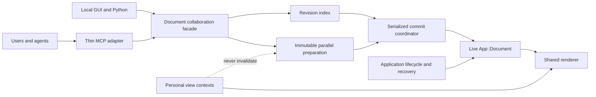

# FreeCAD Document Collaboration Architecture and Implementation Plan

> **Living status:** native collaboration Phases 1–6, MCP Phase 18 cutover, MCP Phase 19 typed tool registration, and MCP Phase 20 capability manifests are complete.
>
> **Next action:** begin MCP Phase 21 (`refactor(mcp): switch registration to generated output`) in `tools/mcp/freecad-mcp/doc/freecad_mcp_architecture_refactor_plan.md`.
>
> **Last updated:** 2026-08-06.
>
> **Update rule:** the integrator updates §11.3 and §11.4 in the same delivery commit that completes each phase. A phase is not complete while its progress entry, reviews, or test evidence is missing.

## 1. Problem statement

Collaboration means safely interleaving work from multiple users or agents against one live parametric document and one FreeCAD-rendered model view. It is not ownership of a Part, Body, Feature, or subtree. The coordination unit is a FreeCAD-owned typed operation with explicit semantic dependencies.

Same-object edits conflict by default. They may proceed independently only when a typed operation has complete dependencies and FreeCAD proves that their commit semantics are independent. Edits to different objects can still conflict through links, expressions, topology, names, membership, ordering, or Tip state.

Independent geometry preparation may run concurrently from immutable inputs. Only FreeCAD may revalidate and atomically apply final mutations to the live document. This places authority at the existing application/document boundary: `App::Document` owns live model state and transactions, while `App::Application` owns creation and destruction (`src/App/Document.h`, class `App::Document`; `src/App/Application.h`, class `App::Application`).

## 2. Current architectural problems

- Core mutation control is document-global. `App::DocumentMutationAuthority::DocumentState` stores one owner, fencing generation, authority epoch, provider, and a recovery-mode flag for a document; `MutationCapability` is scoped by document and broad `MutationKind`, not semantic dependencies (`src/App/DocumentMutationAuthority.h`, classes `DocumentMutationAuthority` and `ExternalMutationAuthorityProvider`; `src/App/MutationCapability.h`, class `MutationCapability`; `src/App/MutationKind.h`, enums `MutationKind` and `MutationOwner`). Enforcement in `src/App/Property.cpp`, `src/App/DynamicProperty.cpp`, `src/App/Document.cpp`, and `src/App/Application.cpp` excludes actors instead of distinguishing independent edits.
- The MCP add-on owns collaboration authority and duplicates lifecycle policy above FreeCAD. `DocumentLeaseService` advances a document state machine; `LeaseRecord` carries a dirty bit, revisions, file baseline, owner, error, and recovery snapshot; `SidecarStore` persists that state outside FreeCAD (`tools/mcp/freecad-mcp/addon/FreeCADMCP/document_lease/service.py`, class `DocumentLeaseService`; `tools/mcp/freecad-mcp/addon/FreeCADMCP/document_lease/model.py`, class `LeaseRecord`; `tools/mcp/freecad-mcp/addon/FreeCADMCP/document_lease/sidecar.py`, class `SidecarStore`). `FreeCADRPC._dispatch()` and `_dispatch_gui()` authorize and bracket mutations (`tools/mcp/freecad-mcp/addon/FreeCADMCP/rpc_server/rpc_server.py`, class `FreeCADRPC`).
- The MCP process is stateful rather than a thin adapter. `LeaseClientManager` owns credentials, aliases, revocation, and reconnect handling; `FreeCADConnection` owns that manager and stale-recovery routing; the server exposes acquire/adopt/save/finalize lifecycle tools (`tools/mcp/freecad-mcp/src/freecad_mcp/lease_manager.py`, class `LeaseClientManager`; `tools/mcp/freecad-mcp/src/freecad_mcp/freecad_client.py`, class `FreeCADConnection`; `tools/mcp/freecad-mcp/src/freecad_mcp/server.py`, functions `acquire_document_lock()`, `adopt_dirty_document()`, `save_document()`, `save_document_as()`, and `finalize_document_edit()`).
- Change detection is coarse. `DocumentHealthSnapshot` compares whole-object signatures and a document dirty value, while `document_modified_state()` treats `Gui::Document.Modified` as authoritative (`tools/mcp/freecad-mcp/addon/FreeCADMCP/rpc_server/mutation_guard_ops/document_health_snapshot.py`, class `DocumentHealthSnapshot`; `tools/mcp/freecad-mcp/addon/FreeCADMCP/rpc_server/mutation_guard_ops/document_health_delta.py`, class `DocumentHealthDelta`; compatibility exports in `tools/mcp/freecad-mcp/addon/FreeCADMCP/rpc_server/mutation_guard.py`; `tools/mcp/freecad-mcp/addon/FreeCADMCP/document_state.py`). `create_snapshot_bundle_gui()` also treats active-document or global-selection changes as snapshot changes, so personal navigation can reject model work (`tools/mcp/freecad-mcp/addon/FreeCADMCP/rpc_server/snapshot_service_ops/create_snapshot_bundle.py`; compatibility export in `tools/mcp/freecad-mcp/addon/FreeCADMCP/rpc_server/snapshot_service.py`).
- Atomicity is coordinated above FreeCAD after live values begin changing. `FreeCADRPC._execute_mutation_with_health()` uses MCP-side `GuiMutationTransaction` for capture, recompute, validation, commit, or compensating abort (`tools/mcp/freecad-mcp/addon/FreeCADMCP/rpc_server/rpc_server.py`; `tools/mcp/freecad-mcp/addon/FreeCADMCP/rpc_server/mutation_guard_ops/gui_mutation_transaction.py`, class `GuiMutationTransaction`; compatibility export in `tools/mcp/freecad-mcp/addon/FreeCADMCP/rpc_server/mutation_guard.py`). Native `App::Transaction` records already-applied changes for undo/redo and has no expected revisions or semantic read set (`src/App/Transactions.h`, class `App::Transaction`; `src/App/Document.cpp`, methods `openTransaction()`, `commitTransaction()`, and `abortTransaction()`).
- Calculation is not yet a collaboration preparation boundary. MCP `WorkerManager` runs one isolated FreeCADCmd job at a time from FCStd snapshots; those snapshots carry aggregate indicators rather than dependency revisions (`tools/mcp/freecad-mcp/addon/FreeCADMCP/rpc_server/worker_manager.py`, class `WorkerManager`; `tools/mcp/freecad-mcp/addon/FreeCADMCP/rpc_server/snapshot_service.py`, function `create_snapshot_bundle_gui()`). Core `App::Application::recomputeWorker()` recomputes the live document rather than preparing immutable results (`src/App/Application.cpp`, class `App::Application`; `src/App/Application.h`, struct `RecomputeRequest`).
- GUI persistence mixes state domains. `Gui::Document::SaveDocFile()` writes ViewProvider properties, tree expansion, and a camera into `GuiDocument.xml`; `TreeWidget::onItemExpanded()` persists expansion through `DocumentObjectItem::setExpandedStatus()` (`src/Gui/Document.cpp`, class `Gui::Document`; `src/Gui/Tree.cpp`, classes `TreeWidget`, `DocumentItem`, and `DocumentObjectItem`). Selection is process-global (`src/Gui/Selection/Selection.h`, class `SelectionSingleton`), and MCP framing/screenshot helpers overwrite it (`tools/mcp/freecad-mcp/addon/FreeCADMCP/rpc_server/view_manager_ops/focus_helpers.py`, function `frame_on_targets()`; `tools/mcp/freecad-mcp/addon/FreeCADMCP/rpc_server/view_manager_ops/screenshot.py`, function `save_active_screenshot()`; `tools/mcp/freecad-mcp/addon/FreeCADMCP/rpc_server/view_manager_ops/refresh_view.py`, function `refresh_active_view()`; compatibility exports in `tools/mcp/freecad-mcp/addon/FreeCADMCP/rpc_server/view_manager.py`).
- FreeCAD already owns the underlying lifecycle primitives, but collaboration policy is split above them: save and transactions are in `App::Document`, close is in `App::Application::closeDocument()`, and recovery snapshots are in `App::writeRecoverySnapshotToTransientDir()`, `Gui::AutoSaver`, and `Gui::Dialog::DocumentRecovery` (`src/App/Document.cpp`; `src/App/Application.cpp`; `src/App/RecoverySnapshot.cpp`; `src/Gui/AutoSaver.cpp`; `src/Gui/DocumentRecovery.cpp`).

## 3. FreeCAD responsibilities

### 3.1 Authority and lifecycle

- Own every live document instance, lifecycle epoch, revision stream, operation status, commit order, persisted-state marker, and recovery record. A disconnected client may orphan or cancel an operation, but it never leaves a document owned.
- Derive semantic dependencies for supported operations. Clients may describe intent but cannot make an unsafe operation valid by omitting a dependency.
- Produce immutable calculation snapshots, run or admit concurrent preparation, revalidate results, and serialize final live commits on the required FreeCAD thread.
- Publish Phase 1 revisions/events as serializable, pointer-free value records that carry the document instance/epoch, stable object identity where applicable, semantic key, monotonic revision, and publication order through a subscription surface that can be bridged out of process; `DocumentObject*` may be used only transiently to derive identity and never appears in an event or observer contract.
- Apply each commit behind a short visibility barrier: validate, open one native transaction, mutate, recompute the affected graph, check postconditions, publish revisions/events on success, or abort without exposing a partial state.
- Decide save, close, interruption, administrative cancellation, stale-result rejection, crash recovery, and snapshot retention through `App::Document`, `App::Application`, `App::RecoverySnapshot`, `Gui::AutoSaver`, and the existing recovery UI.

### 3.2 Narrow initial scope

The MVP starts with `ObjectExistenceRevision`, `ObjectModelRevision`, `ObjectStructureRevision`, `DocumentStructureRevision`, and `Document.UnknownModelMutationRevision`. Before any `PreparedEdit` API is enabled, Phase 1 must ensure that every unclassified App model/structural mutation advances the wildcard, or that the uncovered mutation path is disabled while collaboration is active.

That gate is bounded, not an open-ended audit. Authoritative App mutations already converge on a known funnel set: property writes pass `Property::aboutToSetValue()`/`Property::hasSetValue()` (`src/App/Property.cpp`); dynamic-property schema changes pass `src/App/DynamicProperty.cpp`; undo, redo, transaction open/commit/abort, save, save-as, recompute, and add/remove object pass the `enforceDocumentMutation()` call sites in `src/App/Document.cpp`; close passes `src/App/Application.cpp`. The wildcard increment belongs on the post-change notification path rather than the pre-change guard, so a rejected mutation never advances a revision. The residual risk is state that mutates without traversing that pair — `PropertyPythonObject`, direct status or container manipulation, and any property subclass that writes storage without bracketing. Phase 1 targets exactly that residue and adds a regression test that fails when a new unbracketed ingress appears.

Personal camera, selection, tree, and other view changes are excluded from those revisions from Phase 1. Phase 2 supports exactly two typed operations: an object-property update and a Part Boolean. Until Phase 6, same-object work remains conservatively conflicting and ordinary shared ViewProvider mutations are serialized without promising an atomic App-plus-Gui transaction.

### 3.3 Compatibility mutations and shims

Existing GUI commands, macros, and Python code that make App model/structural changes but cannot declare complete dependencies use one fallback: enter the short commit barrier, perform the existing mutation, recompute as required, increment the applicable object/structure revisions and `Document.UnknownModelMutationRevision`, then publish and release. This is commit-time exclusion only; it grants no ownership and correctness does not depend on a heartbeat. Known personal-view changes bypass this path. Known shared-presentation changes use a separate serialized GUI compatibility path and do not advance the model wildcard unless they also mutate App state.

**Structural compatibility mutations (amendment, 2026-08-04).** Phases 1–6 admitted only non-structural work on this fallback: `Document::ensureCollaborationStructuralMutationAllowed()` rejects `addObject`, `removeObject`, and dynamic-property schema changes for the whole commit barrier. That was correct for local GUI and Python callers, which create objects outside a prepared commit, but it blocks the remote CAD ingress that the MCP refactor's Phase 15 must route through this same boundary. The boundary is therefore extended, under MCP refactor §3.8 and delivered as the parent half of its Phase 15, with four mechanisms that must land together: a scoped structural mutation grant issued only on the compatibility path and only inside the coordinator's own barrier and transaction; deferral of the object new/deleted/activated and transaction append/remove signals, which are the structural analogue of the property notifications already deferred since Phase 2; a per-commit ledger of classified structural effects that the coordinator unions with the declared effects before reserving publication, so a structural commit publishes `documentStructure`, `objectStructure`, and `objectExistence` with stable identities instead of only the wildcard; and an explicit opt-in scope, so a caller that does not declare structural intent keeps today's rejection. The §7 monotonicity invariant, the §9 abort semantics, and the rule that an observer never sees an intermediate state are all preserved — a rolled-back structural callback publishes nothing and replays nothing. Undo, redo, nested transaction control, `clearDocument()`, ordinary prepared operations, and any callback running under a foreign stable-read capture remain rejected.

**Delivered Phase 15 boundary (2026-08-05).** The implementation also covers exact
new/import dynamic-property schema, status, metadata, extension and observer replay;
owned App/Gui bulk-import archive/replay; exact rollback of membership order, stable
identity and activation; authoritative-recompute effect capture; and a Sheet-only
transient `Prop_NoPersist` schema scope. Deferred property records carry their owning
container, coalesce to the stable committed state, and prune a destroyed transient
object by non-dereferenced pointer identity. Create/edit, Pad/Pocket, and FEM
presentation effects move after confirmed native publication. The default bridge
remains UnknownModel; Structural authority exists only through explicit keyword-only
`structural=True`.

Every moved Python symbol retains its old import path through an explicit re-export shim during the migration window. A deliberately retired ownership API is not silently re-exported: it returns the documented deprecation/replacement error until its removal gate is met. Reviewers treat an accidental removed import path as blocking.

## 4. MCP responsibilities

- MCP implementation and MCP-specific testing are owned by `tools/mcp/freecad-mcp/doc/freecad_mcp_architecture_refactor_plan.md`. Phases 1–6 did not edit the MCP submodule, depend on its in-flight interfaces, or require its test suites; they froze and proved the complete native FreeCAD boundary that the MCP refactor now consumes. The former standalone Phase 7 is not executed separately. Its adapter, compatibility, authority-removal, and cross-track obligations are mapped into the MCP refactor, and the overall collaboration program is not complete until that plan's collaboration-cutover phase passes.
- Authenticate and identify callers, translate tools into typed FreeCAD collaboration calls, pass opaque actor/session identifiers, forward advisory cancellation, and return FreeCAD's structured success, conflict, stale, cancellation, or lifecycle result.
- Query or subscribe to authoritative status. Read-only response caching is allowed, but cached state never authorizes a mutation.
- Do not own documents, mutation exclusion, dirty/save state, file baselines, sidecars, recovery snapshots, close rules, administrative cancellation, conflict decisions, or rollback. Terminating or replacing the MCP cannot transfer, revoke, or corrupt document authority; no heartbeat is required for correctness.
- Replace rather than redesign the current ownership machinery: `DocumentLeaseService`, `LeaseRecord`, `SidecarStore`, `DocumentIdentityService`, `LeaseObserver`, and MCP `SaveService` (`tools/mcp/freecad-mcp/addon/FreeCADMCP/document_lease/service.py`; `tools/mcp/freecad-mcp/addon/FreeCADMCP/document_lease/model.py`; `tools/mcp/freecad-mcp/addon/FreeCADMCP/document_lease/sidecar.py`; `tools/mcp/freecad-mcp/addon/FreeCADMCP/document_lease/identity.py`; `tools/mcp/freecad-mcp/addon/FreeCADMCP/document_lease/observer_ops/app_observer.py`; `tools/mcp/freecad-mcp/addon/FreeCADMCP/rpc_server/save_service.py`). Replace lifecycle portions of `FreeCADRPC`, `LeaseClientManager`, `FreeCADConnection`, and `tools/mcp/freecad-mcp/src/freecad_mcp/server.py`; retain unrelated transport authentication and replay protection.
- After every mutation ingress uses the new boundary, retire the `McpOwned` owner/provider/capability surface rather than extending it. The surface is larger than the App core and all of it is in scope: `src/App/DocumentMutationAuthority.h`; `src/App/DocumentMutationAuthority.cpp`; `src/App/MutationCapability.h` and `src/App/MutationCapability.cpp`, including the `MutationAuthorityTLS` internal-grant namespace and `MutationInternalScope` consumed by `src/App/Document.cpp`, `src/App/Transactions.cpp`, and `src/Gui/Command.cpp`; `src/App/MutationKind.h`, including the `MutationOwner` and `MutationOrigin` enums; mutation methods in `src/App/DocumentPyImp.cpp`; the `AlterDoc` authority gate in `src/Gui/Command.cpp`; and the takeover dialog `src/Gui/Dialogs/DlgMutationTakeover.h` and `src/Gui/Dialogs/DlgMutationTakeover.cpp`. Phase 4's mutation-source classification supersedes `MutationOrigin`; it does not extend it.

## 5. Multitask operating model

This refactor is executed with Codex subagents. Parallelism is a tool for shortening independent work, not a phase-completion goal. The parent agent remains the integrator and keeps the critical path. Spawn a subagent only for a concrete, bounded, independently verifiable workstream with exclusive write ownership; otherwise the integrator performs the work directly. Keep one concurrency slot available for the integrator, so a four-slot session runs at most three subagents at once. Record the delegation decision, model, reasoning level, and ownership in §11.4.

### 5.1 Roles

| Role | Model and reasoning | Responsibilities |
| --- | --- | --- |
| **Worker** (implementation subagent) | **GPT-5.6 Terra / high** by default; **GPT-5.6 Sol / high or xhigh** for the risk classes in §5.2 | Implements one frozen workstream under exclusive file ownership. Does not edit shared files. Adds focused tests and reports changed files, tests, assumptions, and blockers. |
| **Integrator** (parent agent) | The session's parent model; use its normal reasoning for orchestration and raise effort for shared-seam integration when the runtime permits | Partitions work, freezes interfaces, owns shared files, waits for every worker in a wave, combines outputs, runs every required test through Docker, updates §11 Progress, and creates the single phase delivery. It does not delegate final integration or the completion decision. |
| **Reviewer** (read-only subagent) | **GPT-5.6 Sol / xhigh** by default; **max** only for an unresolved correctness blocker | Reviews adversarially. After every workstream and after integration/fixes, inspects the actual diff and tests and reports blocking, important, and non-blocking findings without editing files. |

### 5.2 Delegation, model, and reasoning policy

#### 5.2.1 When to use a subagent

Use an implementation subagent only when all of the following are true:

1. The deliverable is concrete and bounded, with an explicit done condition and focused tests.
2. Its write paths are exclusive and do not include a §5.3 shared file or an unresolved integration seam.
3. Its inputs and interfaces are frozen for the duration of the workstream.
4. It can progress independently while the integrator or another worker performs useful work.

Keep work with the integrator when any of the following applies: the next decision changes a shared contract; two candidate tasks edit the same files; one task consumes an interface that has not yet been frozen; the task is small enough that delegation overhead exceeds its work; it is final integration, full-suite validation, progress logging, or delivery; or a worker has returned a blocker that requires a cross-workstream decision. A read-only reviewer may inspect overlapping files because it has no write ownership.

Do not create a worker merely to satisfy a worker count. If only one safe workstream exists, use one worker or work locally and record why. Reassess after every wave or interface freeze; prior independence does not imply that the next tasks remain independent.

#### 5.2.2 Which model and reasoning level to use

Choose the lowest reasoning level adequate for the risk. A higher setting is an explicit correctness escalation, not a substitute for a bounded assignment or frozen interface.

| Model / reasoning | Use for | Do not use for |
| --- | --- | --- |
| **GPT-5.6 Terra / medium** | Read-only inventory, mechanical test isolation, or a narrowly specified compatibility shim with no semantic design decision. | Concurrency, transactions, rollback, lifecycle epochs, recovery, public-contract design, or final review. |
| **GPT-5.6 Terra / high** | Default bounded implementation: localized adapters, bindings, focused tests, and code whose contract and failure semantics are already frozen. | Choosing a cross-component contract or resolving a subtle correctness dispute. |
| **GPT-5.6 Sol / high** | Correctness-sensitive implementation involving revision semantics, atomic commit, threads, recompute, geometry isolation, lifecycle/recovery, rollback, or a native/Python/GUI boundary. | Mechanical work that Terra can complete under the same frozen contract. |
| **GPT-5.6 Sol / xhigh** | Contract analysis, race/deadlock diagnosis, adversarial workstream and integrated-diff review, and fixes spanning multiple invariants. | Routine first-pass implementation with a complete specification. |
| **GPT-5.6 Sol / max** | One documented escalation when `xhigh` leaves a blocking concurrency, rollback, recovery, or integration issue unresolved. | Default workstreams or reviews. |
| **Any model / low** | A very small read-only lookup when spawning still saves time; normally keep such work with the integrator. | Code changes, design, correctness claims, or review gates. |
| **GPT-5.6 Sol / ultra** | Exceptional second escalation after `max` has failed and the unresolved blocker justifies the added cost; record the exact question and why narrower attempts failed. | Planned phase work, ordinary review, or speculative exploration. |

The per-workstream assignments in §11.2 are the starting configuration. The integrator may raise reasoning or move a workstream from Terra to Sol when newly discovered risk matches this table. A downgrade requires re-planning before the worker starts and an explicit §11.4 explanation; never silently substitute a weaker model or reasoning level.

#### 5.2.3 Hard Multitask rules

1. The integrator applies §5.2.1 before every spawn and records the concrete task, done condition, model, reasoning level, exclusive paths, and dependencies.
2. Do not delegate an entire phase to one worker when at least two safe workstreams exist, and do not split a tightly coupled workstream merely to create parallelism.
3. Assign exclusive file ownership to each worker as listed in §11.2 before starting a wave.
4. Workers must not edit shared files listed in §5.3 or integrator-only files in the phase table.
5. Workers do not recursively delegate unless the integrator explicitly authorizes a separately bounded child assignment with its own non-overlapping ownership.
6. Workers report changed files, tests added or changed, assumptions, and blockers.
7. One integrator owns shared files, integration, all Docker-only test execution, §11 Progress updates, and the single parent-repository phase commit.
8. The integrator waits for all workers in a wave before combining their changes.
9. After every workstream, start a read-only **GPT-5.6 Sol / xhigh** review of the actual diff and tests.
10. Review findings are classified as blocking, important, or non-blocking.
11. Fix every blocking and important finding, then review the resulting diff again at **GPT-5.6 Sol / xhigh** or at the documented escalation level.
12. Before every phase delivery, the integrator uses Docker to build the current branch and run its affected FreeCAD test targets. The collaboration-cutover phase in the MCP architecture refactor additionally runs all MCP Docker services: `unit`, `e2e`, `core`, and `benchmark`, plus the Docker branch cross-track gate. No host-side test execution satisfies or supplements either gate.
13. Do not mark a phase complete unless all required reviews and tests pass.
14. If fewer than two independent workstreams remain, use one worker or work locally and explicitly record why further parallelization is unsafe or uneconomical.
15. Create exactly one integrator commit in the parent repository per phase. Temporary workstream branches or worktrees are not delivery units; any phase that changes the MCP submodule has exactly one unavoidable squashed nested commit under §5.4.
16. Every moved symbol keeps its old import path working through the explicit shim policy in §3.3; a removed re-export is blocking.
17. Verify the assigned model and reasoning level before each wave. If unavailable, explicitly re-plan to an available equivalent under §5.2.2 and log the change; block the wave when no equivalent satisfies the risk class. Never silently downgrade.
18. `max` and `ultra` are escalation levels only. Their §11.4 entry names the unresolved blocker, prior attempt, and question being escalated.
19. Keep one runtime slot free for the integrator; do not start more subagents than the session can run concurrently.

### 5.3 Shared-file ownership

Workers may read but never edit the following cross-workstream files. They are unconditionally integrator-owned. The integrator also owns any phase-specific integration seam and may narrow, but never broaden, a worker's path set after a wave starts.

- This plan: `doc/freecad_document_collaboration_plan.md`.
- Build/test registration: `src/App/CMakeLists.txt`, `src/Gui/CMakeLists.txt`, `src/Mod/Part/App/CMakeLists.txt`, `tests/src/App/CMakeLists.txt`, `tests/src/Gui/CMakeLists.txt`, `tests/src/Mod/Part/CMakeLists.txt`, and `tests/src/Mod/Part/App/CMakeLists.txt`.
- Core integration seams: `src/App/Document.h`, `src/App/Document.cpp`, `src/App/Application.h`, `src/App/Application.cpp`, `src/App/Transactions.h`, `src/App/Transactions.cpp`, `src/App/Property.cpp`, and `src/App/DynamicProperty.cpp`. The last two are integrator-owned in every phase, including Phase 4: they are the universal property funnel, and no phase hands them to a worker.
- Authority-removal seams: `src/App/DocumentMutationAuthority.h`, `src/App/DocumentMutationAuthority.cpp`, `src/App/MutationCapability.h`, `src/App/MutationCapability.cpp`, `src/App/MutationKind.h`, `src/Gui/Command.cpp`, `src/Gui/Dialogs/DlgMutationTakeover.h`, `src/Gui/Dialogs/DlgMutationTakeover.cpp`, and `tests/src/App/DocumentMutationAuthority.cpp`.
- GUI integration seams: `src/Gui/Document.h` and `src/Gui/Document.cpp`.
- Phase-scoped seam: `src/App/DocumentRevisionIndex.h` and `src/App/DocumentRevisionIndex.cpp` are worker-owned only in the phase that creates or extends them (1B, then 6A). In every other phase they are integrator-owned, because every later component validates against them.
- MCP facades and package exports: `tools/mcp/freecad-mcp/addon/FreeCADMCP/rpc_server/rpc_server.py`, `tools/mcp/freecad-mcp/addon/FreeCADMCP/rpc_server/view_manager.py`, `tools/mcp/freecad-mcp/src/freecad_mcp/freecad_client.py`, `tools/mcp/freecad-mcp/src/freecad_mcp/server.py`, affected `__init__.py` files, and build/CI configuration.
- The parent-repository gitlink for `tools/mcp/freecad-mcp`.

### 5.4 Repository and delivery constraints

- The `/doc/*` ignore rule that previously hid this plan is gone: commit `879f1a7c25` removed it and committed this document, so `doc/` is no longer ignored and the plan is tracked. Neither a force-add nor a `.gitignore` negation is needed, and earlier revisions of this bullet requiring one are obsolete. The integrator still confirms with `git check-ignore -v doc/freecad_document_collaboration_plan.md` before Phase 1 that the path is tracked and unignored, because every phase commit must carry the §11.3/§11.4 update.
- `tools/mcp/freecad-mcp` is a Git submodule (`.gitmodules`; root index mode `160000`). Its changes are now delivered by the MCP architecture refactor. At each integration gate that changes both repositories, the MCP plan's submodule rule applies: one coherent nested phase commit and one parent integration commit containing the updated gitlink and progress log. The parent commit is the canonical cross-repository delivery; no worker commits are delivery units.
- Before every wave, inspect the root and submodule worktrees for pre-existing changes that overlap assigned paths. Preserve or deliberately integrate them before delegation; an unresolved collision blocks the wave. Never overwrite user work merely to obtain exclusive ownership.
- The four services in `tools/mcp/freecad-mcp/docker-compose.yml` use the conda-forge FreeCAD installed by `tools/mcp/freecad-mcp/Dockerfile`; they validate the MCP adapter but do not exercise this branch's C++ build. They did not gate Phases 1–6 and now run according to the MCP architecture refactor's per-phase and integration-gate policy. They do not replace the separate Docker branch-build lane. The collaboration-cutover gate must additionally pass the branch-built MCP path represented by `freecad-mcp-load-preflight`, `freecad-mcp-core-tests`, and `freecad-mcp-e2e` in `.woodpecker/ci.yml`, or a recorded equivalent executed in Docker against the container-built current branch's `FreeCADCmd`.
- The progress log records the unique phase commit subject and optional annotated phase tag, not the commit's own SHA, which cannot be embedded in the same commit without self-reference.

## 6. Proposed FreeCAD classes and APIs

The first implementation has four primary concepts; the registry and facade stay deliberately small.

| Type | Phase | Purpose and minimal surface |
| --- | --- | --- |
| `App::DocumentRevisionIndex` | 1 | Owns initial object existence/model/structure, document structure, and wildcard revisions; validates and atomically publishes revision changes as pointer-free serializable events with stable identities and publication order for in-process and out-of-process subscribers. Property keys are a Phase 6 extension. |
| `App::PreparedEdit` | 2 | Immutable operation ID, document instance/epoch, expected semantic revisions, read/write sets, prepared outputs, and validation provenance. It contains no live `DocumentObject*`. |
| `App::DocumentCommitCoordinator` | 2 | Per-document serialized commit point; revalidates, applies one native transaction/recompute/postcondition sequence behind a visibility barrier, then publishes or aborts. |
| `Gui::PersonalViewContext` | 1 boundary; 6 storage/API | Actor-scoped camera, projection, selection, tree state, active view/workbench, and overlays. It never participates in model validity. Phase 1 establishes exclusion; Phase 6 adds first-class contexts. |
| `App::CollaborationRegistry` | 1 | Small application-owned map of live document instance/epoch and bounded post-close tombstones; not a general service hierarchy. |
| `App::DocumentCollaborationService` | 2 | Thin `App::Document` facade exposing session, snapshot, prepare, commit, cancel, and status calls by delegating to the revision index and coordinator. |
| `App::EditSession` | 2 | Only `session_id`, `actor_id`, `document_instance_id`, status, and cancellation information. The authoritative epoch remains in the registry and is copied into `PreparedEdit` for validation. The session contains no ownership, heartbeat, expiry authority, credentials, dirty/save state, or sidecar state. |
| `App::CollaborativeOperation` | 2 onward | FreeCAD-owned typed adapter that derives complete dependencies, snapshots inputs, prepares without live mutation, applies a batch, and checks postconditions. Arbitrary code is never treated as dependency-complete. |
| `App::CollaborationDomainProvider` and `Gui::SharedPresentationCoordinator` | 6 | Optional App/Gui boundary for shared-presentation revisions and coordinated commits after the App-only model path is proven. |

The facade exposes `beginEditSession()`, `snapshotForEdit()`, `prepareEdit()`, `commitEdit()`, `cancelEdit()`, and `sessionStatus()`. Python bindings in `src/App/DocumentPyImp.cpp` and `src/App/Document.pyi` return opaque IDs and structured results, never authority credentials. Phase 6 exposes personal-context APIs through `src/Gui/DocumentPyImp.cpp` and `src/Gui/ApplicationPy.cpp`.

## 7. Edit-session and conflict model

- Edit sessions coordinate operations but never grant exclusive document ownership. Correctness never depends on heartbeat, expiry, or client liveness.
- Starting a session binds to a runtime document-instance ID; the registry owns the current lifecycle epoch, and each `PreparedEdit` carries the epoch it prepared against. A base commit sequence is diagnostic only; validation uses the epoch and revisions actually read or reserved for write.
- Phase 1 revisions are object-level: existence/incarnation, model result, object structure, and document structure. Every unclassified mutation increments `Document.UnknownModelMutationRevision`; prepared work that might depend on unknown state reads that wildcard and becomes stale.
- Every revision is a strictly monotonic counter for the life of a document instance. It is never rewound, never derived from content, and never restored by `abortTransaction()`, undo, or redo. Undo and redo changed live values and therefore advance the affected revisions forward exactly like any other mutation. This invariant is load-bearing: the §9 revalidation compares expected against current revisions, so a revision that returned to a previously published value would let a prepared edit validate against a document that changed and changed back, which revalidation cannot detect. Restarting a document instance resets counters only together with a new instance ID and lifecycle epoch, which reject prior results independently.
- Revision publication is itself serializable: subscribers receive only value identities and revisions, never `DocumentObject*` or another live-object address, and a monotonic publication order lets an out-of-process bridge replay the same atomic publication boundary observed in process.
- FreeCAD derives reads and writes. They include object existence, upstream geometry, namespace entries, Body/Group membership and order, Tip, and link edges. Create/delete operations validate the relevant namespace and structure revisions.
- A lifecycle mismatch rejects first. Changed read dependencies or write targets reject the prepared result. Same-object edits conflict by default, even if they name different properties. Phase 6 permits property-level concurrency only for typed adapters with complete dependencies and proven independent commit semantics.
- Compatibility mutations follow §3.3 and conservatively invalidate prepared work. Local GUI, Python, undo, and redo changes publish into the native collaboration revision stream from Phase 4; the MCP refactor's collaboration-cutover gate proves that remote MCP operations enter that same stream.
- Conflict results return changed semantic keys and expected/current revisions. FreeCAD never silently merges; the caller rereads and reprepares.
- FCStd timestamps/hashes, file replacement, `Gui::Document.Modified`, and a document-wide sequence are save or diagnostic evidence only, never conflict predicates.

## 8. Model state versus view state

| Domain | Examples | Initial and final behavior |
| --- | --- | --- |
| Model state | Parametric values, expressions, constraints, placements, shapes, topology results | Persisted and object-revisioned initially; typed property keys are added in Phase 6. |
| Structural state | Object incarnation, names, dynamic-property schema, Body/Group membership and order, Tip, dependency/link edges | Persisted and separately revisioned at object/document structure scope. |
| Shared presentation state | Deliberately shared visibility, color, transparency, display mode, ViewProvider annotations | Through Phase 5, ordinary changes use a separate serialized GUI compatibility path and do not advance model revisions; no App-plus-Gui atomicity promise. Phase 6 adds explicit presentation revisions and the GUI provider. |
| Personal view state | Camera, projection, pan/zoom, selection/preselection, tree expansion/scroll, active document/view/workbench, edit focus, temporary overlays | Stored outside collaboration revisions and dirty/model validity from Phase 1; first-class actor contexts arrive in Phase 6. |

Unknown persisted properties fail closed into model, structural, or shared-presentation handling, never personal state. Before Phase 6, presentation-dependent prepared operations such as “process visible objects” are unsupported; they must instead execute synchronously inside the short GUI compatibility barrier. After Phase 6 they explicitly read shared-visibility revisions.

Applying a personal context to the one shared renderer is an exception-safe, renderer-serialized apply/render/restore action. It cannot update another context, shared ViewProvider properties, dirty state, or collaboration revisions. The process-global `SelectionSingleton` (`src/Gui/Selection/Selection.h`) remains only a compatibility projection of the active human context, never authoritative collaboration state or a screenshot scratchpad.

During migration, split the combined GUI serialization in `Gui::Document::SaveDocFile()`/`RestoreDocFile()` (`src/Gui/Document.cpp`). A legacy FCStd adapter may import/export one local default camera/tree layout, but that blob is non-authoritative and cannot invalidate model work.

## 9. Concurrent calculation and serialized commit flow

1. FreeCAD briefly stabilizes the declared input graph, copies only required values/shapes into an immutable snapshot, and records their revisions. A snapshot must be deep enough to read without the document thread. Property values are copied by value. Shapes need a stated `TopoDS_Shape` discipline, because a handle copy shares the underlying `TShape`: any snapshot read off-thread requires either a deep copy or a documented no-mutation contract on the shared handle for the snapshot's lifetime, and Phase 3 must record which one it relies on and how the build guarantees it. Features whose evaluation re-enters Python, including `App::FeaturePython` and `PropertyPythonObject`, cannot be prepared off the document thread while the GIL is held there; they stay on the synchronous compatibility path through Phase 6.
2. Phase 2 proves atomic commit with the two pilot typed operations. Phase 3 moves supported geometry preparation off the live-document thread; multiple jobs may overlap without access to `App::Document`, GUI objects, global selection, or active view.
3. Each prepared result carries its document instance, epoch, operation type, dependencies, and intended mutation batch. It enters a per-document commit queue, where FreeCAD revalidates immediately before mutation.
4. FreeCAD closes stable-read admission for the short commit interval, opens one native transaction, applies the App mutation batch, recomputes, checks postconditions, and publishes revisions/events only on success. Public App notifications and repaint are buffered so observers see the old or new committed state, never an intermediate state.
5. On failure, FreeCAD aborts and publishes neither success nor revisions, because no value ever became visible. A coordinator abort is the only case that does not advance a revision, and it is distinct from undo and redo, which do advance revisions under the §7 monotonicity invariant. Compatibility mutations use the same short barrier but do not become long-lived sessions or exclusion claims.
6. Long-running preparation never blocks the FreeCAD event loop, camera movement, selection, or tree interaction. Personal view activity cannot cause a conflict, cancellation, admission failure, timeout, or stale result.

The MVP guarantees atomic App-model commits only. Cross-domain App/Gui shared-presentation coordination is a Phase 6 extension. Save/export and other external side effects use lifecycle APIs or stage output until the model commit succeeds.

## 10. Save, close, crash, and recovery behavior

- **Save:** FreeCAD serializes a stable committed model/structure revision and records its persisted marker. Saving does not end a session or stale a result whose dependencies are unchanged. Personal state is excluded; shared-presentation persisted markers are added in Phase 6.
- **Close:** `App::Application` and `Gui::Document::canClose()` remain the decision points (`src/App/Application.cpp`; `src/Gui/Document.cpp`). Before destruction, the registry marks the instance closing, drains or cancels admitted commits, applies FreeCAD's save policy, advances the lifecycle epoch, and retains a bounded tombstone so late results receive a stale-document response.
- **Crash/restart:** FreeCAD writes recovery data only from a stable committed state, extending `App::writeRecoverySnapshotToTransientDir()` and `Gui::AutoSaver` (`src/App/RecoverySnapshot.cpp`; `src/Gui/AutoSaver.cpp`). A reopened document gets a new runtime instance; pre-crash results are never auto-applied.
- **Interrupted sessions:** Disconnection may orphan/cancel work. Cleanup and expiry are resource policies only and never authorize mutations or affect document correctness.
- **Administrative cancellation/recovery:** A local FreeCAD action first preserves a stable recovery point, then cancels sessions and advances the epoch. It does not transfer ownership. Restore choices and retention stay in `src/Gui/DocumentRecovery.h` and `src/Gui/DocumentRecovery.cpp` (classes `DocumentRecovery`, `DocumentRecoveryFinder`, and `DocumentRecoveryHandler`).

## 11. Implementation phases and progress

### 11.1 Phase gate and commit protocol

**Docker-only test execution policy.** All project tests used during development, workstream verification, integration, and phase acceptance are built and run in Docker containers. Do not run FreeCAD, MCP, Python, C++, GUI, Part, benchmark, import-shim, or cross-track test suites directly on the host. A host-side result is not accepted as evidence and does not replace a failed or unavailable container run. The Docker branch-build lane must compile the current checkout inside the container so the FreeCAD binaries under test contain the phase changes. MCP Compose and MCP cross-track tests did not gate Phases 1–6; they are now governed by the MCP architecture refactor and are mandatory at its collaboration-cutover gate.

For each phase, the integrator records the base revision and exclusive ownership before work starts, freezes shared interfaces before dependent parallel work, and executes the wave lifecycle in §5. Every worker supplies focused tests with its implementation; the worker or integrator runs those tests only through the assigned Docker lane. The integrator then wires shared surfaces and runs:

- a Docker branch build of the current checkout followed, inside the same controlled container environment, by the affected FreeCAD targets, including `App_tests_run`, `Gui_tests_run`, and relevant Part tests;
- at the MCP refactor's collaboration-cutover gate, from `tools/mcp/freecad-mcp`, Docker Compose services `unit`, `e2e`, `core`, and `benchmark`;
- at that same gate, the `.woodpecker/ci.yml` branch-built MCP load-preflight plus `core` and `e2e` cross-track jobs, or a recorded Docker equivalent against the container-built current branch's `FreeCADCmd`;
- import-shim/deprecation checks for every moved or retired public symbol, executed in the applicable Docker container.

The integrated diff receives a final read-only **GPT-5.6 Sol / xhigh** review after fixes, escalating only under §5.2.2. A phase completes only when blocking and important findings are zero, every required suite passes, §11.3/§11.4 are current, and the integrator creates the phase delivery with the listed subject. Non-blocking findings are recorded with an owner and target phase.

**Stop criterion.** A phase that cannot meet its gate is marked `Blocked` in §11.3 with the specific unmet condition, and the program does not proceed to the next phase. Native Phases 1–6 have passed. The former standalone Phase 7 is absorbed into the MCP architecture refactor and cannot claim overall collaboration completion until that plan's collaboration-cutover gate passes. The original Phase 1 failure rule remains part of the delivered history: if residual unbracketed writers had not all been bracketed or rejected, `PreparedEdit` would have remained disabled until the residue was closed.

### 11.2 Phase workstreams

#### Phase 1 — Revision and conflict foundation

**Outcome:** document instance ID and lifecycle epoch; object existence/model/structure, document-structure, and unknown-mutation wildcard revisions; serializable pointer-free revision events with stable object identity, atomic publication order, and an out-of-process-bridgeable subscription surface; strict revision monotonicity across undo, redo, and transaction abort; universal wildcard capture (or explicit disabling) for every unclassified authoritative mutation before Phase 2; personal view exclusion; focused conflict tests.

| Wave | Worker / model / reasoning | Exclusive files | Deliverable and tests |
| --- | --- | --- | --- |
| A | 1A / GPT-5.6 Sol / high | `src/App/CollaborationRegistry.h`, `src/App/CollaborationRegistry.cpp`, `tests/src/App/CollaborationRegistry.cpp` | Small live-instance/epoch/tombstone registry and lifecycle-unit tests. |
| A | 1B / GPT-5.6 Sol / high | `src/App/DocumentRevisionIndex.h`, `src/App/DocumentRevisionIndex.cpp`, `tests/src/App/DocumentRevisionIndex.cpp` | Initial revision types, validation/publication, pointer-free serializable event/subscription contract with atomic publication ordering, wildcard behavior, monotonic-counter enforcement, and conflict tests. |
| A | 1C / GPT-5.6 Sol / high | `tests/src/App/DocumentCollaborationBoundary.cpp`, `tests/src/Gui/CollaborationViewIsolation.cpp` | Prove every unclassified authoritative mutation advances the wildcard while camera/selection/tree changes do not advance model revisions, and that undo, redo, and transaction abort never rewind a revision. |

The integrator alone wires `App::Application`, `App::Document`, `Property.cpp`, `DynamicProperty.cpp`, and CMake/test registration. The gate covers the funnel set named in §3.2, proves each funnel increments a classified or wildcard revision on the post-change path, enumerates the residual writers that bypass `aboutToSetValue()`/`hasSetValue()`, and either brackets them or rejects them while collaboration is active. It also proves the §7 monotonicity invariant, since an ABA-capable revision would make every later phase's revalidation unsound. `PreparedEdit` remains disabled until this passes; see the §11.1 stop criterion for the failure mode. Three workers are safe after the registry/revision contract is frozen; a fourth is unsafe because all remaining production hooks converge on those shared mutation paths. Commit: `feat(collaboration): phase 1 add revision foundation`.

#### Phase 2 — Prepared edit and atomic commit

**Outcome:** immutable `PreparedEdit`, serialized `DocumentCommitCoordinator`, lifecycle/revision validation, one native transaction/recompute/postcondition path, and exactly two pilot typed operations: object-property update and Part Boolean.

| Wave | Worker / model / reasoning | Exclusive files | Deliverable and tests |
| --- | --- | --- | --- |
| A | 2A / GPT-5.6 Sol / high | `src/App/PreparedEdit.h`, `src/App/PreparedEdit.cpp`, `src/App/CollaborativeOperation.h`, `src/App/CollaborativeOperation.cpp`, `tests/src/App/PreparedEdit.cpp` | Immutable payload and typed-operation contract tests. |
| A | 2B / GPT-5.6 Sol / xhigh | `src/App/DocumentCommitCoordinator.h`, `src/App/DocumentCommitCoordinator.cpp`, `tests/src/App/DocumentCommitCoordinator.cpp` | Validation, rollback, observer-visibility, and serialization tests. |
| B | 2C / GPT-5.6 Terra / high | `src/App/CollaborativeSetPropertyOperation.h`, `src/App/CollaborativeSetPropertyOperation.cpp`, `tests/src/App/CollaborativeSetPropertyOperation.cpp` | Conservative object-level property-update adapter. |
| B | 2D / GPT-5.6 Sol / high | `src/Mod/Part/App/CollaborativeBooleanOperation.h`, `src/Mod/Part/App/CollaborativeBooleanOperation.cpp`, `tests/src/Mod/Part/App/CollaborativeBooleanOperation.cpp` | Boolean adapter declaring input existence/model reads and result structure/model writes. |

Wave B starts only after the integrator merges and freezes Wave A interfaces. The integrator owns the document facade, transaction/recompute wiring, bindings, and registrations. More parallelism within either wave is unsafe because those integrations share transaction state and public interfaces. Commit: `feat(collaboration): phase 2 add prepared atomic commits`.

#### Phase 3 — Detached geometry preparation

**Outcome:** immutable inputs, concurrent non-blocking preparation, serialized commit admission, and stale rejection from actual read sets. Python-backed features are explicitly out of scope for detached preparation per §9.1 and remain synchronous.

| Wave | Worker / model / reasoning | Exclusive files | Deliverable and tests |
| --- | --- | --- | --- |
| A | 3A / GPT-5.6 Sol / xhigh | `src/App/PreparedEditExecutor.h`, `src/App/PreparedEditExecutor.cpp`, `tests/src/App/PreparedEditExecutor.cpp` | Bounded preparation executor, cancellation/status, and no-live-pointer tests. |
| A | 3B / GPT-5.6 Sol / high | `src/Mod/Part/App/CollaborativeBooleanOperation.h`, `src/Mod/Part/App/CollaborativeBooleanOperation.cpp`, `tests/src/Mod/Part/App/CollaborativeBooleanPreparation.cpp` | Move Boolean calculation to immutable shapes and return a prepared mutation batch. |
| B | 3C / GPT-5.6 Sol / high | `tests/src/App/DocumentCollaborationConcurrency.cpp`, `tests/src/Gui/CollaborationResponsiveness.cpp` | After Wave A integration, prove overlap, serialized final commits, stale rejection, and event-loop/camera responsiveness. |

The integrator freezes the Phase 3 executor/adapter contracts before Wave A, then owns scheduling through `App::Application`, stable snapshot admission through `App::Document`, recompute/commit queue wiring, and registrations. Freezing the executor contract requires deciding first how `PreparedEditExecutor` relates to the existing recompute thread: `App::Application::recomputeWorker()` already runs on `_recomputeThread` (`src/App/Application.cpp`, started during initialization), and two independent off-thread recompute mechanisms would create an ordering and deadlock hazard. Record whether the executor reuses that thread, replaces it, or runs alongside it under a stated lock order, before 3A starts. Wave B starts only after 3A/3B integration. Two Wave A workers are safe; further splitting would collide in scheduler/recompute seams. If the executor/adapter contract cannot remain frozen, collapse Wave A to one worker and log why. Commit: `feat(collaboration): phase 3 detach geometry preparation`.

#### Phase 4 — Existing FreeCAD mutation integration

**Outcome:** selected GUI and Python paths move from the already-safe wildcard path to typed operations; every other local mutation remains on the wildcard compatibility path; local callers and the native FreeCAD collaboration API share one revision stream. Remote MCP routing is deferred to MCP refactor Phases 12–18.

| Wave | Worker / model / reasoning | Exclusive files | Deliverable and tests |
| --- | --- | --- | --- |
| A | 4A / GPT-5.6 Sol / high | `src/App/MutationClassification.h`, `src/App/MutationClassification.cpp`, `tests/src/App/CollaborationCompatibilityMutation.cpp` | Standalone classification helper that maps a mutation site to a typed or wildcard revision effect, with conservative wildcard fallback for every unclassified path. The integrator applies its call sites in `Property.cpp`/`DynamicProperty.cpp`. |
| A | 4B / GPT-5.6 Terra / high | `src/App/DocumentPyImp.cpp`, `src/App/Document.pyi`, `tests/src/App/DocumentCollaborationPython.cpp` | Session/prepare/commit bindings and compatibility-import tests. |
| A | 4C / GPT-5.6 Terra / high | `src/Gui/CollaborationCompatibilityAdapter.h`, `src/Gui/CollaborationCompatibilityAdapter.cpp`, `tests/src/Gui/CollaborationCompatibilityAdapter.cpp` | Short-barrier bridge for legacy GUI commands without treating personal view actions as mutations. |

The integrator owns `App::Document`, `Gui::Document`, `src/App/Property.cpp`, `src/App/DynamicProperty.cpp`, facade wiring, and registrations. Keeping the two property files integrator-owned here is deliberate and matches §5.3 and Phase 1: they are the universal funnel, so 4A delivers a separately testable classification helper and the integrator performs the call-site surgery. Three workers are safe because the classification helper, bindings, and GUI adaptation are disjoint; command-by-command splitting is unsafe until the compatibility adapter contract is stable. Commit: `feat(collaboration): phase 4 integrate local mutations`.

#### Phase 5 — FreeCAD lifecycle and recovery

**Outcome:** FreeCAD owns save, close, reopen, crash recovery, interruption, administrative cancellation, and stale-result behavior through native APIs. No MCP files are changed. The legacy MCP authority surface remains a temporary compatibility layer until MCP refactor Phase 18.

| Wave | Worker / model / reasoning | Exclusive files | Deliverable and tests |
| --- | --- | --- | --- |
| A | 5A / GPT-5.6 Sol / high | `src/App/RecoverySnapshot.h`, `src/App/RecoverySnapshot.cpp`, `tests/src/App/DocumentCollaborationRecovery.cpp` | Stable revision/epoch recovery metadata and crash/reopen tests. |
| A | 5B / GPT-5.6 Sol / high | `src/Gui/AutoSaver.h`, `src/Gui/AutoSaver.cpp`, `src/Gui/DocumentRecovery.h`, `src/Gui/DocumentRecovery.cpp`, `tests/src/Gui/DocumentRecovery.cpp` | Autosave/recovery UI integration and prior-epoch rejection tests. |

After Wave A review, the integrator wires `App::Application`, `App::Document`, native Python bindings, and GUI lifecycle/recovery seams, then proves save/close/reopen/recovery behavior through the Docker branch-build lane. Two workers are safe across App recovery and GUI recovery; lifecycle integration remains centralized. Do not edit `tools/mcp/freecad-mcp`, `FreeCADRPC`, `FreeCADConnection`, MCP package exports, the MCP sidecar/observer paths, or the temporary native `McpOwned` compatibility surface in this phase. Their routing occurs in MCP refactor Phases 12–17 and their removal occurs atomically at MCP Phase 18. Commit: `feat(collaboration): phase 5 move lifecycle authority into FreeCAD`.

#### Phase 6 — Finer concurrency and presentation

**Outcome:** typed property revisions, more adapters, proven same-object concurrency, first-class personal contexts, and explicit shared-presentation coordination.

| Wave | Worker / model / reasoning | Exclusive files | Deliverable and tests |
| --- | --- | --- | --- |
| A | 6A / GPT-5.6 Sol / high | `src/App/DocumentRevisionIndex.h`, `src/App/DocumentRevisionIndex.cpp`, `tests/src/App/DocumentPropertyRevision.cpp` | Property-key revisions in the index, preserving the §7 monotonicity invariant at the finer key scope. |
| A | 6B / GPT-5.6 Sol / xhigh | `src/Gui/SharedPresentationCoordinator.h`, `src/Gui/SharedPresentationCoordinator.cpp`, `tests/src/Gui/SharedPresentationCoordinator.cpp` | Presentation revisions and App/Gui validate/apply/rollback tests. |
| A | 6C / GPT-5.6 Sol / high | `src/Gui/PersonalViewContext.h`, `src/Gui/PersonalViewContext.cpp`, `tests/src/Gui/PersonalViewContext.cpp` | Actor-scoped personal state and exception-safe renderer apply/render/restore. |
| B | 6E / GPT-5.6 Sol / high | `src/App/CollaborativeSetPropertyOperation.h`, `src/App/CollaborativeSetPropertyOperation.cpp`, `tests/src/App/CollaborativeSetPropertyIndependence.cpp` | Typed property-independence proofs against the frozen 6A key contract; unproven same-object edits still conflict. |

The integrator owns the App/Gui provider boundary, public bindings, document serialization split, registrations, and native acceptance integration. Workers 6A–6C are safe in Wave A on separate core, presentation, and personal-view paths. The property-key producer (6A) and its consumer (6E) are deliberately in different waves: everywhere else this plan freezes a contract before dependents start, and giving one worker both sides of the key contract would break that rule at the phase where the conflict model becomes finest-grained. After integration, the integrator freezes the property-key contract and starts 6E alone in Wave B; MCP consumption of the callable personal-context binding is deferred to MCP refactor Phase 16. Commit: `feat(collaboration): phase 6 add fine-grained and presentation concurrency`.

#### Phase 7 — absorbed into the MCP architecture refactor

**Outcome:** Phase 7 is no longer a separately executed collaboration delivery. Its work and acceptance criteria are owned by the ordered phases in `tools/mcp/freecad-mcp/doc/freecad_mcp_architecture_refactor_plan.md`. This removes the circular dependency in which collaboration Phase 7 required a stabilized MCP while the MCP refactor required collaboration Phase 7 to be complete.

| Former obligation | MCP refactor owner |
| --- | --- |
| Normalize legacy client/record compatibility surfaces without expanding their authority | Phases 6–7 |
| Thin collaboration client, reconnect behavior, and public compatibility shims | Phases 12–13 |
| Add-on bridge over the frozen native collaboration and lifecycle APIs | Phases 8, 11–13, and 15 |
| Personal-context-safe MCP view operations | Phase 16 |
| Deterministic bootstrap and shutdown through the native adapters | Phase 17 |
| Remove sidecar/observer/save-recovery authority and retire the full native `McpOwned`, `MutationAuthorityTLS`, `MutationInternalScope`, `AlterDoc` gate, and takeover-dialog surface | Collaboration cutover, MCP Phase 18 |
| Publish the final compatibility manifest and prove remote revision routing, restart safety, import/deprecation behavior, all four MCP services, and the Docker branch cross-track lane | Collaboration cutover, MCP Phase 18 |

The MCP plan begins from the completed native Phases 1–6 while the legacy MCP/native authority implementation remains temporarily present and frozen. No phase may expand that implementation. After all mutation, lifecycle, recovery, and view ingress uses the new native boundary and the bootstrap path is stable, MCP Phase 18 removes the temporary authority surface atomically and runs the complete collaboration gate. Only that gate completes the collaboration program.

### 11.3 Progress

Allowed phase states are `Not started`, `Unblocked`, `In progress`, `Blocked`, `Complete`, and `Absorbed`. The integrator replaces this snapshot in place before every phase delivery.

| Phase | Status | Active wave | Workstreams/reviews | Docker branch-build FreeCAD tests | MCP Docker `unit/e2e/core/benchmark` | Docker branch cross-track | Delivery subject or tag |
| --- | --- | --- | --- | --- | --- | --- | --- |
| 1 — Revision foundation | Complete | — | 1A/1B/1C complete; final Sol/xhigh review PASS (0 blocking, 0 important) | PASS: App 597 executed/0 failed; Gui 153/153; Part 309/309 | N/A | N/A | `feat(collaboration): phase 1 add revision foundation` |
| 2 — Prepared atomic commit | Complete | — | 2A/2B/2C/2D complete; final Sol/xhigh review PASS (0 blocking, 0 important) | PASS: App 646 executed/0 failed; Gui 153/153; Part 324/324 | N/A | N/A | `feat(collaboration): phase 2 add prepared atomic commits` |
| 3 — Detached preparation | Complete | — | 3A/3B/3C complete; final Sol/xhigh review PASS (0 blocking, 0 important) | PASS: App 680 executed/0 failed; Gui 154/154; Part 341/341 | N/A | N/A | `feat(collaboration): phase 3 detach geometry preparation` |
| 4 — Existing mutation integration | Complete | — | 4A/4B/4C complete; final Sol/xhigh review PASS (0 blocking, 0 important) | PASS: App 694 executed/0 failed; Gui 169/169; Part 342/342 | N/A | N/A | `feat(collaboration): phase 4 integrate local mutations` |
| 5 — FreeCAD lifecycle/recovery | Complete | — | 5A/5B complete; final Sol/xhigh review PASS (0 blocking, 0 important) | PASS: App 712 executed/0 failed; Gui 179/179; Part 342/342 | N/A | N/A | `feat(collaboration): phase 5 move lifecycle authority into FreeCAD` |
| 6 — Finer concurrency/presentation | Complete | — | 6A/6B/6C/6E complete; final Sol/xhigh review PASS (0 blocking, 0 important) | PASS: App 747 executed/0 failed (745 passed, 2 skipped); Gui 240/240 and shuffled 240/240; Part 342/342 | N/A | N/A | `feat(collaboration): phase 6 add fine-grained and presentation concurrency` |
| 7 — MCP adapter/cutover | **Complete** | — | MCP Phase 18 integrator delivery; coordinator integrated re-review pending | PASS: App **760/760** (2 skipped); Gui **244/244**; Part **342/342** | PASS: unit **1863/1863**; e2e **111/111**; core **4** + documented xfails; benchmark **1/1**; lint **978** files | PASS: `PREFLIGHT_OK`; core **0**; e2e **0** | `refactor(collaboration): cut over native MCP authority` at nested `246d4991e6e8cc45cb0d6eecba5f1c16e2e864a4` |

**Current snapshot:** Native collaboration Phases 1–6 remain complete. Former Phase 7 /
MCP Phase 18 cutover is **complete** at nested revision
`246d4991e6e8cc45cb0d6eecba5f1c16e2e864a4` (gitlink bumped in the parent Phase 18
delivery). MCP Phase 19 typed tool registration is **complete** at nested delivery
revision `ee9d1da81d0473c79a1800fa6f05f49769c88ec2` (parent gitlink `e085975a`; cross-track
evidence follow-up at nested `7d77ed91`); §5.7 integration gate includes all four Compose services
plus branch-built cross-track preflight/core/e2e. MCP Phase 20 capability manifests and
generator are **complete** at nested delivery `46924a85` (shadow artifacts only; registration
cutover is Phase 21). Live MCP and native mutation-authority
surfaces are removed; only frozen
decoder/deprecation shims remain. Pre-existing untracked `tests/lib/` remains excluded.

**Amendment delivered, 2026-08-05 — structural compatibility boundary.** MCP Phase 15
now admits explicitly opted-in structure through the scoped grant, deferred replay,
observed effect ledger, and keyword-only Structural scope authorized in §3.3. Native
App/Gui/Spreadsheet tests prove success, rollback, import, schema, stable-identity,
observer, recompute, and pointer-lifetime behavior. It does not reopen Phases 1–6;
their ordinary prepared-operation and stable-read exclusions still pass. Continue with
MCP Phase 16 only; no separate collaboration Phase 7 delivery occurs.

### 11.4 Append-only phase log

Append entries at the end in chronological order. Each entry must be sufficient for another integrator to resume without reconstructing state from chat history:

#### 2026-08-01 — Planning baseline

- **Status:** architecture and Multitask implementation plan revised; implementation not started.
- **Decisions:** object-level plus wildcard revisions first; same-object conflict by default; two pilot typed operations; shared-presentation atomicity deferred to Phase 6.
- **Repository state to resolve:** explicitly track this ignored plan before Phase 1; record the root and MCP submodule base revisions without changing existing user work.
- **Next:** freeze Phase 1 interfaces and exclusive ownership, then start Wave A.

#### 2026-08-01 — Pre-Phase-1 plan review

- **Status:** plan reviewed against the tree; still no implementation. All file, class, function, Docker-service, and CI-job citations in the previous revision were verified to exist and are unchanged.
- **Corrections applied:**
  - §7/§9/§12 add a strict revision-monotonicity invariant. The previous revision said undo and redo "publish into the same revision stream" but never forbade a revision returning to a prior value, leaving an ABA hole that the §9 revalidation cannot detect. Coordinator abort remains the one case that publishes no revision.
  - §4 and §5.3 extend the `McpOwned` retirement scope. The previous list covered only the App core and `DocumentPyImp.cpp`, omitting the `AlterDoc` gate in `src/Gui/Command.cpp`, the `DlgMutationTakeover` dialog, the `MutationAuthorityTLS`/`MutationInternalScope` grant mechanism, and the `MutationOrigin` enum. Phase 5 gains worker 5E to verify the GUI half of the removal.
  - §3.2 and Phase 1 bound the mutation-ingress gate to the existing funnel set rather than an open-ended audit, and move the wildcard increment to the post-change path.
  - §5.3 and Phase 4 resolve a contradiction: `Property.cpp`/`DynamicProperty.cpp` were integrator-only in Phase 1 but worker-owned by 4A in Phase 4. They are now integrator-owned in every phase; 4A delivers a standalone `MutationClassification` helper instead.
  - §9.1 and Phase 3 add the missing `TopoDS_Shape` copy discipline and the GIL exclusion for Python-backed features, and require reconciling `PreparedEditExecutor` with the existing `Application::recomputeWorker()` thread before the Wave A contract freeze.
  - Phase 6 splits former worker 6A into 6A (property keys, Wave A) and 6E (independence proofs, Wave B) so the key contract is frozen before its consumer starts.
  - §11.1 adds a stop criterion; §5.4 is rewritten because its premise expired mid-review (see below).
- **Repository state:** commit `879f1a7c25` landed during this review, removing the `/doc/*` ignore rule and committing this plan. The tracking problem recorded in the planning-baseline entry is therefore resolved, and §5.4 no longer asks for a force-add or a `.gitignore` negation. Root HEAD is now `879f1a7c25`, not the `2cd3d396f6` in effect when the review began. Still open: `tests/lib/` is untracked and overlaps Phase 1 test paths; classify or remove it before delegating Wave A.
- **Next:** unchanged — freeze Phase 1 interfaces and exclusive ownership, then start Wave A.

#### 2026-08-01 — Codex subagent policy revision

- **Status:** execution policy updated; implementation remains not started.
- **Decisions:** replace the Cursor-specific worker/reviewer policy with Codex subagents; retain the parent agent as integrator; delegate only bounded, independently verifiable work with frozen inputs and exclusive write paths; reserve one runtime slot for integration.
- **Model/reasoning policy:** GPT-5.6 Terra/high is the default for localized implementation under a frozen contract; GPT-5.6 Sol/high covers correctness-sensitive implementation; Sol/xhigh covers commit coordination, executor concurrency, shared-presentation rollback, contract analysis, and every review gate. `max` and `ultra` are logged blocker escalations, never phase defaults.
- **Phase assignments:** every §11.2 workstream now names its starting model and reasoning level. The integrator may raise effort when discovered risk warrants it, but may not silently downgrade or substitute an unavailable model.
- **Next:** unchanged — resolve the pre-Phase-1 repository state, freeze Phase 1 contracts and ownership, then start Wave A under §5.2.

#### 2026-08-01 — Docker-only test policy revision

- **Status:** test-execution policy updated; implementation remains not started.
- **Decision:** all workstream, integration, acceptance, benchmark, shim, and cross-track tests run only in Docker. Host-side test execution is excluded from the workflow and never counts as phase evidence.
- **Required lanes:** a Docker branch-build lane compiles and tests the current checkout; the existing MCP Compose `unit`, `e2e`, `core`, and `benchmark` services remain a separate adapter lane. Phases 5 and 6 also run the branch-built MCP cross-track gate in Docker.
- **Pre-Phase-1 requirement:** freeze the branch-build image and digest, dependency versions, source-mount/copy policy, configure/build commands, and per-phase container test commands before implementation begins.
- **Next:** define that reproducible Docker branch-build contract, then continue the existing Phase 1 contract and ownership freeze.

#### 2026-08-01 — MCP deferred to final blocked phase

- **Status:** implementation remains not started; new final Phase 7 is `Blocked` by the in-progress MCP refactor.
- **Ordering decision:** Phases 1–6 now implement and validate only the native FreeCAD core/GUI boundary. Former MCP workers 5C/5D and 6D move to Phase 7 as 7A/7B/7C; former authority-removal verification 5E moves to 7D so removal happens with the cutover.
- **Testing decision:** MCP Compose and cross-track suites are `N/A` for Phases 1–6. Phase 7 alone requires all four MCP Docker services and the Docker branch cross-track gate, in addition to branch-built FreeCAD tests.
- **Compatibility decision:** Phase 5 establishes native lifecycle authority but temporarily retains the legacy MCP and native `McpOwned` compatibility surfaces. Phase 7 removes them atomically after adapting the stabilized MCP.
- **Unblock criteria:** record a stable MCP base revision, freeze its public package/import layout, resolve overlapping submodule worktree changes, and pass its four existing Docker services on that base.
- **Historical note:** this entry supersedes the Phase 5/6 MCP assignments and test timing recorded in the two immediately preceding planning entries; those entries remain unchanged under the append-only rule.
- **Next:** Phases 1–6 may proceed. Phase 7 waits until its unblock criteria are satisfied.

#### 2026-08-01 — Phase 1 revision foundation complete

- **Phase/wave and base:** Phase 1 Wave A plus integrator wiring, based on root `564a19ef4f0c05ba9ddfdf92cdac0865d07f0d1e`. The root gitlink remained `4a9badb54b3d467a92716ec55b14d72b6fa9e5ab`; the already-dirty MCP submodule advanced independently during the phase and was never staged, built, tested, or edited by this work. Pre-existing untracked `tests/lib/` was likewise preserved and excluded.
- **Ownership:** 1A (Sol/high) exclusively delivered `CollaborationRegistry.*` and its test; 1B (Sol/high) exclusively delivered `DocumentRevisionIndex.*` and its test; 1C (Sol/high) exclusively delivered the App mutation-boundary and GUI personal-view-isolation tests. The integrator alone changed shared App mutation/lifecycle/property funnels, CMake registration, and the existing GUI style fixture needed for full-suite singleton compatibility.
- **Contracts frozen:** revision events are pointer-free value records containing document instance/epoch, stable object identity, semantic key, monotonic revision, and atomic publication sequence. The bounded cursor/poll subscription returns deterministic serialized JSON suitable for an out-of-process bridge; `DocumentObject*` is not part of any event or observer contract. Object incarnations, tombstones, lifecycle epochs, wildcard fallback, and strict undo/redo/abort monotonicity are covered.
- **Changed files:** added the registry and revision index under `src/App`; wired `Application`, `Document`, `DocumentObject`, property/dynamic-property/Python/container/link/file/VRML mutation paths and private document state; registered new App and GUI tests; added registry, index, mutation-boundary, and real GUI isolation suites. `VRMLObject::Restore` now suppresses transient restore notifications so persisted resources are not overwritten. The style-parameter GUI fixture reuses an existing process-wide `Gui::Application` while retaining standalone construction.
- **Tests:** added/changed `CollaborationRegistry`, `DocumentRevisionIndex`, `DocumentCollaborationBoundary`, and `CollaborationViewIsolation`; the mutation inventory covers every out-of-line `Paste`, `Restore`, and `RestoreDocFile` implementation plus direct touched-state reset behavior and late remove exceptions.
- **Worker assumptions/blockers:** all workers honored frozen pointer-free contracts and exclusive paths; no worker blocker remained. The untracked `tests/lib/` overlap was handled by explicit staging rather than deletion or adoption. Phase 1's universal ingress gate passed, so `PreparedEdit` may be enabled in Phase 2.
- **Reviews:** focused workstream and boundary re-reviews passed with zero blocking/important findings. The first integrated Sol/xhigh review found one blocking missing `Property::purgeTouched()` publication and one important late `_removeObject()` exception-publication gap; both were fixed with exact regression tests. Final integrated and delta re-review passed with zero blocking and zero important findings.
- **Docker lane:** image `freecad-collaboration-ci:ubuntu24.04-20260801` (`sha256:b34e0e1ecabafa22c760850548b7e8239c4a3428c7d4084927ed5d1109f5142f`), source/build volume `freecad-collaboration-workspace`, ccache volume `freecad-collaboration-ccache`; current-checkout files were copied by exact path into the source volume and all configure/build/test execution stayed in Docker. Configure: `cmake -S /workspace -B /workspace/build/debug -G Ninja -DCMAKE_BUILD_TYPE=Debug -DBUILD_TEST=ON -DBUILD_GUI=ON -DFREECAD_USE_CCACHE=ON`. Final affected build: `cmake --build /workspace/build/debug --target App_tests_run Gui_tests_run Part PartScripts Sketcher -- -j6`; relevant Part build additionally used targets `Part_tests_run` and declared resource target `PartTestData`.
- **Docker results:** focused App collaboration tests 59/59; focused GUI isolation 3/3; full App 597 executed, 595 passed, 2 skipped, 0 failed (7 disabled); full GUI 153/153; full Part 309/309. The initial Part run's four null-shape failures disappeared after building its declared but non-dependent `PartTestData` staging target; no product change was needed. MCP and cross-track results are `N/A` by phase policy.
- **Decisions/deviations:** the user-requested serializable, out-of-process-subscribable identity constraint was added before delivery and implemented now rather than deferred. Building downstream module scripts/resources was necessary for full App coverage. The real GUI test exposed a legacy test-only double-singleton construction; the fixture was made order-independent and the full suite rerun.
- **Non-blocking follow-ups:** integrator/Phase 5 owns exception safety if `signalDeleteDocument` throws and a lifecycle inventory stronger than count-based auditing; integrator/Phase 2 owns the theoretical allocation-failure window in aggregate touched-state purge; integrator/Phase 6 owns avoiding ambiguous empty `publish({})` calls, preserving object-scope semantics when adding property keys, and hardening the real-GUI fixture for deliberately shuffled suite order; integrator/Phase 7 owns a JSON representation that avoids JavaScript precision loss for 64-bit counters.
- **Next:** freeze Phase 2 Wave A interfaces and exclusive ownership, then run 2A and 2B in parallel; do not start Wave B until the integrated Wave A interface is reviewed and frozen.
- **Delivery subject:** `feat(collaboration): phase 1 add revision foundation`.

#### 2026-08-02 — Phase 7 unblocked

- **Status:** Phase 7 changed from `Blocked` to `Unblocked` by user direction; its execution order remains after Phases 1–6.
- **Scope:** documentation status only. No MCP, native implementation, tests, submodule state, or delivery commits were changed.
- **Phase 7 start gate:** record the stable MCP base revision and package/import layout, resolve overlapping submodule worktree state deliberately, and run the four existing MCP Docker services before beginning cutover work.
- **Next:** continue the current Phase 2 integration; do not start Phase 7 early.

#### 2026-08-02 — Phase 2 prepared atomic commit complete

- **Phase/waves and base:** Phase 2 Waves A and B plus integrator wiring, integrated on root `6e241103b4297047c5d31d4c5f0cec5271754ad5` after Phase 1 delivery `8593f781ac`. The root's user-landed MCP gitlink was `fc3a52366f56da7293910b1ead8f78dd1949b276`; the MCP submodule worktree and pre-existing untracked `tests/lib/` were preserved and excluded from edits, builds, tests, and staging.
- **Ownership and delegation:** 2A (Sol/high) exclusively implemented immutable prepared-operation contracts; 2B (Sol/xhigh) implemented coordinator atomicity and rollback; 2C (Terra/high) implemented the typed property adapter; 2D (Sol/high) implemented the Part Boolean adapter. The integrator owned shared document/application/transaction/revision wiring, registry trust boundaries, Python bindings, CMake/Part registration, integration fixes, and acceptance tests. Sol/xhigh subagents reviewed the Wave A freeze, each Wave B adapter, and the final integrated diff under exclusive review-only ownership.
- **Changed files and behavior:** added `CollaborativeOperation`, its trusted internal registry, immutable move-only `PreparedEdit`, `EditSession`, `DocumentCollaborationService`, and `DocumentCommitCoordinator`; added exact `App.CollaborativeSetProperty` and `Part.CollaborativeBoolean` adapters; extended document transactions, revision reservation/publication, and pointer-free Python session/snapshot/prepare/commit/cancel/status bindings. A prepared commit now validates lifecycle and semantic revisions, requires a stable native boundary, owns exactly one native transaction and mandatory recompute/postcondition path, preallocates revision publication, publishes revisions before replaying deferred observers, and proves rollback or poisons later admission.
- **Frozen contracts:** only a private non-installed registrar can register adapters; intents, prepared payloads, Python handles/results, read/write sets, and publication effects contain values and stable identities rather than live pointers. Phase 2 property updates support exact Bool/Integer/Float/String property types and reject read-only/output/Label targets. Boolean preparation uses exact `Part::Feature` inputs and a pre-existing exact result, rejects hazardous result-to-input dependency topology, and freezes the result's same-document recursive dependent closure. Structural/schema/document-clear operations remain unsupported and are rejected before visibility.
- **Atomicity and admission closure:** transaction, undo, redo, lock, limit, and mode mutators—including protected transaction internals—are rejected while an operation/recompute/postcondition runs; private coordinator grants exist only around its native open, final commit, and checked restore. Snapshot, preparation, and commit recheck session state at serialized owner-thread admission; queued cancellation therefore linearizes before admission, lifecycle mismatch precedes cancellation/replay/poison status, and stable reads reject active barriers, native transactions/locks, pending recompute, and other unstable document state. Document-wide recompute admits only from a clean boundary, so an adapter's declared affected closure remains complete.
- **Tests:** Wave A focused App contracts passed 25/25; the property adapter passed 9/9; the Boolean adapter passed 15/15; the expanded service suite passed 27/27; and the combined Phase 2 App filter passed 44/44. Conflict coverage includes same-object races, delete-versus-write, namespace/membership/order/Tip/link changes, and upstream Boolean mutations. Failure coverage includes apply/recompute/postcondition rollback, observer visibility, unsupported structural/schema/clear mutations, reentrant stable reads, queued cancellation, transaction-control escape attempts, dirty native admission, and publication silence after failure.
- **Reviews:** Wave A and both Wave B workstreams passed their independent critical re-reviews with zero blocking/important findings. The first final integrated Sol/xhigh review found two blocking seams (operation/recompute transaction-control escape and recursive stable-read admission during an active barrier) and two important seams (queued cancellation checked before dispatch and cancelled-session status masking a document mismatch). The integrator guarded the full transaction-mutator inventory, narrowed coordinator grants, moved session checks to serialized owner-thread admission, enforced clean stable-read boundaries, reordered lifecycle validation, and added exact regressions. Final integrated re-review passed with zero blocking and zero important findings.
- **Docker lane:** image `freecad-collaboration-ci:ubuntu24.04-20260801` (`sha256:b34e0e1ecabafa22c760850548b7e8239c4a3428c7d4084927ed5d1109f5142f`), source/build volume `freecad-collaboration-workspace`, ccache volume `freecad-collaboration-ccache`; only exact native Phase 2 paths were copied into the volume. Configure: `cmake -S /workspace -B /workspace/build/debug -G Ninja -DCMAKE_BUILD_TYPE=Debug -DBUILD_TEST=ON -DBUILD_GUI=ON -DFREECAD_USE_CCACHE=ON`. Final build: `cmake --build /workspace/build/debug --target App_tests_run Gui_tests_run Part_tests_run PartTestData -j 4`.
- **Docker results:** full App 646 executed, 644 passed, 2 skipped, 0 failed (7 disabled); full GUI 153/153; full Part 324/324. MCP Compose and cross-track results are `N/A` by phase policy. The container's installed `clang-format` could not parse the repository's `BreakTemplateDeclarations` setting, so it supplied no style evidence; compilation, tests, and `git diff --check` remained clean.
- **Decisions/deviations:** the Boolean result is pre-existing to keep Phase 2 structural edits out of scope; downstream recompute effects are declared by frozen identity; supported property subclasses are rejected rather than silently broadening serialization; Python uses an opaque `App.PreparedEdit` capsule. The strengthened clean stable-read rule was closed in Phase 2 rather than deferred to Phase 3. The Phase 7 status-only documentation change requested during the pause remains ordered after Phase 6 and does not start MCP work.
- **Non-blocking follow-ups:** a deliberately forced checked-rollback failure/poison regression remains absent although the poison path passed code review. The theoretical allocation-failure window in aggregate touched-state purge remains for later hardening. Phase 3 must preserve the clean snapshot boundary while moving Boolean calculation off-thread.
- **Next:** freeze the Phase 3 executor/adapter contract and record whether it reuses, replaces, or runs alongside `Application::recomputeWorker()` under a stated lock order; then start 3A and 3B in parallel and keep MCP/Phase 7 untouched.
- **Delivery subject:** `feat(collaboration): phase 2 add prepared atomic commits`.

#### 2026-08-02 — Phase 3 Wave A contract freeze and start

- **Phase/wave and base:** Phase 3 Wave A started from `2e4336f39a` with the Phase 2 delivery cleanly committed; the MCP submodule worktree and untracked `tests/lib/` remain excluded.
- **Executor/recompute decision:** `PreparedEditExecutor` runs alongside, and never replaces or reuses, `Application::_recomputeThread`. The existing worker remains the only lane allowed to recompute a live document. The new bounded pool accepts only trusted value-captured detached tasks and may overlap multiple jobs.
- **Lock order:** stable capture takes the document's recursive collaboration commit mutex and releases it before taking the executor queue mutex. Detached workers take only executor-internal queue/job locks and never acquire a document, commit, recompute, GUI, Python/GIL, selection, or view lock. Result collection releases executor locks before owner-thread admission; final commit takes only the document commit mutex. Existing live recompute is serialized with capture/commit by the document commit mutex, with `_recomputeMutex` released before that mutex is acquired. No path may hold a document mutex while waiting for an executor or recompute job.
- **Snapshot discipline:** Boolean Base/Tool inputs are transformed on the owner thread and deep-copied with `BRepBuilderAPI_Copy(copyGeom=true, copyMesh=false)`; the snapshot must not be a `TopoDS_Shape::IsPartner()` of the live input. The worker owns only immutable copied shapes, names, stable identities, kind, and frozen dependency/effect metadata. It never resolves or retains `Document`, `DocumentObject`, `Property`, GUI, selection/view, or Python state. Documents containing `PropertyPythonObject`/FeaturePython payload remain on the synchronous unsupported path.
- **Frozen executor contract:** jobs have numeric pointer-free identities and `Queued`, `Running`, `Completed`, `Cancelled`, or `Failed` status; the queue is bounded; cancellation is cooperative through `std::stop_token`; terminal result collection is single-consumer and never invokes callbacks under a lock. A cancelled task discards any returned operation. Shutdown requests stop and joins all workers.
- **Ownership/delegation:** 3A (Sol/xhigh) exclusively owns `PreparedEditExecutor.*` and its App test; 3B (Sol/high) exclusively owns `CollaborativeBooleanOperation.*` and the new Part preparation test. The integrator owns registry/service/Application/Document scheduling, CMake, existing-test migration, Docker gates, and integration review. Wave B does not start until the integrated Wave A contract passes critical review.
- **Next:** integrate 3A/3B under this contract, serialize existing live recompute at the document boundary, and run focused Docker review gates before starting 3C.

#### 2026-08-02 — Phase 3 Wave B start

- **Phase/wave and base:** Phase 3 Wave B started from the Phase 2 delivery root `2e4336f39a` after integrating Wave A under the frozen runs-alongside executor contract. Root commit `7d71de3d89` later advanced only the MCP gitlink and will therefore be the Phase 3 delivery parent without becoming Phase 3 implementation scope. The still-dirty MCP submodule worktree is preserved and excluded; untracked `tests/lib/` also remains excluded.
- **Wave A review/freeze gate:** independent critical reviews of the executor/service, recompute/lifecycle, and detached Boolean workstreams initially passed with zero blocking and zero important findings, freezing the interfaces consumed by 3C. Subsequent Docker execution exposed Boolean digest and live-`TShape` isolation defects; the correction now deep-copies the immutable computed result for every application attempt and has passed a dedicated critical re-review with zero blocking and zero important findings. The Docker correction rerun is still required before phase delivery.
- **Ownership/delegation:** 3C (GPT-5.6 Sol/high) exclusively owns `tests/src/App/DocumentCollaborationConcurrency.cpp` and `tests/src/Gui/CollaborationResponsiveness.cpp`. The integrator owns CMake registration, exact-path Docker synchronization, focused/full gates, integration fixes, progress evidence, and the phase delivery. A Sol/xhigh subagent independently reviews Wave B and a final Sol/xhigh review will cover the integrated phase diff.
- **Acceptance scope:** prove detached preparations overlap, final live commits serialize at the document/coordinator boundary rather than in the test dispatcher, stale snapshots reject, existing live recompute and commit cannot overlap, close races terminate safely, and camera/event-loop activity remains responsive without advancing model wildcard revisions or dirtying/invalidation of detached model work.
- **Docker lane:** unchanged frozen image `freecad-collaboration-ci:ubuntu24.04-20260801` (`sha256:b34e0e1ecabafa22c760850548b7e8239c4a3428c7d4084927ed5d1109f5142f`), source/build volume `freecad-collaboration-workspace`, and ccache volume `freecad-collaboration-ccache`. Configure/build and focused/full test results remain pending; all execution stays in Docker.
- **Review status:** Wave B review found the first commit-serialization harness serialized callbacks itself, a sleep-based recompute/commit sample could false-pass or hang, and the concurrent GUI test did not bind/assert wildcard revision and dirty state. 3C correction is active; no finding is waived.
- **Next:** complete the 3C correction and review, rerun focused App/Gui/Part gates in Docker, run the final integrated critical review, then run full Docker suites and create the single Phase 3 delivery commit.
- **Delivery subject:** `feat(collaboration): phase 3 detach geometry preparation`.

#### 2026-08-02 — Phase 3 detached geometry preparation complete

- **Phase/waves and base:** Phase 3 Waves A and B plus correction loops completed on delivery parent `7d71de3d89`, following the Phase 2 delivery `2e4336f39a`. The parent already referenced MCP gitlink `fa98ad32a4dd80076200e1850a3169a67132566a`; no MCP file, submodule content, Phase 7 implementation, or MCP test lane was touched. Untracked `tests/lib/` was preserved and excluded.
- **Ownership/delegation:** 3A (Sol/xhigh) exclusively delivered `PreparedEditExecutor.*` and its App tests; 3B (Sol/high) exclusively detached the Part Boolean adapter and delivered its preparation tests; 3C (Sol/high) exclusively delivered App concurrency and GUI responsiveness acceptance tests. A separate Sol/high correction worker replaced the rejected Boolean comparator. The integrator owned Application/Document/service/registry/recompute wiring, CMake, exact-path Docker integration, test-lifetime fixes, phase evidence, and delivery. Independent reviewers covered executor/service, recompute/lifecycle, Boolean isolation/digest, Wave B acceptance, and the final integrated diff.
- **Changed files and behavior:** added the bounded `PreparedEditExecutor` and wired it through `Application`; extended `DocumentCollaborationService`, `PreparedEdit`, the registry, and document-private state for asynchronous prepare/status/cancel/take and serialized owner-thread admission. Recompute requests now bind document instance and lifecycle epoch, live recompute and commits share the document serialization boundary, callbacks retain activity through completion, and an Application-owned lifetime gate rejects or drains service access before document destruction. Part Boolean preparation captures independent immutable Base/Tool shapes, performs OCCT work off-thread with cooperative cancellation, and applies a fresh deep copy on every attempt.
- **Boolean postcondition discipline:** the immutable trust-root digest uses exactly one off-thread `BRepBuilderAPI_Copy` to match the mandatory application-copy representation. Live validation is copy-free. A V3/no-mesh `BRepTools_ShapeSet` streams exact geometry, TShape order/type, topology sharing/order, occurrence orientation, and nonvolatile flags through a 4 KiB SHA-256 buffer; representation-specific location tables are omitted and every location field becomes its effective 3×4 transform. Parsing uses bounded 1 KiB lines and twelve tokens, fails closed, preserves semantic flags while normalizing only Free/Modified/Checked, and supports pre-7.6 OCCT through the guarded numeric V3 format value.
- **Tests added/changed:** executor queue/cancellation/result/destructor races; service async preparation and lifecycle sealing; worker, inline, queued, rejected-callback, close, name-reuse, and observer/recompute deadlock cases; preparation overlap, final commit/recompute serialization, actual-read stale rejection, event-loop/camera responsiveness, immutable-shape isolation, cancellation bounds, retry isolation, compound Boolean semantics, downstream recompute, large streaming results, real placement/geometry/topology changes, semantic TShape flags, and ambiguous seven-bit geometry lines. Test-owned application signal connections are explicitly disconnected before captured stack state expires.
- **Reviews and corrections:** Wave B's first acceptance harness serialized its own callbacks, used a sleep-prone recompute sample, and omitted GUI wildcard/dirty assertions; all were corrected and re-reviewed at zero blocking/important findings. Integrated review then found service/document lifetime admission gaps, callback activity ending too early, same-name queued-recompute retargeting, and close/observer cycles; the Application-owned gate, instance/epoch requests, retained callback activity, sealing, and nonblocking close admission closed them. Docker exposed Boolean TShape sharing and representation-sensitive digest failures; per-attempt copies and the final ShapeSet semantic stream replaced the blocking GTransform/NURBS comparator. Dedicated Boolean and final integrated reviews both passed with 0 blocking and 0 important findings.
- **Docker lane:** frozen image `freecad-collaboration-ci:ubuntu24.04-20260801` (`sha256:b34e0e1ecabafa22c760850548b7e8239c4a3428c7d4084927ed5d1109f5142f`), source/build volume `freecad-collaboration-workspace`, and ccache volume `freecad-collaboration-ccache`. Configure remained `cmake -S /workspace -B /workspace/build/debug -G Ninja -DCMAKE_BUILD_TYPE=Debug -DBUILD_TEST=ON -DBUILD_GUI=ON -DFREECAD_USE_CCACHE=ON`; final affected build used `cmake --build /workspace/build/debug --target App_tests_run Gui_tests_run Part_tests_run PartTestData -j6`. Exact changed paths were copied into the volume; all builds and tests ran only in Docker.
- **Docker results:** focused App executor/service/recompute/concurrency 69/69; focused GUI responsiveness 1/1; focused Part Boolean operation/preparation 29/29. Full App: 680 executed, 678 passed, 2 skipped, 0 failed, 7 disabled. Full GUI: 154/154. Full Part: 341/341. MCP Compose and branch cross-track results are `N/A` by the Phases 1–6 policy.
- **Decisions/deviations:** the preparation pool runs alongside rather than replacing the existing recompute thread under the frozen lock order. Python-backed mutable payloads remain outside detached preparation. The Boolean correction retains one normalization copy only on the detached path; owner-thread commit/postcondition barriers do not transform or copy comparison geometry. No Phase 3 finding was waived.
- **Non-blocking follow-ups:** no new Phase 3 correctness follow-up remains; the Phase 2 allocation/poison hardening notes remain unchanged. Finer property and presentation concurrency remains deliberately assigned to Phase 6.
- **Next:** start Phase 4 Wave A from the Phase 3 delivery commit, freeze the mutation-classification, Python-binding, and GUI compatibility-adapter contracts, and continue to keep MCP/Phase 7 implementation untouched.
- **Delivery subject:** `feat(collaboration): phase 3 detach geometry preparation`.

#### 2026-08-02 — Phase 4 Wave A contract freeze and start

- **Phase/wave and base:** Phase 4 Wave A starts from Phase 3 delivery `69b12a53d6`; MCP gitlink `fa98ad32a4dd80076200e1850a3169a67132566a` and untracked `tests/lib/` remain excluded. No MCP or Phase 7 implementation is in scope.
- **Frozen classification contract:** 4A is a standalone value-returning classifier with no document mutation, locks, pointers retained past a call, or publication side effects. It maps explicitly supported property/value and structural sites to the smallest existing Phase 1 revision-effect set; every unknown source, property family, container, or mutation kind includes `Document.UnknownModelMutationRevision`. Property-key independence is not introduced before Phase 6. The integrator alone applies the helper in `Property.cpp`, `DynamicProperty.cpp`, and shared document funnels.
- **Frozen Python contract:** 4B preserves all existing import names and synchronous session/snapshot/prepare/commit/cancel/status behavior, adds the Phase 3 async preparation handles/results where missing, and returns only copied scalar/container data and opaque numeric/string identities. It must not expose `Document*`, `DocumentObject*`, capabilities, mutation authority, executor internals, or MCP-specific routing. Compatibility-import tests exercise the generated `DocumentPy` surface and `Document.pyi` together.
- **Frozen GUI compatibility contract:** 4C is a short-barrier adapter for an already-declared legacy mutation callback. Admission and finalization run on the document owner/GUI thread and serialize with native commit/recompute; the adapter cannot retain GUI/App pointers after the call, cannot run detached work, and conservatively publishes wildcard/model or shared-presentation effects. Camera, selection, tree expansion, active-view state, and other personal context actions are rejected from this adapter and remain revision-neutral. App-plus-Gui atomicity and presentation revisions remain deferred to Phase 6.
- **Ownership/delegation:** 4A (Sol/high) exclusively owns `MutationClassification.*` and `CollaborationCompatibilityMutation.cpp`; 4B (Terra/high) exclusively owns `DocumentPyImp.cpp`, `Document.pyi`, and `DocumentCollaborationPython.cpp`; 4C (Terra/high) exclusively owns `CollaborationCompatibilityAdapter.*` and its GUI test. The integrator owns `Document.*`, `Gui::Document.*`, `Property.cpp`, `DynamicProperty.cpp`, CMake, facade wiring, Docker gates, progress evidence, and the phase commit.
- **Review/test gate:** each workstream receives independent critical review before integration. The final integrated review must prove local GUI, Python, undo/redo, and native collaboration calls share the native revision stream; unknown compatibility mutations stale prepared work; personal view changes remain excluded; and moved imports retain shims. All affected and full App/Gui/Part tests run only in the frozen Docker lane.
- **Next:** implement 4A/4B/4C in parallel under the frozen contracts, review each workstream, then integrate the App/Gui property/document call sites without touching MCP.
- **Delivery subject:** `feat(collaboration): phase 4 integrate local mutations`.

#### 2026-08-02 — Phase 4 existing mutation integration complete

- **Phase/wave and base:** Phase 4 Wave A plus integrator wiring completed from Phase 3 delivery `69b12a53d6`. The MCP submodule remained untouched at gitlink `fa98ad32a4dd80076200e1850a3169a67132566a`; no MCP or Phase 7 implementation or test lane was used. Pre-existing untracked `tests/lib/` was preserved and excluded.
- **Ownership/delegation:** 4A (Sol/high) exclusively delivered `MutationClassification.*` and its App contract test; 4B (Terra/high) exclusively delivered the asynchronous Python surface and compatibility test; 4C (Terra/high) exclusively delivered the GUI compatibility adapter and its test. The integrator owned App/Gui document and property funnels, coordinator/service integration, CMake, dependency-closure corrections, Docker gates, evidence, and delivery. Independent critical reviewers covered all three workstreams, and a separate Sol/xhigh reviewer covered the final integrated diff.
- **Changed files and behavior:** exact Bool/Integer/Float/String writes now publish `ObjectModel`; link writes publish `ObjectStructure` plus `DocumentStructure`; dynamic schemas and structural property status publish typed structure revisions; object add/remove publish identity-bearing `ObjectExistence` plus `DocumentStructure`; all unknown property families and mutation sites retain the wildcard fallback. `DocumentCollaborationService` and `DocumentCommitCoordinator` provide a short synchronous legacy-model callback that uses the native transaction/recompute/rollback/publication path while supporting mutable Python payloads. `Gui::Document` owns the compatibility adapter; shared-presentation callbacks are lifecycle-pinned, owner-dispatched, explicitly serialized by the App commit mutex, transaction-free, and model-revision-neutral until Phase 6. Python exposes copied async prepare/status/cancel/take values without live pointers or MCP routing.
- **Dependency closure:** typed lifecycle/link publication no longer relies on the wildcard. `CollaborativeSetProperty` therefore reads `DocumentStructure`, and `CollaborativeBoolean` reads Base/Tool `ObjectStructure` plus `DocumentStructure`, in addition to their existing identity/model/affected-closure dependencies. Deterministic `NoTouch` late-link regressions prove both pilots reject changes to their frozen recompute closure even when no pending-recompute flag is available.
- **Tests added/changed:** classifier exhaustiveness/canonicalization; generated Python async compatibility; typed/wildcard mutation-boundary deltas including identity-aware lifecycle events; legacy model success, rollback, stale-identity rejection, mutable-Python support, personal-context rejection, revision-neutral shared presentation, and deterministic App-mutex serialization; exact SetProperty and Boolean dependency sets plus `NoTouch` closure conflicts. Existing service, boundary, and Part preparation expectations were migrated to the typed stream.
- **Reviews and corrections:** 4A passed with 0 blocking and 0 important findings. 4B's first review found one blocking incorrect `App` import in its runtime test; correction and re-review passed 0/0. 4C's first review found 4 blocking and 2 important findings around identity validation, rollback masking, split barrier lifetime, ownership, and neutrality coverage; it was replaced by a single integration-owned synchronous delegate and re-reviewed 0/0. Final integrated review found missing explicit App serialization for shared presentation, incomplete typed dependency closure for `NoTouch` links, and an unwired object-lifecycle classifier; App mutex serialization, pilot structure dependencies, deterministic regressions, and typed add/remove funnel wiring closed them. Final Sol/xhigh re-review passed with 0 blocking and 0 important findings; no finding was waived.
- **Docker lane:** frozen image `freecad-collaboration-ci:ubuntu24.04-20260801` (`sha256:b34e0e1ecabafa22c760850548b7e8239c4a3428c7d4084927ed5d1109f5142f`), source/build volume `freecad-collaboration-workspace`, and ccache volume `freecad-collaboration-ccache`. Configure remained `cmake -S /workspace -B /workspace/build/debug -G Ninja -DCMAKE_BUILD_TYPE=Debug -DBUILD_TEST=ON -DBUILD_GUI=ON -DFREECAD_USE_CCACHE=ON`; final affected builds used `cmake --build /workspace/build/debug --target App_tests_run Gui_tests_run Part_tests_run -j2`. Exact changed paths were copied into the source volume, and all compilation and test execution stayed in Docker.
- **Docker results:** focused classifier/Python 13/13; mutation boundary 36/36; GUI compatibility 15/15; exact SetProperty and `NoTouch` regression 2/2; exact Boolean and `NoTouch` regression 2/2. Full App: 694 executed, 692 passed, 2 skipped, 0 failed, 7 disabled. Full GUI: 169/169. Full Part: 342/342. MCP Compose and branch cross-track results are `N/A` by the Phases 1–6 policy.
- **Decisions/deviations:** synchronous legacy model compatibility bypasses only the detached-preparation mutable-Python restriction and otherwise reuses the coordinator's atomic commit machinery. Shared presentation uses an App serialization boundary without App transaction/revision effects; provider revisions and App-plus-Gui rollback remain deliberately assigned to Phase 6. Object lifecycle moved from the Phase 1 wildcard to the classifier's smallest safe typed set, so unrelated object creation no longer invalidates a prepared edit that does not declare document-structure dependence.
- **Non-blocking follow-ups:** Phase 6 owns property-key refinement and shared-presentation provider revisions/rollback. Phase 7 owns MCP routing and retirement of the legacy mutation-authority surface. No new Phase 4 correctness follow-up remains.
- **Next:** create the single Phase 4 delivery commit, then freeze Phase 5 recovery/lifecycle contracts and ownership without touching MCP or Phase 7 implementation.
- **Delivery subject:** `feat(collaboration): phase 4 integrate local mutations`.

#### 2026-08-02 — Phase 5 Wave A contract freeze and start

- **Phase/wave and base:** Phase 5 Wave A starts from Phase 4 delivery `60ff7d9b22`. Root is clean except pre-existing untracked `tests/lib/`; MCP remains untouched at gitlink `fa98ad32a4dd80076200e1850a3169a67132566a`. No MCP/Phase 7 code, tests, facade, authority, or submodule state is in scope.
- **Frozen recovery metadata contract:** a recovery snapshot records a pointer-free schema-versioned value containing the source document instance ID, lifecycle epoch, and latest atomic publication sequence captured from one stable committed boundary. The fields are decimal 64-bit values, round-trip exactly, and are provenance/diagnostic evidence only: reopening or recovery must never restore an old runtime identity, epoch, revision counter, or authority state into a live document. Legacy metadata with no collaboration element remains accepted.
- **Frozen stable-write contract:** recovery capture and FCStd serialization run on the document owner thread under the same short App commit/recompute serialization boundary used by live commits; an open/committing/aborting transaction, recompute, closing document, or sealed lifecycle rejects before output becomes authoritative. A failed archive write cannot leave metadata claiming a successful stable recovery point. Save and recovery writes publish no model revision and do not stale prepared work whose declared dependencies are unchanged.
- **Frozen lifecycle contract:** native FreeCAD administrative recovery first writes a stable recovery point, then cancels all sessions and pending preparations, advances the registry epoch, and rebinds the revision stream to that newer epoch without replacing the document instance. Close continues to seal/drain and tombstone; reopen/recovery always registers a new runtime instance. Old sessions, snapshots, queued preparations, and prepared results reject after either epoch advance or reopen. The temporary `McpOwned` compatibility surface remains unchanged until Phase 7.
- **Frozen GUI contract:** autosave retries retain dirty work until one stable write succeeds, never bypass the configured timer for ordinary changes, and never write during App or Gui transactions. Recovery UI parsing exposes source collaboration provenance as copied values, tolerates legacy/malformed optional provenance without adopting it, and recovered documents rely on normal Application registration for a fresh live identity.
- **Ownership/delegation:** 5A (Sol/high) exclusively owns `RecoverySnapshot.*` and the new App recovery test. 5B (Sol/high) exclusively owns `AutoSaver.*`, `DocumentRecovery.*`, and the existing GUI recovery test. The integrator owns Application/Document/service/native Python/Gui::Document seams, all CMake, Docker integration, progress evidence, final review, and the phase commit.
- **Review/test gate:** each workstream receives an independent Sol/xhigh critical review and correction loop before integration. The final review and Docker gates must prove stable metadata, save neutrality, failed-write behavior, close/reopen/admin stale rejection, legacy recovery compatibility, autosave deferral, and fresh recovered identity. App/Gui/Part full suites remain mandatory; MCP and cross-track lanes are `N/A`.
- **Next:** implement 5A and 5B in parallel under these contracts, review both, then integrate the native lifecycle APIs and run Docker-only gates.
- **Delivery subject:** `feat(collaboration): phase 5 move lifecycle authority into FreeCAD`.

#### 2026-08-02 — Phase 5 FreeCAD lifecycle and recovery complete

- **Phase/wave and base:** Phase 5 Wave A plus integrator lifecycle wiring completed from Phase 4 delivery `60ff7d9b22`. The MCP submodule remained untouched at gitlink `fa98ad32a4dd80076200e1850a3169a67132566a`; no MCP/Phase 7 implementation or test lane was used. Pre-existing untracked `tests/lib/` was preserved and excluded. The user-requested Phase 7 status is recorded as `Unblocked` while remaining ordered after Phase 6.
- **Ownership/delegation:** 5A (GPT-5.6 Sol/high) exclusively delivered `RecoverySnapshot.*` and the App recovery suite; 5B (GPT-5.6 Sol/high) exclusively delivered `AutoSaver.*`, `DocumentRecovery.*`, and the GUI recovery suite. The integrator owned Application, Document, registry, service, native Python/stub, CMake, lifecycle-race corrections, Docker gates, progress evidence, and delivery. Independent GPT-5.6 Sol/xhigh reviewers covered App and GUI workstreams, followed by a Sol/xhigh integrated re-review.
- **Changed files and behavior:** recovery metadata now carries exact decimal, schema-versioned, pointer-free source instance/epoch/latest-publication provenance that is diagnostic only. Compressed and uncompressed snapshots are staged, retire the superseded format, invalidate prior metadata first, and publish metadata last. Recovery writes acquire real service lifetime admission plus the App serialization/stable-capture boundary, reject unstable state, and remain revision-neutral. Native administrative recovery writes the stable snapshot, pre-reserves an epoch, cancels sessions/preparations, advances the same instance to the reserved epoch, rebinds revisions, and abandons executor jobs while lifetime-pinned. Lifecycle mismatch now precedes session lookup. Python exposes copied recovery/administrative results only. GUI autosave consumes dirty work only after success, retains failed/deferred or reentrant work, binds queued retry to exact document identity, and waits for normal timer or a stable-state retry. Recovery UI preserves/displays copied provenance while actual recovery uses normal Application registration and therefore a fresh runtime identity.
- **Tests added/changed:** exact 64-bit metadata round-trip and malformed/legacy compatibility; stable capture and revision neutrality; compressed/uncompressed replacement and failure; pending-recompute rejection; reentrant mutation and close; same-instance administrative epoch advance; running detached-job cancellation/abandonment; failed administrative write; old prepared work after reopen; Python binding; timer behavior; App/Gui transaction and recompute deferral; failed autosave retention; identity-bound name-reuse retry; exact status-rewrite preservation; and real `DocumentRecovery::accept()` non-adoption.
- **Reviews and corrections:** App review initially reported 2 blocking and 3 important findings: mixed-format stale recovery, post-unlock lifetime UAF, reopen stale-precedence, epoch-allocation exception safety, and incomplete production-path coverage. GUI review identified DLL exports, name-reuse retry identity, recovery-path/status/recompute coverage, and the cross-seam close lifetime. Fixes added staged format replacement, pre-reserved epoch application, true `LifecyclePin` admission, stale-first validation, exported GUI classes, identity-bound retries, and the missing regressions. Full-suite order then exposed an over-broad generic stable-read close rejection that deadlocked existing async preparation; retaining true lifetime admission while removing that generic rejection restored safe drain behavior. Final integrated Sol/xhigh re-review passed with 0 blocking and 0 important findings; no finding was waived.
- **Docker lane:** frozen image `freecad-collaboration-ci:ubuntu24.04-20260801` (`sha256:b34e0e1ecabafa22c760850548b7e8239c4a3428c7d4084927ed5d1109f5142f`), source/build volume `freecad-collaboration-workspace`, and ccache volume `freecad-collaboration-ccache`. Configure remained `cmake -S /workspace -B /workspace/build/debug -G Ninja -DCMAKE_BUILD_TYPE=Debug -DBUILD_TEST=ON -DBUILD_GUI=ON -DFREECAD_USE_CCACHE=ON`; final affected build used `cmake --build /workspace/build/debug --target App_tests_run Gui_tests_run Part_tests_run -j2`. Exact changed paths were copied into the volume, and all compilation and test execution stayed in Docker.
- **Docker results:** focused App recovery 18/18; focused GUI recovery/autosave 23/23; lifetime/close suite-order regression 3/3. Full App: 712 executed, 710 passed, 2 skipped, 0 failed, 7 disabled. Full GUI: 179/179. Full Part: 342/342. MCP Compose and branch cross-track results are `N/A` by the Phases 1–6 policy.
- **Decisions/deviations:** recovery provenance never becomes live authority or a restored revision cursor. Actual service lifetime admission, rather than generic stable-read depth, owns close safety: same-thread reentrant close rejects, a cross-thread close either loses serialized admission or marks Closing and drains the admitted call. Administrative epoch allocation is reserved before cancellation so allocation failure cannot leave an old live epoch with partially cancelled work. No Phase 5 review finding was deferred.
- **Non-blocking follow-ups:** Phase 6 retains the existing property-key, shared-presentation, personal-context, ambiguous-empty-publication, object-scope, and shuffled-GUI-fixture obligations. Phase 7 owns MCP routing and retirement of the temporary authority surface. No new Phase 5 correctness follow-up remains.
- **Next:** create the single Phase 5 delivery commit, then freeze Phase 6 Wave A contracts and ownership without touching MCP or Phase 7 implementation.
- **Delivery subject:** `feat(collaboration): phase 5 move lifecycle authority into FreeCAD`.

#### 2026-08-02 — Phase 6 Wave A contract freeze and start

- **Phase/wave and base:** Phase 6 Wave A starts from Phase 5 delivery `02476edba1`. Root is clean except pre-existing untracked `tests/lib/`; MCP remains untouched at gitlink `fa98ad32a4dd80076200e1850a3169a67132566a`. No MCP or Phase 7 implementation, binding, authority removal, submodule edit, or test lane is in scope.
- **Frozen property-key contract:** 6A extends `DocumentRevisionKey` with an object-property kind represented by separate UTF-8 object subject and property-name scalar fields, never by an ambiguous concatenated string or pointer. Validity, equality, ordering, hashing, JSON publication, identity requirements, capture/validate/reservation, overflow, and journal behavior apply at property scope. Publishing a property key atomically and monotonically advances both that key and its aggregate `ObjectModel` key with the same stable object identity, so broad object consumers remain conservative while a typed adapter may validate only proven property dependencies. Existing object/document key behavior and imports remain compatible, and ambiguous empty `publish({})` calls receive an explicit typed/named path rather than another overload ambiguity.
- **Frozen shared-presentation contract:** 6B owns a pointer-free GUI-domain key/observation/revision contract for deliberately shared ViewProvider properties such as visibility, color, transparency, display mode, and annotations. The coordinator validates lifecycle plus declared App and presentation dependencies under the App serialization boundary, applies one short App/Gui change, and on any App/GUI/postcondition failure restores both domains without publishing a presentation revision. Successful presentation publication is monotonic, identity-bound, and model-wildcard-neutral. No GUI pointer may escape a synchronous callback; ordinary compatibility behavior and public imports remain available until integrator wiring replaces them.
- **Frozen personal-context contract:** 6C stores actor-scoped, pointer-free camera/projection, selection/preselection paths, tree expansion/scroll, active document/view/workbench, edit focus, and overlay values outside model/presentation revisions and dirty persistence. Applying a context to the shared renderer is one renderer-mutex-serialized apply/render/restore action; the prior renderer state is restored on success and every exception, no other actor context is modified, and process-global selection is never authoritative context storage. The worker supplies a callback/value boundary only; the integrator later wires real GUI objects and callable native/Python APIs.
- **Ownership/delegation:** 6A (GPT-5.6 Sol/high) exclusively owns `DocumentRevisionIndex.*` and `DocumentPropertyRevision.cpp`; 6B (GPT-5.6 Sol/xhigh) exclusively owns `SharedPresentationCoordinator.*` and its GUI test; 6C (GPT-5.6 Sol/high) exclusively owns `PersonalViewContext.*` and its GUI test. The integrator owns App/Gui Document, Property/DynamicProperty, provider and persistence seams, public bindings, all CMake registration, Docker gates, progress evidence, reviews, and delivery. Workers may not edit shared files or recursively delegate.
- **Review/test gate:** each workstream receives independent GPT-5.6 Sol/xhigh review and correction before integration. After Wave A, the integrator freezes the delivered property-key API and only then starts 6E in Wave B. Final Docker gates must prove aggregate object safety plus independent property commits, App/Gui rollback, personal renderer restoration/isolation, full App/Gui/Part compatibility, and moved-import shims. MCP and cross-track lanes remain `N/A`.
- **Next:** implement 6A/6B/6C in parallel under exclusive ownership, review them, integrate the provider/binding/persistence seams, freeze the property contract, and start 6E alone.
- **Delivery subject:** `feat(collaboration): phase 6 add fine-grained and presentation concurrency`.

#### 2026-08-02 — Phase 6 Wave A complete and Wave B start

- **Phase/wave and base:** Phase 6 Wave A completed from Phase 5 delivery `02476edba1`; the integrated property-key API is now frozen and Wave B starts 6E alone. The parent index still records MCP gitlink `fa98ad32a4dd80076200e1850a3169a67132566a`; the clean nested checkout independently at `eab4f932d6acaf4316ff665705dc6586e10b09a0` remains unstaged and out of scope, as does pre-existing untracked `tests/lib/`. No MCP or Phase 7 implementation or test lane was used.
- **Ownership/delegation:** 6A (GPT-5.6 Sol/high) delivered `DocumentRevisionIndex.*` plus `DocumentPropertyRevision.cpp`; 6B (GPT-5.6 Sol/xhigh) delivered `SharedPresentationCoordinator.*` and its GUI suite; 6C (GPT-5.6 Sol/high) delivered `PersonalViewContext.*` and its GUI suite. The integrator exclusively wired App/Gui documents, property and mutation funnels, provider schema/lifecycle, persistence, renderer, native/Python/stub APIs, CMake, Docker gates, and review corrections. No worker reported a blocker. Further Wave B parallelism is unsafe and uneconomical because 6E is the sole consumer of the newly frozen property-key contract and its two production files are one adapter seam.
- **Changed behavior:** pointer-free property publications advance the exact property and aggregate object-model keys atomically with one stable object identity. Atomic App/Gui presentation commits validate declared dependencies, reject undeclared or cross-document mutations before durable change, restore both domains on failure, publish exactly once on success, and keep App `Visibility` model-revision-neutral. ViewProvider property and schema changes publish identity-bound presentation revisions; replay owns a structural barrier, and persistence tracks successful shared-presentation saves. Actor contexts are deep-copied, revision/dirty-neutral values with process-wide serialized apply/render/restore; native and Python APIs project selection only into the target viewer, parse bounded allowlisted cameras/overlays, and return PNG bytes without changing human GUI state.
- **Tests added/changed:** App property-key validity, aggregate expansion, identity conflicts, capture/reservation, overflow, serializable JSON, monotonicity, exact-once atomic presentation, rollback, poison, stable-identity and cross-document rejection. GUI tests cover presentation dependency/conflict ordering, apply/postcondition/durability failures, rollback poisoning, observer/replay barriers, schema rename/remove/recreate ABA, persistence markers, actor isolation/concurrency/recursion, native/Python APIs, parser and payload limits, real PNG rendering, and restoration of camera, selection, dirty state, revisions, and stored contexts.
- **Reviews and corrections:** independent workstream reviews and integrated Sol/xhigh correction loops resolved aggregate publication/audit gaps, lifecycle and cross-document admission, provider replay/schema invalidation, callback exact-once and poison semantics, renderer parser/cap bounds, GUI preflight ordering, non-DocumentObject dynamic-property rename handling, and real OpenGL test admission. The final read-only GPT-5.6 Sol/xhigh Wave A re-review passed with 0 blocking and 0 important findings; no finding was waived.
- **Docker lane and results:** frozen image `freecad-collaboration-ci:ubuntu24.04-20260801` (`sha256:b34e0e1ecabafa22c760850548b7e8239c4a3428c7d4084927ed5d1109f5142f`), workspace volume `freecad-collaboration-workspace`, and ccache volume `freecad-collaboration-ccache`. Configure remains `cmake -S /workspace -B /workspace/build/debug -G Ninja -DCMAKE_BUILD_TYPE=Debug -DBUILD_TEST=ON -DBUILD_GUI=ON -DFREECAD_USE_CCACHE=ON`; exact current sources were copied into the volume and `ninja App_tests_run Gui_tests_run -j2` passed. Focused App property/presentation tests passed 19/19. Focused GUI presentation/personal/integration tests passed 58/58 under manually managed Xvfb with the xcb Qt platform, including the native framebuffer PNG path. All compilation and test execution remained in Docker.
- **Decisions/deviations:** an ordinary App-side `Visibility` write remains a shared-presentation change and is deliberately excluded from property-independent model commits. Object-backed annotations have non-reusable stable identities and are covered; annotation-map-only providers remain excluded until the native GUI provider layer supplies equivalent incarnation identity. That exclusion is a non-blocking future native provider extension, not Phase 7 adapter work.
- **Frozen Wave B contract:** 6E may use the exact property key without validating the aggregate only for an explicit, conservatively proven native property/object class whose commit cannot recompute or mutate another semantic key. It must reject `Visibility`, labels, links, expressions, schema changes, Python-backed objects, and every unproven class; the existing `App::FeatureTest` path remains object-conservative. Each successful fine-grained publication still expands to the aggregate object-model key for broad consumers.
- **Next:** run 6E with GPT-5.6 Sol/high under exclusive ownership of `CollaborativeSetPropertyOperation.*` and `CollaborativeSetPropertyIndependence.cpp`, then review, integrate its CMake registration, run the final integrated review and full Docker App/Gui/Part gates, update this log, create the single Phase 6 commit, and stop before Phase 7.
- **Delivery subject:** `feat(collaboration): phase 6 add fine-grained and presentation concurrency`.

#### 2026-08-02 — Phase 6 finer concurrency and presentation complete

- **Phase/waves and base:** Phase 6 Waves A and B completed from Phase 5 delivery `02476edba1`. The parent index still records MCP gitlink `fa98ad32a4dd80076200e1850a3169a67132566a`; the clean nested checkout independently at `eab4f932d6acaf4316ff665705dc6586e10b09a0` and pre-existing untracked `tests/lib/` were preserved and excluded. No MCP or Phase 7 implementation, submodule edit, or test lane was used.
- **Ownership/delegation:** 6A (GPT-5.6 Sol/high) delivered pointer-free property revisions; 6B (GPT-5.6 Sol/xhigh) delivered shared-presentation coordination; 6C (GPT-5.6 Sol/high) delivered personal contexts; 6E (GPT-5.6 Sol/high) alone consumed the frozen property-key contract in `CollaborativeSetPropertyOperation.*` and `CollaborativeSetPropertyIndependence.cpp`. The integrator owned App/Gui provider and lifecycle seams, public native/Python APIs, persistence and renderer integration, CMake, Docker validation, progress, and delivery. Independent GPT-5.6 Sol/xhigh reviewers covered every workstream and the integrated result.
- **Changed behavior:** exact native dynamic Bool/Integer/Float/String properties on an exact base `App::DocumentObject` use property-granular read/write/effect sets only when six fail-closed facts prove independence: exact base object, exact dynamic property, no extensions, no expressions, `Prop_NoRecompute`, and no reverse dependents. The same proof is revalidated against the live object before apply. Every unproven object/property class remains object-conservative; a broad exact-base write additionally publishes the document wildcard so broad/fine conflicts are symmetric in both commit orders. Exact property publication still atomically advances aggregate `ObjectModel`. Shared ViewProvider changes have identity-bound presentation revisions with App/Gui validation, rollback, poisoning, replay/schema barriers, and persistence markers. Personal camera, selection, tree, focus, workbench, and overlay contexts remain copied, actor-scoped, revision/dirty-neutral state applied through serialized renderer apply/render/restore.
- **Tests added/changed:** Phase 6 covers property-key value semantics, JSON, identity, aggregate expansion, reservation and overflow; same-property conflicts, independent same-object commits, broad/fine symmetry, typed scalars, expressions, extensions, recompute/dependency invalidators, live identity/schema/type/editability checks, Visibility and Python exclusions; App/Gui atomic presentation exact-once, rollback, poison, cross-document and lifecycle rejection; provider schema ABA and persistence; personal-context isolation, concurrency, recursion, bounded parsers/payloads, native/Python APIs, real framebuffer PNG rendering, and restoration of camera, selection, dirty state, revisions, and stored contexts. The proof-fact regression independently negates every required fact without constructing an invalid extension lifetime.
- **Reviews and corrections:** the first 6E review reported 0 blocking, 2 important, and 1 non-blocking finding. Corrections replaced a misleading object-structure broad barrier with the document wildcard and added exact dependency/effect plus initial/live invalidator coverage; 6E re-review passed with 0 blocking and 0 important findings. Full-suite investigation then added guards for undo-retained detached objects before deriving names/identities or publishing value/schema revisions, with a regression covering all three detached mutation forms. The final integrated Sol/xhigh re-review passed with 0 blocking, 0 important, and 0 non-blocking findings; no finding was waived.
- **Docker lane:** frozen image `freecad-collaboration-ci:ubuntu24.04-20260801` (`sha256:b34e0e1ecabafa22c760850548b7e8239c4a3428c7d4084927ed5d1109f5142f`), workspace volume `freecad-collaboration-workspace`, and ccache volume `freecad-collaboration-ccache`. Configure remained `cmake -S /workspace -B /workspace/build/debug -G Ninja -DCMAKE_BUILD_TYPE=Debug -DBUILD_TEST=ON -DBUILD_GUI=ON -DFREECAD_USE_CCACHE=ON`. Exact Phase 6 paths were copied into the volume; the intentional `PropertyContainer::changeDynamicProperty` virtual-dispatch addition required `cmake --build /workspace/build/debug --target Sketcher -j2` to refresh the runtime-loaded module, followed by `cmake --build /workspace/build/debug --target App_tests_run Gui_tests_run Part_tests_run -j2`. All compilation and test execution stayed in Docker.
- **Docker results:** focused 6E App tests passed 25/25; combined Phase 6 App tests passed 44/44; the suite-order reproduction passed 2/2. Full App executed 747 tests: 745 passed, 2 skipped, 0 failed, with 7 disabled. Full GUI passed 240/240 under manually managed Xvfb with the xcb Qt platform; a deliberately shuffled seed-6026 rerun also passed 240/240. Full Part passed 342/342. MCP Compose and branch cross-track results are `N/A` by the Phases 1–6 policy.
- **Decisions/deviations:** `Visibility` remains shared presentation and model-revision-neutral. Exact-base broad edits deliberately over-serialize unrelated fine edits through `UnknownModelMutation` because the conflict index must remain safe in both directions. Making `changeDynamicProperty` virtual is intentional so existing base-pointer Python/property-editor/dialog call sites dispatch through `ViewProvider` schema admission/publication; it changes the internal vtable and therefore requires source-consistent dependent-module rebuilds. Object-backed annotations are covered by non-reusable identity; annotation-map-only providers remain excluded until the native provider layer supplies equivalent incarnation identity.
- **Non-blocking follow-ups:** the annotation-map-only identity extension remains future native provider work, not Phase 7 adapter work. The final review determined that no separate adapter-local Python test gap remains because the exact-base proof independently excludes Python subclasses in addition to the public semantic rejection. The previously recorded Phase 7 JSON precision and cutover obligations remain unchanged.
- **Next:** create the single Phase 6 delivery commit and stop. Phase 7 remains `Unblocked` but unstarted pending explicit user direction; do not touch MCP or begin cutover as part of this delivery.
- **Delivery subject:** `feat(collaboration): phase 6 add fine-grained and presentation concurrency`.

#### 2026-08-03 — Phase 7 absorbed into the MCP architecture refactor

- **Status:** native collaboration Phases 1–6 remain complete. The former standalone Phase 7 is `Absorbed`; it will not be executed as a separate delivery.
- **Ordering decision:** the MCP architecture refactor now starts from the completed native foundation and temporarily carries the frozen legacy authority implementation. Its phases route collaboration, lifecycle, CAD, and view operations onto the native boundary before a dedicated MCP Phase 18 removes the old MCP and native authority surfaces.
- **Reason:** the previous documents formed a cycle: collaboration Phase 7 expected a stabilized MCP, while the MCP refactor declared collaboration Phase 7 a prerequisite. Absorption preserves every cutover obligation without requiring either plan to be complete first.
- **Required final gate:** MCP Phase 18 publishes the compatibility manifest; proves remote revision routing, restart/lifecycle safety, personal-context preservation, and authority removal; and passes branch-built FreeCAD tests, all four MCP Docker services, import/deprecation contracts, and the Docker branch cross-track lane.
- **Repository state:** the parent gitlink remains `fa98ad32a4dd80076200e1850a3169a67132566a`; the selected nested base is `49b2dfda63caa9915e15949889d8612c7816fbc2`, whose committed content tree matches the gitlink. This decision edits only the two plan files; pre-existing untracked `tests/lib/` remains excluded.
- **Next:** execute MCP architecture refactor Phase 1 only; do not perform the authority removal before its routed-ingress and bootstrap prerequisites are complete.

#### 2026-08-04 — MCP Phase 12 native compatibility binding complete

- **Phase/base and two-object delivery:** the parent started from
  `6cbd05adfce1240339fe74b850c2ec96bbdf27ab`; the nested MCP Phase 12 object is
  `8d6a56957bfc2a3f9753416749ca0684900481e2`. The canonical parent delivery adds
  the minimal native binding and focused test, advances the gitlink, and updates
  both plans under the exact subject `refactor(mcp): inject collaboration
  collaborators`. Pre-existing untracked `tests/lib/` was preserved and excluded.
- **Native boundary:** `Document.commitCompatibilityMutation(callback)` accepts one
  callable and exposes only the existing synchronous UnknownModel compatibility
  barrier. It dispatches through the document owner thread, releases the GIL while
  waiting, transports Python exceptions safely across the thread boundary so native
  rollback completes before exact Python re-raise, releases callback ownership, and
  returns the structured native result. It exposes no caller stable identity, owner,
  token, generation, confirmation boolean, TLS/capability grant, or
  revision-neutral serialization callback.
- **MCP integration:** the add-on bridge is the exact-once native delegator; the
  installed client retains its eight existing RPC collaboration operations without
  gaining document authority. `FreeCADRPC` eagerly captures the injected
  collaboration graph and startup binds the authenticated manifest before
  publication/listener start. Acquisition, adoption, handoff, reconciliation, and
  recovery paths no longer resolve their assigned RPC module locators. The census
  fell by 163 nodes, from 514 to 351, while all six frozen authority totals remain
  unchanged; later phases own remaining native routing and Phase 18 cutover.
- **Reviews:** independent client, bridge, lease-injection, native, integrated, and
  final post-gate delta reviews are clear with zero blocking and zero important
  findings. Corrections covered live manifest staging, cross-thread Python exception
  custody, deterministic manifest serialization, eager default collaborator capture,
  fixture ordering/cleanup, and exact evidence wording. No finding was waived.
- **Docker native lane:** image
  `freecad-collaboration-ci:ubuntu24.04-20260801` at
  `sha256:b34e0e1ecabafa22c760850548b7e8239c4a3428c7d4084927ed5d1109f5142f`;
  exact current sources were copied into `freecad-collaboration-workspace` and built
  there. Focused binding tests passed 7/7. Full App executed 754: 752 passed and two
  known BackupPolicy cases skipped; GUI passed 240/240 under `docker run --init`
  plus Xvfb; Part passed 342/342.
- **Docker MCP integration gate:** final Compose image
  `freecad-mcp-tests:latest` at
  `sha256:d5c6a2c1360e0afd5dc5b5f0199784a4cd273c538925577013588e5e2dccca88`.
  Production lint checked 979 files. `unit` selected 2,233: 2,229 passed, three
  Windows-DACL skips, one existing screenshot xfail, and 129 deselected; `e2e`
  passed 115 with two native-API skips; `core` passed four with one adapter-only
  skip and seven documented xfails; `benchmark` passed 1/1. Every service exited
  zero. The hardened child-result pytest entrypoint also propagated a deliberate
  missing-test probe as code 4.
- **Docker branch cross-track:** image `freecad-ci-mcp:24.04-phase1` at
  `sha256:4ea79d64874ce74eddd8689bbcb8560cc7215a8603d28e6a0b45da8f64defcc3`.
  Current native sources plus the current nested tree emitted `PREFLIGHT_OK` for
  FreeCAD 26.3.0; with strict native collaboration enabled, core selected 12:
  seven passed and five expected xfailed, while e2e passed 117/117. Both strict
  verdict files contained zero and generated result/XML files were removed after
  recording.
- **Next:** create the canonical parent Phase 12 commit, then continue automatically
  with MCP Phase 13 lifecycle collaborator injection. Do not remove any legacy
  authority surface before MCP Phase 18.

#### 2026-08-05 — MCP Phase 15 native structural compatibility boundary complete

- **Phase/base and two-object delivery:** the parent started from
  `b9d12b8811` and the nested MCP Phase 15 object is
  `a8fa9ab19883195ffe87d0f51795db4956d22804`, committed as
  `refactor(mcp): inject CAD collaborators`. The canonical parent delivery advances
  the gitlink, updates both plans, and uses the exact subject
  `fix(collaboration): admit compatibility structural mutations`. Pre-existing
  untracked `tests/lib/` is preserved and excluded.
- **Native boundary:** M1–M4 admit structure only for an explicit keyword-only
  `structural=True` callback inside the coordinator's own barrier and transaction.
  Deferred object/property/schema/extension/import notifications replay only after
  publication; declared and observed semantic effects publish once with stable
  identities. Failure restores exact membership order, activation, identities,
  imported state, Spreadsheet cells/schema, and emits no observer or revision event.
  Undo, redo, nested transaction control, `clearDocument()`, prepared operations,
  atomic presentation, reentry, poisoned commits, and foreign stable reads still reject.
- **MCP integration:** eager `CadCollaborators` route document, object, sketch,
  feature, FEM, transaction, and reference-repair operations through the injected
  native boundary. Structural call sites opt in explicitly. Create/edit
  `ShapeColor`/`ViewObject`, Pad/Pocket sketch visibility, and FEM ViewProxy setup run
  exactly once only after confirmed publication; every native failure path leaves
  presentation untouched.
- **Reviews:** independent CAD/FEM workers and native/integrated reviewers closed
  import/recompute/schema rollback, transient property lifetime, FEM provider
  resolution, and pre-commit presentation defects. Final source and progress-delta
  reviews are CLEAR with zero remaining blocking or important finding.
- **Docker native lane:** image
  `freecad-collaboration-ci:ubuntu24.04-20260801` at
  `sha256:b34e0e1ecabafa22c760850548b7e8239c4a3428c7d4084927ed5d1109f5142f`;
  all 28 changed native source/test files byte-match the Docker workspace. App ran
  778: 776 passed and the two known BackupPolicy tests skipped. Gui passed 242/242
  under Xvfb/xcb/llvmpipe; Spreadsheet passed 8/8.
- **Docker MCP phase gate:** final Compose image
  `freecad-mcp-tests:latest` at
  `sha256:af598e307043b5a35c2e60760c1271af8ed248c794a6fbe12bbe903533e360c0`.
  Production lint checked 983 files. Unit selected 2,334: 2,330 passed, three
  Windows-DACL tests skipped, the existing screenshot test xfailed, and 130 were
  deselected. The final focused Phase 15 selection passed 63/63.
- **Docker branch cross-track:** image `freecad-ci-mcp:24.04-phase1` at
  `sha256:4ea79d64874ce74eddd8689bbcb8560cc7215a8603d28e6a0b45da8f64defcc3`.
  Preflight emitted `PREFLIGHT_OK`; strict core passed eight with five documented
  xfails and strict e2e passed 117/117. Both verdict files were zero and generated
  result/XML files were removed.
- **Next:** continue automatically with MCP Phase 16 GUI and view collaborator
  injection. Do not remove the frozen authority surface before MCP Phase 18.

#### 2026-08-05 — MCP Phase 18 / former Phase 7 cutover complete

- **Status:** Complete. Agent lane: Cursor Multitask (Composer 2.5 + Grok 4.5 High).
- **Delivery:** nested `refactor(collaboration): cut over native MCP authority` at
  `246d4991e6e8cc45cb0d6eecba5f1c16e2e864a4`; parent canonical commit removes native
  `DocumentMutationAuthority` / `MutationCapability`, GUI takeover dialog, and Python
  ownership surfaces; adds App freeze/`setPropertyStatus` publication fixes and native
  `saveAsWithPolicy`; bumps gitlink; updates both plans.
- **Docker native lane:** `freecad-collaboration-ci:ubuntu24.04-20260801` at
  `sha256:b34e0e1ecabafa22c760850548b7e8239c4a3428c7d4084927ed5d1109f5142f`;
  `App_tests_run` **760 passed / 2 skipped / 0 failed**; `Gui_tests_run` **244/244**;
  `Part_tests_run` **342/342**.
- **Docker MCP integration gate:** `freecad-mcp-tests:latest` at
  `sha256:e8164e5ce0b5`; unit **1863/1863**; e2e **111/111**; core **4** with documented
  xfails; benchmark **1/1**; lint **978** files.
- **Docker branch cross-track:** `freecad-ci-mcp:24.04-phase1` at
  `sha256:4ea79d64874ce74eddd8689bbcb8560cc7215a8603d28e6a0b45da8f64defcc3`;
  `PREFLIGHT_OK`; core verdict **0**; e2e verdict **0**.
- **Review:** coordinator integrated re-review pending after this delivery; integrator
  does not self-claim CLEAR.

For each implementation wave, append: phase/wave and date; base revision; ownership assigned; changed files; tests added/changed; each worker's assumptions/blockers; review findings by severity and re-review result; Docker image/digest and branch-build configure/build/test commands with results/counts; at the MCP collaboration-cutover phase, all four MCP Docker results and the Docker branch cross-track result; decisions/deviations; unresolved non-blocking follow-ups; next action; and the planned phase commit subject/tag. Host-side test results are never recorded as phase evidence.

## 12. Acceptance criteria and required tests

- No actor or session owns a document, and no heartbeat or client liveness is required for correctness. Stopping or replacing MCP cannot transfer, revoke, or corrupt authority.
- Phase 1 tests object existence/model/structure, document structure, lifecycle epochs, wildcard revision advancement/validation, pointer-free serializable publication events (including stable object identity and monotonic atomic publication order) through an out-of-process-bridgeable subscription surface, universal mutation-ingress coverage, and personal-view exclusion. The `PreparedEdit` API cannot be enabled while any authoritative unclassified path bypasses the wildcard.
- Revisions are strictly monotonic. An explicit test performs edit-then-undo, edit-then-redo, and edit-then-abort sequences and asserts that no revision returns to a previously published value, and that a prepared edit captured before the sequence is rejected afterwards. A revision that can rewind invalidates every later phase's revalidation and is blocking wherever it appears.
- Phase 2 tests both pilot operations; same-object concurrent edits are rejected by default. Same-key, delete-versus-write, namespace/membership/order/Tip/link, and upstream-geometry conflicts reject exactly one stale result with no partial mutation.
- Injected apply, recompute, and postcondition failures restore the pre-commit document. Concurrent readers and observers see no intermediate values, revision publication, or success event.
- Phase 3 proves independent preparations overlap while final live commits never overlap. Long-running geometry preparation does not block camera interaction or the FreeCAD event loop; view activity never makes model work stale. The recorded executor-versus-`recomputeWorker()` decision is exercised under concurrent preparation and commit, and snapshots read off-thread honour the declared `TopoDS_Shape` copy discipline.
- Phase 4 proves local GUI, Python, undo/redo, and native collaboration API operations enter one revision stream; any unclassified local mutation invalidates every potentially affected prepared edit; compatibility mutations are short and conservative; all moved import paths retain shims. Remote MCP routing is not part of this phase.
- Phase 5 proves save does not stale unchanged dependencies; close, recovery, crash/reopen, and administrative epoch advance reject prior results through the native FreeCAD lifecycle APIs. It makes no MCP cutover or restart claim.
- Phase 6 permits same-object concurrency only where a typed adapter proves property independence. Shared presentation uses GUI-provider revisions, while personal camera/selection/tree contexts remain isolated and renderer apply/render/restore preserves every context.
- The MCP refactor's collaboration-cutover phase proves remote MCP operations enter the native revision stream; MCP restart leaves the document, dirty/persisted marker, recovery data, and close policy intact; no authority sidecar or FCStd-difference conflict check remains; MCP view calls preserve personal contexts; `AlterDoc` commands run with no authority gate or takeover prompt; and no reachable path remains to `DlgMutationTakeover` or a `MutationAuthorityTLS` internal grant.
- Use distinct suites under `tests/src/App/`, `tests/src/Gui/`, and `tests/src/Mod/Part/` to avoid shared-file collisions. The MCP collaboration-cutover phase additionally uses adapter tests under `tools/mcp/freecad-mcp/tests/`, replaces ownership expectations in `tests/src/App/DocumentMutationAuthority.cpp`, and retains regressions for `App::Document` transactions, `Gui::AutoSaver`, `Gui::Dialog::DocumentRecovery`, snapshots, and view operations.
- Every workstream and integrated diff passes the required critical review/re-review. For native Phases 1–6, the current checkout was built in Docker and its applicable containerized FreeCAD tests passed before progress update and delivery; MCP suites were `N/A`. The MCP collaboration-cutover phase additionally passes MCP Docker `unit`, `e2e`, `core`, and `benchmark` plus the Docker branch-built MCP cross-track gate. No host-side test run counts toward any criterion.

## 13. Explicit non-goals

- Assigning a Part, Body, Feature, subtree, document, or session to one actor.
- Heartbeat-based correctness, credential rotation as document authority, or a new service hierarchy before the first typed Boolean commits safely.
- CRDTs, automatic semantic merging, offline editing, FCStd merging, or Git/file changes as live conflict detection.
- Redesigning the existing MCP ownership system; it is a compatibility mechanism to remove after the FreeCAD boundary exists.
- Making MCP authoritative for save, close, dirty state, recovery, administrative cancellation, cleanup, rollback, or conflict decisions.
- Running concurrent mutations on the live C++ object graph; concurrency is limited to immutable preparation followed by serialized FreeCAD commits.
- Treating camera, zoom, selection, tree expansion, active UI state, or temporary overlays as shared model state.
- MVP atomicity across App model state and GUI presentation, multiple live documents, or arbitrary filesystem/network effects. Shared presentation is Phase 6; multi-document transactions are outside this plan.
- Declaring arbitrary Python code collaboration-safe without a FreeCAD-owned typed adapter and complete dependencies.
