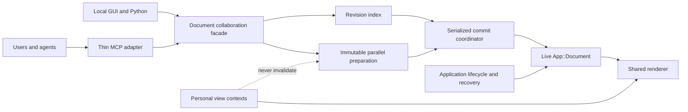

# FreeCAD Document Collaboration Architecture and Implementation Plan

> **Living status:** architecture revised; implementation not started.
>
> **Next action:** Phase 1 contract and file-ownership freeze.
>
> **Last updated:** 2026-08-01.
>
> **Update rule:** the integrator updates §11.3 and §11.4 in the same delivery commit that completes each phase. A phase is not complete while its progress entry, reviews, or test evidence is missing.

## 1. Problem statement

Collaboration means safely interleaving work from multiple users or agents against one live parametric document and one FreeCAD-rendered model view. It is not ownership of a Part, Body, Feature, or subtree. The coordination unit is a FreeCAD-owned typed operation with explicit semantic dependencies.

Same-object edits conflict by default. They may proceed independently only when a typed operation has complete dependencies and FreeCAD proves that their commit semantics are independent. Edits to different objects can still conflict through links, expressions, topology, names, membership, ordering, or Tip state.

Independent geometry preparation may run concurrently from immutable inputs. Only FreeCAD may revalidate and atomically apply final mutations to the live document. This places authority at the existing application/document boundary: `App::Document` owns live model state and transactions, while `App::Application` owns creation and destruction (`src/App/Document.h`, class `App::Document`; `src/App/Application.h`, class `App::Application`).

## 2. Current architectural problems

- Core mutation control is document-global. `App::DocumentMutationAuthority::DocumentState` stores one owner, generation, epoch, and provider for a document; `MutationCapability` is scoped by document and broad `MutationKind`, not semantic dependencies (`src/App/DocumentMutationAuthority.h`, classes `DocumentMutationAuthority` and `ExternalMutationAuthorityProvider`; `src/App/MutationCapability.h`, class `MutationCapability`; `src/App/MutationKind.h`, enums `MutationKind` and `MutationOwner`). Enforcement in `src/App/Property.cpp`, `src/App/DynamicProperty.cpp`, `src/App/Document.cpp`, and `src/App/Application.cpp` excludes actors instead of distinguishing independent edits.
- The MCP add-on owns collaboration authority and duplicates lifecycle policy above FreeCAD. `DocumentLeaseService` advances a document state machine; `LeaseRecord` carries a dirty bit, revisions, file baseline, owner, error, and recovery snapshot; `SidecarStore` persists that state outside FreeCAD (`tools/mcp/freecad-mcp/addon/FreeCADMCP/document_lease/service.py`, class `DocumentLeaseService`; `tools/mcp/freecad-mcp/addon/FreeCADMCP/document_lease/model.py`, class `LeaseRecord`; `tools/mcp/freecad-mcp/addon/FreeCADMCP/document_lease/sidecar.py`, class `SidecarStore`). `FreeCADRPC._dispatch()` and `_dispatch_gui()` authorize and bracket mutations (`tools/mcp/freecad-mcp/addon/FreeCADMCP/rpc_server/rpc_server.py`, class `FreeCADRPC`).
- The MCP process is stateful rather than a thin adapter. `LeaseClientManager` owns credentials, aliases, revocation, and reconnect handling; `FreeCADConnection` owns that manager and stale-recovery routing; the server exposes acquire/adopt/save/finalize lifecycle tools (`tools/mcp/freecad-mcp/src/freecad_mcp/lease_manager.py`, class `LeaseClientManager`; `tools/mcp/freecad-mcp/src/freecad_mcp/freecad_client.py`, class `FreeCADConnection`; `tools/mcp/freecad-mcp/src/freecad_mcp/server.py`, functions `acquire_document_lock()`, `adopt_dirty_document()`, `save_document()`, `save_document_as()`, and `finalize_document_edit()`).
- Change detection is coarse. `DocumentHealthSnapshot` compares whole-object signatures and a document dirty value, while `document_modified_state()` treats `Gui::Document.Modified` as authoritative (`tools/mcp/freecad-mcp/addon/FreeCADMCP/rpc_server/mutation_guard_ops/document_health_snapshot.py`, class `DocumentHealthSnapshot`; `tools/mcp/freecad-mcp/addon/FreeCADMCP/rpc_server/mutation_guard_ops/document_health_delta.py`, class `DocumentHealthDelta`; compatibility exports in `tools/mcp/freecad-mcp/addon/FreeCADMCP/rpc_server/mutation_guard.py`; `tools/mcp/freecad-mcp/addon/FreeCADMCP/document_state.py`). `create_snapshot_bundle_gui()` also treats active-document or global-selection changes as snapshot changes, so personal navigation can reject model work (`tools/mcp/freecad-mcp/addon/FreeCADMCP/rpc_server/snapshot_service_ops/create_snapshot_bundle.py`; compatibility export in `tools/mcp/freecad-mcp/addon/FreeCADMCP/rpc_server/snapshot_service.py`).
- Atomicity is coordinated above FreeCAD after live values begin changing. `FreeCADRPC._execute_mutation_with_health()` uses MCP-side `GuiMutationTransaction` for capture, recompute, validation, commit, or compensating abort (`tools/mcp/freecad-mcp/addon/FreeCADMCP/rpc_server/rpc_server.py`; `tools/mcp/freecad-mcp/addon/FreeCADMCP/rpc_server/mutation_guard_ops/gui_mutation_transaction.py`, class `GuiMutationTransaction`; compatibility export in `tools/mcp/freecad-mcp/addon/FreeCADMCP/rpc_server/mutation_guard.py`). Native `App::Transaction` records already-applied changes for undo/redo and has no expected revisions or semantic read set (`src/App/Transactions.h`, class `App::Transaction`; `src/App/Document.cpp`, methods `openTransaction()`, `commitTransaction()`, and `abortTransaction()`).
- Calculation is not yet a collaboration preparation boundary. MCP `WorkerManager` runs one isolated FreeCADCmd job at a time from FCStd snapshots; those snapshots carry aggregate indicators rather than dependency revisions (`tools/mcp/freecad-mcp/addon/FreeCADMCP/rpc_server/worker_manager.py`, class `WorkerManager`; `tools/mcp/freecad-mcp/addon/FreeCADMCP/rpc_server/snapshot_service.py`, function `create_snapshot_bundle_gui()`). Core `App::Application::recomputeWorker()` recomputes the live document rather than preparing immutable results (`src/App/Application.cpp`, class `App::Application`; `src/App/Application.h`, struct `RecomputeRequest`).
- GUI persistence mixes state domains. `Gui::Document::SaveDocFile()` writes ViewProvider properties, tree expansion, and a camera into `GuiDocument.xml`; `TreeWidget::onItemExpanded()` persists expansion through `DocumentObjectItem::setExpandedStatus()` (`src/Gui/Document.cpp`, class `Gui::Document`; `src/Gui/Tree.cpp`, classes `TreeWidget`, `DocumentItem`, and `DocumentObjectItem`). Selection is process-global (`src/Gui/Selection/Selection.h`, class `SelectionSingleton`), and MCP framing/screenshot helpers overwrite it (`tools/mcp/freecad-mcp/addon/FreeCADMCP/rpc_server/view_manager_ops/focus_helpers.py`, function `frame_on_targets()`; `tools/mcp/freecad-mcp/addon/FreeCADMCP/rpc_server/view_manager_ops/screenshot.py`, function `save_active_screenshot()`; `tools/mcp/freecad-mcp/addon/FreeCADMCP/rpc_server/view_manager_ops/refresh_view.py`, function `refresh_active_view()`; compatibility exports in `tools/mcp/freecad-mcp/addon/FreeCADMCP/rpc_server/view_manager.py`).
- FreeCAD already owns the underlying lifecycle primitives, but collaboration policy is split above them: save and transactions are in `App::Document`, close is in `App::Application::closeDocument()`, and recovery snapshots are in `App::writeRecoverySnapshotToTransientDir()`, `Gui::AutoSaver`, and `Gui::Dialog::DocumentRecovery` (`src/App/Document.cpp`; `src/App/Application.cpp`; `src/App/RecoverySnapshot.cpp`; `src/Gui/AutoSaver.cpp`; `src/Gui/DocumentRecovery.cpp`).

## 3. FreeCAD responsibilities

### 3.1 Authority and lifecycle

- Own every live document instance, lifecycle epoch, revision stream, operation status, commit order, persisted-state marker, and recovery record. A disconnected client may orphan or cancel an operation, but it never leaves a document owned.
- Derive semantic dependencies for supported operations. Clients may describe intent but cannot make an unsafe operation valid by omitting a dependency.
- Produce immutable calculation snapshots, run or admit concurrent preparation, revalidate results, and serialize final live commits on the required FreeCAD thread.
- Apply each commit behind a short visibility barrier: validate, open one native transaction, mutate, recompute the affected graph, check postconditions, publish revisions/events on success, or abort without exposing a partial state.
- Decide save, close, interruption, administrative cancellation, stale-result rejection, crash recovery, and snapshot retention through `App::Document`, `App::Application`, `App::RecoverySnapshot`, `Gui::AutoSaver`, and the existing recovery UI.

### 3.2 Narrow initial scope

The MVP starts with `ObjectExistenceRevision`, `ObjectModelRevision`, `ObjectStructureRevision`, `DocumentStructureRevision`, and `Document.UnknownModelMutationRevision`. Before any `PreparedEdit` API is enabled, Phase 1 must ensure that every unclassified App model/structural mutation advances the wildcard, or that the uncovered mutation path is disabled while collaboration is active. Personal camera, selection, tree, and other view changes are excluded from those revisions from Phase 1. Phase 2 supports exactly two typed operations: an object-property update and a Part Boolean. Until Phase 6, same-object work remains conservatively conflicting and ordinary shared ViewProvider mutations are serialized without promising an atomic App-plus-Gui transaction.

### 3.3 Compatibility mutations and shims

Existing GUI commands, macros, and Python code that make App model/structural changes but cannot declare complete dependencies use one fallback: enter the short commit barrier, perform the existing mutation, recompute as required, increment the applicable object/structure revisions and `Document.UnknownModelMutationRevision`, then publish and release. This is commit-time exclusion only; it grants no ownership and correctness does not depend on a heartbeat. Known personal-view changes bypass this path. Known shared-presentation changes use a separate serialized GUI compatibility path and do not advance the model wildcard unless they also mutate App state.

Every moved Python symbol retains its old import path through an explicit re-export shim during the migration window. A deliberately retired ownership API is not silently re-exported: it returns the documented deprecation/replacement error until its removal gate is met. Reviewers treat an accidental removed import path as blocking.

## 4. MCP responsibilities

- Authenticate and identify callers, translate tools into typed FreeCAD collaboration calls, pass opaque actor/session identifiers, forward advisory cancellation, and return FreeCAD's structured success, conflict, stale, cancellation, or lifecycle result.
- Query or subscribe to authoritative status. Read-only response caching is allowed, but cached state never authorizes a mutation.
- Do not own documents, mutation exclusion, dirty/save state, file baselines, sidecars, recovery snapshots, close rules, administrative cancellation, conflict decisions, or rollback. Terminating or replacing the MCP cannot transfer, revoke, or corrupt document authority; no heartbeat is required for correctness.
- Replace rather than redesign the current ownership machinery: `DocumentLeaseService`, `LeaseRecord`, `SidecarStore`, `DocumentIdentityService`, `LeaseObserver`, and MCP `SaveService` (`tools/mcp/freecad-mcp/addon/FreeCADMCP/document_lease/service.py`; `tools/mcp/freecad-mcp/addon/FreeCADMCP/document_lease/model.py`; `tools/mcp/freecad-mcp/addon/FreeCADMCP/document_lease/sidecar.py`; `tools/mcp/freecad-mcp/addon/FreeCADMCP/document_lease/identity.py`; `tools/mcp/freecad-mcp/addon/FreeCADMCP/document_lease/observer_ops/app_observer.py`; `tools/mcp/freecad-mcp/addon/FreeCADMCP/rpc_server/save_service.py`). Replace lifecycle portions of `FreeCADRPC`, `LeaseClientManager`, `FreeCADConnection`, and `tools/mcp/freecad-mcp/src/freecad_mcp/server.py`; retain unrelated transport authentication and replay protection.
- After every mutation ingress uses the new boundary, retire the `McpOwned` owner/provider/capability surface rather than extending it (`src/App/DocumentMutationAuthority.h`; `src/App/DocumentMutationAuthority.cpp`; `src/App/MutationCapability.h`; `src/App/MutationCapability.cpp`; `src/App/MutationKind.h`; mutation methods in `src/App/DocumentPyImp.cpp`).

## 5. Multitask operating model

This refactor is executed with Cursor Multitask. Maximize parallel workers **only** when file ownership is disjoint. Default to one worker when fewer than two safe independent workstreams exist, and record why in §11.4.

### 5.1 Roles

| Role | Model | Responsibilities |
| --- | --- | --- |
| **Worker** (implementation subagent) | **Composer 2.5 only** — never Composer 2.5 Fast | Implements one workstream under exclusive file ownership. Does not edit shared files. Adds focused tests and reports changed files, tests, assumptions, and blockers. |
| **Integrator** (parent or dedicated agent) | Same session orchestrator | Freezes interfaces, owns shared files, waits for every worker in a wave, combines outputs, runs native and Docker suites, updates §11 Progress, and creates the single phase delivery. |
| **Reviewer** (read-only subagent) | **Cursor Grok 4.5 High** | Reviews extremely critically. After every workstream and after integration/fixes, inspects the actual diff and tests and reports blocking, important, and non-blocking findings. |

### 5.2 Hard Multitask rules

1. Use **Composer 2.5** for every implementation subagent.
2. Never use Composer 2.5 Fast for subagents.
3. Do not delegate an entire phase to one worker when at least two safe workstreams exist.
4. Assign exclusive file ownership to each worker as listed in §11.2 before starting a wave.
5. Workers must not edit shared files listed in §5.3 or integrator-only files in the phase table.
6. Workers report changed files, tests added or changed, assumptions, and blockers.
7. One integrator owns shared files, integration, native test execution, Docker execution, §11 Progress updates, and the single parent-repository phase commit.
8. The integrator waits for all workers in a wave before combining their changes.
9. After every workstream, start a read-only Cursor Grok 4.5 High review of the actual diff and tests.
10. Review findings are classified as blocking, important, or non-blocking.
11. Fix every blocking and important finding, then review the resulting diff again.
12. Before the phase delivery, the integrator runs branch-built native tests and all Docker services: `unit`, `e2e`, `core`, and `benchmark`.
13. Do not mark a phase complete unless all required reviews and tests pass.
14. If fewer than two independent workstreams remain, use one worker and explicitly record why parallelization is unsafe.
15. Create exactly one integrator commit in the parent repository per phase. Temporary workstream branches or worktrees are not delivery units; any phase that changes the MCP submodule has exactly one unavoidable squashed nested commit under §5.4.
16. Every moved symbol keeps its old import path working through the explicit shim policy in §3.3; a removed re-export is blocking.
17. If either required Cursor model is unavailable, mark the wave blocked; do not silently substitute a different model.

### 5.3 Shared-file ownership

Workers may read but never edit the following cross-workstream files. They are unconditionally integrator-owned. The integrator also owns any phase-specific integration seam and may narrow, but never broaden, a worker's path set after a wave starts.

- This plan: `doc/freecad_document_collaboration_plan.md`.
- Build/test registration: `src/App/CMakeLists.txt`, `src/Gui/CMakeLists.txt`, `src/Mod/Part/App/CMakeLists.txt`, `tests/src/App/CMakeLists.txt`, `tests/src/Gui/CMakeLists.txt`, `tests/src/Mod/Part/CMakeLists.txt`, and `tests/src/Mod/Part/App/CMakeLists.txt`.
- Core integration seams: `src/App/Document.h`, `src/App/Document.cpp`, `src/App/Application.h`, `src/App/Application.cpp`, `src/App/Transactions.h`, and `src/App/Transactions.cpp`.
- Authority-removal seams: `src/App/DocumentMutationAuthority.h`, `src/App/DocumentMutationAuthority.cpp`, `src/App/MutationCapability.h`, `src/App/MutationCapability.cpp`, `src/App/MutationKind.h`, and `tests/src/App/DocumentMutationAuthority.cpp`.
- GUI integration seams: `src/Gui/Document.h` and `src/Gui/Document.cpp`.
- MCP facades and package exports: `tools/mcp/freecad-mcp/addon/FreeCADMCP/rpc_server/rpc_server.py`, `tools/mcp/freecad-mcp/addon/FreeCADMCP/rpc_server/view_manager.py`, `tools/mcp/freecad-mcp/src/freecad_mcp/freecad_client.py`, `tools/mcp/freecad-mcp/src/freecad_mcp/server.py`, affected `__init__.py` files, and build/CI configuration.
- The parent-repository gitlink for `tools/mcp/freecad-mcp`.

### 5.4 Repository and delivery constraints

- Root `.gitignore:58` ignores `/doc/*`. Before Phase 1, the integrator must explicitly track this existing plan (for example by force-adding this exact path); otherwise it cannot be updated in phase commits. This planning-only edit does not alter `.gitignore`.
- `tools/mcp/freecad-mcp` is a Git submodule (`.gitmodules`; root index mode `160000`). Any phase that changes it requires exactly one squashed submodule commit and one parent phase commit containing the updated gitlink and progress log. The parent commit is the canonical phase delivery; no worker commits are delivery units. If “one commit” means literally one Git object across both repositories, that phase is blocked until the user approves splitting the phase by repository or changing the repository layout.
- Before every wave, inspect the root and submodule worktrees for pre-existing changes that overlap assigned paths. Preserve or deliberately integrate them before delegation; an unresolved collision blocks the wave. Never overwrite user work merely to obtain exclusive ownership.
- The four services in `tools/mcp/freecad-mcp/docker-compose.yml` use the conda-forge FreeCAD installed by `tools/mcp/freecad-mcp/Dockerfile`; they do not exercise this branch's C++ build or replace native `App_tests_run`, `Gui_tests_run`, or relevant `Part_tests_run` tests. Phases 5 and 6 must additionally pass the branch-built MCP cross-track path represented by `freecad-mcp-load-preflight`, `freecad-mcp-core-tests`, and `freecad-mcp-e2e` in `.woodpecker/ci.yml`, or a recorded equivalent using this branch's `FreeCADCmd`.
- The progress log records the unique phase commit subject and optional annotated phase tag, not the commit's own SHA, which cannot be embedded in the same commit without self-reference.

## 6. Proposed FreeCAD classes and APIs

The first implementation has four primary concepts; the registry and facade stay deliberately small.

| Type | Phase | Purpose and minimal surface |
| --- | --- | --- |
| `App::DocumentRevisionIndex` | 1 | Owns initial object existence/model/structure, document structure, and wildcard revisions; validates and atomically publishes revision changes. Property keys are a Phase 6 extension. |
| `App::PreparedEdit` | 2 | Immutable operation ID, document instance/epoch, expected semantic revisions, read/write sets, prepared outputs, and validation provenance. It contains no live `DocumentObject*`. |
| `App::DocumentCommitCoordinator` | 2 | Per-document serialized commit point; revalidates, applies one native transaction/recompute/postcondition sequence behind a visibility barrier, then publishes or aborts. |
| `Gui::PersonalViewContext` | 1 boundary; 6 storage/API | Actor-scoped camera, projection, selection, tree state, active view/workbench, and overlays. It never participates in model validity. Phase 1 establishes exclusion; Phase 6 adds first-class contexts. |
| `App::CollaborationRegistry` | 1 | Small application-owned map of live document instance/epoch and bounded post-close tombstones; not a general service hierarchy. |
| `App::DocumentCollaborationService` | 2 | Thin `App::Document` facade exposing session, snapshot, prepare, commit, cancel, and status calls by delegating to the revision index and coordinator. |
| `App::EditSession` | 2 | Only `session_id`, `actor_id`, `document_instance_id`, status, and cancellation information. The authoritative epoch remains in the registry and is copied into `PreparedEdit` for validation. The session contains no ownership, heartbeat, expiry authority, credentials, dirty/save state, or sidecar state. |
| `App::CollaborativeOperation` | 2 onward | FreeCAD-owned typed adapter that derives complete dependencies, snapshots inputs, prepares without live mutation, applies a batch, and checks postconditions. Arbitrary code is never treated as dependency-complete. |
| `App::CollaborationDomainProvider` and `Gui::SharedPresentationCoordinator` | 6 | Optional App/Gui boundary for shared-presentation revisions and coordinated commits after the App-only model path is proven. |

The facade exposes `beginEditSession()`, `snapshotForEdit()`, `prepareEdit()`, `commitEdit()`, `cancelEdit()`, and `sessionStatus()`. Python bindings in `src/App/DocumentPyImp.cpp` and `src/App/Document.pyi` return opaque IDs and structured results, never authority credentials. Phase 6 exposes personal-context APIs through `src/Gui/DocumentPyImp.cpp` and `src/Gui/ApplicationPy.cpp`.

## 7. Edit-session and conflict model

- Edit sessions coordinate operations but never grant exclusive document ownership. Correctness never depends on heartbeat, expiry, or client liveness.
- Starting a session binds to a runtime document-instance ID; the registry owns the current lifecycle epoch, and each `PreparedEdit` carries the epoch it prepared against. A base commit sequence is diagnostic only; validation uses the epoch and revisions actually read or reserved for write.
- Phase 1 revisions are object-level: existence/incarnation, model result, object structure, and document structure. Every unclassified mutation increments `Document.UnknownModelMutationRevision`; prepared work that might depend on unknown state reads that wildcard and becomes stale.
- FreeCAD derives reads and writes. They include object existence, upstream geometry, namespace entries, Body/Group membership and order, Tip, and link edges. Create/delete operations validate the relevant namespace and structure revisions.
- A lifecycle mismatch rejects first. Changed read dependencies or write targets reject the prepared result. Same-object edits conflict by default, even if they name different properties. Phase 6 permits property-level concurrency only for typed adapters with complete dependencies and proven independent commit semantics.
- Compatibility mutations follow §3.3 and conservatively invalidate prepared work. Local GUI, Python, undo, and redo changes publish into the same revision stream as remote operations.
- Conflict results return changed semantic keys and expected/current revisions. FreeCAD never silently merges; the caller rereads and reprepares.
- FCStd timestamps/hashes, file replacement, `Gui::Document.Modified`, and a document-wide sequence are save or diagnostic evidence only, never conflict predicates.

## 8. Model state versus view state

| Domain | Examples | Initial and final behavior |
| --- | --- | --- |
| Model state | Parametric values, expressions, constraints, placements, shapes, topology results | Persisted and object-revisioned initially; typed property keys are added in Phase 6. |
| Structural state | Object incarnation, names, dynamic-property schema, Body/Group membership and order, Tip, dependency/link edges | Persisted and separately revisioned at object/document structure scope. |
| Shared presentation state | Deliberately shared visibility, color, transparency, display mode, ViewProvider annotations | Through Phase 5, ordinary changes use a separate serialized GUI compatibility path and do not advance model revisions; no App-plus-Gui atomicity promise. Phase 6 adds explicit presentation revisions and the GUI provider. |
| Personal view state | Camera, projection, pan/zoom, selection/preselection, tree expansion/scroll, active document/view/workbench, edit focus, temporary overlays | Stored outside collaboration revisions and dirty/model validity from Phase 1; first-class actor contexts arrive in Phase 6. |

Unknown persisted properties fail closed into model, structural, or shared-presentation handling, never personal state. Before Phase 6, presentation-dependent prepared operations such as “process visible objects” are unsupported; they must instead execute synchronously inside the short GUI compatibility barrier. After Phase 6 they explicitly read shared-visibility revisions.

Applying a personal context to the one shared renderer is an exception-safe, renderer-serialized apply/render/restore action. It cannot update another context, shared ViewProvider properties, dirty state, or collaboration revisions. The process-global `SelectionSingleton` (`src/Gui/Selection/Selection.h`) remains only a compatibility projection of the active human context, never authoritative collaboration state or a screenshot scratchpad.

During migration, split the combined GUI serialization in `Gui::Document::SaveDocFile()`/`RestoreDocFile()` (`src/Gui/Document.cpp`). A legacy FCStd adapter may import/export one local default camera/tree layout, but that blob is non-authoritative and cannot invalidate model work.

## 9. Concurrent calculation and serialized commit flow

1. FreeCAD briefly stabilizes the declared input graph, copies only required values/shapes into an immutable snapshot, and records their revisions.
2. Phase 2 proves atomic commit with the two pilot typed operations. Phase 3 moves supported geometry preparation off the live-document thread; multiple jobs may overlap without access to `App::Document`, GUI objects, global selection, or active view.
3. Each prepared result carries its document instance, epoch, operation type, dependencies, and intended mutation batch. It enters a per-document commit queue, where FreeCAD revalidates immediately before mutation.
4. FreeCAD closes stable-read admission for the short commit interval, opens one native transaction, applies the App mutation batch, recomputes, checks postconditions, and publishes revisions/events only on success. Public App notifications and repaint are buffered so observers see the old or new committed state, never an intermediate state.
5. On failure, FreeCAD aborts and publishes neither success nor revisions. Compatibility mutations use the same short barrier but do not become long-lived sessions or exclusion claims.
6. Long-running preparation never blocks the FreeCAD event loop, camera movement, selection, or tree interaction. Personal view activity cannot cause a conflict, cancellation, admission failure, timeout, or stale result.

The MVP guarantees atomic App-model commits only. Cross-domain App/Gui shared-presentation coordination is a Phase 6 extension. Save/export and other external side effects use lifecycle APIs or stage output until the model commit succeeds.

## 10. Save, close, crash, and recovery behavior

- **Save:** FreeCAD serializes a stable committed model/structure revision and records its persisted marker. Saving does not end a session or stale a result whose dependencies are unchanged. Personal state is excluded; shared-presentation persisted markers are added in Phase 6.
- **Close:** `App::Application` and `Gui::Document::canClose()` remain the decision points (`src/App/Application.cpp`; `src/Gui/Document.cpp`). Before destruction, the registry marks the instance closing, drains or cancels admitted commits, applies FreeCAD's save policy, advances the lifecycle epoch, and retains a bounded tombstone so late results receive a stale-document response.
- **Crash/restart:** FreeCAD writes recovery data only from a stable committed state, extending `App::writeRecoverySnapshotToTransientDir()` and `Gui::AutoSaver` (`src/App/RecoverySnapshot.cpp`; `src/Gui/AutoSaver.cpp`). A reopened document gets a new runtime instance; pre-crash results are never auto-applied.
- **Interrupted sessions:** Disconnection may orphan/cancel work. Cleanup and expiry are resource policies only and never authorize mutations or affect document correctness.
- **Administrative cancellation/recovery:** A local FreeCAD action first preserves a stable recovery point, then cancels sessions and advances the epoch. It does not transfer ownership. Restore choices and retention stay in `src/Gui/DocumentRecovery.h` and `src/Gui/DocumentRecovery.cpp` (classes `DocumentRecovery`, `DocumentRecoveryFinder`, and `DocumentRecoveryHandler`).

## 11. Implementation phases and progress

### 11.1 Phase gate and commit protocol

For each phase, the integrator records the base revision and exclusive ownership before work starts, freezes shared interfaces before dependent parallel work, and executes the wave lifecycle in §5. Every worker supplies focused tests with its implementation. The integrator then wires shared surfaces and runs:

- the branch-built native targets affected by the phase, including `App_tests_run`, `Gui_tests_run`, and relevant Part tests;
- from `tools/mcp/freecad-mcp`, Docker Compose services `unit`, `e2e`, `core`, and `benchmark`;
- for Phases 5 and 6, the `.woodpecker/ci.yml` branch-built MCP load-preflight plus `core` and `e2e` cross-track jobs, or a recorded equivalent against this branch's `FreeCADCmd`;
- import-shim/deprecation checks for every moved or retired public symbol.

The integrated diff receives a final read-only Cursor Grok 4.5 High review after fixes. A phase completes only when blocking and important findings are zero, every required suite passes, §11.3/§11.4 are current, and the integrator creates the phase delivery with the listed subject. Non-blocking findings are recorded with an owner and target phase.

### 11.2 Phase workstreams

#### Phase 1 — Revision and conflict foundation

**Outcome:** document instance ID and lifecycle epoch; object existence/model/structure, document-structure, and unknown-mutation wildcard revisions; universal wildcard capture (or explicit disabling) for every unclassified authoritative mutation before Phase 2; personal view exclusion; focused conflict tests.

| Wave | Worker/model | Exclusive files | Deliverable and tests |
| --- | --- | --- | --- |
| A | 1A / Composer 2.5 | `src/App/CollaborationRegistry.h`, `src/App/CollaborationRegistry.cpp`, `tests/src/App/CollaborationRegistry.cpp` | Small live-instance/epoch/tombstone registry and lifecycle-unit tests. |
| A | 1B / Composer 2.5 | `src/App/DocumentRevisionIndex.h`, `src/App/DocumentRevisionIndex.cpp`, `tests/src/App/DocumentRevisionIndex.cpp` | Initial revision types, validation/publication, wildcard behavior, and conflict tests. |
| A | 1C / Composer 2.5 | `tests/src/App/DocumentCollaborationBoundary.cpp`, `tests/src/Gui/CollaborationViewIsolation.cpp` | Prove every unclassified authoritative mutation advances the wildcard while camera/selection/tree changes do not advance model revisions. |

The integrator alone wires `App::Application`, `App::Document`, `Property.cpp`, `DynamicProperty.cpp`, and CMake/test registration. The gate inventories all App model/structural mutation ingress and proves each path increments a classified or wildcard revision, or is rejected while collaboration is active; `PreparedEdit` remains disabled until this passes. Three workers are safe after the registry/revision contract is frozen; a fourth is unsafe because all remaining production hooks converge on those shared mutation paths. Commit: `feat(collaboration): phase 1 add revision foundation`.

#### Phase 2 — Prepared edit and atomic commit

**Outcome:** immutable `PreparedEdit`, serialized `DocumentCommitCoordinator`, lifecycle/revision validation, one native transaction/recompute/postcondition path, and exactly two pilot typed operations: object-property update and Part Boolean.

| Wave | Worker/model | Exclusive files | Deliverable and tests |
| --- | --- | --- | --- |
| A | 2A / Composer 2.5 | `src/App/PreparedEdit.h`, `src/App/PreparedEdit.cpp`, `src/App/CollaborativeOperation.h`, `src/App/CollaborativeOperation.cpp`, `tests/src/App/PreparedEdit.cpp` | Immutable payload and typed-operation contract tests. |
| A | 2B / Composer 2.5 | `src/App/DocumentCommitCoordinator.h`, `src/App/DocumentCommitCoordinator.cpp`, `tests/src/App/DocumentCommitCoordinator.cpp` | Validation, rollback, observer-visibility, and serialization tests. |
| B | 2C / Composer 2.5 | `src/App/CollaborativeSetPropertyOperation.h`, `src/App/CollaborativeSetPropertyOperation.cpp`, `tests/src/App/CollaborativeSetPropertyOperation.cpp` | Conservative object-level property-update adapter. |
| B | 2D / Composer 2.5 | `src/Mod/Part/App/CollaborativeBooleanOperation.h`, `src/Mod/Part/App/CollaborativeBooleanOperation.cpp`, `tests/src/Mod/Part/App/CollaborativeBooleanOperation.cpp` | Boolean adapter declaring input existence/model reads and result structure/model writes. |

Wave B starts only after the integrator merges and freezes Wave A interfaces. The integrator owns the document facade, transaction/recompute wiring, bindings, and registrations. More parallelism within either wave is unsafe because those integrations share transaction state and public interfaces. Commit: `feat(collaboration): phase 2 add prepared atomic commits`.

#### Phase 3 — Detached geometry preparation

**Outcome:** immutable inputs, concurrent non-blocking preparation, serialized commit admission, and stale rejection from actual read sets.

| Wave | Worker/model | Exclusive files | Deliverable and tests |
| --- | --- | --- | --- |
| A | 3A / Composer 2.5 | `src/App/PreparedEditExecutor.h`, `src/App/PreparedEditExecutor.cpp`, `tests/src/App/PreparedEditExecutor.cpp` | Bounded preparation executor, cancellation/status, and no-live-pointer tests. |
| A | 3B / Composer 2.5 | `src/Mod/Part/App/CollaborativeBooleanOperation.h`, `src/Mod/Part/App/CollaborativeBooleanOperation.cpp`, `tests/src/Mod/Part/App/CollaborativeBooleanPreparation.cpp` | Move Boolean calculation to immutable shapes and return a prepared mutation batch. |
| B | 3C / Composer 2.5 | `tests/src/App/DocumentCollaborationConcurrency.cpp`, `tests/src/Gui/CollaborationResponsiveness.cpp` | After Wave A integration, prove overlap, serialized final commits, stale rejection, and event-loop/camera responsiveness. |

The integrator freezes the Phase 3 executor/adapter contracts before Wave A, then owns scheduling through `App::Application`, stable snapshot admission through `App::Document`, recompute/commit queue wiring, and registrations. Wave B starts only after 3A/3B integration. Two Wave A workers are safe; further splitting would collide in scheduler/recompute seams. If the executor/adapter contract cannot remain frozen, collapse Wave A to one worker and log why. Commit: `feat(collaboration): phase 3 detach geometry preparation`.

#### Phase 4 — Existing FreeCAD mutation integration

**Outcome:** selected GUI and Python paths move from the already-safe wildcard path to typed operations; every other local mutation remains on the wildcard compatibility path; local and remote work share one revision stream.

| Wave | Worker/model | Exclusive files | Deliverable and tests |
| --- | --- | --- | --- |
| A | 4A / Composer 2.5 | `src/App/Property.cpp`, `src/App/DynamicProperty.cpp`, `tests/src/App/CollaborationCompatibilityMutation.cpp` | Refine selected mutation-source classification while preserving conservative wildcard invalidation for all unclassified paths. |
| A | 4B / Composer 2.5 | `src/App/DocumentPyImp.cpp`, `src/App/Document.pyi`, `tests/src/App/DocumentCollaborationPython.cpp` | Session/prepare/commit bindings and compatibility-import tests. |
| A | 4C / Composer 2.5 | `src/Gui/CollaborationCompatibilityAdapter.h`, `src/Gui/CollaborationCompatibilityAdapter.cpp`, `tests/src/Gui/CollaborationCompatibilityAdapter.cpp` | Short-barrier bridge for legacy GUI commands without treating personal view actions as mutations. |

The integrator owns `App::Document`, `Gui::Document`, facade wiring, and registrations. Three workers are safe because source interception, bindings, and GUI adaptation are disjoint; command-by-command splitting is unsafe until the compatibility adapter contract is stable. Commit: `feat(collaboration): phase 4 integrate local mutations`.

#### Phase 5 — Lifecycle and MCP cutover

**Outcome:** FreeCAD owns save, close, reopen, crash recovery, interruption, administrative cancellation, and stale-result behavior; MCP calls the FreeCAD boundary; sidecars and ownership/heartbeat/credential-custody correctness logic are removed.

| Wave | Worker/model | Exclusive files | Deliverable and tests |
| --- | --- | --- | --- |
| A | 5A / Composer 2.5 | `src/App/RecoverySnapshot.h`, `src/App/RecoverySnapshot.cpp`, `tests/src/App/DocumentCollaborationRecovery.cpp` | Stable revision/epoch recovery metadata and crash/reopen tests. |
| A | 5B / Composer 2.5 | `src/Gui/AutoSaver.h`, `src/Gui/AutoSaver.cpp`, `src/Gui/DocumentRecovery.h`, `src/Gui/DocumentRecovery.cpp`, `tests/src/Gui/DocumentRecovery.cpp` | Autosave/recovery UI integration and prior-epoch rejection tests. |
| A | 5C / Composer 2.5 | `tools/mcp/freecad-mcp/src/freecad_mcp/collaboration_client.py`, `tools/mcp/freecad-mcp/tests/test_collaboration_client.py`, `tools/mcp/freecad-mcp/tests/test_collaboration_public_api.py` | Thin client calls, reconnect behavior, public compatibility shims, and no-client-authority tests. |
| A | 5D / Composer 2.5 | `tools/mcp/freecad-mcp/addon/FreeCADMCP/rpc_server/collaboration_api.py`, `tools/mcp/freecad-mcp/tests/test_collaboration_rpc.py` | Add-on FreeCAD API bridge and structured result tests. |

After Wave A review, the integrator wires `Application`/`Document` lifecycle, `FreeCADRPC`, `FreeCADConnection`, `server.py`, and package exports; removes the old sidecar/observer/save-recovery paths; retires the native `McpOwned` provider/capability surface listed in §4; and preserves only the §3.3 deprecation surface. Four workers are safe across App recovery, GUI recovery, MCP client, and add-on RPC boundaries; deletion and facade rewiring remain centralized because their imports overlap. Apply the submodule delivery rule in §5.4. Commit: `refactor(collaboration): phase 5 cut over lifecycle and MCP`.

#### Phase 6 — Finer concurrency and presentation

**Outcome:** typed property revisions, more adapters, proven same-object concurrency, first-class personal contexts, and explicit shared-presentation coordination.

| Wave | Worker/model | Exclusive files | Deliverable and tests |
| --- | --- | --- | --- |
| A | 6A / Composer 2.5 | `src/App/DocumentRevisionIndex.h`, `src/App/DocumentRevisionIndex.cpp`, `src/App/CollaborativeSetPropertyOperation.h`, `src/App/CollaborativeSetPropertyOperation.cpp`, `tests/src/App/DocumentPropertyRevision.cpp`, `tests/src/App/CollaborativeSetPropertyIndependence.cpp` | Property keys and typed independence proofs; unproven same-object edits still conflict. |
| A | 6B / Composer 2.5 | `src/Gui/SharedPresentationCoordinator.h`, `src/Gui/SharedPresentationCoordinator.cpp`, `tests/src/Gui/SharedPresentationCoordinator.cpp` | Presentation revisions and App/Gui validate/apply/rollback tests. |
| A | 6C / Composer 2.5 | `src/Gui/PersonalViewContext.h`, `src/Gui/PersonalViewContext.cpp`, `tests/src/Gui/PersonalViewContext.cpp` | Actor-scoped personal state and exception-safe renderer apply/render/restore. |
| B | 6D / Composer 2.5 | `tools/mcp/freecad-mcp/addon/FreeCADMCP/rpc_server/view_manager_ops/collaboration_context.py`, `tools/mcp/freecad-mcp/addon/FreeCADMCP/rpc_server/view_manager_ops/focus_helpers.py`, `tools/mcp/freecad-mcp/addon/FreeCADMCP/rpc_server/view_manager_ops/screenshot.py`, `tools/mcp/freecad-mcp/addon/FreeCADMCP/rpc_server/view_manager_ops/refresh_view.py`, `tools/mcp/freecad-mcp/tests/test_collaboration_view_context.py` | After the personal-context binding contract is frozen, MCP view calls use contexts rather than global selection/active view; the integrator maintains the top-level compatibility export. |

The integrator owns the App/Gui provider boundary, public bindings, document serialization split, registrations, and final acceptance integration. Workers 6A–6C are safe in Wave A on separate core, presentation, and personal-view paths. After integration, the integrator freezes the callable personal-context binding and starts 6D in Wave B; running it earlier would couple two unfinished interfaces. Commit: `feat(collaboration): phase 6 add fine-grained and presentation concurrency`.

### 11.3 Progress

Allowed phase states are `Not started`, `In progress`, `Blocked`, and `Complete`. The integrator replaces this snapshot in place before every phase delivery.

| Phase | Status | Active wave | Workstreams/reviews | Native tests | Docker `unit/e2e/core/benchmark` | Branch cross-track | Delivery subject or tag |
| --- | --- | --- | --- | --- | --- | --- | --- |
| 1 — Revision foundation | Not started | — | Pending | Pending | Pending | N/A | `feat(collaboration): phase 1 add revision foundation` |
| 2 — Prepared atomic commit | Not started | — | Pending | Pending | Pending | N/A | `feat(collaboration): phase 2 add prepared atomic commits` |
| 3 — Detached preparation | Not started | — | Pending | Pending | Pending | N/A | `feat(collaboration): phase 3 detach geometry preparation` |
| 4 — Existing mutation integration | Not started | — | Pending | Pending | Pending | N/A | `feat(collaboration): phase 4 integrate local mutations` |
| 5 — Lifecycle/MCP cutover | Not started | — | Pending | Pending | Pending | Pending | `refactor(collaboration): phase 5 cut over lifecycle and MCP` |
| 6 — Finer concurrency/presentation | Not started | — | Pending | Pending | Pending | Pending | `feat(collaboration): phase 6 add fine-grained and presentation concurrency` |

**Current snapshot:** no active wave; no implementation base recorded; no worker branches; reviews and tests pending. Before Phase 1, record the base revision, explicitly track this ignored document, freeze the Phase 1 contracts, and assign the three exclusive path sets.

### 11.4 Append-only phase log

Append entries at the end in chronological order. Each entry must be sufficient for another integrator to resume without reconstructing state from chat history:

#### 2026-08-01 — Planning baseline

- **Status:** architecture and Multitask implementation plan revised; implementation not started.
- **Decisions:** object-level plus wildcard revisions first; same-object conflict by default; two pilot typed operations; shared-presentation atomicity deferred to Phase 6.
- **Repository state to resolve:** explicitly track this ignored plan before Phase 1; record the root and MCP submodule base revisions without changing existing user work.
- **Next:** freeze Phase 1 interfaces and exclusive ownership, then start Wave A.

For each implementation wave, append: phase/wave and date; base revision; ownership assigned; changed files; tests added/changed; each worker's assumptions/blockers; review findings by severity and re-review result; native test commands/results/counts; all four Docker results; branch cross-track result when required; decisions/deviations; unresolved non-blocking follow-ups; next action; and the planned phase commit subject/tag.

## 12. Acceptance criteria and required tests

- No actor or session owns a document, and no heartbeat or client liveness is required for correctness. Stopping or replacing MCP cannot transfer, revoke, or corrupt authority.
- Phase 1 tests object existence/model/structure, document structure, lifecycle epochs, wildcard revision advancement/validation, universal mutation-ingress coverage, and personal-view exclusion. The `PreparedEdit` API cannot be enabled while any authoritative unclassified path bypasses the wildcard.
- Phase 2 tests both pilot operations; same-object concurrent edits are rejected by default. Same-key, delete-versus-write, namespace/membership/order/Tip/link, and upstream-geometry conflicts reject exactly one stale result with no partial mutation.
- Injected apply, recompute, and postcondition failures restore the pre-commit document. Concurrent readers and observers see no intermediate values, revision publication, or success event.
- Phase 3 proves independent preparations overlap while final live commits never overlap. Long-running geometry preparation does not block camera interaction or the FreeCAD event loop; view activity never makes model work stale.
- Phase 4 proves local GUI, Python, undo/redo, and remote operations enter one revision stream; any unclassified local mutation invalidates every potentially affected prepared edit; compatibility mutations are short and conservative; all moved import paths retain shims.
- Phase 5 proves save does not stale unchanged dependencies; close, recovery, crash/reopen, and administrative epoch advance reject prior results. MCP restart leaves the document, dirty/persisted marker, recovery data, and close policy intact, with no authority sidecar or FCStd-difference conflict check.
- Phase 6 permits same-object concurrency only where a typed adapter proves property independence. Shared presentation uses GUI-provider revisions, while personal camera/selection/tree contexts remain isolated and renderer apply/render/restore preserves every context.
- Use distinct suites under `tests/src/App/`, `tests/src/Gui/`, and `tests/src/Mod/Part/` to avoid shared-file collisions, plus MCP adapter tests under `tools/mcp/freecad-mcp/tests/`. Replace ownership expectations in `tests/src/App/DocumentMutationAuthority.cpp` and retain regressions for `App::Document` transactions, `Gui::AutoSaver`, `Gui::Dialog::DocumentRecovery`, snapshots, and view operations.
- Every workstream and integrated diff passes the required critical review/re-review. Branch-built native tests and Docker `unit`, `e2e`, `core`, and `benchmark` all pass before the progress update and phase delivery; Phases 5 and 6 also pass the branch-built MCP cross-track gate.

## 13. Explicit non-goals

- Assigning a Part, Body, Feature, subtree, document, or session to one actor.
- Heartbeat-based correctness, credential rotation as document authority, or a new service hierarchy before the first typed Boolean commits safely.
- CRDTs, automatic semantic merging, offline editing, FCStd merging, or Git/file changes as live conflict detection.
- Redesigning the existing MCP ownership system; it is a compatibility mechanism to remove after the FreeCAD boundary exists.
- Making MCP authoritative for save, close, dirty state, recovery, administrative cancellation, cleanup, rollback, or conflict decisions.
- Running concurrent mutations on the live C++ object graph; concurrency is limited to immutable preparation followed by serialized FreeCAD commits.
- Treating camera, zoom, selection, tree expansion, active UI state, or temporary overlays as shared model state.
- MVP atomicity across App model state and GUI presentation, multiple live documents, or arbitrary filesystem/network effects. Shared presentation is Phase 6; multi-document transactions are outside this plan.
- Declaring arbitrary Python code collaboration-safe without a FreeCAD-owned typed adapter and complete dependencies.
