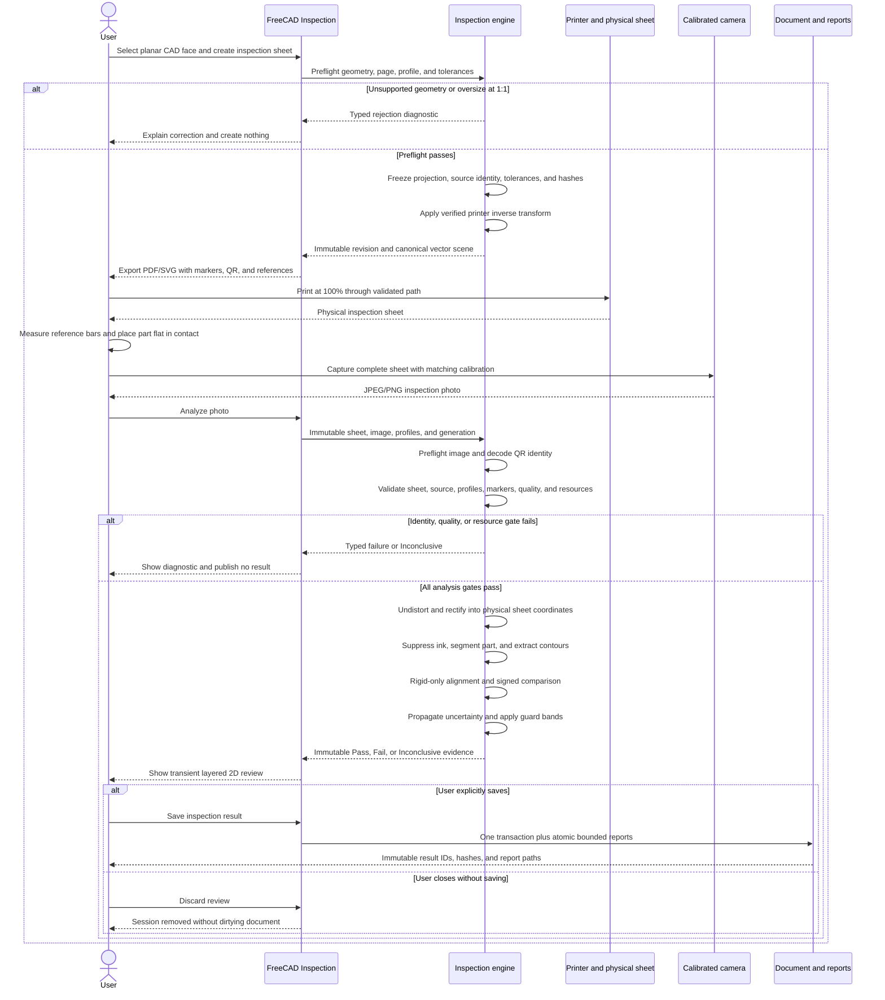
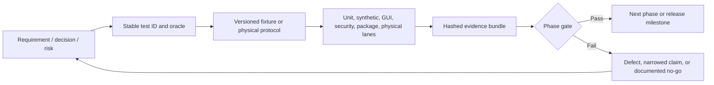
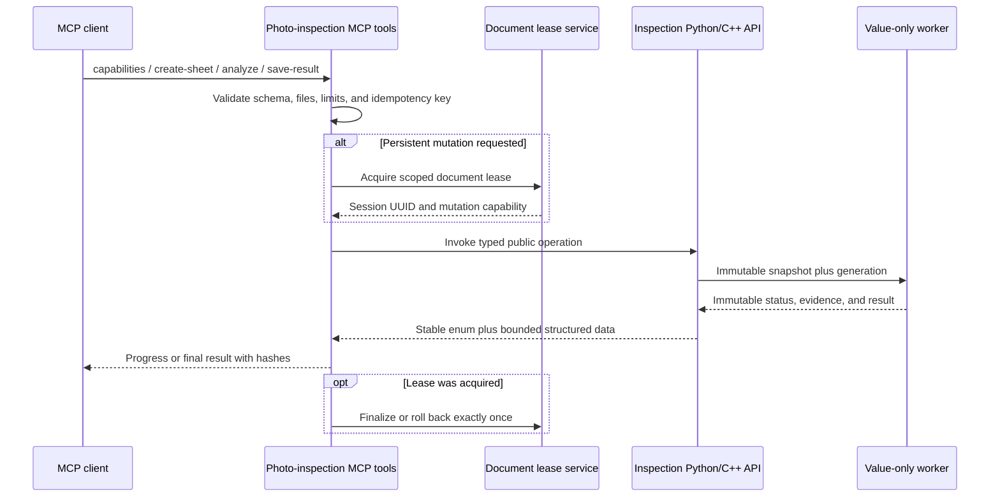

# Photo-Based Planar Print Inspection — Implementation Plan

Status: implementation-ready full-program architecture and executable test plan; this document defines implementation and verification work but is not itself product code.

Reviewed repository commit: `21b81b8bb1f3e8454260aa8dc45375c9f55c2be3`

Review date: 2026-07-29

Target module: Inspection

## Evidence notation

Every material conclusion is tagged so that verified facts are not confused with recommendations:

- `[RF-nn]` — verified repository fact at the reviewed commit.
- `[EF-nn]` — verified external fact; source and access date are in the evidence ledger.
- `[DD-nn]` — design decision. The complete record is in section 33.
- `[AV-nn]` — assumption that must be validated by a build, synthetic experiment, or physical experiment.
- `[BQ-nn]` — genuine blocker to claiming or shipping the stated capability.

Line references are inclusive and refer to the reviewed commit. “v1” means the first releasable product defined by this plan, not the first development phase.

## 1. Executive summary

The recommended architecture is an optional photo-inspection subsystem owned by `Inspection`: a GUI-thread snapshotter creates immutable, GUI-free domain inputs; a C++ worker using Part/OCCT and optional OpenCV produces an immutable result; Inspection GUI renders a deterministic 1:1 vector sheet and a dedicated layered 2D review; document mutation occurs only after a generation guard on the GUI thread. Inspection must not depend on Measure, TechDraw, or Assembly, and existing Inspection remains buildable when OpenCV is absent. `[DD-01] [DD-02] [DD-04] [DD-16] [DD-19] [DD-20]`

The first release milestone accepts exactly one selected planar face whose in-plane outer wire and holes fit a single A4 or A3 page at physical 1:1 scale. It generates a frozen, revisioned PDF/SVG inspection sheet, accepts a calibrated single photograph (plus an optional independently rectified empty-sheet photograph), measures the outer contour and supported in-plane circular through-features, and reports sheet-coordinate or rigid `SE(2)` best-fit deviations with explicit uncertainty and `Pass`, `Fail`, or `Inconclusive`. Later gated milestones extend this to Phase 7 whole-body/Part/assembly/tiling work and Phase 8 advanced 3D research without weakening the first milestone's planar guarantees. `[DD-07] [DD-21] [DD-25] [DD-26]`

The most important correction is that detecting the printed marker board does **not** make the nominal CAD scale physically correct. Printing applies a device-dependent transform:

```text
SheetPhysical = PrinterTransform(PrintCommand)
```

If ideal marker coordinates are used after the printer has stretched or sheared the page, the camera homography normalizes the printer error into the part measurement and can conceal real dimensional error. The sheet must therefore use a verified printer profile to pre-compensate vector output and freeze its transform, covariance, and residual field into the revision; alternatively, same-sheet physical reference measurements can verify but not silently “correct” an unprofiled print. QR is identity only and never a scale reference. `[DD-14] [EF-09]`

The provisional operating target is `±0.3 mm` to `±0.5 mm` expanded uncertainty for well-controlled A4/A3 setups at 15–25 rectified pixels/mm, with a hard minimum of 10 px/mm and at least 80 source-image pixels per accepted marker side. This is a target for Phase 0/6 validation, not a present accuracy claim; no sub-0.1 mm claim is credible for the proposed consumer-camera workflow. `[AV-01] [DD-23] [BQ-03]`

The requested full program contains nine implementation phases, numbered 0–8, and this plan commits work and tests for every phase. Every phase has a hard exit gate: Milestone 1 ends at Phase 6, Milestone 2 implements Phase 7, and Milestone 3 executes Phase 8A research and implements Phase 8B only when the independent feasibility gate permits a defensible 3D product. A failed physical or safety gate produces a documented no-go or narrowed capability, never a false implementation claim. The primary blockers are physical printer/camera repeatability data, cross-platform availability and deployability of the required OpenCV components, empirically chosen image-quality thresholds, and proof that the deterministic PDF/SVG route preserves geometry and physical units on supported viewers/printers. `[BQ-01] [BQ-02] [BQ-03] [BQ-04]`

## 2. User problem and intended workflow

The user needs a low-cost, auditable way to compare a physically printed or manufactured flat profile against a planar CAD face without a CMM. The result must expose limitations and uncertainty rather than convert a visually plausible overlay into a pass. `[DD-22]`

The intended workflow is:

1. In Inspection, select one planar face and choose **Create Photo Inspection Sheet**.
2. Choose A4/A3 and orientation, a verified printer profile, tolerances, supported features, and optional datum strategy.
3. Preflight rejects unsupported geometry and oversize content. Successful creation adds an immutable `PhotoInspectionSheet` revision and exports vector PDF/SVG from the same canonical scene. No “fit to page” operation exists.
4. Print at 100% with the frozen device/driver/media/settings. Measure the horizontal and vertical reference bars and enter the observations, or run the printer-profile verification workflow.
5. Place the part flat and in contact with the sheet. Photograph the complete board with the exact calibrated camera/lens/zoom/image-size configuration. An empty-sheet photo may also be captured.
6. Choose **Analyze Photo**. QR identifies the candidate sheet; source hashes, profiles, physical references, camera identity, markers, and image quality are independently validated.
7. Review a layered 2D result: original/rectified image, nominal geometry, detected geometry, accepted/rejected markers, signed-deviation heat map, dimensions, uncertainty, warnings, and the decision.
8. Keep the review transient by default. Explicitly choose **Save Inspection Result** to create an immutable persistent report object and write bounded JSON/CSV/SVG/PDF outputs. `[DD-05] [DD-06] [DD-24]`



The implementation loop is equally gated: each requirement, decision, risk, and phase exit criterion maps to stable test IDs in section 28; CI and physical validation produce evidence; failures return to implementation without waiving or rewriting the original oracle.



The same workflow is exposed to automation and MCP without making Inspection depend on MCP. Inspection provides stable capability, sheet, calibration, analysis, status, cancellation, and report operations through its headless C++/Python boundary. A thin adapter in `tools/mcp/freecad-mcp` validates typed requests, obtains a document lease only for explicit persistent mutations, calls those public operations, and returns bounded structured results. Pure analysis remains read-only, and arbitrary `execute_code` is not the supported photo-inspection interface. `[RF-27] [DD-18] [DD-34]`



A failed precondition never becomes an empty or passing result. Unsupported geometry, source/profile/sheet mismatch, low image quality, incomplete board coverage, stale source, cancellation, and numerical failure have explicit non-pass statuses. `[DD-22]`

## 3. Repository baseline and evidence ledger

### 3.1 Exact baseline

| Item | Verified value |
|---|---|
| Repository | `https://github.com/Rchiemstra/FreeCAD.git` |
| Worktree | `D:\code\free-cad-1` |
| Current/reference branch | `feature/assembly-interference-detection` tracking `origin/feature/assembly-interference-detection` |
| Reviewed HEAD | `21b81b8bb1f3e8454260aa8dc45375c9f55c2be3` |
| HEAD date/subject | `2026-07-29T14:28:41+02:00`, “Add spreadsheet clearance reports” |
| Local and origin `main` | `c010820cc3bbeb6604ff33f8b406d43deb9f0889` |
| Merge base with `main` | `c010820cc3bbeb6604ff33f8b406d43deb9f0889` |
| Relative count | branch is 378 commits ahead and 0 behind `main` |
| Initial worktree | clean; destination plan did not exist |
| Product version | `26.3.0dev`, from `version.json` and top-level CMake parsing |
| Repository instructions | no `AGENTS.md` found |

`[RF-01]` The reference branch is a broad integration branch, not a focused photo-inspection prototype. Only directly relevant modules, public contracts, tests, and validation patterns are used as evidence; unrelated changes are not treated as architecture precedent.

### 3.2 Repository evidence ledger

| ID | Verified repository fact and exact evidence | Planning consequence |
|---|---|---|
| RF-02 | `src/Mod/Inspection/App/InspectionFeature.h:61-168` abstracts current nominal/actual Mesh, Points, and Part geometry; `:243-275` defines `Inspection::Feature` with linked inputs and `Distances`. | Existing point-to-geometry inspection is retained; photo data needs separate domain types. |
| RF-03 | `src/Mod/Inspection/App/InspectionFeature.cpp:777-851` executes from linked document objects; `:851-990` launches `QtConcurrent` during `execute()` and writes document output. | Do not extend this execution/thread contract for photo analysis. |
| RF-04 | `src/Mod/Inspection/App/CMakeLists.txt:3-8` links FreeCADApp, Mesh, Points, Part; GUI CMake `:3-6` links Inspection and FreeCADGui. | Part is an acceptable App dependency; GUI-only Qt rendering stays in InspectionGui. |
| RF-05 | `src/Mod/Inspection/Gui/VisualInspection.cpp:102-132,233-303` enumerates document objects, uses `Gui::Command` to create/recompute a persistent feature, and changes input visibility. | It is a command/UI pattern, not a transient photo-review architecture. |
| RF-06 | `src/Mod/Inspection/Gui/ViewProviderInspection.h:54-118` is a Coin 3D view provider with a colour bar; `Workbench.cpp:41-59` registers the current menu and has toolbars commented. | Keep it intact; add explicit commands and a dedicated 2D view. |
| RF-07 | `src/Mod/Measure/App/MeasureBase.h:49-90` and `.cpp:42-79,168-188` provide persistent measurement, unit-formatting and generated Python-wrapper patterns; `AppMeasure.cpp:62-103` registers the Python module/types; `MassPropertiesObject.h:32-42` is a saved result pattern. | Reuse units/result/binding concepts through Base/App APIs, not a module dependency. |
| RF-08 | `src/Mod/Measure/Gui/TaskMeasure.h:51-122`, `TaskMassProperties.h:44-83`, and `ViewProviderMeasureBase.h:81-157` are TaskDialog/save-result/3D annotation patterns tied to GUI and document objects. | Useful UX precedent only; worker results remain GUI/document-free. |
| RF-09 | There is no Image workbench module. `src/App/ImagePlane.h:34-50` defines `Image::ImagePlane` with included-file and physical size properties. `src/Gui/ViewProviderImagePlane.cpp:199-339` loads raster/SVG, reads dots-per-metre and manages a textured plane/size. `src/Gui/TaskView/TaskImage.cpp:58-118,153-249,256-400` previews/restores interactive placement, width/height/aspect and scale changes. | Core ImagePlane can inspire import/display/restore semantics but its user-mutable scale is not a calibrated metric and it provides no EXIF camera matching, homography, QR, or measurement pipeline. |
| RF-10 | `src/Mod/TechDraw/Gui/PagePrinter.cpp:72-131,182-262,298-432` derives page size/orientation and renders a GUI `QGraphicsScene` through QPdfWriter/printing/SVG while restoring modified state. `AppTechDrawGuiPy.cpp:127-242` requires GUI view providers. | TechDraw is not a headless authoritative export service. |
| RF-11 | `src/Mod/TechDraw/App/DrawView.cpp:77-102,193-213,483-506` supports automatic/custom scale and auto-scaling; `DrawViewPart.h:187-207` exposes projection-coordinate patterns. | Existing page views can rescale; v1 must own an exact-unit scene and preflight. |
| RF-12 | `src/Mod/Part/App/Geometry.cpp:5014-5044` implements planar-surface checks/conversion. `FeatureProjectOnSurface.cpp:360-416` demonstrates outer/inner-wire and ShapeAnalysis/ShapeFix handling. `src/Mod/TechDraw/App/DrawViewPart.cpp:31,309-381,528-680` uses threaded OCCT HLR plus edge cleanup/splitting for whole-shape views. | Direct planar face-wire extraction is viable and simpler for v1; HLR exists but belongs to later whole-body scope with materially different cleanup/lifecycle. |
| RF-13 | `src/Mod/Assembly/App/InterferenceScan.h:55-70,237-275,423-445` has immutable-ish scan inputs, explicit completion/cancellation, options, and caller-thread snapshots. | Reuse the value-snapshot and explicit-status contracts, not Assembly traversal. |
| RF-14 | `InterferenceScanSession.h:14-65` and `.cpp:9-50` implement generation, cancellation, busy, and stale state. `TaskInterferenceCheck.cpp:2673-2725` checks generation before UI mutation. | Photo analysis needs the same session principle with stricter no-mutation-before-guard rules. |
| RF-15 | `TaskInterferenceCheck.cpp:2042-2139,2273-2288,2290-2650` watches document/object lifecycle, snapshots on the caller thread, launches a value-only worker, and reports generation-tagged progress. `:1725-1799,3027-3076` owns/discards transient preview. `src/Mod/Assembly/Gui/Commands.cpp:410-493`, `Resources/Assembly.qrc:28`, and the App/Gui CMake files register the command, icon, scan/session and task. | Adopt lifecycle, command/resource/build registration, queued progress, and disposable preview contracts; do not adopt Assembly traversal. |
| RF-16 | `tests/src/Mod/Assembly/Gui/TaskInterferenceCheck.cpp`, including test `bThenALateFinishDoesNotMutateNewerUiState` at line 334, exercises late results, document close/delete, mutation, attach/detach, exceptions, cancel, and preview cleanup. | Equivalent photo lifecycle tests are mandatory. |
| RF-17 | `scripts/ci/interference-validate.sh:1-75,104-191` uses fresh Docker, `--network none`, read-only source, unique volumes, provenance, App/offscreen tests, and mandatory Xvfb/xcb GUI tests. | Build a separate isolated photo validator from this pattern. |
| RF-18 | `cMake/FreeCAD_Helpers/CheckInterModuleDependencies.cmake:25,31,41` says Inspection requires Mesh/Points/Part, Measure requires Part, and TechDraw requires Part/PartDesign/Spreadsheet/Measure/Import. `src/Mod/CMakeLists.txt:33-35,113-119` orders Inspection before Measure and TechDraw. | `Inspection -> TechDraw` would introduce the wrong dependency direction and an indirect Measure dependency. |
| RF-19 | `cMake/FreeCAD_Helpers/InitializeFreeCADBuildOptions.cmake:154` defines `BUILD_INSPECTION` default ON. No OpenCV discovery appears in repository CMake, Inspection, packaging scripts, or `pixi.toml`. Ubuntu install scripts do not install OpenCV. | OpenCV must be optional and explicitly discovered, linked, deployed, and tested. |
| RF-20 | Windows obtains LibPack 3.5.3 in `.github/workflows/actions/windows/getLibpack/action.yml:44-48`. `package/rattler-build/linux/create_bundle.sh:10,55` and `osx/create_bundle.sh:10,77` copy/list the Pixi environment into AppImage/macOS bundles; neither root/Pixi/rattler manifests nor lock declare OpenCV. | Actual LibPack component content is unverified and Pixi-derived bundles do not intentionally contain OpenCV; all release platforms need a probe/deployment gate. |
| RF-21 | `src/App/Document.h:176` and `Document.cpp:999-1002` provide a persistent document UUID. `Document.cpp:1344-1352,1792-1807` shows hidden object UUID/source UUID conventions for export/import. `src/App/PropertyStandard.h:819-845` provides `PropertyUUID`. | Sheet identity can use its own persistent UUID plus document UUID and source tokens; existing hidden export UUIDs are not assumed universal. |
| RF-22 | `src/App/Application.cpp:1432-1434` exposes the per-user application data directory. `tests/src/App/PropertyFile.cpp:61-118` verifies traversal/absolute-path rejection for included-file restore. | Profiles belong in a versioned user-data directory; embedded files and report references require strict path handling. |
| RF-23 | Existing App hashing uses SHA-1 (`src/App/StringHasher.cpp:254-272`), which is an internal string-compaction mechanism rather than a provenance hash. Qt provides `QCryptographicHash`. | Define explicit SHA-256 canonical hashes for sheet/profiles/assets; do not reuse StringHasher semantics. |
| RF-24 | No Inspection-specific test directory or OpenCV/ArUco/ChArUco/QR implementation was found. | New tests and compatibility code are additions, not extensions of a hidden existing facility. |
| RF-25 | `src/Mod/Part/App/InterferenceDetection.h:17-63` defines explicit kind/options/result values and cooperative cancellation; `.cpp:180-296` validates finite/nonnegative input, checks cancellation around OCCT work, and converts kernel failures to `InvalidInput`/`Inconclusive`/`Cancelled`. | Reuse the fail-closed Part-service contract for projection/OCCT failures; do not reuse its 3D interference algorithm. |
| RF-26 | `doc/interference_detection_plan.md:22-44,228-297` is a historical implementation/audit record with explicit snapshot caveats and Docker provenance, while current source/tests contain the corrected contracts. | Treat the plan as scope/history evidence and current code/tests as behavioral authority; do not copy historical defects or Assembly traversal. |
| RF-27 | `tools/mcp/freecad-mcp/README.md:88-177,353-392` documents per-document leases, isolated authenticated instances, request status/cancellation, structured results, and Docker-only sign-off. `src/freecad_mcp/freecad_client.py:1065,1171-1231,1712,1773-2031` separates document, execution, cancellation, and lease/finalization operations. | Add narrow typed photo-inspection tools over the stable Inspection API; require leases only for mutations, structured fail-closed results, cooperative cancellation, and isolated Docker contract/e2e tests. Inspection must not depend on the MCP submodule. |
| RF-28 | `.gitmodules:1-18` contains six recursive submodules for FreeCAD-owned/forked code, header/library source, AddonManager, MCP, Coin and Pivy. OpenCV is not one of them, and repository package/LibPack/Pixi routes already need separate dependency deployment `[RF-19] [RF-20]`. | A source submodule would not solve OpenCV DLL/dylib/codec deployment and would increase every recursive checkout. Keep OpenCV package-supplied; allow an isolated pinned source-build lane without changing the product submodule graph. |

### 3.3 External evidence ledger

All external sources were accessed 2026-07-29. External algorithms are conceptual/linked-library dependencies only; no third-party source is to be copied into FreeCAD.

| ID | External fact and source | Use in this plan |
|---|---|---|
| EF-01 | OpenCV 4.6 documents ChArUco as more accurate than ArUco for calibration, with partial-visibility benefits and legacy APIs (`CharucoBoard::create`, `detectMarkers`, `interpolateCornersCharuco`): [OpenCV 4.6 ChArUco tutorial](https://docs.opencv.org/4.6.0/df/d4a/tutorial_charuco_detection.html). | ChArUco for camera calibration; ArUco board for the inspection sheet. |
| EF-02 | The ArUco API moved from contrib into core objdetect and changed construction/detection APIs in 4.7: [OpenCV issue 23176](https://github.com/opencv/opencv/issues/23176). | A narrow `<4.7`/`>=4.7` compatibility facade is mandatory. |
| EF-03 | Even-row ChArUco layouts changed convention around OpenCV 4.6/4.7 and newer versions expose `setLegacyPattern`: [OpenCV issue 23873](https://github.com/opencv/opencv/issues/23873), [current `CharucoBoard` API](https://docs.opencv.org/4.x/d0/d3c/classcv_1_1aruco_1_1CharucoBoard.html). | Profiles freeze board convention and generator version; golden cross-version tests are mandatory. |
| EF-04 | OpenCV 4.6 source exposes `QRCodeEncoder` and `QRCodeDetector` in objdetect: [4.6 objdetect header](https://github.com/opencv/opencv/blob/4.6.0/modules/objdetect/include/opencv2/objdetect.hpp). | No additional QR library is needed if runtime capabilities pass. |
| EF-05 | Ubuntu 24.04 Noble supplies OpenCV 4.6 development packages and component packages including calib3d, contrib, imgcodecs, imgproc, and objdetect: [Ubuntu package](https://packages.ubuntu.com/noble/libopencv-dev). | OpenCV 4.6 is the minimum compatibility floor and Linux CI lane. |
| EF-06 | OpenCV 4.13.0 is the latest stable 4.x release at review time: [OpenCV releases](https://github.com/opencv/opencv/releases). | Use 4.13 as the second compatibility lane; support policy is `>=4.6,<5`. |
| EF-07 | OpenCV 4.5+ is Apache-2.0: [OpenCV license](https://opencv.org/license/). | Dynamic/static packaging remains subject to FreeCAD dependency/legal review; no copied code. |
| EF-08 | ChArUco/homography documentation notes distortion sensitivity when calibration is absent; `calibrateCameraExtended`, homography, and undistortion expose needed primitives: [OpenCV calib3d](https://docs.opencv.org/4.13.0/d9/d0c/group__calib3d.html). | Require a matching camera profile for decisions; uncalibrated analysis is preview-only. |
| EF-09 | Paper dimensions vary with humidity; RISE describes hygroexpansion as dimensional change from ambient humidity: [RISE hygroexpansion](https://www.ri.se/en/packaging/pulp-and-paper/service/hygroexpansion-of-paper-and-paperboard). Printing heat/moisture can also affect dimensions: [Journal of Textile Engineering study](https://www.jstage.jst.go.jp/article/tse/33/3/33_21/_article/-char/en). | Printer/media/environment residuals belong in uncertainty and same-sheet verification. |
| EF-10 | JCGM 100 defines combined/expanded uncertainty, and JCGM 106 applies uncertainty to conformity assessment: [JCGM 100](https://www.bipm.org/en/doi/10.59161/jcgm100-2008e), [JCGM 106](https://www.bipm.org/en/doi/10.59161/jcgm106-2012). | Use a documented uncertainty budget and guard-banded three-state decision. |
| EF-11 | ILAC G8 discusses decision rules and guard bands in statements of conformity: [ILAC G8:09/2019 notice](https://ilac.org/latest_ilac_news/revised-ilac-g8-published/). | Default rule is symmetric guard band, not “inside nominal tolerance means pass.” |
| EF-12 | NIST identifies repeatability, reproducibility, bias, resolution, stability, and linearity as measurement-process characterization concerns: [NIST gauge studies](https://www.itl.nist.gov/div898/handbook/mpc/section4/mpc46.htm). | Physical validation separates systematic and repeatability effects. |
| EF-13 | TechDraw headless PDF/SVG export remains an open FreeCAD issue: [FreeCAD #5710](https://github.com/FreeCAD/FreeCAD/issues/5710). A separate report describes bitmap “Print All” output on supported desktop platforms: [FreeCAD #18235](https://github.com/FreeCAD/FreeCAD/issues/18235). | Do not make TechDraw GUI scene rendering the sole deterministic 1:1 route. |
| EF-14 | Homography-based planar measurement uncertainty depends on image localization and homography estimation: [A plane measuring device](https://doi.org/10.1016/S0262-8856(98)00183-8). | Propagate corner/homography/localization uncertainty; a global RMS alone is insufficient. |
| EF-15 | The original ArUco work describes robust fiducial dictionaries and camera pose from square markers: [Garrido-Jurado et al.](https://doi.org/10.1016/j.patcog.2014.01.005). | Use a predefined, frozen dictionary/ID layout and reject foreign IDs. |
| EF-16 | OpenCV 4.13 source exposes `ArucoDetector`, `generateImageMarker`, and `CharucoDetector`, and explicitly documents the post-4.6 pattern incompatibility: [ArucoDetector header](https://github.com/opencv/opencv/blob/4.13.0/modules/objdetect/include/opencv2/objdetect/aruco_detector.hpp), [CharucoDetector header](https://github.com/opencv/opencv/blob/4.13.0/modules/objdetect/include/opencv2/objdetect/charuco_detector.hpp). | Confirms the newer facade lane independently of a newest-only tutorial. |
| EF-17 | OpenCV imgproc provides contour hierarchy, morphology, robust distance types and distance-transform primitives: [OpenCV 4.13 imgproc header](https://github.com/opencv/opencv/blob/4.13.0/modules/imgproc/include/opencv2/imgproc.hpp). | Reuse linked-library primitives for candidate extraction/indexing; analytic OCCT nearest-curve refinement and uncertainty remain original FreeCAD work. |
| EF-18 | AprilTag is BSD-2-Clause and ZXing-C++ is Apache-2.0: [AprilTag license](https://github.com/AprilRobotics/apriltag/blob/master/LICENSE.md), [ZXing-C++ license](https://github.com/zxing-cpp/zxing-cpp/blob/master/LICENSE). | They are permissively licensed conceptual/provider alternatives, but add dependencies and are not selected or copied because approved OpenCV already covers v1 markers/QR. |
| EF-19 | QPDF’s current source is Apache-2.0 while MuPDF’s current source is AGPL-3.0: [QPDF license](https://github.com/qpdf/qpdf/blob/main/LICENSE.txt), [MuPDF COPYING](https://github.com/ArtifexSoftware/mupdf/blob/master/COPYING). | A pinned QPDF-style tool may be an optional CI parser; do not bundle/link an AGPL PDF implementation into this feature without separate legal/product approval. |

External-code classification: OpenCV is the selected optional linked component; QPDF is a possible test-only executable; AprilTag/ZXing are unselected fallback concepts/providers; MuPDF’s copyleft terms make it unsuitable as an unreviewed bundled/runtime shortcut. The projection/frame/canonical scene, profile schemas, printer correction, contour-to-CAD refinement, uncertainty integration, FreeCAD objects, GUI/session and reports are original implementation work. No external implementation source or marker dictionary tables are copied. `[EF-07] [EF-18] [EF-19]`

### 3.4 Assumptions and blockers ledger

| ID | Item | Closure evidence |
|---|---|---|
| AV-01 | A controlled phone/camera setup can achieve expanded uncertainty of 0.3–0.5 mm over A4/A3. | Phase 0 and Phase 6 physical data across devices, page positions, operators, and environments. |
| AV-02 | Direct planar wire extraction can canonicalize all declared v1 edge types reproducibly across supported OCCT versions. | Cross-platform golden projection corpus. |
| AV-03 | The chosen marker size/layout remains detectable with useful spatial coverage under expected obliquity and occlusion. | Synthetic sweeps followed by physical ROC data. |
| AV-04 | A deterministic QPainter PDF plus controlled SVG emitter preserves vector primitives and exact media units across supported Qt versions. | Parser-level and physical ruler tests, not visual inspection. |
| BQ-01 | OpenCV component/deployment availability on Windows LibPack and Pixi-derived macOS/AppImage is unknown. | Packaging probe and installed-artifact smoke test on every release platform. |
| BQ-02 | Image-quality, marker residual, and segmentation thresholds lack empirical data. | Frozen validation corpus and preregistered threshold-selection procedure. |
| BQ-03 | The accuracy target is not yet demonstrated physically. | Physical validation acceptance in section 29. |
| BQ-04 | PDF/SVG viewer and print-driver transformations may violate exact scale even when export is correct. | Supported print-path matrix and same-sheet physical verification workflow. |

## 4. Scope and non-goals

### 4.1 v1 scope

`[DD-07]` v1 supports one user-selected `Part::TopoShape` face that is planar within a fixed, hashed planarity tolerance; its in-plane outer wire and holes are extracted directly. Supported comparison geometry is the exterior contour plus reliably classified in-plane circular through-holes/features. Line, circular arc, elliptical arc, and bounded B-spline edges may contribute to the outer/inner contour; a “supported measurement feature” is narrower and initially limited to circles whose full boundary belongs to the selected planar face and passes topology/fit checks.

`[DD-25]` The complete board, measurement region, reference bars, QR, labels, and quiet zones must fit one A4 or A3 page in portrait or landscape at 1:1 physical scale after printer pre-compensation. Oversize is rejected with required size, available size, margin cause, and suggestions (larger supported paper, rotate, or select a smaller face). Scaling and tiling are not offered in v1.

### 4.2 explicit non-goals

- Curved selected surfaces, Z/height measurement, elevated chamfers/fillets/walls, silhouettes of a whole body, hidden-line removal, arbitrary `Part`/assembly projection, or deciding whether an elevated edge coincides with the sheet plane.
- Assemblies or occurrence traversal, linked-document transforms, tiled sheets, multi-page registration, stereo, photogrammetry, structured light, multi-view reconstruction, or ML/cloud inference.
- Automatic CAD modification, process-control feedback, legal-metrology claims, or sub-0.1 mm claims.
- A generic TechDraw page, a generic ImagePlane replacement, or a rewrite of current point-to-geometry Inspection.
- Arbitrary datum fitting with scale, shear, affine, or projective freedom. `[DD-21]`

`[DD-26]` Assembly occurrences are Phase 7. The later adapter must live on the Assembly side and pass an already resolved immutable occurrence snapshot through a public Inspection API; Inspection never imports Assembly types.

## 5. Existing Inspection capabilities

Current Inspection owns comparison of linked actual geometry against one or more nominal geometries and visualizes scalar distances through a 3D view provider. It already depends on Part, Mesh, and Points and therefore is the semantically and structurally correct owner for “compare physical observation against nominal geometry.” `[RF-02] [RF-04] [DD-01]`

The existing `Inspection::Feature::execute()` contract is not safe to reuse for photo analysis because it resolves mutable document links and runs concurrent work as part of recompute, while the required workflow has file decoding, cancellation, progress, stale source/profile handling, and optional persistence. Photo analysis gets separate value-domain types and an explicit GUI-owned session. The existing class and behavior remain unchanged. `[RF-03] [DD-19]`

Current command, task, and view-provider code provides menu registration, transaction, unit/colour, and 3D overlay precedents. It does not provide a layered image review, immutable sheet revision, or non-dirty transient result, so those are new InspectionGui facilities. `[RF-05] [RF-06]`

## 6. Existing Measure capabilities

Measure supplies strong patterns for quantity formatting, saved result objects, TaskDialog workflows, explicit “save result,” and persistent 3D annotations. Those ideas should be reused through stable Base unit/quantity and App property APIs. `[RF-07] [RF-08]`

Inspection must not link to Measure. Measure already depends on Part and TechDraw already depends on Measure; making photo Inspection depend on either would enlarge the dependency graph, risk a cycle/order violation, and couple the CV engine to UI-oriented measurement objects. If a shared low-level quantity-formatting helper is missing, extract it downward to Base/App in a separate reviewed change rather than introduce `Inspection -> Measure`. `[RF-18] [DD-02]`

## 7. Existing image-plane capabilities

FreeCAD has a core `Image::ImagePlane` App object and GUI view provider, not an Image workbench. It embeds or references a raster/SVG, derives physical dimensions, and displays a textured 3D plane. It does not parse camera identity/EXIF, calibrate optics, detect markers/QR, rectify a plane, segment a part, or compare geometry. `[RF-09]`

`[DD-20]` The primary result view is therefore a dedicated InspectionGui 2D layered widget. ImagePlane may later be an opt-in export/import aid for placing a rectified raster in the 3D view, but it is not authoritative, not created by default, and never participates in decisions.

## 8. Existing TechDraw and print/export capabilities

TechDraw knows page/template sizes and can render its GUI scene to printer, PDF, and SVG. It also has custom/automatic scale behavior and export paths coupled to GUI view providers/scenes. This is valuable reference code but not a deterministic headless exact-scale service. `[RF-10] [RF-11] [EF-13]`

`[DD-04]` Select a hybrid-independent route: Inspection App owns a unit-bearing canonical vector scene; InspectionGui uses a small Inspection-owned renderer to emit direct SVG primitives and vector PDF through QPdfWriter/QPainter from that same scene. TechDraw is neither required nor called. Reusing limited page-layout concepts is allowed; importing/copying TechDraw implementation is not. Phase 2 parser tests must prove media boxes, path coordinates, line widths, QR/ArUco cells, and absence of rasterized CAD layers. `[AV-04]`

## 9. Reference interference architecture and reusable contracts

The reference interference implementation proves four contracts worth reusing:

1. Resolve mutable documents, linked objects, placements, and shapes on the caller/GUI thread, then pass value snapshots to the worker.
2. Give every run a monotonically increasing generation and cancellation token; progress and results carry the generation.
3. Watch all source lifecycle events and mark the session stale/cancel when relevant input changes or closes.
4. Own preview state separately and make discard/replace idempotent. `[RF-13] [RF-14] [RF-15]`

The lower Part classifier also demonstrates typed fail-closed OCCT service results and cooperative cancellation boundaries. Photo projection adopts that error shape, not the classifier’s 3D Boolean/distance algorithm. `[RF-25]`

The photo implementation must improve one subtle point into a named invariant: **no document, widget, layer, diagnostics, progress-finalization, or busy-state mutation from a completion handler occurs until the handler proves its generation is current**. This covers the required ordering “run B finishes; then superseded run A returns late.” `[RF-16] [DD-19]`

The worker must not hold `App::DocumentObject*`, Gui objects, Coin nodes, widgets, selection objects, or mutable profile/document state. Shapes copied into immutable projection inputs are acceptable only after all resolution/placement is complete. Worker outputs contain owned values and bounded byte/raster buffers, not `cv::Mat` exposed across the public boundary. `[DD-18] [DD-19]`

## 10. Recommended module ownership and dependency graph

`[DD-01]` Inspection owns the product because the core responsibility is conformance comparison against nominal geometry, and Inspection already owns nominal/actual comparison. `[RF-02]` Measure remains independent, TechDraw remains independent, Part is the geometry provider, and optional Assembly integration points inward from AssemblyGui at a later phase. `[DD-02]`

```text
                         later, optional (Phase 7)
     Assembly App/Gui ------------------------------+
          | resolves occurrence                    |
          v                                        v
FreeCADApp <---- Part <---- Inspection App <---- InspectionGui ----> FreeCADGui/Qt
    ^                         |   |
    |                         |   +---- optional OpenCV >=4.6,<5
    |                         |
    +---- Measure App/Gui     +---- Base units, JSON, UUID, SHA-256
    ^
    +---- TechDraw App/Gui  (no dependency from Inspection)

Core ImagePlane <---- optional user-directed display/export adapter only
```

Allowed direct production dependencies:

| Owner | Allowed | Forbidden |
|---|---|---|
| Inspection App | FreeCADApp, Base, Part/OCCT, QtCore where already supported, optional OpenCV core/imgproc/imgcodecs/calib3d/objdetect and 4.6 contrib aruco | FreeCADGui, InspectionGui, Measure, TechDraw, Assembly, Coin, widgets |
| InspectionGui | Inspection, FreeCADGui, QtGui/Widgets/Svg/PrintSupport | Worker-domain ownership, direct document access from worker |
| Future Assembly adapter | Assembly/AssemblyGui plus public Inspection input API | Inspection importing Assembly headers/types |
| Tests/validator | Parser/test-only tools inside isolated CI image | Runtime dependence on external PDF viewers or network |

`[DD-16]` OpenCV is compiled C++ behind `FREECAD_USE_OPENCV_PHOTO_INSPECTION` (exact CMake spelling to follow project convention). The existing Inspection library and commands continue to build when it is false. `[RF-19]`

## 11. First-release product definition

### 11.1 Input contract

`[DD-07]` A sheet-creation input is valid only when all of the following are true:

- One and only one resolvable face is selected from a saved or unsaved local document with a valid document UUID.
- The resolved world/occurrence shape is a non-null `TopoDS_Face`; its geometric surface is planar within the hashed v1 tolerance.
- The face contains one unambiguous outer wire and zero or more valid inner wires; all edges can be represented by the canonical v1 primitives and form closed, non-self-intersecting cycles after projection.
- Every requested dimensional feature passes an explicit classifier. A circular measurement requires a complete circle, a stable centre/radius, and topology consistent with a hole in the selected planar material region.
- The canonical layout, eight markers and quiet zones, QR, reference geometry, labels, margins, and compensation bounds fit the chosen single page at 1:1.
- A supported printer mode is selected: verified reusable profile with inverse compensation, or explicit as-printed characterization. `[DD-14]`

An analysis input additionally requires a decodable bounded image, matching sheet identity/hash, matching calibrated camera profile, matching or newly characterized print transform, complete-enough distributed marker observations, and quality metrics within calibrated operating bounds. An uncalibrated image may enter **Preview only** but cannot create a conformance decision or persistent “complete” result. `[DD-15] [DD-22]`

### 11.2 Output contract

Successful sheet creation produces:

- an immutable document `PhotoInspectionSheet` revision containing identity, a frozen source snapshot and hashes, layout/renderer schema, marker/QR layout, printer-mode snapshot, tolerances, and canonical vector scene;
- deterministic SVG and PDF exports generated from that exact scene;
- a renderer-independent ideal ink mask recipe/hash for segmentation tests and later analysis;
- printable horizontal, vertical, and opposing diagonal verification references distributed around the measurement area. `[DD-03] [DD-04] [DD-05]`

Analysis produces an immutable value result with an operation status and a separate conformance decision. Operation status is one of:

```text
Complete | Incomplete | Cancelled | InvalidInput | ProfileMismatch |
SheetMismatch | StaleSource | LowImageQuality | Inconclusive |
UnsupportedGeometry | NumericalFailure | ResourceLimit
```

`Complete` means the declared pipeline completed, not that the part passed. The decision is `Pass`, `Fail`, or `Inconclusive`; every non-`Complete` operation status has decision `Inconclusive`. No boolean “success” is exposed in App or Python APIs. `[DD-22]`

The result contains identity/generation, provenance versions, accepted and rejected marker observations, image/profile/reference checks, transforms and covariance/residual summaries, nominal/measured contours, supported feature dimensions, alignment details, signed deviations, uncertainty components, decision rule inputs, warnings/diagnostics, and bounded preview layers. It contains no document/GUI pointers or public mutable OpenCV objects. `[DD-18] [DD-19]`

### 11.3 Product invariants

1. A printed revision never tracks live CAD.
2. Nothing silently scales a page, image, contour, or alignment.
3. QR identifies; only calibrated physical geometry establishes scale.
4. Homography maps the sheet plane only.
5. A worker cannot read or mutate FreeCAD/GUI state.
6. A stale/foreign/malformed/low-quality input cannot pass.
7. Transient review does not dirty the document.
8. Persistent creation is explicit, transactional, immutable, and auditable.
9. Reported precision never exceeds supported expanded uncertainty.
10. Existing Inspection works with and without OpenCV. `[DD-05] [DD-06] [DD-14] [DD-16] [DD-19] [DD-22]`

## 12. Measurement assumptions and coordinate systems

### 12.1 Physical assumptions

The part must contact the sheet in the measured region; the desired contour must lie in the sheet plane. The camera is a central-projection approximation described by the selected profile. The paper is flat, the whole marker board is visible, and lighting produces a segmentable material/paper boundary without specular saturation or heavy cast shadows. These are measured preconditions, not inferred guarantees. `[DD-07] [AV-01]`

If a physical edge is height `h` above the sheet and the camera is approximately `D` above the sheet, planar rectification leaves a first-order scale error of about `h/D`. At `h=10 mm`, `D=400 mm`, the error is about 2.5%, or 2.5 mm over 100 mm. Chamfer rims, upper wall silhouettes, and elevated features are therefore unsupported even when visually sharp. `[DD-07]`

### 12.2 Named coordinate systems

| Symbol/name | Unit | Definition and owner |
|---|---:|---|
| `CADWorld3D` (`C_W`) | mm | Resolved selected face after occurrence/placement snapshot, Inspection App. |
| `FaceCanonical2D` (`C_F`) | mm | Deterministic right-handed plane frame, Inspection App. |
| `PrintCommand2D` (`C_P`) | mm | Coordinates emitted to PDF/SVG before the physical printer, renderer scene. |
| `SheetPhysical2D` (`C_S`) | mm | Actual printed geometry on paper, calibrated physical measurement frame. |
| `CameraImageRaw` (`C_I`) | pixels | Decoder output after explicit EXIF orientation normalization. |
| `CameraUndistorted` (`C_U`) | pixels | Image coordinates after applying the exact camera profile/crop model. |
| `RectifiedRaster` (`C_R`) | pixels | Bounded raster with declared pixels/mm and origin in `C_S`. |
| `ResultAligned2D` (`C_A`) | mm | Optional measured geometry after rigid-only `SE(2)` alignment. |

### 12.3 Transform chain

```text
selected shape + occurrence placement
            |
            v  T_WF: canonical orthographic planar projection (no scale)
 CADWorld3D C_W ------------------------------> FaceCanonical2D C_F
                                                       |
                                                       v  L_FP: page translation + user rotation
                                              target SheetPhysical C_S
                                                       ^
                                                       |  F_printer: measured physical print transform
                                                       |
                                              PrintCommand2D C_P
                                                       ^
                                                       |  pre-compensation F_printer^-1

photo CameraImageRaw C_I --U_camera--> CameraUndistorted C_U
                                                |
                                                v  H_US from calibrated physical marker corners
                                       SheetPhysical2D C_S
                                                |
                                                v  scale/origin only
                                        RectifiedRaster C_R
                                                |
                                                v  optional R,t only (no scale/shear)
                                        ResultAligned2D C_A
```

`[DD-14]` Mapping conventions are explicit:

```text
p_S = F_printer(p_P)                 # commanded ink to actual sheet millimetres
p_P = inverse(F_printer)(p_target)   # profile-compensated generation
p_U = H_SU(p_S)                      # observed undistorted image position
p_S = H_US(p_U), H_US = inverse(H_SU)
p_R = s_rect * (p_S - roi_origin_S)  # rasterization only
p_A = R(theta) * p_S + t             # optional rigid comparison
```

Homogeneous 3×3 matrices use column vectors, millimetres, and last row `[0,0,1]` for printer affine transforms; homographies are normalized with `H(2,2)=1` when numerically safe. Matrix direction, coordinate origin, handedness, image y-direction, and covariance ordering are serialized. No API accepts an unlabeled generic “transform.” `[DD-14]`

## 13. Printer-calibration model

### 13.1 Transform convention and modes

`[DD-14]` `F_printer` maps **commanded vector coordinates to measured physical sheet coordinates**. It is a 2D affine matrix plus a bounded residual-field model and uncertainty:

```text
p_S = A_2x2 p_P + t + r(p_P)
```

Rotation/translation relative to the paper edge are stored for audit/layout bounds; scale, anisotropy, and shear affect dimensional correctness. `r` is not used as an unconstrained warp that could overfit sparse data. v1 stores sampled residual vectors and an interpolation policy only after physical validation; otherwise it stores a conservative position-dependent residual bound. `[AV-01]`

Two v1 modes are supported:

- **Verified reusable profile (preferred):** create and validate a device/driver/media/settings-specific profile, generate `p_P = F_printer^-1(p_target)`, and freeze the exact profile snapshot in the sheet. Analysis uses expected physical marker corners `F_printer(p_P)` and includes residual uncertainty.
- **As-printed one-use characterization:** emit uncompensated commands, require the user to measure a distributed set of horizontal, vertical, and opposing-diagonal references on that print, solve a sheet-specific affine metric, and use `F_print_run(commanded corner)` as the marker physical coordinates. It is frozen into the result, not silently promoted to a reusable profile. Pass is disabled until Phase 0 proves that the chosen manual reference procedure bounds shear/local distortion adequately. `[BQ-03]`

Merely choosing “100%” in a print dialog is neither mode. Same-sheet references are always checked; disagreement with the frozen profile beyond the validated threshold yields `ProfileMismatch`/`Inconclusive`, never an automatic rescale. `[BQ-04]`

Compensation is rejected rather than applied when the inverse is ill-conditioned, predicted ink leaves the printable/keep-out region, scale/shear exceeds the physically validated profile envelope, the residual bound or held-out verification fails, local deformation is not covered by the model, or device/driver/application/media/orientation/page-side/settings do not match. Residual non-affinity is not “corrected” by a high-order warp unless a later profile schema and physical validation support it. `[DD-14]`

### 13.2 Calibration target and verification

The printer-calibration command generates a full-page vector target with at least a 3×3 set of widely separated cross centres, long horizontal/vertical spans at multiple rows/columns, both diagonal directions, page/media/orientation labels, profile nonce, and machine-readable identity. The operator enters traceable measurements or imports a specifically selected local sidecar from a supported calibration instrument. The solver uses weighted robust least squares, reports rank/condition number, covariance, held-out residuals, and rejects inconsistent/non-finite observations. `[DD-15]`

Minimum reusable-profile evidence is nine spatially distributed 2D points or an overdetermined equivalent span network, at least two held-out verification spans, repeated prints (provisionally five) and reloading/reprinting after driver restart. Exact counts and thresholds become release constants only after Phase 0 repeatability data. `[AV-01] [BQ-02]`

Every inspection sheet prints:

- horizontal and vertical bars with independently addressable endpoints;
- both diagonal directions to reveal shear/sign;
- references near more than one page region to reveal local non-affinity;
- nominal labels and a warning to measure the **printed endpoints**, not paper edges;
- a settings token that must match the frozen profile/run.

The analysis dialog records measuring instrument resolution and observations. Any manual entry affects uncertainty and provenance.

### 13.3 Printer profile schema and storage

`[DD-15]` `printer-profile-v1.json` is strict UTF-8 JSON with:

```text
schema {name, major, minor}
uuid, createdUtc, modifiedUtc
device {make, model, serialOrUserToken}
driver {name, version, platform}
printPath {application, backend, colorMode, duplex, pageSide, scaling, borderless}
media {standard, widthMm, heightMm, orientation, feedEdge, stockToken}
settingsHash
commandToPhysicalAffine[9], inverseAffine[9]
parameterCovariance, residualSamples[], residualBoundMm
calibrationTarget {schema, hash, observations, instrumentResolutionMm}
verification {verifiedUtc, heldOutResiduals, repeats, environmentNotes, accepted}
opencvVersion, rendererVersion, canonicalSha256
```

Unknown minor fields are preserved; unknown major versions are rejected. Matrices must be finite, affine, well-conditioned, dimensionally plausible, and mutually inverse within a strict numeric tolerance. The canonical SHA-256 excludes the hash field itself and uses sorted-key, normalized JSON encoding defined by the schema. `[DD-09]`

The profile UI shows the full matrix and a non-authoritative decomposition into X/Y scale, rotation, shear/skew, translation and residual statistics, with the exact page-side/feed convention. The matrix—not unrelated displayed scalar fields—remains authoritative.

Profiles are user data under `App::Application::getUserAppDataDir()/Inspection/PhotoInspection/Profiles/Printer/v1/`, written atomically with restrictive normal-user permissions and never fetched from QR or the network. A sheet embeds the full immutable snapshot and its hash, so deletion/change of the user profile cannot change an old revision. `[RF-22] [DD-15]`

## 14. Camera-calibration model

`[DD-12]` Camera calibration uses a generated ChArUco board, not the inspection sheet. The profile freezes the exact board dimensions, dictionary, IDs, square/marker lengths, coordinate origin/axis, OpenCV generator version, and `legacyPattern` convention. An odd number of rows is preferred to avoid the known even-row convention trap, but the convention is still explicit. `[EF-01] [EF-03]`

The workflow:

1. Generate a vector ChArUco calibration board with a board-schema hash and physical reference bars.
2. Capture a guided set of diverse views spanning the image, tilt, distance, and orientation at the exact lens/zoom/focus/image-size/crop configuration.
3. Detect markers/corners through the compatibility facade, reject weak/duplicate frames, and run `calibrateCameraExtended`.
4. Display coverage, per-view RMS, aggregate RMS, parameter uncertainty, residual vector plots, and leave-one-out stability.
5. Remove outliers only by a documented rule; require recapture rather than repeatedly pruning for a good number.
6. Save only after the board’s measured physical dimensions and convention are confirmed. `[EF-08]`

`[DD-15]` `camera-profile-v1.json` contains:

```text
schema, uuid, createdUtc
device {make, model, serialOrUserToken}
lens {identifier, focalSetting, opticalZoom, digitalZoom, focusMode, stabilizationMode}
image {width, height, orientationConvention, cropRect, binning, pixelAspect}
intrinsics[9], distortionModel, distortionCoefficients[]
parameterStdDeviations[], covarianceOrBound
charucoBoard {schema, dictionary, dimensions, lengthsMm, ids, legacyPattern, hash}
views {count, acceptedIds, coverage, perViewRms[]}
aggregateRms, validationResiduals, environmentNotes
opencvVersion, canonicalSha256
```

Profiles live beside printer profiles under `.../Profiles/Camera/v1/` and are atomically written. Matching requires explicit profile selection plus exact decoded width/height, crop/aspect/orientation convention, and declared lens/zoom token. EXIF, when present, is an additional consistency check, never the sole identity. When EXIF is absent the user may manually confirm the device configuration, but dimension/aspect/crop checks remain mandatory. A phone model name alone is insufficient. `[DD-15]`

Calibration-age warnings are advisory until drift data justify a hard age. A same-session board check can lower uncertainty but cannot repair a mismatched profile. Corrupt, non-finite, ill-conditioned, wrong-schema, or hash-mismatched profiles are rejected. `[DD-22]`

## 15. Sheet object, revision, and metadata design

### 15.1 Canonical representation

`[DD-03]` The canonical sheet is an immutable, unit-bearing vector scene owned by Inspection App, serialized into a persistent `PhotoInspectionSheet` document object. It is neither a TechDraw page nor a PDF/SVG file. The scene uses millimetres and a small closed primitive set:

```text
Page, Layer, Path(Line/Arc/EllipseArc/BSpline), Circle, Rect,
FilledCell, TextRun, Clip, MetadataAnchor
```

Fonts are restricted to a bundled/known family or converted to outlined glyph paths for scale-critical labels; text is never measurement geometry. CAD geometry, markers, QR cells, references, and annotations occupy distinct deterministic layers. The same scene feeds SVG, PDF, display, and the ideal ink-mask recipe. `[DD-04]`

### 15.2 Persistent object and immutable revision

`[DD-05]` The C++ `Inspection::PhotoInspectionSheet` derives from an appropriate non-parametric App document object and has no recompute-driven regeneration. At creation it receives:

- `SheetSeriesUUID`, `SheetRevisionUUID`, integer `Revision`;
- source `PropertyLinkSub` for navigation only, source document UUID, object token/name, normalized subelement path, optional occurrence path (empty in v1), resolved placement, and projection geometry hash;
- frozen canonical projection snapshot and sheet-content SHA-256;
- page/media/orientation/margins/layout/user rotation;
- printer mode and frozen profile/characterization expectations;
- board, QR, renderer, numeric, ink-mask, and schema versions;
- selected tolerances/features/datum mode and creation provenance;
- `SourceState = Current | Stale | Broken | Unavailable`, which is the only lifecycle-derived mutable status.

All content properties become read-only after construction. Editing page, profile, source, tolerance, marker layout, or geometry invokes **Create New Revision**, generating a new revision UUID/content hash/object while retaining the old revision. Old export files are not overwritten without a separate explicit confirmation. `[DD-10]`

The source link is convenience, not authority: its mutation or automatic topological retargeting cannot alter frozen geometry. If the source is changed/deleted/recomputed/relabeled/relocated or the referenced subelement resolves differently, the old sheet is marked stale/broken and analysis is `StaleSource` unless the user intentionally chooses an archived-snapshot comparison mode whose report prominently says the CAD source is stale. It never silently rebinds. `[DD-10]`

Metadata placement is deliberate:

| Storage | Fields |
|---|---|
| Readable document properties | UUIDs/revision/parent, source link and normalized reference, document/object/occurrence tokens, page/orientation/usable region, profile UUID/hash, projection/sheet hashes, creation time, export status/hashes, source state at creation. |
| Generated immutable object metadata/blob | Explicit frame/direction/placement, canonical geometry/scene bytes, marker dictionary/IDs/physical corners/layout, QR payload/version/hash, ideal/compensated/command→physical transforms, frozen profiles/covariance/residuals, tolerances/features, numeric/renderer/schema and FreeCAD/Qt/OCCT/OpenCV provenance. |
| Optional canonical sheet sidecar JSON | A redundant, human/tool-readable export of all non-link metadata plus asset hashes and export diagnostics; it contains no live `DocumentObject` pointer, raw BREP, absolute source path, or secret. |
| Session only | Live stale/broken state, selected output directory, temporary export names, preview state and current user-profile file path. |

The sidecar is derived and hash-recorded; the sealed document object remains authoritative. An export failure updates no immutable content: export status is an append-only export record/result associated with the revision, or a new saved export record, not a mutation of geometry identity. `[DD-05]`

### 15.3 Metadata identity

There are separate hashes:

- `projectionGeometrySha256`: canonical projected geometry/frame/options only.
- `sheetContentSha256`: projection hash plus source identity, layout, tolerances, markers/QR, printer snapshot/mode, scene, renderer/numeric/schema versions.
- asset SHA-256 values for each PDF/SVG/image/report.

Document UUID comes from `Document::Uid`; object identity uses an existing stable internal object UUID if present, otherwise document UUID + internal object `Name` + normalized full subelement path, with the projection hash as a mismatch detector. Sheet creation must not add a hidden UUID to the source merely to gain identity, because that would mutate/dirty user geometry. `[RF-21] [DD-09]`

The prompt-level “complete projection hash” is `sheetContentSha256`; `projectionGeometrySha256` is an additional geometry-only cache/debug identity. QR stores both (`ph` and `sh`) so a geometry match cannot override a source/layout/printer mismatch.

## 16. Marker-board and QR design

### 16.1 Inspection-sheet ArUco board

`[DD-11]` v1 freezes:

- OpenCV predefined `DICT_5X5_1000`;
- eight 12.0 mm square markers, IDs `920`–`927`, with IDs mapped to fixed roles clockwise from top-left;
- at least 2.0 mm clear quiet zone around every marker, plus printer-safe page margin;
- markers at four corners and four edge-mid regions around, not inside, the measurement region;
- all cells emitted as exact vector rectangles from the dictionary bit matrix;
- accepted minimum: four correct IDs with one in each board quadrant, convex-hull coverage over a calibrated minimum fraction of the board, no duplicate IDs, and each accepted marker at least 80 pixels/side in the source image.

IDs `900`–`999` are reserved for this feature/schema family; `920`–`927` are v1 roles and all unexpected IDs are reported/rejected. The layout hash includes dictionary, byte definitions, border bits, IDs, role order, physical corners, size, quiet zone, and generator compatibility version. `[EF-15] [AV-03]`

Eight markers provide occlusion tolerance and spatial residual sampling; four is only the absolute solve/coverage minimum. Homography is fit robustly to all accepted corners with per-marker residual/outlier reporting. A four-marker result may still become `Inconclusive` if spatial distribution, local residual, uncertainty, or physical-reference checks fail. `[DD-23]`

Layout starts with a page-safe inset `max(profile unprintable inset, 5 mm)`. Each marker plus its quiet zone lies wholly inside the printable area bounded by that inset and outside the measurement ROI. The projected part’s physical bounds receive at least 5 mm placement clearance from every marker/QR/reference/label keep-out. The usable measurement region is the largest explicitly stored polygon/rectangle remaining after these keep-outs and inverse-compensation extrema, not merely the nominal paper rectangle. If any required board quadrant or keep-out is covered by the part/layout, sheet creation rejects before persistence. `[DD-25]`

### 16.2 ChArUco calibration board

The camera board is a separate artifact and ID namespace. `[DD-12]` Use a 7×9-square board (odd rows), `DICT_5X5_1000`, square length 20 mm, marker length 14 mm, with a frozen non-legacy/legacy convention flag chosen by the generating facade and encoded in the board hash. These dimensions are provisional for printable A3/A4 calibration and must pass Phase 0 corner-coverage experiments; changing them increments the board schema and invalidates incompatible profiles, not existing sheet revisions. `[AV-03]`

### 16.3 QR identity

`[DD-13]` Use one QR code with medium error correction, at least the encoder-required four-module quiet zone, a 22–28 mm physical box selected by payload/module count, and maximum decoded UTF-8 payload of 512 bytes. The payload is canonical compact JSON with maximum nesting depth 2:

```json
{"v":[1,0],"sid":"<revision-uuid>","r":3,"so":"<opaque-source-token>",
 "ph":"<base64url-sha256>","sh":"<base64url-sha256>","bl":1,
 "pg":"A4L","pp":"<profile-uuid-or-run>","pH":"<base64url-sha256>",
 "ck":"<crc32c-of-prior-canonical-fields>"}
```

Exact short field names and order are schema-defined. Full hashes are retained; the source token is a compact hash-derived local identity, not a document label. CRC32C detects scan/transcription corruption but is not authentication. The QR contains no geometry, dimensions, filesystem paths, URLs, document labels, user data, secrets, or commands. It selects a local candidate revision; the full local object/profile/hash comparison establishes identity. QR is never used for scale, orientation truth, or trust. `[EF-04]`

Malformed JSON, duplicate keys, unknown major schema, an unadvertised newer minor version, excessive length/depth/string size, non-ASCII keys, invalid UUID/hash/base64, or external reference fields are rejected before lookup. The decoded security cap is 512 bytes; the v1 generator caps its canonical payload at 320 bytes, chooses a QR version/box that maintains at least a provisional 0.40 mm printed module including four-module quiet zone, and rejects layout if it cannot. No path or URL from QR is opened. `[DD-13] [AV-03]`

### 16.4 Printed ink and segmentation mask

`[DD-03]` v1 is monochrome: CAD boundaries and optional supported-feature centre marks use a 0.15 mm black stroke; verification geometry uses 0.20 mm; marker/QR cells are filled vector rectangles with no stroke; label glyph outlines use at least a 0.20 mm effective stroke. Outer and inner face-boundary wires are mandatory; circle centre marks are optional and hashed. There is no HLR “visible wire” option in v1 because the source is the selected face boundary, not a projected body. User style choices may increase (never reduce) validated widths and are hashed.

A light known nominal colour could help separate ink from dark parts, but it also introduces printer color-management, camera white-balance, fading and monochrome-driver failure modes not covered by the v1 profile. It is deferred until a controlled experiment shows a net robustness gain; monochrome is the only decision-capable v1 mode. `[DD-03] [BQ-02]`

The ideal ink mask contains CAD lines/centres, filled markers plus quiet zones, QR modules plus quiet zone, references, labels and page furniture. It is rasterized from the scene at the analysis mapping, then expanded by a printer-profile spread allowance (provisional default 0.30 mm, allowed validated range 0.10–1.00 mm) so known ink cannot be mistaken for a part boundary. The exact dilation is expressed in millimetres and included in sheet/analysis hashes and segmentation-sensitivity uncertainty. An unvalidated override makes the result Inconclusive.

The measurement ROI excludes marker/QR/reference/label quiet zones. CAD nominal lines are rendered outside the actual comparison boundary where feasible; unavoidable ink beneath a part is masked. The optional empty-sheet reference is rectified independently and subtracted only after its own identity, marker, residual, exposure, and scale checks pass. `[DD-23]`

## 17. CAD projection and canonical hashing

### 17.1 Direct planar projection

`[DD-07]` On the GUI/caller thread, resolve the selected subobject and its full placement/occurrence transform, copy the resulting face shape, and record source identity. Inspection App then:

1. verifies a planar `GeomSurface` and bounded planarity residual;
2. obtains the unambiguous outer wire and inner wires;
3. rejects null, open, self-intersecting, seam-ambiguous, degenerate, duplicate, or tolerance-collapsed cycles;
4. projects exact curve geometry orthographically into the canonical face frame;
5. normalizes outer winding counter-clockwise and hole winding clockwise;
6. classifies fully circular inner boundaries for v1 dimensions;
7. computes page bounds including compensation and all board furniture.

No HLR, tessellated silhouette, whole-body projection, or view-dependent TechDraw geometry is used. `[RF-12]`

### 17.2 Projection frame rule

`[DD-08]` The deterministic frame is:

1. Obtain the geometric plane normal after the resolved world placement.
2. Canonicalize its sign: find the largest absolute component, with X/Y/Z tie order, and make that component positive.
3. Choose the global axis least parallel to the normal, with X/Y/Z tie order; project it onto the plane and normalize as `x_F`.
4. Set `y_F = n × x_F`, producing a right-handed frame.
5. Set origin `o_F` to the orthogonal projection of global `(0,0,0)` onto the plane. This is independent of arbitrary `gp_Pln` construction origin.
6. Map `p_W` to `((p_W-o_F)·x_F, (p_W-o_F)·y_F)`.

The frame algorithm version and numeric/tie tolerances are hashed. Sheet layout then adds a user rotation quantized to 0.01° and a translation to the physical measurement region; neither changes scale. A reversed face orientation therefore does not arbitrarily mirror the sheet. `[AV-02]`

### 17.3 Canonical encoding and hashes

`[DD-09]` Canonical geometry is not a raw BREP hash. It is a schema-versioned, length-prefixed binary stream with fixed little-endian integers:

- header/magic, schema major/minor, unit `mm`, frame algorithm/version and quantized frame;
- planarity/canonicalization tolerances and source placement snapshot;
- sorted cycles tagged outer/hole, normalized winding, and canonical starting edge;
- each primitive tagged Line, CircleArc, EllipseArc, or BSpline with quantized parameters;
- B-splines include degree, rational/periodic flags, normalized knot vector/multiplicities, poles, and weights;
- feature classifier results and stable feature IDs;
- projection/layout options whose change affects comparison.

Coordinates and dimensionless parameters are quantized to explicit integer grids (provisionally `10^-6 mm` and `10^-12` respectively). This grid is for deterministic identity, not claimed measurement precision. At a cycle, candidate starts/directions are compared lexicographically over the complete encoded sequence, resolving symmetric ties deterministically. Cycles/features are sorted by type, area/centre/bounds, then full encoding. NaN/Inf and overflow are rejected. SHA-256 is computed over the exact byte stream. `[RF-23] [AV-02]`

Golden tests must prove repeatability under edge enumeration changes, benign serialization round trips, face-orientation reversal, and supported OCCT/platform versions; meaningful geometry/placement/tolerance/layout changes must change the appropriate hash. A schema-major change never claims hash equivalence; migration retains old bytes/hash and may generate a new revision explicitly. `[DD-31]`

### 17.4 Source/topological-name changes

The persistent source reference stores the normalized full subelement path, object/document tokens, resolved placement, topology signature, projection snapshot, and hashes. On restore/recompute/change, a caller-thread checker may resolve the reference for status only. Any ambiguity, missing element, different resolved element identity, shape/placement/projection hash change, or foreign document UUID marks the sheet stale/broken. It does not update the snapshot and does not search for a “similar” face. `[DD-10]`

For Phase 7 occurrences, the adapter must additionally snapshot the full occurrence path, source-definition identity, normalized TNP subelement path, world placement, every linked document/object dependency and a distinct occurrence token so repeated instances sharing one source never collapse. The same immutable extraction and all-document lifecycle watch apply; none of this traversal enters v1 Inspection. `[RF-13] [DD-26]`

## 18. Image-processing pipeline

`[DD-18]` The orchestrated C++ pipeline is deterministic and stage-addressed. If no sheet is selected, stages 1–6 run first as a bounded **identity preflight worker**; it returns QR bytes only. The GUI then performs stage 7, snapshots the resolved sheet/source/profile and file identity, and launches the full analysis worker. If a sheet is already selected, the GUI snapshots it before launch and stage 6 merely validates that QR agrees. There is never a worker-to-document continuation or worker dereference of mutable FreeCAD state. `[DD-19]`

The GUI records input file canonical path token, size, modification time and, after bounded read, SHA-256; it rechecks identity immediately before launch. Each stage below declares output/frame, thread, relative progress weight (sum 100), cancellation/cache boundary and failure class:

| Stage | Input → output/evidence | Frame / thread | Wt | Cancel/cache | Failure status |
|---:|---|---|---:|---|---|
| 1 | selected local path/bytes → file identity/codec candidate | encoded / worker or preflight worker | 1 | before/after; no cache | `InvalidInput` |
| 2 | header → checked dimensions/channels/depth/byte reservation | encoded / worker | 1 | boundary; no cache | `InvalidInput`/`ResourceLimit` |
| 3 | encoded JPEG/PNG → owned 8-bit gray/RGB/RGBA raster | `C_I` / worker | 5 | decoder is opaque; no persistent cache | `InvalidInput`/`ResourceLimit` |
| 4 | raster+bounded EXIF → normalized raster/orientation record | `C_I` / worker | 1 | boundary; no cache | `InvalidInput` |
| 5 | normalized raster → gray/color views and basic quality metrics | `C_I` / worker | 2 | tile/boundary; ephemeral only | `LowImageQuality`/`ResourceLimit` |
| 6 | image → strict QR candidates/schema/checksum bytes | `C_I` / worker/preflight | 3 | detector boundary; ephemeral image-hash cache only | `SheetMismatch`/`InvalidInput` |
| 7 | QR/user selection → immutable sheet/source/profile snapshot | identities / **GUI caller** | 0 | generation check; no cache | `SheetMismatch`/`StaleSource` |
| 8 | snapshot+QR → verified identities/content/profile hashes | tokens / worker | 2 | boundary; no cache | `SheetMismatch`/`ProfileMismatch` |
| 9 | image metadata+profile → exact match/preview policy | `C_I` metadata / worker | 2 | boundary; parsed-profile cache | `ProfileMismatch` |
| 10 | image+profile → undistorted owned raster | `C_I -> C_U` / worker | 5 | map tiles; cache maps, not image | `ProfileMismatch`/`ResourceLimit` |
| 11 | undistorted image+dictionary → candidates/rejects | `C_U` / worker | 5 | OpenCV detector may delay; no result cache | `LowImageQuality`/`NumericalFailure` |
| 12 | candidates → refined accepted/rejected corners/IDs | `C_U` / worker | 3 | per marker; no cache | `LowImageQuality` |
| 13 | corners+physical board → correspondences/initial homography | `C_U <-> C_S` / worker | 3 | boundary; no cache | `Inconclusive`/`NumericalFailure` |
| 14 | correspondences → robust inliers/residuals/condition/hull | `C_U <-> C_S` / worker | 3 | per robust iteration; no cache | `LowImageQuality`/`Inconclusive` |
| 15 | fit → covariance/local px/mm/residual-support maps | `C_S` local / worker | 4 | bootstrap batches; no cache | `Inconclusive`/`ResourceLimit` |
| 16 | physical observations+profile → verified print-run evidence | `C_S` / worker | 2 | per observation; no cache | `ProfileMismatch`/`Inconclusive` |
| 17 | image+homography+ROI → bounded rectified raster/mapping | `C_U/C_S -> C_R` / worker | 8 | tiles; no image cache | `ResourceLimit`/`NumericalFailure` |
| 18 | sheet scene+mapping → ink/quiet-zone mask with spread | `C_S -> C_R` / worker-safe renderer | 3 | boundary; scene/mask cache | `InvalidInput`/`ResourceLimit` |
| 19 | optional empty input → independently verified background | `C_I/C_U/C_S/C_R` / worker | 5 | entire subpipeline/tiles; exact-key cache | `SheetMismatch`/`LowImageQuality` |
| 20 | rectified/background/options → foreground probability/mask | `C_R` / worker | 8 | tiles/iterations; no cache | `LowImageQuality`/`Inconclusive` |
| 21 | mask+ink/keep-outs → cleaned physical-unit mask | `C_R` / worker | 4 | morphology tiles; no cache | `Inconclusive`/`ResourceLimit` |
| 22 | clean mask → contour hierarchy/circle candidates | `C_R` / worker | 6 | component batches; no cache | `UnsupportedGeometry`/`ResourceLimit` |
| 23 | contours+source patches → refined edges/sensitivity | `C_I/C_R/C_S` / worker | 8 | point/perturbation batches; no cache | `Inconclusive`/`ResourceLimit` |
| 24 | refined observations+nominal → associated physical geometry | `C_S` / worker | 4 | contour/feature batches; no cache | `Inconclusive` |
| 25 | associations+datums → absolute and optional rigid result | `C_S -> C_A` / worker | 3 | fit iterations; no cache | `Inconclusive`/`NumericalFailure` |
| 26 | geometry+fits+quality → deviations/dimensions/U budget | `C_S/C_A` / worker | 5 | curve/Monte Carlo batches; distance/index cache | `Inconclusive`/`ResourceLimit` |
| 27 | metrics+policy → decision and immutable result/provenance | scalar/owned values / worker | 4 | boundary; publish no cache until complete | explicit non-Pass status |
| 28 | result → accepted layers and optional explicit persistence | GUI view/document / **GUI caller** | 0 | generation check **before mutation**; no cache | obsolete result discarded |

The pipeline supports deterministic diagnostic dumps only under a test/developer flag with user-chosen destination and privacy warning. Production logs contain sizes, hashes, codes, timings, and aggregate metrics, not raw images or QR payloads. `[DD-06] [DD-28]`

### 18.1 Empty-sheet reference mode

`[DD-23]` Empty-sheet reference is optional but is the preferred high-confidence mode when part/sheet contrast is weak or printed ink approaches the boundary. It is never a prerequisite for basic analysis and never reused merely because page/QR looks similar. Cache identity includes sheet hash, printer-run verification, camera profile, input image hash, orientation, homography, rectification mapping, exposure normalization, OpenCV version, and segmentation settings.

The empty sheet gets its own QR/marker/homography/quality result. Its raster is mapped into `C_S`, not registered directly to the part photo with a free image warp. Invalid/old/foreign references are ignored with an explicit error; they cannot downgrade uncertainty silently.

### 18.2 Rectification resolution

`[DD-27]` Default rectification is 15 px/mm; supported range is 10–25 px/mm. Below 10 is `LowImageQuality`; 15–25 is recommended based on ROI/resource fit. The source image must also provide at least 80 px per marker side. Resolution is a sampling parameter, not evidence of accuracy.

Reference full-page sizes:

| Page | 10 px/mm | 15 px/mm | 20 px/mm | 25 px/mm |
|---|---:|---:|---:|---:|
| A4 210×297 | 2100×2970 = 6.24 MP | 3150×4455 = 14.03 MP | 4200×5940 = 24.95 MP | 5250×7425 = 38.98 MP |
| A3 297×420 | 2970×4200 = 12.47 MP | 4455×6300 = 28.07 MP | 5940×8400 = 49.90 MP | 7425×10500 = 77.96 MP |

Only the measurement ROI plus bounded context is rectified. A full A3 at 25 px/mm exceeds the provisional 32 MP rectified cap and is rejected or reduced to a lower supported resolution; it is never allocated optimistically. `[DD-27]`

## 19. Alignment and comparison algorithms

### 19.1 Sheet-coordinate mode

`[DD-21]` Default comparison is absolute `C_S`: measured geometry is compared directly with the nominal physical sheet target. This preserves placement, rotation, shrinkage, and manufacturing error together. The report includes reference-frame axes and all raw residuals.

Nominal geometry is analytic where possible. Measured raster contours are simplified only with a physical error bound smaller than the applicable localization uncertainty; raw/refined points remain available within caps. Nearest nominal points are first found with a bounded spatial index/distance field and then refined analytically on Line/Arc/Ellipse/BSpline primitives. `[DD-27]`

The default report includes absolute outer width/height in `C_F` axes, supported hole/feature centres and spacings, X/Y dimensional change by declared span, quadrant/zone asymmetry and contour signed deviation. “Shrinkage” is derived from independent physical dimensions; it is not a fitted scale transform and cannot normalize the decision. Placement relative to declared datums is reported separately.

### 19.2 Rigid best-fit mode

Optional best-fit is strictly `SE(2)`:

```text
argmin(R,t) Σ robust_loss_i( ||R m_i + t - n_i|| / sigma_i )
subject to RᵀR=I, det(R)=+1
```

`[DD-21]` Datum priority is: explicit user-selected feature centres/points; matched supported hole centres; recorded manual anchors; trimmed symmetric contour ICP only as a last explicitly selected mode. Weighted 2D Kabsch/Procrustes solves point datums; RANSAC/robust loss rejects outliers under frozen limits. Contour ICP has bounded initial translation/rotation, multistart for symmetric cases, bidirectional distances, trim fraction, convergence/condition checks, and ambiguity detection.

Scale, reflection, anisotropic scale, shear, affine, or projective degrees of freedom are forbidden because they could hide shrinkage or print error. The report shows the fitted `R,t`, datum residuals, condition/ambiguity, and every metric both before and after fit. A fit that exceeds allowed setup correction or is ambiguous yields `Inconclusive`. `[DD-21]`

### 19.3 Signed deviations and features

Define the nominal material region `M`. At a measured boundary point `q`, let `p` be a unique closest nominal boundary point and `n_out(p)` point from nominal material into nominal void. Signed error is:

```text
e(q) = (q - p) dot n_out(p)
```

Positive means extra material; negative means missing material. This convention works for both outer contours and holes: a smaller-than-nominal hole is positive extra material. At corners, equidistant branches, self-near regions, or ambiguous associations, sign is flagged ambiguous and cannot support a directional tolerance; bounded unsigned distance remains reportable. `[DD-21]`

Contours are sampled adaptively by analytic chord/curvature error: maximum physical step is 0.25 mm and maximum chord error is the smaller of 0.05 mm and one-fifth of local expanded uncertainty, subject to the global point cap. The rectified distance field at the declared 10–25 px/mm is only a candidate lookup; analytic closest-point refinement determines the final distance. Discontinuity/corner neighbourhoods are split by primitive and marked when the normal is non-unique.

Per contour/zone the report gives sample count/covered length, min/max signed, mean signed, median, RMS, 95th/99th percentile absolute error, positive/negative affected length and area proxies, fraction outside nominal/guarded limits, rejected/ambiguous fraction and local `U` range. Missing/extra regions retain material-sign semantics; no summary suppresses a local mandatory Fail. `[DD-21] [DD-22]`

Supported v1 dimensions are hole diameter/radius and centre coordinates/deviations, outer contour axis-aligned extent in `C_F`/`C_S`, declared distances between supported datum centres, and sampled/zone contour deviation. Circular fit uses robust geometric least squares with coverage, roundness residual, and topology checks; a partial arc is not relabeled a through-hole. `[DD-07]`

## 20. Accuracy, uncertainty, and decision rules

### 20.1 Accuracy statement

`[AV-01]` The release objective is expanded uncertainty `U` of 0.3–0.5 mm for supported dimensions/contours under the validated setup. The UI must say “provisional target” until section 29 passes. Resolution (pixels/mm), repeatability, calibration residual, and accuracy are distinct; displaying more decimals does not improve any of them.

The minimum 10 px/mm gives 0.1 mm raster spacing, but edge localization, optics, marker/homography fit, print distortion, paper movement, segmentation, setup height, and model mismatch dominate. No default tolerance smaller than the validated `U` is allowed to produce Pass/Fail; it produces `Inconclusive`. `[DD-22] [DD-23]`

### 20.2 Uncertainty model

`[DD-22]` For each reported scalar/zone, the engine builds a named budget:

| Component | Evidence/estimator |
|---|---|
| `u_camera` | calibration parameter uncertainty, held-out/per-view residuals, profile drift/check |
| `u_marker` | subpixel corner localization sensitivity and accepted/rejected distribution |
| `u_homography` | robust-fit covariance/Monte Carlo bootstrap, condition and local Jacobian |
| `u_printer` | affine parameter covariance, held-out/local residual bound, same-sheet references |
| `u_reference` | entered instrument resolution, repeatability, and entry/import uncertainty |
| `u_sampling` | rectified pixel spacing and analytic refinement residual |
| `u_segment` | result change across preregistered threshold/illumination/morphology perturbations |
| `u_feature` | contour association/circle-fit covariance, coverage and roundness residual |
| `u_alignment` | datum/fit covariance and ambiguity, only for aligned outputs |
| `u_repeat` | physical repeatability/reproducibility floor from validation corpus |

Clearly independent standard components combine by root-sum-square. Known/shared or unproven correlation groups combine conservatively by absolute sum before RSS with other groups. Local covariance is propagated through transform Jacobians; worst supported local residual floors the result. Expanded uncertainty is `U = k u_c`, default `k=2` with wording “approximately 95% coverage under the stated model,” not a certification claim. `[EF-10] [EF-12] [EF-14]`

The report lists components, correlation policy, distribution assumptions, degrees-of-freedom/coverage approximation where available, `u_c`, `k`, `U`, validation-floor version, and unsupported effects. Output is rounded so `U` has one significant digit (two when the first digit is 1 or 2) and the measurement uses the same decimal place. `[DD-22]`

### 20.3 Quality metrics and thresholds

Metrics retained per run include decoded/rectified pixels per mm; marker side pixels; accepted/rejected count and IDs; per-corner/per-marker/global/local reprojection residuals in pixels and mm; homography condition; convex-hull/board quadrant coverage; camera-profile residual/identity; physical-reference residuals; blur; exposure clipping; contrast; illumination gradient; segmentation stability; contour completeness/topology; circle coverage/roundness; alignment residual/condition; and uncertainty budget. `[DD-23]`

Fixed provisional preflight thresholds are only:

- rectified resolution `>=10 px/mm`, recommended 15–25;
- each accepted marker side `>=80 source pixels`;
- at least four correctly distributed accepted markers, one per board quadrant, with no duplicate/foreign IDs;
- finite, well-conditioned transforms and matrices;
- declared resource/security caps.

Numeric blur, exposure, contrast, board-hull, reprojection, segmentation-stability, print-reference, alignment, and profile residual thresholds are **not invented in implementation**. Phase 0 synthetic sweeps establish candidate ranges; blinded physical data chooses thresholds by documented ROC/risk criteria; constants and corpus/version are frozen in a policy schema. Until then Pass is disabled. `[BQ-02] [DD-23]`

### 20.4 Decision rule

`[DD-22]` For a symmetric tolerance half-width `T` and signed deviation/measurement error `e` with expanded uncertainty `U`:

```text
Pass          when abs(e) + U <= T
Fail          when abs(e) - U >  T
Inconclusive  otherwise
```

For asymmetric limits, apply the same guard band independently to lower and upper limits. A part-level Pass requires every mandatory feature/zone to pass and every pipeline/profile/quality precondition to be valid. Any mandatory Fail makes the part Fail. Any mandatory Inconclusive, missing/ambiguous measurement, non-complete status, stale source, or invalid uncertainty makes the part Inconclusive unless another mandatory feature already proves Fail. The rule and tolerance source are printed in the report. `[EF-10] [EF-11]`

## 21. App architecture and public APIs

### 21.1 App-domain components

`[DD-18]` Use a small set of cohesive components rather than one class per noun:

| Component/public types | Responsibility and public API | Boundary, thread safety, persistence, dependencies, tests |
|---|---|---|
| `PhotoInspectionTypes.*` — `ProjectionSnapshot`, `VectorScene`, `SheetDraft`, `CameraProfile`, `PrinterProfile`, `AnalysisInput`, `AnalysisResult`, status/diagnostic enums | Owned value types, units, named transforms, options, bounded preview payloads; validation and canonical serialization helpers. | No GUI/document pointers; immutable after construction and safe to move to worker; selected types schema v1; Base/Part/QtCore only; serialization/property/fuzz tests. |
| `PhotoInspectionProjection.*` — `projectPlanarFace(const ProjectionInput&)` | Validate copied/resolved planar face; create canonical frame, cycles, features, hashes, and physical bounds. | No document access; reentrant after input construction; snapshot persisted through sheet; Part/OCCT; geometry golden tests. |
| `PhotoInspectionSheet.*` — `buildSheetDraft(...)`, `PhotoInspectionSheet` document object | Compose canonical unit scene/ink recipe and expose immutable sheet metadata; persistent object factory/restore validation. | Draft builder is reentrant; document object only caller thread; scene/schema v1; App/Part, no Gui/TechDraw; object round-trip/revision/stale tests. |
| `PhotoInspectionProfiles.*` — `load/validate/saveCameraProfile`, printer equivalents | Strict schema, atomic user-profile storage, canonical hash, matrix checks, compatibility/migration. | Parsing may run on worker from supplied bytes; filesystem selection/write orchestration on caller thread; schema v1; QtCore/App; malformed/corrupt/path tests. |
| `OpenCVPhotoInspectionCompat.*` — narrow functions for board bits/detection, ChArUco, calibration, QR, undistort | Hide OpenCV 4.6 versus 4.7+ API/headers/types and convert immediately to Inspection-owned values. | Private to Inspection library; reentrant except documented OpenCV internals, no persistence; optional OpenCV only; dual-version golden/compile tests. |
| `PhotoInspectionEngine.*` — `analyze(const AnalysisInput&, CancelToken, ProgressSink)` | Staged pipeline, resource accounting, deterministic diagnostics, comparison, uncertainty, decision. | Worker-safe; never resolves App/Gui state; immutable result; pipeline schema v1; optional OpenCV + domain code; synthetic/fuzz/resource tests. |
| `PhotoInspectionReport.*` — `toCanonicalJson`, `toCsvMeasurements`, `buildResultScene` | Renderer-independent report model and deterministic JSON/CSV/vector review scene. | Reentrant, no I/O except explicit bounded stream; report schema v1; App/QtCore; golden/schema/locale tests. |
| `PhotoInspectionPy.*` | Python wrappers for capability query, profile validation, sheet metadata, synchronous analysis, report serialization, and explicit persistence. | Converts at boundary; no `cv::Mat`, watcher, Qt widget, or background callback exposed; API v1; Python tests. |

The generation/cancellation state is a compact `PhotoInspectionSessionState` value in App if useful to non-GUI callers; QFuture/QFutureWatcher, document observers, and layer ownership belong to the GUI controller. `[DD-19]`

### 21.2 C++ API boundary

The public App headers expose Inspection-owned values and `Part::TopoShape`/OCCT only where projection requires it. Representative signatures:

```cpp
ProjectionResult projectPlanarFace(const ProjectionInput&);
SheetBuildResult buildPhotoInspectionSheet(const ProjectionSnapshot&,
                                           const SheetOptions&,
                                           const PrinterProfileSnapshot&);
AnalysisResult analyzePhotoInspection(const AnalysisInput&,
                                      const CancellationToken&,
                                      ProgressCallback);
ReportWriteResult writeCanonicalReport(const AnalysisResult&,
                                       const ReportOptions&,
                                       OutputSink&);
PhotoInspectionCapabilities photoInspectionCapabilities();
```

`ProjectionInput` is created only after caller-thread resolution and includes a copied face, resolved placement already applied or explicitly named, and identity values. `AnalysisInput` includes image bytes or a validated immutable local-file snapshot, sheet snapshot, profile bytes/snapshots, physical observations, options, hashes, and generation. It does not include a sheet document object. `[DD-18] [DD-19]`

Every result uses a typed expected/error form with stable diagnostic code, localized-message key, technical context map, and status. Exceptions do not cross the public/Python boundary. Progress is `(generation, stageId, completed, total, messageKey)` and is advisory; final truth is the immutable result.

### 21.3 Python boundary

`[DD-18]` The App Python module exposes:

- `photoInspectionCapabilities() -> dict`;
- `validatePhotoInspectionCameraProfile(path_or_bytes) -> dict` and printer equivalent;
- `getPhotoInspectionSheetMetadata(sheet) -> dict`;
- `analyzePhotoInspection(sheet, imagePath, cameraProfilePath, options={}) -> immutable result wrapper` (synchronous, non-mutating);
- result methods `toJson()`, `toCsv()`, `getMeasurements()`, `getDiagnostics()`;
- `savePhotoInspectionResult(result, document, options={})` as the only persistence operation.

Sheet creation from arbitrary Python geometry can be added only when the projection/sheet factories have stable ownership and transaction semantics; v1 may expose the command-grade factory after Phase 2. Async Python callbacks and Python-provided CV algorithms are excluded because cancellation, interpreter lifetime, and thread safety would weaken the contract. GUI-only export is `InspectionGui.exportPhotoInspectionSheet(sheet, path, format)`. `[DD-04]`

### 21.4 MCP boundary

`[DD-34]` MCP support is a thin typed adapter over the same Python/App operations. It does not import OpenCV directly, parse FreeCAD document internals, depend on InspectionGui for analysis, or use general `execute_code` as the public workflow. This preserves one measurement authority and lets other automation consumers use the same contract.

MCP operations fall into three authority classes:

| Class | Operations | Authority and transaction |
|---|---|---|
| Observation | capabilities, validate profile, get status, get result/metadata | No document lease or transaction; session/result authorization still required. |
| Read-only compute | calibrate camera/printer, analyze and cancel | Snapshot allowed input bytes and any document/sheet state under the existing runtime guard, then operate on immutable values; no document transaction. Cancellation uses the established request/task mechanism. |
| Mutation/output | create sheet, save profile/result, export | Authenticated document lease and exactly one transaction for document mutation; output-root authorization plus atomic writer for external files; idempotency key required. PDF/SVG also requires the explicit InspectionGui renderer capability. |

MCP structured output nests `photo_inspection_schema_version`, operation/status/decision, document/sheet/result UUIDs and hashes, diagnostics, quality/uncertainty summaries, measurements, provenance and artifact hashes under the existing response envelope. It never returns `success=true` as a substitute for the `Pass`/`Fail`/`Inconclusive` decision. Photos remain local governed inputs or explicit MCP image content where the transport already supports it; raw/base64 photos, profile secrets and full host paths are absent from structured results and telemetry by default.

The adapter checks document-session UUID, lease token for mutations, sheet/source/profile hashes, request generation, idempotency key and allowed input/output roots at every state-changing boundary. Timeout or lost client connection does not imply cancellation or rollback: existing request status/recovery tells the truth, and a late result remains read-only until a separately authorized save. `[RF-27]`

## 22. GUI architecture and lifecycle

### 22.1 Commands and views

`[DD-20]` Register these discoverable commands in the Inspection menu; Create/Analyze may join a toolbar after UX validation:

```text
Inspection_CreatePhotoInspectionSheet
Inspection_AnalyzePhotoInspection
Inspection_CalibratePhotoInspectionCamera
Inspection_CalibratePhotoInspectionPrinter
Inspection_OpenPhotoInspectionResult
Inspection_SavePhotoInspectionResult
```

Create Sheet and the two calibration flows are bounded task/wizard panels. Analyze/Open use one dockable `PhotoInspectionPanel` containing a dedicated `PhotoInspectionView` based on Qt graphics/view primitives and a measurement/diagnostic model. It is not a Coin view and does not require an active 3D view. Layer toggles include raw, undistorted/rectified, empty reference, nominal, measured, markers, references, deviation map, features, uncertainty, and diagnostics. `[RF-06] [DD-20]`

### 22.2 Create Sheet workflow

The task panel:

1. validates a single selected planar face and snapshots it on the GUI thread;
2. shows explicit support/rejection reasons and source identity;
3. offers A4/A3, orientation, margins, user rotation/datum direction, printer mode/profile, tolerances, inner-wire/feature inclusion, optional circle centre marks, fixed-or-increased validated nominal/reference line widths, output directory, and optional metadata sidecar;
4. performs non-mutating preflight and renders a vector preview with a large “NOT AN INSPECTION REVISION” watermark;
5. reports exact physical bounds, marker/QR/reference keep-out intrusion and compensation extrema; oversize or insufficient marker keep-out cannot advance;
6. shows printer/profile/settings and physical-contact limitations;
7. on **Create**, stages assets to unique temporary files, opens one document transaction, creates/fills/seals the object, atomically writes selected exports, records hashes, commits, and rolls back/removes only its own staged files on failure.

Preview generation, option changes, sidecar/export-path browsing and export do not dirty the document. Outputs are the persistent revision, vector PDF/SVG, optional canonical metadata JSON sidecar, printable preview, print/verification checklist and asset hashes. The source object is never hidden or mutated. New revision is a separate command that seeds options from the old object. `[DD-05] [DD-25]`

### 22.3 Analyze workflow

The panel has explicit Setup, Quality, Compare, Decision, and Report sections:

- Setup selects the immutable sheet revision, photo, camera profile, optional empty photo, printer evidence, comparison mode, and report locale/units.
- **Analyze** snapshots everything, starts a generation, and locks correctness-affecting controls for that generation.
- Quality shows every accepted/rejected marker, physical-reference residual, transform support, image/segmentation metric, and uncertainty component—not a single confidence percentage.
- Compare exposes sheet-coordinate and optional rigid views side by side, including the exact datum set and transform.
- Decision shows operation status separately from Pass/Fail/Inconclusive and the guard-band arithmetic for every mandatory item.
- Report keeps data transient until explicit Save/Export. `[DD-20] [DD-22]`

Manual segmentation seeds/mask edits and datum overrides are permitted only as explicit, revisioned analysis options. Changing one invalidates the current result and starts a new generation; the report records the edit geometry and actor-entered reason. Manual dragging of a measured contour to “look aligned” is not an analysis input. `[DD-21]`

### 22.4 Transactions, dirty state, and lifecycle

`[DD-06]` These operations do not open a transaction or alter document modified state: selection/preflight, preview, image/profile load, calibration trial solve, analysis, cancellation, layer/zoom changes, comparison-mode exploration, and report preview.

These use one named undoable transaction: final sheet revision creation; explicit **Relink as New Revision** (never mutate/relink the old sheet); saved camera/printer profile document attachment if chosen; explicit saved result creation; explicit raw/preview image attachment; and deletion of a saved sheet/result through the normal document command. Undo/redo must restore sealed objects and references without rerunning analysis. External report/profile writes are atomic and return exact paths/hashes; failure leaves no document object claiming a missing artifact. External files are not silently deleted by document undo.

Live `Current/Stale/Broken/Unavailable` source state is computed by the GUI controller/observer and displayed transiently. The persistent sheet stores only `SourceStateAtCreation` and frozen identity; observing a later change does not dirty the document. On document restore, status is recomputed. This refines section 15’s “only mutable status”: it is mutable session state, not mutable persisted sheet content. `[DD-05] [DD-10]`

## 23. Persistent versus transient data

`[DD-05] [DD-06]` Ownership is explicit:

| Data | Owner/lifetime | Persistent by default? | Dirty-state/security rule |
|---|---|---:|---|
| Canonical projection and vector scene | `PhotoInspectionSheet` revision | Yes | Immutable, schema/hash validated on restore. |
| Source link and frozen identity/placement/hash | Sheet revision | Yes | Link is navigation only; no silent rebinding. |
| Frozen printer snapshot and marker/QR/layout metadata | Sheet revision | Yes | No live user-profile dependency. |
| Export PDF/SVG | User-selected files | Yes, external | Atomic write; object records content hash/path policy. |
| Camera/printer reusable profiles | User profile store | Yes | Atomic strict JSON; sheet/result embed snapshots. |
| Input raw/empty photo bytes | Analysis session | No | Kept in bounded worker/session memory; released on discard. |
| Absolute input path | Analysis session | No | Never put in QR/default report; logs omit it. |
| Rectified raster/intermediate masks/distance fields | Worker/result-view cache | No | LRU/capped; not document properties. |
| Live analysis result and 2D layers | Panel generation | No | Discard/replace idempotently; no transaction. |
| Persistent inspection result | `PhotoInspectionResult` object | Only explicit Save | Immutable report snapshot, vector/measurement data, hashes. |
| Raw source image in saved result | User choice | No by default | Options: metadata/hash only; explicitly copy into report package; explicitly embed via safe included-file facility. |
| Derived rectified preview | User choice | No by default | Privacy warning and bounded dimensions; hash/provenance recorded. |
| JSON/CSV/SVG/PDF reports | User-selected files/package | Only explicit Export/Save | No external links/scripts; atomic and size-capped. |
| Source/profile/lifecycle observers | GUI controller | No | Disconnected on panel close/document close/workbench teardown. |
| Caches | Process/user cache | No correctness persistence | Content-addressed, versioned, bounded; stale keys rejected. |

`[DD-06]` The default persistent result stores the image SHA-256, byte size, decoded dimensions, normalized orientation, media type, and privacy-sanitized basename—not raw bytes or an absolute path. The Save dialog explains that metadata-only results cannot reproduce segmentation without reselecting a byte-identical image. If copying is selected, report references are package-relative and canonicalized; if embedding is selected, `PropertyFileIncluded`-style basename/traversal rules apply. `[RF-22]`

## 24. Threading, cancellation, and stale-result handling

### 24.1 Thread ownership

`[DD-19]` The boundary is:

| GUI/caller thread only | Worker thread only or worker-safe values |
|---|---|
| Selection and active-document access | Encoded/decoded image bytes and owned pixel buffers |
| Resolve `DocumentObject`, `Link`, subelement, occurrence and placement | Copied resolved face/projection snapshot |
| Create/copy/fill App objects and properties | Strict profile parsing from supplied bytes |
| Document transactions/recompute/modified state | OpenCV matrices, detectors, undistortion, homography |
| ViewProviders, widgets, Qt graphics items/models | Rectification, masks, segmentation, contours, fits |
| Coin scene graph, active 3D view | Comparison, uncertainty, decision |
| File dialogs and user prompts | Immutable result and bounded preview data creation |
| Register/disconnect observers | Cancellation polling and generation-tagged progress emission |
| Validate generation before any UI/doc mutation | No `DocumentObject*`, Gui pointer, Coin node, widget, selection |

Qt value classes are used off-thread only where documented reentrant and owned; QPixmap, QPainter on widgets/devices, and all GUI classes stay on the GUI thread. QImage use is isolated/owned and proven by tests; the core engine prefers explicit byte/raster containers. `[DD-19]`

### 24.2 Session/generation state machine

The GUI controller owns:

```text
generation: uint64
cancelSource
busy: bool
stale: bool
currentInputIdentity
currentResultIdentity
watcher (QPointer guarded)
observer connections
transient layer owner
```

`begin()` cancels the prior token, increments generation, clears accepted-result identity, snapshots controls, and launches exactly one worker. `invalidate(reason)` increments generation **before** cancellation/cleanup so queued old progress immediately becomes obsolete. A result handler executes:

```text
if handlerGeneration != session.generation: return
if controller/panel target is gone: return
if input identity no longer matches: invalidate and return
only now: finish session, replace layers, update diagnostics, enable Save
```

The “generation check first” applies equally to success, cancellation, exception, synchronous preparation failure, worker-launch failure, and watcher destruction. Tests instrument every observable mutation. `[RF-14] [RF-16]`

Caller-thread preparation records every object/document traversed while resolving links/occurrences. It revalidates their identities immediately after projection/snapshot creation and before worker launch; a mid-preparation change aborts without launching. Synchronous preparation/identity-preflight/launch failure clears busy state and releases watcher/token ownership only after the current-generation check.

### 24.3 Progress and cancellation

Progress is queued, coalesced/rate-limited, generation-tagged, stage-monotonic, and ignored unless the session is current, busy, not stale, and not cancelled. It cannot create objects, change layers, or report completion.

Cancellation checks occur before/after every pipeline stage, between image tiles/contour batches, during robust/Monte Carlo iterations, and before constructing large previews. Own loops target ≤250 ms poll spacing. Individual opaque OpenCV calls are not forcibly interrupted; Phase 0 must show p95 cancel acknowledgement ≤2 s at the maximum accepted input or introduce smaller tiles/alternative calls. Cancellation returns `Cancelled`, never partial `Complete`. `[DD-27]`

### 24.4 Invalidation matrix

Cancel/invalidate the current generation on:

- active/source/target or **any traversed linked document** close, any contributing source/link object delete, sheet/result object delete;
- relevant source recompute, shape, placement, link target, subelement resolution, document UUID, or projection hash change;
- sheet revision/content/profile snapshot/hash mismatch;
- camera/printer profile file deletion/change after snapshot selection;
- input/empty image path byte identity change;
- physical-reference, tolerance, datum, alignment, resolution, segmentation, or other correctness option change;
- panel close/destruction, new run, workbench/application teardown.

Selection changes alone do not invalidate a run after an explicit sheet is selected, unless the selected sheet/source contract uses current selection. Cosmetic layer/colour/zoom changes do not invalidate. Each event is tested independently and in late-finish orderings. `[DD-19]`

### 24.5 Exception and allocation recovery

The worker boundary catches `Base::Exception`, `cv::Exception`, `Standard_Failure`, `std::bad_alloc`, `std::exception`, and unknown exceptions, maps them to sanitized stable diagnostics, destroys owned buffers, and posts a generation-tagged failure value. The GUI handler still performs the early-generation check. Profile/parser APIs do not throw across Python. Allocation failure is `ResourceLimit`/Inconclusive, never an empty contour. `[DD-18] [DD-19]`

## 25. OpenCV compatibility and packaging

### 25.1 Version and component policy

`[DD-16]` Support OpenCV `>=4.6.0,<5.0.0`; test the floor (4.6) and reviewed current stable (4.13). Required compiled components are `core`, `imgproc`, `imgcodecs`, `calib3d`, and `objdetect`; 4.6 additionally requires the contrib `aruco` component/headers. Configuration performs compile/link probes for:

- predefined ArUco dictionary and marker generation/detection;
- ChArUco board generation, detection/interpolation and calibration;
- QRCodeEncoder and QRCodeDetector;
- calibration/undistortion/homography;
- PNG/JPEG readers.

Version alone is insufficient. If any required symbol/component/runtime codec is missing, `PHOTO_INSPECTION_OPENCV_AVAILABLE=false`. The final CMake report prints version, components, compatibility branch, QR/ArUco/ChArUco/codec probes, library paths, and feature state. `[EF-02] [EF-04] [EF-05] [EF-06]`

Use the approved distribution/LibPack/Pixi **shared** OpenCV targets and deploy their runtime libraries/codecs; do not build or download OpenCV from Inspection. CMake records shared/static linkage. A platform-standard static build is accepted only after explicit legal, binary-size, symbol, transitive-dependency and security-update review and must pass the same installed-artifact inventory; it is not the default. `[EF-07]`

OpenCV is **not** added as a Git submodule. Although this repository uses submodules for a small number of source-integrated projects, adding [`opencv/opencv`](https://github.com/opencv/opencv.git) alone would not provide the 4.6 contrib `aruco` source, platform codecs, ABI-compatible runtime deployment, package metadata, or security-update integration. Adding both `opencv` and `opencv_contrib` would also move a large, independently packaged binary dependency into every recursive checkout while still requiring separate Windows, Linux, and macOS build recipes. The supported acquisition paths remain Ubuntu packages, an approved Windows LibPack, and pinned Pixi/rattler packages. A developer may point `OpenCV_DIR` at a separately built tree for local facade development, but that path is non-release and must pass the same capability probes. `[DD-32]`

### 25.2 Compatibility facade

`[DD-16]` All version differences stay in `OpenCVPhotoInspectionCompat.*`:

| Capability | OpenCV 4.6 lane | OpenCV 4.7–4.13 lane | Inspection-owned output |
|---|---|---|---|
| ArUco module/header | contrib `opencv2/aruco.hpp` / `opencv_aruco` | objdetect ArUco headers/library path | dictionary fingerprint, marker bit grid |
| Marker detector | free `cv::aruco::detectMarkers` + created parameters | `cv::aruco::ArucoDetector` | corners, IDs, rejects, parameter snapshot |
| Marker generation | legacy `drawMarker` | `generateImageMarker`/current equivalent | binary cells verified by golden hash |
| ChArUco board | `CharucoBoard::create` pointer | value constructor/current API | frozen board definition/corners |
| ChArUco detection | `interpolateCornersCharuco` | `CharucoDetector`/current API | IDs/corners/residual inputs |
| Pattern convention | 4.6 generated convention recorded | explicit `setLegacyPattern` where available | one normalized profile convention |
| QR | objdetect encoder/detector | objdetect encoder/detector | strict payload bytes/cell grid |

Compile-time checks use `CV_VERSION_MAJOR/MINOR` plus feature probes; no scattered preprocessor branches occur outside the facade. Golden boards/QR images and detection results are identical at the Inspection-domain level or explicitly schema-versioned. OpenCV build/version is always provenance. `[EF-01] [EF-02] [EF-03]`

### 25.3 Missing-OpenCV behavior and fallback

`[DD-17]` Commands remain visible. Without the full capability:

- existing **Visual Inspection** and **Inspect Element** are unchanged;
- Create Sheet, Analyze, Camera Calibration, and Printer Calibration are disabled with a tooltip/dialog listing missing components and the build report location;
- Open Saved Photo Inspection Result and view/export of already stored vector/result data remain enabled where they do not invoke OpenCV;
- `photoInspectionCapabilities()` returns exact booleans/reasons;
- restoring a photo sheet/result succeeds as read-only data and never loses properties.

There is no Python `cv2` fallback, runtime plugin download, cloud service, alternate uncalibrated decision path, or partially identified sheet. A future independent marker/QR provider can implement the same internal facade after separate licensing/security/reproducibility review. `[DD-17]`

### 25.4 Source-acquisition and update policy

`[DD-32]` Dependency ownership is explicit:

- FreeCAD/Inspection owns the version range, capability probes, facade, test goldens, package declarations, runtime inventory, and third-party notices.
- The Linux distribution, approved LibPack, or pinned Pixi/rattler environment owns building OpenCV and its transitive codecs/libraries.
- CI pins exact package builds or immutable image digests and records OpenCV build information; a floating `main`, release tag, or unreviewed developer installation is never release evidence.
- Security updates move one package lane at a time, run the complete compatibility/synthetic/parser/installed-artifact suite, and compare normalized domain outputs before promotion.
- A source-build experiment uses an external checkout/cache outside the FreeCAD source tree. It never mutates `.gitmodules`, `src/3rdParty`, the user's FreeCAD profile, or the MCP submodule.

If an approved packaging route becomes impossible, Phase 0 may open a separate proposal for a superbuild/external package recipe. The proposal must compare checkout/build time, binary size, codec/legal surface, patch ownership, CVE response, reproducibility, and all-platform deployment before reconsidering a submodule.

### 25.5 Platform capability and packaging matrix

`[BQ-01]` Repository state is “not declared/proven” on every platform, even if a developer machine happens to contain OpenCV:

| Platform/build route | Reviewed state | Required implementation | Release proof |
|---|---|---|---|
| Ubuntu 24.04 CI/dev | OS offers OpenCV 4.6 + contrib, but repository install script does not install it. `[RF-19] [EF-05]` | Add explicit build dependency; configure component probes; link with transitive libs. | Floor build/unit/synthetic/GUI tests plus `ldd`/runtime codec/ArUco/QR smoke in fresh container. |
| Linux Pixi/AppImage | `pixi.toml` has no OpenCV; bundle copies Pixi env. `[RF-20]` | Add `opencv >=4.6,<5` from approved channel, pin build, include plugins/libs/licenses and RPATH. | Run installed AppImage offline on clean image; inspect library provenance and codecs. |
| Windows LibPack | LibPack 3.5.3 is downloaded; contents/capabilities not proven. `[RF-20]` | Add/verify approved OpenCV package in LibPack, CMake config, DLL deployment, codec dependencies, license notice. No FetchContent. | Clean VM installed build, `dumpbin`/loader smoke, board/QR/calibration test, no PATH reliance. |
| macOS Pixi/bundle | Pixi manifest has no OpenCV. `[RF-20]` | Add universal/target-arch package, copy dylibs/codecs, repair/sign RPATH/install names, include notice. | Signed installed bundle offline on clean runner, both supported architectures where applicable. |
| Developer without OpenCV | Inspection builds today. `[RF-19]` | Configure optional capability false; compile all non-CV sheet/result restore/view code. | Mandatory no-OpenCV build and restore/capability/command tests. |

OpenCV 4.6+ is Apache-2.0; packaging must include its notices and a dependency/legal review, while FreeCAD code calls the library and copies no OpenCV source/dictionary implementation. `[EF-07]`

## 26. Security and robustness

`[DD-27]` v1 accepts only explicitly user-selected local JPEG and PNG images, decoded to 8-bit gray/RGB/RGBA. RAW, HEIC, TIFF, PDF-as-image, animated/multipage images, archives, URLs, clipboard network objects, and recursive sidecars are rejected. Supporting another codec is a schema/security change with fuzz corpus and packaging proof.

Hard pre-allocation limits are provisional release constants:

| Input/resource | Hard limit and failure |
|---|---|
| QR | 512 decoded bytes, depth 2, 32 keys, 128 bytes/string except fixed hashes; strict schema; `InvalidInput` |
| Profile JSON | 1 MiB, depth 8, bounded arrays/samples; no duplicate keys; unsupported major rejected |
| Encoded image | 512 MiB/file; PNG/JPEG dimensions parsed before decode where possible |
| Dimensions/pixels | each dimension ≤16,384; width×height ≤64 MP; checked 64-bit products/strides |
| Channels/depth | decoded ≤4 channels, exactly 8-bit for v1; color profile/metadata blocks capped |
| Decoded bytes | ≤512 MiB including decoder output and orientation copy |
| Rectified ROI | ≤32 MP and each dimension ≤12,000 |
| Contours/features | ≤4,096 components, 250,000 retained points, 256 measured features |
| Vector scene | ≤200,000 primitives/cells, path/control-point limits, bounded text |
| Reports | ≤100 MiB total, ≤10 MiB canonical JSON unless explicit image package |
| Peak accounted job memory | ≤1.5 GiB; allocation reservation failure is `ResourceLimit` |

Security rules:

- Use checked add/multiply for all dimensions, strides, point counts, SVG/PDF coordinates, and buffer sizes.
- Validate PNG/JPEG headers and metadata length/orientation before decode; confirm decoded shape exactly matches preflight. Decoder exceptions/shape disagreements fail closed.
- Fuzz QR/profile/report/image-header parsers and the decode boundary with sanitizer builds. Keep OpenCV patched within the supported line and record exact version. `[EF-06]`
- QR never opens a path/URL. Profiles and sidecars are read only after explicit file selection or exact local UUID lookup under the canonical profile root.
- Canonicalize package paths, reject absolute/device/UNC/`..`/alternate-separator traversal, symlink escape, duplicate normalized names, and overwriting source inputs. Follow the existing included-file security tests. `[RF-22]`
- Reject foreign document UUID, sheet UUID/hash, profile hash/settings, non-finite matrix/covariance, non-positive uncertainty, ill-conditioned inverse, inconsistent EXIF orientation, and unsupported schema major.
- SVG output has no script, event handlers, external resources, `foreignObject`, URLs, or unescaped text; PDF has no attachment/action/link. Reports treat labels as data.
- Never deserialize an OpenCV object. All matrices/points are copied through strict Inspection schemas.
- Allocation, decoder, OpenCV, OCCT, filesystem, and report failures produce typed non-pass results; partial output uses a temporary name and is never advertised as complete.

In-process image decoding retains residual native-code risk. Because inputs are local and explicit, v1 mitigates it through minimal codecs, caps, fuzz/sanitizer testing, and current dependency maintenance. A sandboxed helper process is a Phase 0 security decision if fuzzing or platform review finds the residual risk unacceptable; it cannot be added silently after public API freeze. `[BQ-01]`

## 27. Performance and limits

### 27.1 Memory model

At the 32 MP rectified cap, one 8-bit RGB raster is 96 MB, one gray/mask raster is 32 MB, and one float distance field is 128 MB. The engine must schedule buffers so RGB, multiple full-size float fields, and redundant copies do not coexist unnecessarily. An A3 15 px/mm full page is about 28.1 MP: RGB 84 MB, gray/mask 28 MB each, float field 112 MB. A typical peak with source decode, undistorted/rectified RGB, two masks, one field, contours, and overhead is provisionally 500–800 MB; the hard accounted cap is 1.5 GiB. `[DD-27]`

Input decode is capped at 64 MP/512 MiB, but analysis immediately crops/rectifies a validated ROI. At most one full-resolution diagnostic preview exists, and user-visible previews are downsampled to ≤8 MP without changing measurement data. Memory reservations are made before stages; unaccounted allocation failure is caught. `[DD-27]`

### 27.2 Runtime budgets

On the Phase 0 reference four-core CPU, provisional p95 budgets for A4 at 15 px/mm are: decode/orientation 2 s, QR/marker/undistort/homography 3 s, rectification/ink 3 s, segmentation/refinement 4 s, comparison/uncertainty/report scene 3 s, total 15 s. A3/32 MP total budget is 30 s. These are release gates after benchmark hardware/corpus are frozen, not current guarantees. `[AV-03]`

Marker detection, Monte Carlo uncertainty, morphology, distance fields, and contour refinement must be tiled/bounded where the algorithm permits. Progress weights come from measured stage costs. Own-loop cancellation checks target 250 ms; whole-operation cancellation p95 target is 2 s. GUI interaction/zoom/layer toggle after result acceptance targets <100 ms by using bounded display data.

### 27.3 Complexity and caching

Hard complexity caps are in section 26. Contours above 250,000 retained points are simplified with a stated physical Hausdorff bound or rejected; they are never silently truncated. A maximum 256 measured features prevents quadratic association explosions. Nearest-curve structures and distance fields are built per bounded ROI/tile. `[DD-27]`

Process cache is a 512 MiB LRU; optional disk cache is disabled by default until privacy/eviction design is validated. Cacheable items and complete key material:

| Item | Required key inputs |
|---|---|
| CAD projection | canonical source identity/placement/shape bytes, frame and projection schema, all tolerances, OCCT compatibility version |
| Sheet vector/ink scene | projection hash, layout/page/rotation, markers/QR, printer mode/profile snapshot, style/spread, renderer/schema |
| Undistortion map | camera profile full hash, exact width/height/crop/orientation/model, OpenCV compatibility version |
| Empty-sheet rectification | raw image SHA-256, sheet/profile hashes, camera hash, print evidence, homography/inliers, ROI/resolution, quality policy |
| Distance field/index | nominal projection hash, ROI/origin/resolution, curve evaluator and distance schema |
| Parsed profile | exact profile bytes SHA-256, schema/parser version |

Every option or version affecting correctness is in the key. Values carry their key and are revalidated on access. Unknown/missing fields are cache misses; stale entries are deleted/ignored, never optimistically reused. Cancellation does not publish a cache value. `[DD-27]`

## 28. Testing strategy

The test suite is layered so domain correctness does not require a GUI and lifecycle correctness does not depend on a real camera/printer. Randomized tests record a seed; locale/timezone/thread-count are fixed; golden files carry schema/tool versions. `[DD-28]`

### 28.1 Pure App/domain tests (`PhotoInspectionAppTests`)

Projection tests:

- planar/non-planar/null/open/self-intersecting/degenerate/seam/duplicate-wire inputs;
- outer/inner winding, circle versus partial-arc classification, unsupported spline/pathology diagnostics;
- canonical normal/axis/origin at ties and near-ties, placements far from origin, face reversal, edge/cycle enumeration permutations;
- golden binary encodings and SHA-256 across supported OCCT/platform builds;
- a 1 µm canonicalization-grid boundary test without representing that grid as accuracy;
- bounds including every page element and printer inverse-compensation extreme; oversize never scales. `[DD-08] [DD-09] [DD-25]`

Transform/profile tests:

- named-direction matrix composition/inversion with anisotropic scale, shear, translation, rotation, residuals and covariance;
- regression: a printer with +2% X scale must not be normalized away by using ideal marker coordinates; calibrated physical marker coordinates recover the injected part dimension while the old/incorrect model does not;
- same-sheet span network rank, shear sign, held-out residual and uncertainty;
- strict schemas, duplicate/unknown fields, unsupported major, canonical hash, atomic-write recovery, corrupt/non-finite/singular/implausible matrices, wrong settings/device/media;
- ChArUco convention/profile matching and exact image/crop/lens matching. `[DD-14] [DD-15]`

Comparison/decision tests:

- analytic lines/arcs/ellipses/B-splines and circle features with known nearest points;
- extra/missing material sign on outer contours and holes, corner ambiguity, contour association ambiguity;
- exact `SE(2)` recovery, noisy weighted fit, RANSAC outliers, symmetric ambiguity, bounded ICP, and explicit proof that scale/shear cannot be fitted;
- covariance/Jacobian propagation, correlation groups, rounding, asymmetric tolerances;
- guard-band boundary cases including equality, zero/invalid uncertainty, Fail precedence, incomplete mandatory features. `[DD-21] [DD-22]`

Serialization/object tests:

- sheet/result/profile/report round trips, unknown minor preservation, old major read-only behavior, missing-OpenCV restore, immutable properties, new-revision semantics;
- source deletion/recompute/placement/subelement/hash mismatch marks transient stale state without content mutation or document dirtying;
- Python boundary returns stable enums/diagnostics and no OpenCV/document pointer. `[DD-05] [DD-10] [DD-18]`

### 28.2 Vector export conformance tests (`PhotoInspectionVectorTests`)

For every A4/A3 orientation and a compensated/uncompensated fixture:

- Parse SVG XML: `width`/`height` in `mm`, exact `viewBox`, permitted element/attribute set, no raster/external/script content, canonical scene-to-path coordinates, exact cell/reference/CAD line widths and bounding boxes.
- Normalize PDF with a pinned test-only parser/tool, inspect MediaBox in points (`72/25.4` per mm), concatenate graphics transforms, and verify physical coordinates/widths of tagged golden paths. Assert no image XObject represents CAD, markers, QR, or references.
- Verify a 100.000 mm reference encodes as 100.000 mm in SVG and approximately 283.464567 PDF points within numeric writer tolerance; verify A4/A3 boxes similarly.
- Compare semantic scene traces from PDF and SVG, not timestamps/object numbers or visually rendered pixels.
- Round-trip rasterize at several DPIs only as a supplemental marker/QR detectability test, never as proof of vector scale.
- Corrupt/truncate/locale-switch exporters and assert atomic failure/no claimed asset.
- Assert preview/export leaves the source/sheet document modified flag exactly unchanged.

Phase 2 additionally prints a physical 100/200 mm ruler/grid through every supported print path and measures it; parser checks alone cannot validate viewer/driver behavior. `[DD-04] [AV-04] [BQ-04]`

### 28.3 Synthetic image tests (`PhotoInspectionSyntheticTests`)

A renderer produces ground-truth scenes from the canonical sheet and applies independently controlled:

- printer affine/non-affine fields and part dimensional deviations;
- Brown/fisheye camera distortion, perspective, crop, EXIF rotations and sampling;
- blur, noise, JPEG artifacts, exposure clipping, shadows/gradients, color/contrast;
- marker occlusion, foreign/duplicate IDs, corner perturbations/outliers, partial board coverage and QR damage;
- part translation/rotation, uniform/anisotropic shrinkage, hole displacement, local deformation, colors/textures, printed ink spread, contamination, missing/extra material, holes and ambiguous contours;
- optional empty-sheet images with independent pose/exposure and intentional mismatches.

Each fixture carries expected named transforms, physical dimensions, centre/contour deviations, decision and an allowed algorithm-error budget. Tests sweep fixed grids plus seeded property cases. Ground-truth assertions cover QR identity only, camera undistortion, physical-coordinate homography, robust outlier retention/reporting, rectified scale, ink suppression, contour/feature recovery, signed error, uncertainty monotonicity, quality rejection, and decision state. Negative fixtures must reject/be Inconclusive, not merely become less accurate. An injected elevated-edge perspective case must be declared unsupported rather than “correctly” measured. `[DD-07] [DD-18] [DD-22]`

Golden fixtures include nominal, clear Pass, clear Fail, guard-band Inconclusive, printer-scale regression, profile mismatch, sheet mismatch, stale source, low resolution, underexposure, blur, board coverage failure, segmentation ambiguity, resource cap, and cancel at every stage.

### 28.4 OpenCV compatibility tests (`PhotoInspectionOpenCVCompatTests`)

Build and run the same facade contract against 4.6 and 4.13:

- byte-level/fingerprint golden marker boards for `DICT_5X5_1000` IDs 920–927;
- QR cell grids and round-trip strict payload decoding;
- ChArUco board corner/ID/convention goldens and cross-version profile reads;
- detection output normalized for stable ordering, with tolerance-based corner comparison;
- calibration/homography/undistortion synthetic goldens and provenance;
- compile checks proving no version branch leaks outside the facade;
- runtime codec and linked-library inventory.

Also build without OpenCV and prove existing Inspection, sheet/result restore, capability query, and result view/export. `[DD-16] [DD-17]`

### 28.5 GUI and lifecycle tests (`PhotoInspectionGuiTests`)

Using injectable fake engine/watcher/file writers:

- selection support/error states, oversize UI, options invalidate preview, Create one transaction, rollback/atomic-file failure, new revision preserves old;
- analysis never opens a transaction or dirties the document; explicit Save opens exactly one;
- progress arrives after cancel/stale/close and is ignored;
- run A starts, run B supersedes and finishes, then A finishes late: **zero** post-B mutation of busy state, diagnostics, layers, model, document, actions, or files;
- the inverse ordering and repeated A/B/C runs;
- synchronous preparation failure, worker-launch failure, `cv::Exception`, OCCT exception, bad allocation, unknown exception and watcher destruction;
- source/sheet/profile/image mutation, object/document deletion, active-document switch, panel/workbench/application teardown;
- attach/detach and open/close cycles leave no observers, graphics items, futures or document pointers;
- hidden/construction/source objects and 3D visibility remain unchanged;
- layer replacement/discard is idempotent, bounded and unpickable outside the 2D view;
- locale/unit changes affect labels only, not canonical numeric output;
- missing-OpenCV command enablement/tooltips and saved-result usability. `[RF-16] [DD-19] [DD-20]`

Explicit persistent sheet/result/image-attachment/delete operations also get undo/redo and saved-document restore tests; source appearance/visibility and solver/recompute state remain unchanged except for the requested document operation.

### 28.6 Security, parser, and resource tests

Fuzz targets cover QR JSON, profile/report JSON, canonical geometry bytes, PNG/JPEG header/metadata parsing, decoded shape validation, SVG labels, and report paths. Seed corpora include truncation, decompression bombs, huge dimensions/chunks, ICC/EXIF abuse, path traversal on both separators, symlink escape, duplicate keys, NaN/Inf/denormals, count/stride overflow, deep nesting, foreign UUID/hash, unsupported major, and OpenCV decoder exceptions.

ASan/UBSan jobs run parser/synthetic corpora on Linux; platform-native tests exercise path/DLL/dylib behavior. Hard-limit tests monitor peak accounted memory and ensure no partial Pass/report/cache publication. `[DD-27]`

### 28.7 Master test-plan contract

`[DD-33]` The lists above define test techniques; this subsection is the executable master test plan. Implementation adds `tests/src/Mod/Inspection/TestManifest.json`, validated against a checked-in schema, with one record for every test ID below. Each record contains:

- stable ID, exact CTest/gtest/pytest name, owning phase and requirement/decision/risk IDs;
- level (`unit`, `component`, `contract`, `integration`, `system`, `physical`), required platform/lane, and timeout;
- fixture IDs and SHA-256, deterministic seed or physical protocol/run IDs, setup/action, exact oracle and numeric tolerance;
- feature flags, OpenCV/OCCT/Qt/tool versions, expected status/diagnostic and allowed resource envelope;
- quarantine state, linked defect, result artifact paths and retention class.

Test IDs are never reused. A renamed test retains its ID. A changed oracle requires review of the governing requirement/decision; a changed golden records old/new hashes and an explanation. Compact ranges below are presentation only: every named ID becomes its own independently reported test. Mandatory tests may not be hidden behind broad labels or silently skipped.

The initial catalog contains **178 mandatory automated/physical test cases**, plus parameter sweeps and fuzz/property iterations:

| Family | IDs | Count | Primary authority |
|---|---:|---:|---|
| Projection and source identity | `PI-GEO-001`–`PI-GEO-016` | 16 | App/golden |
| Sheet, marker, and vector export | `PI-SHT-001`–`PI-SHT-016` | 16 | App/vector/physical |
| Camera and printer calibration | `PI-CAL-001`–`PI-CAL-016` | 16 | App/synthetic/physical |
| Image pipeline and segmentation | `PI-IMG-001`–`PI-IMG-020` | 20 | Synthetic/CV |
| Comparison, uncertainty, and decision | `PI-CMP-001`–`PI-CMP-018` | 18 | Analytic/synthetic |
| Persistence, Python, report, and GUI lifecycle | `PI-LIF-001`–`PI-LIF-020` | 20 | App/Python/GUI |
| Security, fuzz, and resources | `PI-SEC-001`–`PI-SEC-014` | 14 | Fuzz/sanitizer |
| Build, package, compatibility, and performance | `PI-PKG-001`–`PI-PKG-014` | 14 | CI/installed product |
| MCP contract and end-to-end workflow | `PI-MCP-001`–`PI-MCP-018` | 18 | MCP unit/contract/e2e |
| Physical metrology and release validation | `PI-PHY-001`–`PI-PHY-026` | 26 | Governed physical campaign |
| **Total** |  | **178** |  |

Parameterization does not inflate the case count: each page/orientation/version/device/quality/seed variation is reported beneath the governing ID. Required minimum variations are specified below and in the fixture manifest.

### 28.8 Detailed automated test catalog

#### Projection and source identity

| ID | Setup/action | Required oracle |
|---|---|---|
| PI-GEO-001 | Project a planar face containing lines and full circles. | Canonical frame, outer cycle, holes, feature types, bounds and hash equal the golden. |
| PI-GEO-002 | Project supported arcs, ellipses and B-splines in outer/inner wires. | Curve parameters and orientation are canonical; sampled evaluator stays within its declared numeric oracle. |
| PI-GEO-003 | Supply null selection, no face, multiple faces and a non-face subelement. | Each rejects with its distinct stable diagnostic; no draft/object/file exists. |
| PI-GEO-004 | Supply cylindrical, conical, warped and tolerance-outside-planar faces. | All reject as unsupported, including near-threshold cases on both sides. |
| PI-GEO-005 | Supply open, self-intersecting, zero-length, degenerate and duplicate-edge wires. | Each pathology is deterministic and fail-closed; no empty geometry is accepted. |
| PI-GEO-006 | Reverse face normal and every wire/edge orientation. | The canonical physical projection and hash remain equal; source orientation provenance changes only where specified. |
| PI-GEO-007 | Permute edges, wires and OCCT enumeration order. | Canonical bytes and SHA-256 remain byte-identical. |
| PI-GEO-008 | Exercise axis/origin tie and near-tie geometry at the canonicalization boundary. | Exact documented tie-break wins and is stable across supported platforms. |
| PI-GEO-009 | Move/rotate a source far from origin and through a link placement. | Frozen physical projection is correct; placement is named once and never double-applied. |
| PI-GEO-010 | Edit source geometry, placement, subelement, document UUID and object UUID independently. | Existing revision becomes stale/broken with the exact reason, without mutation or document dirtying. |
| PI-GEO-011 | Rename, reorder, recompute and serialization-round-trip without semantic change. | Revision remains valid and hash-equal; no similar-face heuristic runs. |
| PI-GEO-012 | Delete source object/document, then restore saved sheet without source. | Sheet remains auditable/read-only and reports missing source; no dangling pointer or crash. |
| PI-GEO-013 | Cross the 1 µm encoding grid in both directions. | Canonical value changes exactly at the defined boundary; UI never calls this grid “accuracy.” |
| PI-GEO-014 | Exceed each curve/point/feature/count bound by one and at exact limit. | Exact limit succeeds; limit-plus-one returns `ResourceLimit` before unbounded allocation. |
| PI-GEO-015 | Compare canonical bytes on Linux, Windows and macOS supported OCCT lanes. | Every declared primitive is identical or the gate narrows support before release. |
| PI-GEO-016 | Inject OCCT exception, standard failure, cancellation and allocation failure. | Stable typed non-pass result; all owned values release; no document mutation. |

#### Sheet, marker, QR, and vector export

| ID | Setup/action | Required oracle |
|---|---|---|
| PI-SHT-001 | Build A4/A3 portrait/landscape sheets at exact fit and 0.001 mm over. | Exact fit succeeds; over-size rejects; no scale-to-fit factor exists. |
| PI-SHT-002 | Change tolerances, profile, selected features, media or layout. | New immutable revision and new appropriate hashes; prior object/files remain unchanged. |
| PI-SHT-003 | Generate the same revision twice under fixed environment. | Canonical scene and semantic PDF/SVG traces are identical. |
| PI-SHT-004 | Parse SVG page size, `viewBox`, transforms, paths and widths. | All physical units and geometry equal the scene oracle; no raster/external/active content. |
| PI-SHT-005 | Parse PDF MediaBox, graphics-state transforms, tagged paths and widths. | A4/A3 dimensions and every critical physical coordinate match within writer numeric tolerance. |
| PI-SHT-006 | Encode a 100.000 mm and 200.000 mm reference in PDF/SVG. | SVG remains exact in mm and PDF equals `length*72/25.4` within tolerance. |
| PI-SHT-007 | Generate marker IDs 920–927 on OpenCV 4.6 and reviewed current. | Cell grids and dictionary fingerprints match the frozen goldens. |
| PI-SHT-008 | Generate/decode every legal QR v1 field boundary and maximum 512-byte payload. | Strict bytes round-trip; identity contains no path/URL and never supplies scale. |
| PI-SHT-009 | Corrupt QR version, UUID/hash, duplicate/unknown key and UTF-8. | Distinct fail-closed identity diagnostic; no local file lookup occurs. |
| PI-SHT-010 | Verify ink-mask geometry, clearances and overlaps at all page edges. | Printed CAD/marker/reference ink is completely represented by the frozen mask and never clips. |
| PI-SHT-011 | Apply anisotropic/sheared inverse printer compensation. | Command coordinates compose with profile to the intended physical coordinates; bounds use compensated extremes. |
| PI-SHT-012 | Force exporter exception, truncated stream, full disk and target collision. | Atomic failure leaves no claimed/partial replacement and no document dirty state. |
| PI-SHT-013 | Switch locale, decimal separator, timezone, font availability and unit display. | Semantic numeric output/hash is unchanged; human labels remain escaped and legible. |
| PI-SHT-014 | Rasterize exported files at minimum/recommended DPI. | QR and all required markers detect; this supplementary test cannot satisfy physical-scale conformance. |
| PI-SHT-015 | Print every supported viewer/driver/media route at 100%, fit, borderless and wrong size. | Only validated 100% routes pass reference measurements; all altered paths become Inconclusive. |
| PI-SHT-016 | Preview/create/export then undo/redo and close/reopen. | Preview/export never dirties; one create transaction restores exact prior/next immutable revisions. |

#### Camera and printer calibration

| ID | Setup/action | Required oracle |
|---|---|---|
| PI-CAL-001 | Parse minimal/complete valid camera profile and canonicalize it. | Exact schema/default behavior, finite matrices, UUID and SHA-256 match goldens. |
| PI-CAL-002 | Exercise duplicate/unknown fields, unsupported major, NaN/Inf and singular intrinsics. | Strict rejection with field-local diagnostics; no partial profile publication. |
| PI-CAL-003 | Match exact camera/lens/zoom/focus/image-size/crop/rotation. | Exact configuration accepts; each independently changed field rejects or follows explicitly tested compatibility. |
| PI-CAL-004 | Calibrate synthetic Brown distortion with known intrinsics. | Recovered parameters/residual/covariance remain within preregistered error bounds. |
| PI-CAL-005 | Calibrate supported fisheye configuration and misuse it as Brown. | Correct model passes; wrong model is rejected by residual/model checks. |
| PI-CAL-006 | Use insufficient, clustered, blurred and partial ChArUco observations. | Wizard refuses a decision-capable profile and explains missing coverage/quality. |
| PI-CAL-007 | Compare legacy/current ChArUco conventions across OpenCV lanes. | Normalized board corners/IDs/profile meaning are equal or explicitly incompatible. |
| PI-CAL-008 | Parse/canonicalize printer profile including affine, residual field and covariance. | Schema and command-to-physical convention match the golden. |
| PI-CAL-009 | Inject +2% X scale, Y scale, shear, rotation and translation independently. | Inverse compensation recovers physical references; sign regression catches any reversed transform. |
| PI-CAL-010 | Use ideal instead of calibrated marker coordinates in the injected-scale fixture. | Regression proves the incorrect model conceals dimensional error and therefore fails. |
| PI-CAL-011 | Fit same-sheet span network at full rank, rank deficiency and one outlier. | Valid fit/covariance is recovered; deficient/unstable network becomes Inconclusive. |
| PI-CAL-012 | Change device, driver, DPI, media, orientation, duplex/borderless and profile age. | Exact mismatch policy and diagnostic fires for each independently. |
| PI-CAL-013 | Interrupt atomic profile write at every replace stage. | Old or new complete profile survives; never partial JSON or lost last-good profile. |
| PI-CAL-014 | Load old minor, old supported major and future major profiles. | Compatible reads preserve meaning; explicit copy-on-write migration; future major remains read-only. |
| PI-CAL-015 | Repeat printer/camera calibration across operators and sessions. | Bias/repeatability/covariance coverage meet the Phase 3 gate or the envelope narrows. |
| PI-CAL-016 | Attempt uncalibrated or expired evidence in decision mode. | Preview may be allowed as labeled; `Pass` and `Fail` remain impossible. |

#### Image pipeline and segmentation

| ID | Setup/action | Required oracle |
|---|---|---|
| PI-IMG-001 | Decode valid baseline/progressive JPEG and PNG variants within caps. | Orientation/color normalization and immutable byte hash match the fixture. |
| PI-IMG-002 | Apply all EXIF rotations/mirrors and crop metadata combinations. | Physical corner order is canonical and no transform is applied twice. |
| PI-IMG-003 | Supply wrong extension, MIME/signature mismatch and unsupported codec. | Preflight rejects before general decode; diagnostic reveals no sensitive path. |
| PI-IMG-004 | Detect complete marker board over accepted pose grid. | IDs/corners/homography/inliers and physical rectification meet numeric oracle. |
| PI-IMG-005 | Occlude each marker and distributed marker combinations. | Acceptance follows coverage policy; insufficient distribution is Inconclusive. |
| PI-IMG-006 | Add duplicate/foreign IDs and corner outliers. | Robust estimator rejects outliers, reports them, and never associates another sheet. |
| PI-IMG-007 | Sweep blur, motion blur, JPEG artifacts and sampling. | Accepted cases meet error bound; threshold-crossing cases reject monotonically. |
| PI-IMG-008 | Sweep under/over-exposure, clipping, shadows and gradients. | Quality status follows frozen policy; no low-quality image produces a decision. |
| PI-IMG-009 | Sweep perspective/obliquity through and beyond the operating envelope. | Accepted homographies meet error bound; beyond-envelope cases reject. |
| PI-IMG-010 | Inject lens profile mismatch and unstated digital crop. | Profile/image mismatch or residual gate rejects; never absorbed into part error. |
| PI-IMG-011 | Rectify A4/A3 at 10, 15, 20 and 25 px/mm under caps. | Pixel-to-mm transform, ROI bounds and accounted allocation equal analytic expectations. |
| PI-IMG-012 | Render printed CAD/markers/references without a part. | Ink suppression yields no accepted part contour and never a Pass. |
| PI-IMG-013 | Render nominal part with varied colors/textures/backgrounds. | Detected contour error stays within fixture budget for accepted quality. |
| PI-IMG-014 | Inject missing/extra material, contamination and ink spread independently. | Segmentation and sign agree with ground truth; ambiguity becomes Inconclusive. |
| PI-IMG-015 | Use optional empty-sheet image with independent valid pose/exposure. | Each image rectifies independently and improves/substantiates the declared segmentation result. |
| PI-IMG-016 | Use empty-sheet image from wrong sheet/profile/media or changed print. | Identity/evidence mismatch rejects; images are never pixel-aligned in camera coordinates. |
| PI-IMG-017 | Perturb thresholds/morphology within sensitivity neighborhood. | Instability contributes to uncertainty or rejects according to policy. |
| PI-IMG-018 | Present elevated/chamfered/warped part edges and cast shadows. | Unsupported 3D evidence is flagged/rejected, never described as a correct planar contour. |
| PI-IMG-019 | Cancel before/after every one of the 28 pipeline stages. | Cancellation p95 meets budget and publishes no cache/result/report. |
| PI-IMG-020 | Run every frozen synthetic fixture on OpenCV floor/current. | Normalized status/decision/measurements agree within declared compatibility tolerances. |

#### Comparison, uncertainty, and decision

| ID | Setup/action | Required oracle |
|---|---|---|
| PI-CMP-001 | Compare analytic lines/arcs/ellipses/B-splines at known offsets. | Nearest points and signed deviations meet analytic/numeric error budgets. |
| PI-CMP-002 | Apply extra/missing material to outer contours and holes. | Sign convention is correct for all winding/orientation combinations. |
| PI-CMP-003 | Move supported circle centers/radii independently. | Diameter, center displacement and contour errors equal ground truth. |
| PI-CMP-004 | Exercise corners, tangent joins and equidistant nominal segments. | Association is deterministic or explicitly ambiguous; no unstable segment switch. |
| PI-CMP-005 | Recover exact/noisy/outlier `SE(2)` transforms. | Rotation/translation and covariance meet oracle; bounded RANSAC is deterministic by seed. |
| PI-CMP-006 | Inject uniform scale, anisotropic scale, shear and projective error. | Alignment never fits these degrees of freedom; manufacturing/print error remains visible. |
| PI-CMP-007 | Use symmetric geometry and multiple plausible rigid minima. | Ambiguity/condition gate returns Inconclusive unless explicit datums disambiguate. |
| PI-CMP-008 | Exceed each rotation/translation/iteration bound. | Fit rejects with exact reason and cannot silently clamp into Pass. |
| PI-CMP-009 | Propagate independent and fully/partially correlated uncertainty components. | Jacobian/covariance result equals analytic calculations and stays positive semidefinite. |
| PI-CMP-010 | Increase every uncertainty source separately. | Reported local uncertainty never decreases. |
| PI-CMP-011 | Exercise zero, negative, NaN, infinite and singular uncertainty. | Invalid input is Inconclusive; no arithmetic exception or false precision. |
| PI-CMP-012 | Test exact Pass guard boundary `abs(e)+U=T`. | Pass follows the documented inclusive boundary. |
| PI-CMP-013 | Test exact Fail guard boundary `abs(e)-U>T` and equality. | Strict Fail behavior and equality-to-Inconclusive match the rule. |
| PI-CMP-014 | Test asymmetric lower/upper tolerances and rounding edges. | Unrounded SI values decide; displayed rounding cannot change the decision. |
| PI-CMP-015 | Combine mandatory Pass/Inconclusive/Fail features. | Fail precedence and part-level aggregation exactly match section 20.4. |
| PI-CMP-016 | Omit/ambiguate a mandatory feature or quality precondition. | Part is Inconclusive unless another mandatory feature independently proves Fail. |
| PI-CMP-017 | Compare absolute versus declared-datum rigid modes. | Both before/after transforms and deviations are reported; mode is provenance. |
| PI-CMP-018 | Run blinded synthetic holdout and physical reference results. | Bias, coverage, false-Pass and subgroup gates meet section 29 without post-hoc oracle changes. |

#### Persistence, Python, reports, and GUI lifecycle

| ID | Setup/action | Required oracle |
|---|---|---|
| PI-LIF-001 | Round-trip sheet/result objects with and without OpenCV. | All immutable properties/schema bytes survive; disabled build restores read-only data. |
| PI-LIF-002 | Load corrupt/unknown-minor/unsupported-major document properties. | Corrupt data fails safely; unknown minor is preserved; unsupported major remains auditable. |
| PI-LIF-003 | Call every Python boundary with valid and wrong types. | Stable immutable values or typed exceptions-as-results; no `cv::Mat`, GUI or document pointer leaks. |
| PI-LIF-004 | Serialize JSON/CSV/SVG/PDF twice across locales. | Canonical JSON and semantic derivatives are deterministic, escaped and hash-recorded. |
| PI-LIF-005 | Start transient analysis and inspect every progress/layer update. | No transaction, document modified flag, source appearance or solver state change. |
| PI-LIF-006 | Explicitly create/new-revision/save/delete then undo/redo. | Each requested mutation uses exactly one transaction and restores exact state. |
| PI-LIF-007 | Run A, supersede with B, finish B, then finish A late. | A performs zero post-B mutation of UI, model, document, files, cache or busy state. |
| PI-LIF-008 | Finish A before B and repeat A/B/C with queued progress. | Only current generation affects state; busy/progress settles deterministically. |
| PI-LIF-009 | Cancel queued, running and completion-racing jobs. | Current run reaches one terminal state; obsolete callbacks are ignored. |
| PI-LIF-010 | Close/delete source, sheet, object or document during each stage. | No UAF; run cancels/stales; all observers/layers/watchers release. |
| PI-LIF-011 | Switch active document/workbench and tear down app/panel. | No mutation crosses document/session; attach/detach remains balanced. |
| PI-LIF-012 | Inject preparation, launch, OpenCV, OCCT, allocation and unknown exceptions. | Busy clears once; stable sanitized diagnostic; no partial output. |
| PI-LIF-013 | Force atomic report/profile/image-copy failures. | Rollback preserves prior document/files and leaves no claimed artifact. |
| PI-LIF-014 | Save default-private result and scan FCStd/report bundle. | No raw/derived image bytes or absolute path appears without explicit opt-in. |
| PI-LIF-015 | Opt in to bounded image copy/embed with hostile names/symlinks. | Only canonical allowed target is written; size/hash/consent are recorded. |
| PI-LIF-016 | Replace/discard every 2D layer repeatedly and after exceptions. | Operations are idempotent, bounded and leak-free. |
| PI-LIF-017 | Change layer colors, visibility, zoom and selection. | Cosmetic changes never invalidate analysis or alter canonical result. |
| PI-LIF-018 | Exercise command enablement for selections and no-CV builds. | Visible commands provide exact capability/rejection reason; saved results remain accessible. |
| PI-LIF-019 | Restore documents from every supported prior schema fixture. | Read-old/preserve-old policy holds and migration creates a new explicit revision. |
| PI-LIF-020 | Run lifecycle suite under offscreen and Xvfb/xcb repeatedly. | Behavior is equivalent; xcb is mandatory and no observer/future/item leak trend appears. |

#### Security, fuzz, and resources

| ID | Setup/action | Required oracle |
|---|---|---|
| PI-SEC-001 | Fuzz QR strict JSON with the governed corpus for at least 1,000,000 total nightly executions or the approved time budget, whichever is reached first. | No crash/hang/OOB/path access; parser returns bounded stable diagnostics. |
| PI-SEC-002 | Fuzz camera/printer/report JSON including deep nesting and number extremes. | Caps, duplicate-key and finite-number policy hold under ASan/UBSan. |
| PI-SEC-003 | Fuzz JPEG/PNG headers, chunks and metadata before decoder. | Bomb/overflow/unsupported cases reject before oversized allocation. |
| PI-SEC-004 | Fuzz bounded full decoder using minimal codec build. | All exceptions are contained; accounted peak stays within limit. |
| PI-SEC-005 | Exercise decompression bombs and dimensions/stride/count multiplication overflow. | Checked arithmetic rejects before allocation; no cache/report publication. |
| PI-SEC-006 | Attempt traversal with `/`, `\`, drive, UNC, device, ADS and encoded separators. | Every external read/write remains within the explicit allowed root or rejects. |
| PI-SEC-007 | Attempt symlink/junction/reparse-point escape and target replacement race. | Canonical/open-handle policy prevents escape; operation fails closed. |
| PI-SEC-008 | Inject CSV formulas and SVG/XML/script/entity/external references. | CSV is neutralized; SVG parser/exporter contains no active/external content or XXE. |
| PI-SEC-009 | Scan logs, telemetry, exceptions, FCStd and reports for secrets/paths/images. | Privacy policy holds in success, failure, timeout and cancellation paths. |
| PI-SEC-010 | Hit exact and plus-one image/point/feature/report/cache limits. | Exact boundary behavior is deterministic and documented. |
| PI-SEC-011 | Force memory pressure/concurrent jobs up to and beyond global cap. | Admission control/rejection is bounded; process and current session recover. |
| PI-SEC-012 | Mutation-test transform, identity, guard-band and strict-parser code. | Required mutation score is met and no critical survivor remains unexplained. |
| PI-SEC-013 | Run sanitizers, static analysis and exception-injection corpus. | Zero unresolved critical/high finding in release scope. |
| PI-SEC-014 | Re-run frozen corpus after dependency/security update. | Normalized results are compatible or update is blocked with explicit migration decision. |

#### Build, package, compatibility, and performance

| ID | Setup/action | Required oracle |
|---|---|---|
| PI-PKG-001 | Configure/build/test with OpenCV completely absent. | Existing Inspection and restore/view APIs work; CV capabilities are explicitly false. |
| PI-PKG-002 | Configure floor OpenCV 4.6 plus contrib. | All capability probes and normalized facade contract pass. |
| PI-PKG-003 | Configure reviewed-current OpenCV. | All capability probes and the same domain goldens pass. |
| PI-PKG-004 | Remove each required component/symbol/codec in turn. | Configure report names the missing item and disables the complete feature. |
| PI-PKG-005 | Point `OpenCV_DIR` to incompatible/wrong-major/static-unreviewed trees. | Range/ABI/capability policy rejects or marks non-release exactly as designed. |
| PI-PKG-006 | Install Linux package/AppImage and run offline in a clean image. | Loader, codecs, QR/ArUco/ChArUco and test data work without build-tree/PATH leakage. |
| PI-PKG-007 | Install Windows package in a clean VM/container-equivalent lane. | DLL/component inventory and smoke suite pass without developer DLLs. |
| PI-PKG-008 | Install/sign macOS bundle in clean runner. | dylib/RPATH/signature/component inventory and smoke suite pass. |
| PI-PKG-009 | Audit shipped licenses, package versions and transitive runtime inventory. | OpenCV/component notices and exact provenance are complete and policy-approved. |
| PI-PKG-010 | Run A4/A3 reference corpus on frozen hardware. | p95 runtime is ≤15/30 s and peak accounted memory is within limits. |
| PI-PKG-011 | Cancel every long stage on frozen hardware. | p95 acknowledgement/terminal cancellation is ≤2 s with no late publication. |
| PI-PKG-012 | Repeat deterministic suites with thread counts 1 and N. | Status, hashes and measurements remain identical within declared numeric policy. |
| PI-PKG-013 | Run isolated validator with network, host profile, device and MCP unavailable. | All mandatory labels run; evidence bundle is complete; source mount remains unchanged. |
| PI-PKG-014 | Deliberately skip/fail one required label or provenance check. | Validator cannot print `ALL_MANDATORY_PASSED`. |

### 28.9 MCP contract and isolated end-to-end catalog

The MCP adapter is an optional consumer under `tools/mcp/freecad-mcp`; Inspection never imports or links it. The typed tools are:

```text
photo_inspection_capabilities
photo_inspection_validate_profile
photo_inspection_calibrate_camera
photo_inspection_calibrate_printer
photo_inspection_create_sheet
photo_inspection_analyze
photo_inspection_get_status
photo_inspection_cancel
photo_inspection_get_result
photo_inspection_save_result
photo_inspection_export
```

Create/save/export are explicit mutations and require the MCP submodule's authenticated document lease/transaction or allowed output-root authority. Capability/profile-validation/status/get-result are observations. Calibration and analysis are document-read-only after caller-thread immutable snapshots; their image/profile inputs must be within the configured MCP workspace/upload roots and are snapshotted by bytes/hash before launch. Calibration creates no user profile until a separately authorized atomic save/export. Heavy calibration/analysis uses the existing request/task lifecycle, correlation IDs and cooperative cancellation. Responses use MCP structured result schema plus a nested versioned photo-inspection result; they never encode photos as base64 structured data or log raw paths. `[RF-27] [DD-34]`

JSON/CSV report and profile output can run in the headless App lane. PDF/SVG sheet/result rendering remains an explicit `InspectionGui` capability: an MCP server hosted by FreeCADCmd must return `CapabilityUnavailable` for those formats, while a GUI-capable isolated instance may render them. Tests exercise FreeCADCmd for headless operations and a separate disposable Xvfb/xcb GUI lane for vector exports; no tool silently substitutes raster output.

| ID | Setup/action | Required oracle |
|---|---|---|
| PI-MCP-001 | Call capabilities and validate/calibrate camera/printer profile endpoints with OpenCV on/off and frozen synthetic data. | Bounded structured result accurately names feature/version/components/reasons; profile/calibration output matches the direct API; no document mutation/lease. |
| PI-MCP-002 | Create sheet with valid document/object/subelement and idempotency key. | One lease/transaction creates one revision; retry returns the same outcome without duplication. |
| PI-MCP-003 | Create sheet without/with wrong lease, stale document session or ambiguous face. | Typed rejection; zero document/file mutation. |
| PI-MCP-004 | Analyze valid local image/profile using a frozen sheet. | Read-only request returns task/request correlation, then immutable result matching direct API golden. |
| PI-MCP-005 | Supply traversal, symlink escape, disallowed absolute path, URL or oversized upload. | Rejected before FreeCAD/OpenCV access; response/log contains no secret/full path. |
| PI-MCP-006 | Poll queued/running/completed/failed/expired analysis. | Status maps exactly to existing request lifecycle and retains correlation/progress stage. |
| PI-MCP-007 | Cancel before execution, during each stage and after completion. | Cooperative terminal state is truthful; no saved result/cache/report from cancelled work. |
| PI-MCP-008 | Timeout during analysis then complete late. | Recovery/status truth remains available; late completion cannot mutate document or supersede a newer request. |
| PI-MCP-009 | Start A, supersede with B, finish B, then return A late through MCP. | Generation/idempotency fence produces zero B/document/file mutation from A. |
| PI-MCP-010 | Get result for wrong session/request/user or expired result. | Authorization/scope rejection reveals no result metadata. |
| PI-MCP-011 | Save result with valid lease and expected document/sheet hash. | Exactly one persistent object/transaction; structured response returns immutable IDs/hashes. |
| PI-MCP-012 | Save stale/mismatched/already-saved result or lose lease mid-finalization. | Idempotent typed result or rollback/recovery incident; never duplicate/partial save. |
| PI-MCP-013 | Export JSON/CSV in FreeCADCmd and JSON/CSV/SVG/PDF in a GUI-capable Xvfb/xcb instance inside the allowed output root. | Atomic bounded files/hashes match direct exporters; headless PDF/SVG returns `CapabilityUnavailable`; no arbitrary target write or raster substitution. |
| PI-MCP-014 | Send malformed/unknown/oversized nested options and non-finite values. | JSON schema/type/size validation rejects before backend; stable error code. |
| PI-MCP-015 | Inspect structured/text response compatibility and schema evolution. | Authoritative structured content, readable text, append-only minor behavior and unsupported-major rejection. |
| PI-MCP-016 | Run two document sessions and concurrent analyses. | Leases/generations/results never cross documents; configured global resources remain bounded. |
| PI-MCP-017 | Scan MCP telemetry/debug logs after success/failure/timeout. | Only hashes, counts, IDs, stage and timing appear; no image bytes/profile secrets/full paths. |
| PI-MCP-018 | Run profile validation/calibration and create→analyze→status/result→save→JSON/CSV export in fresh isolated FreeCADCmd/MCP Docker, then PDF/SVG export in a separate disposable Xvfb/xcb lane, both `--network none`. | Direct-API parity and capability boundaries pass; containers exit cleanly; host FreeCAD/MCP/profile are untouched. |

### 28.10 Physical test catalog

Each physical case is a governed protocol with calibrated instruments, independent ground truth, environmental record, operator/device/media identifiers, raw evidence hashes, uncertainty calculation and blinded analysis. The test IDs below organize the section 29 design; repeated runs remain separately identifiable.

| ID | Physical case | Release oracle |
|---|---|---|
| PI-PHY-001 | A4 horizontal/vertical 100/200 mm references on each supported print path. | Bias/repeatability and scale meet the declared print-path limit. |
| PI-PHY-002 | A3 references on each supported path. | Same, including page-position/local residual limit. |
| PI-PHY-003 | Portrait versus landscape and page quadrant. | Profile model/uncertainty covers observed differences. |
| PI-PHY-004 | Fit-to-page, wrong media, borderless, duplex and wrong DPI negative controls. | Every case is detected and becomes Inconclusive. |
| PI-PHY-005 | Warm/cold printer and repeated reprints. | Drift/repeatability is inside profile age/residual policy. |
| PI-PHY-006 | Paper stock, dry/nominal/humid bands and conditioning time. | Validated envelope is supported; excluded bands reject or widen uncertainty. |
| PI-PHY-007 | Camera distance and accepted obliquity grid. | Error/coverage meets limits throughout accepted envelope. |
| PI-PHY-008 | Lighting/exposure/background/material-color grid. | Accepted subgroups meet contour/decision criteria without hidden bias. |
| PI-PHY-009 | Repeat camera calibration across sessions. | Reproducibility and profile-match gates support claimed validity period. |
| PI-PHY-010 | Three operators independently set up/capture the same artifacts. | Reproducibility and operator component are covered by uncertainty. |
| PI-PHY-011 | Small/medium/near-page outer profile artifacts. | Contour median/95th/max error criteria pass. |
| PI-PHY-012 | Certified circular holes across size/page positions. | Diameter and center error/coverage pass. |
| PI-PHY-013 | Lines/arcs/concavities/corners and multiple holes. | Feature-specific bias and ambiguity behavior pass. |
| PI-PHY-014 | Conforming and clearly out-of-tolerance artifacts. | Correct decisions and no false Pass. |
| PI-PHY-015 | Guard-band challenge artifacts on both sides of each boundary. | Pass/Fail/Inconclusive frequencies agree with uncertainty policy. |
| PI-PHY-016 | At least 300 blinded decision challenges. | Zero false Pass; confidence bound and subgroup criteria meet section 29. |
| PI-PHY-017 | FDM and resin axis shrinkage specimens. | Known independent ground truth is recovered without scale fitting. |
| PI-PHY-018 | Hole undersize/offset specimens. | Diameter/center/sign and decisions meet oracle. |
| PI-PHY-019 | Local warp/elephant-foot/chamfer specimens. | Unsupported/elevated edge is flagged or envelope explicitly validated. |
| PI-PHY-020 | Empty-reference on/off paired captures. | Benefit/failure modes are quantified; wrong reference rejects. |
| PI-PHY-021 | Intentional camera/profile mismatch. | No decision; exact mismatch evidence reported. |
| PI-PHY-022 | Intentional printer/profile/settings mismatch. | No decision; incorrect profile cannot conceal error. |
| PI-PHY-023 | Marker occlusion/QR damage/contamination negative controls. | Quality/identity gates fail closed at preregistered boundaries. |
| PI-PHY-024 | Repeated captures without reprinting versus repeated prints. | Camera and printer variance components are separately estimable. |
| PI-PHY-025 | Frozen holdout rerun by a second analyst/script. | Results and evidence bundle reproduce from hashes and declared versions. |
| PI-PHY-026 | Phase 7/8 new-scope artifact campaign. | No new geometry/3D claim inherits planar evidence; independent gate passes first. |

### 28.11 Coverage, repetition, and quality gates

- Every acceptance item, `[DD-*]`, `[BQ-*]`, and risk detection in section 34 maps to at least one manifest test; critical risks map to a negative test. CI rejects orphan requirements and orphan tests.
- Pure transform, identity, parser, uncertainty and decision code targets ≥95% line and ≥90% branch coverage. Other new Inspection App code targets ≥85% line and ≥75% branch. Coverage is diagnostic for GUI/rendering code; behavior tests remain mandatory.
- Mutation score for transform convention, QR/profile strict parsers, source identity, generation fencing, guard-band arithmetic and path authorization is ≥85%, with zero surviving mutation that can turn rejection/Inconclusive into Pass.
- Deterministic property tests run at least 10,000 seeds per core family nightly and archive failing seeds. Pull requests run a stable 100-seed subset. Fuzz jobs use time budgets and preserve any reproducer.
- Lifecycle race cases repeat at least 100 times under native GUI CI and targeted sanitizer/thread instrumentation where supported. One race failure blocks the gate; rerunning to green does not erase it.
- Mandatory tests have zero unexplained skip, xfail, flaky retry or quarantined critical/high defect at a phase exit. Platform-unavailable physical tests are “not run,” never green.
- Numeric tolerances derive from analytic/numerical algorithm error, not the product tolerance. Widening a test tolerance requires a decision amendment and never hides physical accuracy failure.

### 28.12 Test execution, evidence, and defect process

For each phase:

1. **Entry review:** required code/API/schema and fixture manifests exist; upstream phase gates are green; physical instruments/calibration are in date.
2. **Developer loop:** targeted unit/contract tests and the deterministic PR seed subset run before broad suites.
3. **CI qualification:** no-CV, OpenCV floor/current, platform, GUI, security and installed-artifact lanes run as assigned by the manifest.
4. **Independent validation:** frozen synthetic holdout and applicable physical protocols run without changing thresholds/oracles.
5. **Evidence review:** CI creates a signed/hashed manifest of commit, dirty paths, test IDs/counts, skipped/quarantined IDs, versions, fixtures, seeds, logs and artifacts.
6. **Exit decision:** the phase owner and metrology/security reviewers sign pass, narrow/no-go, or defect return. Calendar pressure cannot waive a required test.

Defects are classified `Critical` (possible false Pass, corruption, arbitrary code/path access, UAF), `High` (wrong measurement/identity/decision, privacy leak, installed feature broken), `Medium` (recoverable functional/lifecycle issue), or `Low` (cosmetic/documentation). Critical/High defects block the owning and all downstream gates. A fixed defect adds a permanent regression test with its own stable ID or an explicit parameter under an existing ID before closure.

## 29. Physical validation plan

No production accuracy or conformance claim is enabled before this plan passes. Synthetic accuracy validates software against its model; physical validation determines whether the model and uncertainty budget describe real cameras, paper, printers, parts, and operators. `[BQ-02] [BQ-03]`

### 29.1 Reference artifacts and ground truth

Use at least three dimensionally stable, matte planar artifacts covering small/medium/near-page extents, outer lines/arcs/concavities, and multiple through-holes. Include intentionally conforming, near-limit, and out-of-tolerance variants or certified shims/offset contours. Ground truth comes from a calibrated CMM/vision comparator or laboratory method whose expanded uncertainty is ≤0.05 mm or at most one-fifth of the claimed photo-inspection uncertainty. Record traceability, temperature, artifact flatness and edge definition. `[EF-12]`

Dedicated print targets separately characterize printer affine/local distortion; camera targets separately characterize optical calibration. Do not estimate all error sources from the same final comparison because their effects are confounded.

Validation has two separately reported campaigns:

1. **Camera/printer metrology-system campaign:** dimensionally stable reference artifacts and injected print/image errors estimate system bias, repeatability, feature-centre error, contour distribution, uncertainty coverage and rejection independently of additive-manufacturing variation.
2. **3D-printed-part campaign:** FDM/resin parts deliberately vary axis shrinkage, hole undersize/offset, local warp, elephant-foot/edge condition and material/color. Ground truth is independently measured after conditioning. This validates the intended user material/workflow and reports manufacturing-process effects, but it is not used to “calibrate away” the metrology-system bias.

### 29.2 Experimental design

Phase 0 feasibility uses at least two printer technologies/devices, two camera/lens configurations, A4 and A3 where available, three artifacts, three page positions/orientations, and five repeated captures/reprints. Release validation expands to at least:

- three printers across laser/inkjet and driver paths;
- three calibrated camera configurations including two phone classes;
- two paper stocks per size, controlled dry/nominal/humid exposure bands where safe;
- three operators and repeated independent setup;
- camera distance 350–700 mm, obliquity through the accepted operating limit, board rotation, and accepted illumination range;
- warm/cold printer state, page quadrant, portrait/landscape, profile age/reload;
- optional empty-reference on/off where both are supported.

Use a preregistered balanced/fractional design with at least 180 general measurement runs plus at least 300 statistically independent decision-challenge cases near/outside tolerance for false-accept assessment. Training/threshold-selection and blinded acceptance sets are disjoint and immutable by hash. `[AV-01] [BQ-02]`

The initial decision-capable claimed dimension range is provisionally 10–150 mm. Larger geometry may fit/render, but a measurement outside the physically validated range remains informational/Inconclusive until the validation envelope expands.

For every run retain raw and sanitized derived data under explicit participant/privacy consent, environment, printer settings/token, physical reference observations, marker/quality metrics, all estimates/U, and ground truth. Randomize run order where practical. Analyze operator, camera, printer, paper, environment and page-location effects with repeatability/reproducibility and bias plots, not only aggregate RMS. `[EF-09] [EF-12]`

### 29.3 Threshold calibration

Use the training set to select blur/exposure/contrast, board coverage/residual, verification residual, segmentation stability, fit/ambiguity, and accepted-pose bounds. The objective is bounded false acceptance; “more completed results” is secondary. Freeze thresholds, versions, and operating envelope before running the blinded set. Any post-hoc threshold change invalidates and reruns blinded acceptance on a new holdout. `[DD-23]`

### 29.4 v1 physical exit criteria

`[DD-29]` Within the declared operating envelope, all must hold on blinded data:

1. Absolute systematic bias per supported measurement class has a 95% confidence interval inside ±0.15 mm.
2. Within-operator repeatability standard deviation is ≤0.15 mm and important reproducibility effects are represented in the uncertainty floor.
3. At least 95% of complete scalar and feature-centre errors are within the reported expanded interval; coverage shortfall by the preregistered binomial criterion fails.
4. The 95th percentile absolute dimensional and feature-centre error is ≤0.30 mm, the 95th-percentile local contour absolute error is ≤0.40 mm, and maximum accepted-run error is ≤0.50 mm.
5. Among at least 300 independently challenged known out-of-tolerance mandatory decisions, there are zero false Passes (approximately <1% one-sided 95% “rule of three” bound); any false Pass fails the gate.
6. At least 90% of clearly conforming in-envelope cases Pass; near-boundary cases may be Inconclusive. Inconclusive/low-quality rates are reported by factor and may not conceal a subgroup failure.
7. Parser/export plus physical reference measurements prove scale on every supported viewer/driver/platform print path.
8. Repeated same-sheet reference/profile checks detect injected wrong scaling, media, driver, anisotropy, and shear at the validated rejection threshold.

If the system misses these criteria, widen `U`, narrow the operating envelope/tolerance classes, improve calibration/sheet design, or ship analysis as experimental without Pass/Fail. Do not tune results into compliance or retain the 0.3–0.5 mm claim. `[AV-01] [BQ-03]`

## 30. CI and isolated validation

### 30.1 Continuous-integration matrix

`[DD-28]` Required lanes:

| Lane | Configure/build | Mandatory tests/artifacts |
|---|---|---|
| Linux no OpenCV | `BUILD_INSPECTION=ON`, photo CV capability OFF | Existing Inspection, domain non-CV, restore/view/capability, command-state |
| Ubuntu 24.04 floor | OpenCV 4.6 + contrib | App/vector/synthetic/compat/security; offscreen and Xvfb/xcb GUI |
| Linux current | pinned OpenCV 4.13 | Same contract/goldens, sanitizers/fuzz smoke, performance trend |
| Windows release | approved LibPack OpenCV | Build/install, DLL/codec inventory, App/vector/synthetic/GUI smoke |
| macOS release | approved Pixi/bundle OpenCV | Build/install/sign/RPATH, App/vector/synthetic/GUI smoke |
| Pixi/AppImage | packaged OpenCV | Offline installed artifact, no build-tree/PATH leakage |
| MCP unit/contract | plain CPython plus mocked typed Inspection client | Tool schemas, structured results, lease/path/idempotency/privacy/lifecycle tests |
| MCP isolated e2e | disposable FreeCADCmd + MCP image and separate Xvfb/xcb GUI export lane, both with packaged OpenCV | `PI-MCP-001`–`PI-MCP-018`, direct-API/capability parity, no host services/profile/network |

Pull requests run a bounded synthetic subset; nightly runs the full seeded sweep/fuzz corpus and performance trends. Physical data analysis is reproducible CI over frozen inputs but physical acquisition is a release-gate process, not ordinary CI.

### 30.2 Isolated validator

Add `scripts/ci/photo-inspection-validate.sh` following the proven interference validator pattern. It must:

1. require an explicit container image/digest and record git commit, `git status --porcelain=v1 -uall`, a SHA-256 manifest of every dirty path, source-tree fixture manifest, toolchain, Qt/OCCT/OpenCV/package provenance;
2. create a fresh `docker run --rm` with `--network none`, read-only source mount, unique named build/cache/output volumes, non-root user, CPU/memory/process limits, and no host FreeCAD configuration/device/socket mounts;
3. configure/build the exact targets `Inspection`, `InspectionGui`, `PhotoInspectionAppTests`, `PhotoInspectionVectorTests`, `PhotoInspectionSyntheticTests`, `PhotoInspectionOpenCVCompatTests`, `PhotoInspectionSecurityTests`, and `PhotoInspectionGuiTests` when enabled, without modifying the source;
4. run exact CTest-label filters `^PhotoInspection\\.(App|Vector|Synthetic|OpenCVCompat|Security)$` for the App lane and record the enumerated test names/counts;
5. run the exact headless label `^PhotoInspection\\.Python$` under `FreeCADCmd`/the registered CTest wrapper and `^PhotoInspection\\.GuiOffscreen$` under `QT_QPA_PLATFORM=offscreen`;
6. run mandatory Xvfb with xcb using label `^PhotoInspection\\.GuiXcb$`; offscreen success cannot substitute for it;
7. validate exported artifacts using pinned in-container parsers and copy only reports to the explicit output volume;
8. record fixture schema/version and aggregate SHA-256, configure options, built targets, each exact filter/result, offscreen/xcb platform details and parser versions;
9. print `ALL_MANDATORY_PASSED` only when every mandatory command and artifact/provenance check passes.

The script must have a no-OpenCV mode and explicit `4.6`/`current` image modes. Images are built/pinned in CI, not pulled by digest-less tags during validation. It never talks to a running FreeCAD process, user profile, or MCP service. `[RF-17] [DD-28]`

### 30.3 Isolated MCP validator

Add a separate `tools/mcp/freecad-mcp/scripts/ci/photo_inspection_validate.py` (or the submodule's accepted equivalent) rather than connecting the core validator to an MCP service. It builds/starts a fresh disposable FreeCADCmd/MCP pair for headless operations and a separate disposable Xvfb/xcb GUI-capable pair for PDF/SVG rendering, with:

- `--network none`, non-root users, a newly generated isolated FreeCAD profile and MCP secret, a unique temporary workspace/output root, and no host FreeCAD/MCP configuration, sockets, ports, devices or documents;
- exact main-repository and MCP-submodule commits, OpenCV/FreeCAD/MCP schema versions, image digest and dirty-path manifests;
- a synthetic FreeCAD document/face and generated image/profile fixtures created inside the isolated workspace;
- exact pytest IDs corresponding to `PI-MCP-001`–`PI-MCP-018`, plus direct Python-versus-MCP structured result/hash comparison and explicit headless `CapabilityUnavailable` checks for GUI-only formats;
- process-tree teardown, lease/recovery cleanup, output allowlist and a post-run proof that the read-only source tree and host workspace outside the explicit result directory were unchanged.

It prints `ALL_MCP_MANDATORY_PASSED` only after every exact MCP ID ran without skip/quarantine and all provenance/privacy/cleanup assertions passed. The wrapper validator may require both success sentinels for a Phase 6 gate, but the two containers/process trees remain isolated. This satisfies the instruction not to interfere with a live FreeCAD or MCP instance. `[DD-33] [DD-34]`

## 31. Compatibility, migration, and schema versioning

`[DD-31]` Independently version:

```text
projection encoding, vector scene, sheet object, marker layout,
QR payload, ChArUco board, camera profile, printer profile,
analysis policy, result/report, cache key, renderer, OpenCV facade
```

Rules:

- Major changes alter interpretation/canonical bytes and are never silently migrated in place.
- Minor changes are backward-compatible additions; strict readers preserve unknown minor fields where round-trip is promised and ignore only explicitly ignorable fields.
- Every persisted object stores original schema/version, canonical bytes or sufficient frozen snapshot, SHA-256, creating FreeCAD/Qt/OCCT/OpenCV versions, and migration history.
- Old sheets/results restore and remain viewable without OpenCV. Unsupported major versions are read-only with a precise diagnostic; content is not dropped.
- Migration creates a new sheet revision/result/profile, retains the old object/file, records old/new hashes and migration code version, and requires explicit user confirmation.
- QR v1 continues resolving its exact revision; a new QR/schema never changes a printed old sheet.
- A new OpenCV version can analyze an old sheet only if facade golden/compat policy supports its marker/board/profile schema; otherwise it reports `ProfileMismatch`/unsupported, not a best effort.
- Cache formats are disposable and invalidated on any incompatible minor/major or dependency change.
- Python enums/diagnostic codes are append-only within API major; removed semantics require a new API namespace/version.

Document property restore tests cover feature-off builds, unknown properties, corrupt snapshots, and a round-trip back to the same file version. User profile directories are versioned and migrations are atomic copy-on-write. `[DD-05] [DD-09] [DD-15] [DD-16]`

## 32. Implementation phases and exit gates

There are nine phases (`0`–`8`) in the requested full implementation program. Milestone 1 is the planar product through Phase 6, Milestone 2 is the Phase 7 scope expansion, and Milestone 3 is Phase 8 advanced 3D. Every phase gate is pass/fail and evidence is archived by commit/hash; calendar completion does not waive a gate. Phase 8 is deliberately split into mandatory feasibility implementation (8A) and product implementation (8B): if 8A proves the proposed measurement unsafe or physically infeasible, its correct completed deliverable is a reproducible no-go and 8B must not ship. `[DD-29]`

### Phase 0 — repository, dependency, security, and metrology proof

Deliver:

- minimal optional OpenCV CMake/component/facade spike compiled against 4.6 and 4.13 and off;
- installed-artifact probes for Ubuntu, Windows LibPack, Pixi/AppImage and macOS paths;
- canonical scene plus one A4/A3 semantic SVG/PDF prototype and parser tests;
- printer transform/sign regression and small physical printer/camera study;
- threat model/fuzzable decoder/parser boundary and reference hardware/corpus/protocol;
- candidate operating envelope/threshold data plan; no public Pass.

Hard gate: close `[BQ-01]`; demonstrate vector physical-unit correctness on at least one path, feasibility compatible with 0.5 mm expanded uncertainty, no architectural/license blocker, and an approved plan for decoder risk. If not, stop or revise architecture before public schemas/code spread.

### Phase 1 — planar projection and immutable sheet revision

Deliver canonical frame/wire/feature extraction, geometry encoding/hash, persistent immutable sheet object, source identity/stale observer, revision creation, Python metadata, and non-CV restore.

Hard gate: all projection/hash/object/revision/stale/round-trip tests pass on Linux/Windows/macOS; no source mutation or silent rebinding; every declared v1 geometry has a golden. Close `[AV-02]` or narrow supported geometry.

### Phase 2 — deterministic vector inspection-sheet generation

Deliver canonical scene, exact layout/oversize preflight, vector ArUco/QR/reference/ink layers through the proven OpenCV facade, Inspection-owned PDF/SVG renderers, previews and exports.

Hard gate: parser-level SVG/PDF semantic conformance for all pages/orientations/profiles, vector-only critical layers, cross-version marker/QR goldens, physical ruler test, and no fit-to-page path. Close `[AV-04]` for supported Qt/export paths.

### Phase 3 — camera and printer profiles

Deliver ChArUco camera wizard/profile, printer target/profile and one-use characterization, strict schemas/storage, covariance/residual UI, profile/settings matching and same-sheet references.

Hard gate: profile golden/negative tests, dual OpenCV calibration compatibility, repeatable calibration study, printer regression/held-out checks, and no Pass when evidence is missing. Candidate thresholds may remain provisional but are versioned.

### Phase 4 — photo import, identity, detection, and rectification

Deliver safe JPEG/PNG preflight/decode/EXIF, QR local resolution, camera matching/undistort, ArUco board/homography/residual/uncertainty, physical references, bounded rectification, async session, cancel/progress/lifecycle shell.

Hard gate: synthetic pose/distortion/occlusion/outlier sweeps, strict mismatch/quality/resource behavior, A/B-late lifecycle suite, p95 runtime/cancel/memory budgets, and no document dirtying.

### Phase 5 — contour segmentation and comparison

Deliver deterministic ink mask, optional independently rectified empty reference, segmentation/sensitivity, contour extraction/refinement, sheet-coordinate and rigid comparison, signed deviation and initial uncertainty.

Hard gate: blinded synthetic contour corpus meets preregistered error/coverage thresholds; scale/shear cannot enter alignment; outer/hole sign and ambiguity tests pass; real-photo pilot shows no undisclosed segmentation failure. Freeze candidate image-quality policy for physical validation.

### Phase 6 — supported dimensions, decisions, reports, and v1 release

Deliver supported circular/linear dimensions, complete uncertainty budget/guard bands/rounding, persistent explicit result, JSON/CSV/SVG/PDF reports, privacy options, typed MCP tools over the stable Python/App API, installed packaging, documentation and full physical validation.

Hard gate: all section 29 criteria, `PI-MCP-001`–`PI-MCP-018`, and all platform/CI/security/acceptance criteria pass; close `[BQ-02] [BQ-03] [BQ-04]`. Otherwise ship no conformance decision or narrow/relabel the product. This is the Milestone 1 release boundary.

### Phase 7 — whole-body, Part, assembly occurrences, and tiling

Committed Milestone 2 scope after the planar release gate. Implement HLR/whole-body projection for explicitly supported views, multiple coplanar faces, generic Part inputs, page tiling/registration, and an AssemblyGui-side occurrence adapter reusing immutable snapshots and stale/generation contracts. Extend the App/Python/MCP schemas by additive versioned types; never reinterpret a Phase 1–6 planar revision. `[DD-26]`

Entry gate before production implementation: a new architecture/measurement study specifies ambiguous silhouettes, overlap/occlusion, link transforms/TNP, multi-page accumulated uncertainty, UX, performance, and dependency direction. Exit gate: each supported whole-body/occurrence/tiling mode has independent canonical, lifecycle, synthetic and physical tests; unsupported views/occlusions reject; accumulated uncertainty and multi-page registration meet their declared envelope. No Milestone 1 schema is stretched to imply support.

### Phase 8 — advanced 3D research

Committed Milestone 3 program:

- **Phase 8A — feasibility implementation:** build research-only height-aware, calibrated multi-view/stereo/photogrammetry prototypes; create traceable 3D reference artifacts/datasets; quantify observability, calibration drift, privacy/security, compute limits, uncertainty coverage and false-accept risk. Results are labeled research and cannot emit product Pass/Fail.
- **Phase 8B — gated product implementation:** only after 8A passes independent accuracy/safety/privacy review, design new nonplanar/3D schemas, acquisition UX, algorithms, uncertainty/decision model, MCP contracts, packaging and complete automated/physical test catalog.

Hard gate: independent accuracy/safety/privacy feasibility and an explicit product decision. If it passes, implement and validate 8B before any product claim. If it fails, archive the reproducible no-go as the completed Phase 8 deliverable. A homography or single photograph is never presented as 3D measurement.

### 32.1 Phase-to-test traceability matrix

| Phase | App/domain | Vector | Synthetic/CV | GUI/lifecycle | Security/performance | MCP | Packaging/physical |
|---:|---|---|---|---|---|---|---|
| 0 | transform/sign spike | A4/A3 parser prototype | 4.6/4.13/off probes | harness proof | decoder threat/fuzz smoke | adapter/API feasibility | all route probes; feasibility study |
| 1 | projection/hash/object goldens | scene serialization only | OCCT platform corpus | create/revision/stale | corrupt canonical bytes/caps | metadata contract draft | no-OpenCV restore on all OS |
| 2 | layout/oversize | full semantic PDF/SVG | marker/QR raster detectability | preview/create/export rollback | SVG injection/report path | create/export schema tests | physical ruler; packaged renderer |
| 3 | profile/calibration math | calibration targets | ChArUco dual-version; print distortion | both calibration wizards | profile fuzz/path/atomic writes | profile validation contract | repeat printer/camera study |
| 4 | identity/transforms/U basis | rectification trace | full pose/quality/mismatch sweeps | A/B-late, close/delete/cancel | image fuzz, memory/runtime | analyze/status/cancel | installed codec/detector smoke |
| 5 | compare/sign/rigid/U | result-scene layers | segmentation/empty-ref blinded corpus | layer/datum edit invalidation | contour caps/cancel | result parity/late fencing | real-photo pilot |
| 6 | features/decision/report | report PDF/SVG | full frozen corpus | Save/Export/privacy/restore | fuzz/sanitizers/perf gates | `PI-MCP-001`–`018` | full OS packages + section 29 |
| 7 | whole-body/occurrence | tiling registration | occurrence/HLR corpus | Assembly lifecycle | expanded caps | additive scope tools | new physical study |
| 8 | research/product-specific | research-specific | 3D ground truth | research UX | research threat model | research isolation/new schema | independent validation |

## 33. Decision records

Each record contains the required selection, alternatives, evidence/rationale, consequences/compatibility, tests, and fallback/migration.

### DD-01 — Primary owning module

- **Selected:** Inspection App/Gui owns photo inspection.
- **Alternatives:** Measure ownership; TechDraw ownership; a new workbench/module.
- **Evidence/rationale:** Inspection already owns actual-versus-nominal comparison and depends on Part `[RF-02] [RF-04]`; Measure is a measurement-object/UI pattern `[RF-07]`; TechDraw is page/view oriented `[RF-10]`. A new module would duplicate product semantics and build plumbing.
- **Consequences/compatibility:** Existing Inspection remains intact; new names are photo-specific. No Measure/TechDraw behavior changes.
- **Tests/fallback:** Mandatory Inspection on/off/OpenCV-off build. If Inspection cannot host optional dependencies cleanly, split only the CV engine into a lower private library while keeping product/API ownership in Inspection.

### DD-02 — Dependency direction

- **Selected:** `Inspection App -> FreeCADApp/Base/Part/(optional OpenCV)`; `InspectionGui -> Inspection/FreeCADGui/Qt`; no Inspection dependency on Measure, TechDraw, or Assembly; later `AssemblyGui -> public Inspection API`.
- **Alternatives:** Inspection→TechDraw/Measure; Measure→Inspection; Inspection→Assembly; shared high-level module.
- **Evidence/rationale:** Current module requirements/order make TechDraw depend on Measure and place both after Inspection `[RF-18]`. The selected graph is acyclic and keeps workers GUI-free.
- **Consequences/compatibility:** Some concepts are reimplemented at the correct lower layer; future Assembly supplies resolved values. No current module link is removed.
- **Tests/fallback:** CMake dependency checker and header-boundary test. Extract a genuinely generic helper downward to Base/App rather than reversing the graph.

### DD-03 — Canonical sheet representation

- **Selected:** immutable, millimetre-based Inspection vector scene stored in `PhotoInspectionSheet`.
- **Alternatives:** TechDraw Page; PDF as source of truth; SVG DOM as source; raster template.
- **Evidence/rationale:** TechDraw export is GUI-scene coupled and can auto-scale `[RF-10] [RF-11] [EF-13]`; a renderer-neutral scene can drive PDF/SVG/display/ink mask identically.
- **Consequences/compatibility:** A small scene schema/serializer is new. PDF/SVG become derived assets, not authority.
- **Tests/fallback:** Scene round-trip and cross-render semantic traces. If the primitive set is insufficient, add a versioned primitive; never embed an opaque raster as canonical CAD.

### DD-04 — Vector rendering/export route

- **Selected:** InspectionGui-controlled deterministic SVG emitter plus QPdfWriter/QPainter vector output from the same scene; no TechDraw runtime route.
- **Alternatives:** TechDraw export; SVG-only; PDF-only; raster printing.
- **Evidence/rationale:** Repository and open issue evidence show TechDraw GUI/headless/bitmap concerns `[RF-10] [EF-13]`; exact media/path checks are possible on an owned scene.
- **Consequences/compatibility:** Qt-specific rendering stays in Gui; semantic rather than byte determinism is required where PDF metadata differs.
- **Tests/fallback:** Parser-level MediaBox/path/vector tests and physical ruler tests. If QPdfWriter cannot meet them, replace only the PDF backend with a reviewed minimal/vector library while preserving the scene/API.

### DD-05 — Persistent sheet and result

- **Selected:** persistent immutable sheet revisions; transient analysis; explicit immutable `PhotoInspectionResult` Save.
- **Alternatives:** live recomputing sheet; always persistent analysis; files only; mutable result.
- **Evidence/rationale:** Current Measure offers explicit saved-result precedent `[RF-07]`; printed artifacts must not follow changing CAD.
- **Consequences/compatibility:** More stored snapshot data, but documents remain auditable and old sheets work without source/OpenCV. Existing Inspection objects unchanged.
- **Tests/fallback:** round-trip, read-only property, new-revision and no-dirty tests. Migrate by copy-on-write to a new revision, never in-place.

### DD-06 — Raw-image persistence

- **Selected:** no raw/empty/derived image or absolute path persisted by default; store sanitized basename/hash/shape/provenance. Explicit copy-to-package or safe embedding is opt-in.
- **Alternatives:** always embed; always external absolute path; discard all identity.
- **Evidence/rationale:** Images are large/private; included-file restore has strict basename/path constraints `[RF-22]`. Hash-only preserves identity without silently collecting photos.
- **Consequences/compatibility:** Default saved results are not independently reprocessable; UI states this. Opt-in package increases size/privacy exposure.
- **Tests/fallback:** privacy/round-trip/traversal/size tests. Future content-addressed asset store can migrate only by explicit user action.

### DD-07 — v1 source geometry

- **Selected:** one selected planar face; direct outer/inner wires; contour plus fully supported circular through-features in the sheet plane.
- **Alternatives:** whole-body HLR; all coplanar faces; arbitrary Part/assembly; elevated edges.
- **Evidence/rationale:** Part exposes planar conversion and wire handling `[RF-12]`; homography is valid only on the sheet plane, and height causes material perspective error.
- **Consequences/compatibility:** Strong rejection messages and a narrow useful product; no misleading Z capability.
- **Tests/fallback:** topology/planarity/elevated-edge corpus. Expand only in Phase 7/8 under new measurement evidence.

### DD-08 — Projection frame

- **Selected:** canonical normal sign, least-parallel global-axis projection, right-handed cross product, and world-origin projection; layout rotation is separate/hashed.
- **Alternatives:** face UV axes; first edge; bounding-box corner; arbitrary plane location; user-only frame.
- **Evidence/rationale:** UV/edge enumeration/construction origin can vary; the selected rule is deterministic and placement-aware.
- **Consequences/compatibility:** Near tie thresholds are schema-critical; global placement changes coordinates/hash intentionally.
- **Tests/fallback:** tie/permutation/reversal/platform goldens. A future improved frame is a new projection schema and sheet revision.

### DD-09 — Projection hash/canonicalization

- **Selected:** SHA-256 over a versioned, length-prefixed, fixed-integer canonical curve stream; separate projection and sheet-content hashes.
- **Alternatives:** raw BREP hash; SHA-1 StringHasher; formatted JSON; tessellation hash.
- **Evidence/rationale:** repository StringHasher is SHA-1 internal compaction `[RF-23]`; raw BREP/enumeration and floating text are not stable enough for provenance.
- **Consequences/compatibility:** Canonicalization code is critical and versioned; the fine grid is identity, not accuracy.
- **Tests/fallback:** extensive goldens/property tests. Never reinterpret old hashes; create a new major/revision and retain original bytes.

### DD-10 — Revision and stale-source behavior

- **Selected:** source snapshot is frozen; any relevant source/placement/topology/identity change computes transient stale/broken status; no silent rebind/update; changes create a new revision.
- **Alternatives:** live recompute; geometric “similar face” recovery; ignore source changes.
- **Evidence/rationale:** printed paper cannot update; document/object UUID facilities exist but object UUID is not universal `[RF-21]`.
- **Consequences/compatibility:** Topological naming changes may require intentional revision even if visually similar—safe but conservative.
- **Tests/fallback:** all lifecycle/TNP/hash cases and no-dirty status. User may explicitly compare to archived snapshot with a prominent stale report, never Pass against claimed-current CAD.

### DD-11 — ArUco dictionary, size, IDs, layout

- **Selected:** `DICT_5X5_1000`, IDs 920–927 fixed clockwise roles, eight 12 mm markers, ≥2 mm quiet zones around page perimeter; minimum four quadrant-distributed/≥80 px-side accepted.
- **Alternatives:** 4×4 smaller dictionary; random/per-sheet IDs; four corners only; AprilTag.
- **Evidence/rationale:** predefined ArUco dictionaries/boards are robust and supported in 4.6+ `[EF-01] [EF-15]`; fixed roles make schema/goldens auditable.
- **Consequences/compatibility:** Consumes page border and ties sheets to layout schema; QR handles sheet identity, not marker uniqueness.
- **Tests/fallback:** cross-version bit/detection, occlusion/coverage and physical ROC. Size/layout change creates a new marker schema; AprilTag would require separate dependency/license review.

### DD-12 — ChArUco convention

- **Selected:** separate 7×9-square, 20/14 mm, `DICT_5X5_1000` board; exact legacy-pattern flag/generator version/hash persisted.
- **Alternatives:** chessboard only; sheet ArUco board for intrinsics; unspecified/even-row board.
- **Evidence/rationale:** ChArUco combines subpixel calibration accuracy and partial visibility `[EF-01]`; OpenCV convention changed `[EF-03]`.
- **Consequences/compatibility:** Calibration requires another printed artifact and physical verification. Old profiles retain exact convention.
- **Tests/fallback:** 4.6/4.13 golden board/calibration. Dimensions may change after Phase 0 only under a new board schema/profile.

### DD-13 — QR schema and payload

- **Selected:** one canonical compact JSON QR, medium correction, 512-byte cap/depth 2, containing only schema/revision/full hashes/page/profile token/checksum; no geometry/path/URL.
- **Alternatives:** QR as scale; full report/geometry; URL/sidecar pointer; no QR.
- **Evidence/rationale:** OpenCV 4.6 supplies encoder/detector `[EF-04]`; strict minimal identity limits attack surface. Fiducial geometry, not QR, supplies measurement.
- **Consequences/compatibility:** Local sheet object is required; labels can assist manual resolution. Major payload changes require new QR schema.
- **Tests/fallback:** strict parser/fuzz/golden cells/round-trip. Manual local UUID/hash selection is fallback after unreadable QR but still requires marker/profile validation.

### DD-14 — Printer-transform convention

- **Selected:** `F_printer: PrintCommand2D -> SheetPhysical2D`; inverse-compensate generation or characterize that print, and always use calibrated physical marker coordinates.
- **Alternatives:** ideal marker coordinates; homography “fixes print”; QR scale; user 100% setting.
- **Evidence/rationale:** paper/printing dimension varies `[EF-09]`; using ideal coordinates mathematically absorbs printer error into part measurement.
- **Consequences/compatibility:** Profiles/reference measurements and uncertainty are mandatory; old naive sheets cannot be promoted to decision-capable v1.
- **Tests/fallback:** +2% scale/shear regression, held-out physical references. As-printed characterization is fallback; absent sufficient evidence remains Inconclusive.

### DD-15 — Profile formats/storage

- **Selected:** strict versioned JSON camera/printer profiles under user app data; UUID, complete device/settings/model/covariance/residual/provenance, canonical SHA-256; sheet embeds snapshot.
- **Alternatives:** preferences-only scalars; opaque OpenCV YAML; document-only profiles; match by device model.
- **Evidence/rationale:** user data directory is available `[RF-22]`; calibration uncertainty/API conventions require richer explicit schemas `[EF-03] [EF-08]`.
- **Consequences/compatibility:** Atomic file management and migrations are required; profile hashes/settings can reject otherwise usable-looking input.
- **Tests/fallback:** schema/fuzz/matrix/atomic/matching tests. Copy-on-write major migration; uncalibrated preview only.

### DD-16 — OpenCV version/compatibility

- **Selected:** optional C++ OpenCV `>=4.6,<5`, compile/link capability probes, facade with 4.6 and 4.7+ paths, floor/current/no-CV CI.
- **Alternatives:** latest-only; bundle own CV; Python cv2; mandatory global OpenCV.
- **Evidence/rationale:** Ubuntu floor is 4.6 `[EF-05]`; ArUco moved/changed in 4.7 `[EF-02]`; 4.13 is reviewed current `[EF-06]`; repository has no existing integration `[RF-19]`.
- **Consequences/compatibility:** More CI/package work; existing Inspection remains available. OpenCV provenance is report data.
- **Tests/fallback:** component probes and dual golden contracts. Narrow range or disable feature on a platform if a new 4.x breaks the facade; OpenCV 5 requires a new decision.

### DD-17 — Missing-OpenCV behavior

- **Selected:** photo create/analyze/calibrate commands visible but disabled with exact reason; saved data viewable; existing Inspection unaffected.
- **Alternatives:** hide commands; build failure; partial unmarked sheet; runtime download/cloud/Python fallback.
- **Evidence/rationale:** Inspection is ON by default and currently OpenCV-free `[RF-19]`; explicit capability avoids surprise/data loss.
- **Consequences/compatibility:** Users can discover requirements and open old results, but cannot generate new decision-capable artifacts.
- **Tests/fallback:** no-CV build/restore/command/capability tests. Future provider must satisfy the same facade/goldens.

### DD-18 — C++/Python boundary

- **Selected:** C++ owns projection/CV/measurement; public values have no OpenCV/GUI pointers; Python gets synchronous high-level wrappers, immutable results and explicit persistence.
- **Alternatives:** Python CV pipeline; expose `cv::Mat`; async Python callbacks; command-only API.
- **Evidence/rationale:** repository engine is C++ and worker isolation needs owned values `[RF-13]`; OpenCV compatibility is compile-time.
- **Consequences/compatibility:** Python custom-algorithm extensibility is deferred; stable enums/schemas become API obligations.
- **Tests/fallback:** refcount/exception/GIL-free boundary and serialization tests. Later async uses a separate future API, never changes sync semantics.

### DD-19 — Session/generation model

- **Selected:** GUI snapshots all mutable state, monotonically increments generation, cancels via token, worker returns values, and every callback checks generation before any mutation.
- **Alternatives:** document recompute worker; single busy flag; completion-time-only stale check; worker document reads.
- **Evidence/rationale:** interference contracts/tests prove snapshot/generation/lifecycle value `[RF-13] [RF-14] [RF-16]`.
- **Consequences/compatibility:** More explicit controller state and observers; eliminates late-result corruption/UAF class.
- **Tests/fallback:** exhaustive A/B/C late/progress/failure/close tests. If a stage cannot snapshot safely, keep it on caller thread before launch, not in worker.

### DD-20 — Primary 2D result view

- **Selected:** InspectionGui dockable layered Qt 2D view/panel; persistent objects open into it; ImagePlane only optional export aid.
- **Alternatives:** Coin 3D overlay; ImagePlane as result; TechDraw page; external web/HTML view.
- **Evidence/rationale:** current view provider is 3D `[RF-06]`; core ImagePlane only displays texture/size `[RF-09]`.
- **Consequences/compatibility:** New GUI models/layers; no active 3D view requirement. Existing 3D Inspection remains.
- **Tests/fallback:** layer ownership, zoom, lifecycle and no-document-dirty tests. A future 3D overlay consumes bounded result values without becoming authority.

### DD-21 — Alignment/comparison algorithms

- **Selected:** absolute sheet coordinates by default; optional robust datum-driven `SE(2)` only; material-normal signed deviation; report before/after.
- **Alternatives:** affine/projective/scale best fit; visual drag; contour ICP default; unsigned-only.
- **Evidence/rationale:** free scale/shear can hide shrinkage/print error; physical sheet already establishes a metric frame.
- **Consequences/compatibility:** Setup errors may yield Inconclusive rather than a cosmetically close overlay; hole sign is defined consistently.
- **Tests/fallback:** analytic/robust/ambiguity/no-scale/sign tests. User can change declared datums and rerun; no hidden broader fit.

### DD-22 — Uncertainty and decision

- **Selected:** named local budget, conservative correlations, `U=k u_c` with default `k=2`, guard-banded Pass/Fail/Inconclusive.
- **Alternatives:** pixel/reprojection confidence; binary tolerance check; global RMS only; no decision.
- **Evidence/rationale:** JCGM/ILAC guidance ties uncertainty to conformity and guard bands `[EF-10] [EF-11]`; planar uncertainty is local `[EF-14]`.
- **Consequences/compatibility:** More Inconclusive near limits; transparent arithmetic and restrained precision.
- **Tests/fallback:** propagation/rounding/boundary/coverage physical tests. If uncertainty model fails coverage, widen floor/narrow envelope or disable decisions.

### DD-23 — Image-quality thresholds

- **Selected:** fixed provisional minimum 10 px/mm, recommended 15–25, 80 px/marker, four distributed markers; all other thresholds selected from frozen synthetic/physical ROC data.
- **Alternatives:** invented constants; user-overridable safety thresholds; one confidence score; accept all and inflate U.
- **Evidence/rationale:** repo has no prior CV corpus `[RF-24]`; ChArUco/homography accuracy depends on calibration/distribution `[EF-01] [EF-08]`.
- **Consequences/compatibility:** Pass remains disabled until policy data exists; policy version is provenance.
- **Tests/fallback:** threshold holdout/monotonic/edge cases. Narrow operating range or require empty reference if segmentation cannot meet risk target.

### DD-24 — Report formats

- **Selected:** canonical JSON full report, CSV flat measurement table, SVG and PDF visual report; no v1 HTML. Raw images absent by default.
- **Alternatives:** HTML bundle; PDF only; database; proprietary binary.
- **Evidence/rationale:** JSON preserves typed provenance, CSV supports analysis, vector visual formats reuse the proven renderer; HTML adds active-content/security surface.
- **Consequences/compatibility:** Four exporters/schema/goldens; CSV is explicitly lossy and never authoritative.
- **Tests/fallback:** locale-independent JSON/CSV, schema, formula-injection escaping, SVG/PDF security/scale. HTML may be added later as a passive derived view under separate threat review.

### DD-25 — Objects larger than paper

- **Selected:** reject with required/available dimensions and rotate/larger-paper/smaller-face suggestions; never scale or tile in v1.
- **Alternatives:** fit-to-page; automatic tiling; crop; arbitrary custom paper.
- **Evidence/rationale:** scaling destroys 1:1 and tiling adds registration uncertainty; TechDraw auto-scale precedent is unsuitable `[RF-11]`.
- **Consequences/compatibility:** Limits use cases but preserves measurement meaning.
- **Tests/fallback:** boundary/bounds/compensation tests. A3/rotation are current fallbacks; tiling requires Phase 7 model and validation.

### DD-26 — Assembly integration phase

- **Selected:** defer to Phase 7; AssemblyGui-side adapter resolves occurrence and passes immutable placed face input; Inspection has no Assembly dependency.
- **Alternatives:** v1 assembly selection; Inspection traversal; duplicate Assembly CV feature.
- **Evidence/rationale:** interference code proves occurrence snapshot/lifecycle concepts `[RF-13] [RF-15]`, but v1 product is one direct face and dependency must stay acyclic `[RF-18]`.
- **Consequences/compatibility:** Assembly users may manually select a resolved face only where current selection semantics already supply it; no promised occurrence support.
- **Tests/fallback:** later linked-doc/placement/TNP/close corpus. The public value API is the migration seam.

### DD-27 — Performance/memory caps

- **Selected:** 64 MP/512 MiB decode, 32 MP rectified ROI, 1.5 GiB accounted peak, 250k points/256 features, 100 MiB report, 512 MiB LRU; A4 15 s/A3 30 s p95 and cancel p95 2 s targets.
- **Alternatives:** no caps; full-page 25 px/mm always; GPU requirement; silent downsample/truncate.
- **Evidence/rationale:** A3 at 25 px/mm is ~78 MP before intermediate buffers; malformed inputs require fail-closed limits.
- **Consequences/compatibility:** Some large/high-resolution jobs reject or use lower declared resolution; never silently lose geometry.
- **Tests/fallback:** peak-memory/runtime/cancel/overflow tests. Tile/reduce resolution with explicit effect; future GPU is an implementation detail behind identical results.

### DD-28 — CI and packaging matrix

- **Selected:** mandatory no-CV, OpenCV 4.6, current 4.13, Windows, macOS and installed Pixi/AppImage lanes; offline Docker validator modeled on interference; runtime provenance/component smoke.
- **Alternatives:** Linux developer build only; version-only configure; networked host tests; FetchContent.
- **Evidence/rationale:** packaging currently declares no OpenCV and platforms differ `[RF-19] [RF-20]`; isolated validator precedent exists `[RF-17]`.
- **Consequences/compatibility:** Significant release engineering and dependency notices are part of feature scope, not follow-up.
- **Tests/fallback:** installed artifact/loader/codec/board/QR smoke. A platform ships feature-disabled if approved packaging cannot pass, while saved data still opens.

### DD-29 — Physical acceptance

- **Selected:** blinded multi-device/operator validation with bias/repeatability/coverage/error limits and ≥300 decision challenges with zero false Pass; v1 decision disabled until passed.
- **Alternatives:** screenshots; synthetic-only; a few ruler checks; unqualified beta accuracy claim.
- **Evidence/rationale:** NIST separates measurement-system effects `[EF-12]`; paper varies physically `[EF-09]`; uncertainty conformity requires actual evidence `[EF-10]`.
- **Consequences/compatibility:** Release may narrow envelope/widen U or remain experimental; physical dataset/protocol become governed artifacts.
- **Tests/fallback:** section 29 protocol. Failure fallback is no Pass/Fail, not a relaxed post-hoc threshold.

### DD-30 — Genuine unresolved blockers

- **Selected:** treat `[BQ-01]` packaging, `[BQ-02]` empirical thresholds, `[BQ-03]` physical accuracy, and `[BQ-04]` print-path scale as hard gates; no other question blocks beginning Phase 0.
- **Alternatives:** assume them solved; block all coding pending perfect data; leave major architecture choices open.
- **Evidence/rationale:** repository lacks OpenCV integration/corpus `[RF-19] [RF-24]`, and external/repository evidence shows physical print/export uncertainty `[EF-09] [EF-13]`.
- **Consequences/compatibility:** Implementation can begin with proofs, but public decision capability cannot bypass the named gates.
- **Tests/fallback:** closure artifacts are exactly the Phase 0/6 package, threshold, physical, and print conformance results. If a blocker fails, use the fallback in its governing decision or stop that capability.

### DD-31 — Schema/migration policy (supplemental)

- **Selected:** independent major/minor schemas, read-old/preserve-old, copy-on-write explicit migration, content-addressed disposable caches.
- **Alternatives:** one global version; in-place automatic conversion; latest-only restore.
- **Evidence/rationale:** printed sheets and calibration profiles outlive dependency versions and must remain auditable.
- **Consequences/compatibility:** More version metadata/read paths; prevents silent reinterpretation.
- **Tests/fallback:** old/new/no-CV/corrupt round trips. Unsupported major remains read-only and exportable where safe.

### DD-32 — OpenCV acquisition; no Git submodule

- **Selected:** consume approved shared OpenCV packages through Ubuntu/system packages, Windows LibPack and pinned Pixi/rattler; permit a non-release external `OpenCV_DIR` for development; do not add `opencv/opencv` or `opencv_contrib` submodules.
- **Alternatives:** add only `opencv`; add both source repositories; CMake FetchContent; vendor a source snapshot; build/download at runtime.
- **Evidence/rationale:** this repository already separates source-integrated submodules from platform package/LibPack/Pixi dependencies. OpenCV source alone does not solve contrib 4.6 ArUco, codecs, ABI/runtime deployment, licensing inventory or CVE updates, and recursive source checkout would still need every platform recipe. `[RF-19] [RF-20] [RF-28]`
- **Consequences/compatibility:** package owners must supply verified builds; FreeCAD owns probes/facade/goldens. `.gitmodules` and `src/3rdParty` remain unchanged.
- **Tests/fallback:** `PI-PKG-001`–`PI-PKG-014` prove off/floor/current/external-source compatibility and clean installed products. If packaging cannot meet the gate, open an external-superbuild proposal or ship the capability disabled; do not silently fall back to an unverified checkout.

### DD-33 — Master test governance

- **Selected:** stable machine-readable catalog of 178 initial cases, full requirement/decision/risk traceability, deterministic fixtures/seeds, coverage/mutation/race gates, zero mandatory skips and hashed CI/physical evidence.
- **Alternatives:** prose-only categories; implementation-authored ad hoc tests; coverage percentage alone; manual happy-path sign-off.
- **Evidence/rationale:** measurement, asynchronous UI, parsers, packaging and physical conformity fail in different ways; phase exit gates need objective oracles and negative controls rather than screenshots.
- **Consequences/compatibility:** test/fixture/evidence maintenance is first-class implementation scope. Test/golden/oracle changes receive the same review as schema or algorithm changes.
- **Tests/fallback:** the manifest self-validator detects duplicate/orphan/missing IDs and required lane coverage. A missing or quarantined mandatory test blocks the owning gate; scope may be narrowed explicitly but the test is never silently waived.

### DD-34 — MCP integration

- **Selected:** implement narrow typed MCP tools as an optional adapter over Inspection's stable Python/App API; observations/read-only analysis avoid document leases, mutations use authenticated leases/one transaction, file I/O uses allowed roots/atomic writers, and heavy work uses existing request/task/status/cancellation contracts.
- **Alternatives:** no MCP support; general `execute_code`; duplicate CV logic inside MCP; make Inspection depend on MCP; allow agent-controlled arbitrary host paths.
- **Evidence/rationale:** the checked-out MCP submodule already provides structured results, document leases, isolated instances, request status/cancellation and Docker sign-off `[RF-27]`; the Inspection API provides the correct single measurement authority `[DD-18]`.
- **Consequences/compatibility:** MCP and direct GUI/Python results are contract-identical; adapter schema/version and privacy/idempotency become compatibility obligations. MCP absence never affects Inspection build or use.
- **Tests/fallback:** `PI-MCP-001`–`PI-MCP-018`, including direct-API parity, lease/idempotency, path authorization, timeout/late result, privacy and fresh isolated Docker e2e. Until those pass, automation can use the documented direct Python API in a controlled local process; arbitrary `execute_code` is not advertised as equivalent.

## 34. Risks and mitigations

Probability and impact are pre-implementation estimates; each risk remains open until its detection evidence passes.

| ID | Risk | Probability | Impact | Mitigation | Detection/trigger |
|---|---|---:|---:|---|---|
| R-01 | Printer scale/shear is absorbed into homography, hiding part error. | High | Critical | Command→physical convention, inverse compensation or characterized print, physical marker coordinates, distributed references. `[DD-14]` | +2%/shear regression and deliberately wrong-profile physical tests. |
| R-02 | Paper humidity/heat/local feed distortion exceeds affine profile. | High | High | Media/settings-specific residual field/bound, same-sheet multi-region references, uncertainty floor, narrow environment. `[EF-09]` | Repeats by humidity, warm/cold state and page location; held-out residual alarms. |
| R-03 | User/viewer/driver applies “fit”, wrong media, borderless or duplex transform. | High | Critical | Settings token/instructions, parser proof, physical references, reject mismatch; validated print-path list. `[BQ-04]` | Intentionally print through wrong modes; verification must become Inconclusive. |
| R-04 | Camera zoom/focus/crop/stabilization invalidates intrinsics. | Medium | High | Exact profile configuration and dimensions/crop, explicit selection, EXIF consistency, same-session check. `[DD-15]` | Cross-configuration misuse matrix and drift study. |
| R-05 | Elevated/chamfer/wall edge is treated as coplanar. | High in misuse | Critical | Selected planar-face wire only, contact instruction, unsupported feature classifier, height warning. `[DD-07]` | Fixtures with elevated sharp edges must reject/flag, never Pass. |
| R-06 | Low contrast, printed ink, shadow or texture biases segmentation. | High | High | Ink mask/spread, optional empty reference, sensitivity perturbation, uncertainty and fail-closed quality policy. `[DD-23]` | Blinded material/light corpus; instability/ground-truth error correlation. |
| R-07 | Quality thresholds overfit the development corpus. | Medium | Critical | Preregister selection, frozen holdout, versioned policy, physical subgroup reporting. `[BQ-02]` | Holdout failure, subgroup bias, post-hoc change invalidates gate. |
| R-08 | Uncertainty omits correlation/local systematic error. | Medium | Critical | Local Jacobians/residual floors, conservative correlation grouping, physical coverage criterion. `[DD-22]` | Coverage below criterion or residual versus location/factor trend. |
| R-09 | Rigid/ICP alignment hides manufacturing error or finds a symmetric wrong minimum. | Medium | High | Absolute default, `SE(2)` only, explicit datums, bounds/condition/multistart/ambiguity, before/after report. `[DD-21]` | Symmetric/outlier/injected-scale corpus and transform-limit tests. |
| R-10 | Topological naming silently points an old sheet at another face. | Medium | Critical | Frozen identity/placement/projection snapshot/hash; conservative stale; no similar-face search. `[DD-10]` | Reorder/recompute/link/rename/delete/TNP corpus. |
| R-11 | Late/cancelled worker mutates a newer/closed UI or document. | Medium | Critical | Generation first, value-only worker, QPointer/observers, idempotent layer cleanup. `[DD-19]` | B finishes then A-late plus teardown/failure instrumentation. |
| R-12 | Malicious/corrupt image or QR causes allocation/crash/path access. | Medium | High | Minimal codecs, strict preflight/caps/schemas, checked arithmetic, fuzz/sanitizers, no QR path/URL. `[DD-27]` | Fuzz corpus, bombs/overflow/path tests and peak-memory monitoring. |
| R-13 | OpenCV 4.6/4.7+ API or ChArUco convention divergence changes results. | High | High | One facade, explicit convention, floor/current goldens and provenance. `[EF-02] [EF-03]` | Dual-version CI semantic mismatch. |
| R-14 | OpenCV DLL/dylib/codecs work in build tree but not installed product. | High | High | Approved packaging, runtime component/codec tests, offline clean install, library inventory. `[BQ-01]` | Installed artifact smoke on every release OS. |
| R-15 | Qt PDF/SVG renderer rasterizes or changes units/line widths. | Medium | Critical | Same canonical scene, parser trace, vector-XObject check, physical ruler, backend replacement seam. `[AV-04]` | Semantic export test or physical scale failure. |
| R-16 | User interprets sampling precision as accuracy or uses too-tight tolerance. | High | High | Distinct resolution/U display, guarded precision, minimum decisionable tolerance, limitations in sheet/report. `[DD-22]` | UX tests; report audit; attempts below validated U yield Inconclusive. |
| R-17 | Raw/derived photos leak private/workplace information. | Medium | High | No raw/path persistence/logging by default, explicit privacy options, sanitized report package. `[DD-06]` | Saved-document/report privacy scan and consent UX test. |
| R-18 | Canonical hash changes across OCCT/platform without geometry change. | Medium | High | Own curve encoding/sorting/quantization, cross-platform goldens, schema versions. `[AV-02]` | Golden drift in Phase 1 CI; block release or narrow primitives. |
| R-19 | Resource caps reject near-page A3 or analysis is too slow. | Medium | Medium | ROI rectification, 15 px/mm default, staged buffers, explicit resolution choice/estimates. `[DD-27]` | p95 performance/memory corpus and rejection-rate telemetry with consent. |
| R-20 | Physical system cannot meet 0.5 mm across intended devices. | Medium | Critical | Early feasibility, narrow envelope, expand U, require better setup or ship experimental measurement only. `[BQ-03]` | Section 29 blinded failure. |
| R-21 | Manual reference measurements are too noisy to characterize one print. | Medium | High | Overdetermined spans, instrument resolution, held-out checks, conservative U; reusable profile preferred. | Repeated-operator characterization study; rank/residual/coverage failure. |
| R-22 | External report/profile CSV/JSON/SVG becomes an injection vector. | Low | High | Canonical typed emitters, CSV formula escaping, no SVG active/external content, strict paths. | Security goldens/fuzz and viewer static inspection. |
| R-23 | MCP request reads/writes an unauthorized path or mutates without a valid lease. | Medium | Critical | Typed tools, allowed roots, byte snapshots, lease/idempotency/session/hash checks and atomic output. `[DD-34]` | `PI-MCP-003/005/010/012/013/016/017` contract and isolated e2e tests. |
| R-24 | MCP timeout/late result duplicates a save or overwrites a newer analysis. | Medium | Critical | Existing request recovery plus Inspection generation fence; analysis is read-only; save is separately authorized and idempotent. `[RF-27] [DD-19] [DD-34]` | `PI-MCP-006`–`PI-MCP-012` including B-then-A-late. |
| R-25 | CI appears green because mandatory cases were skipped, hidden by a broad label, or only tested on a developer host. | Medium | Critical | Machine manifest, exact test enumeration, zero mandatory skips, isolated/offline installed-product evidence. `[DD-33]` | Manifest self-test and `PI-PKG-013/014`; evidence review rejects missing IDs. |
| R-26 | Vendored/submodule OpenCV source diverges from packaged runtimes or becomes unpatched. | Low after decision | High | No OpenCV submodule; approved packages, capability probes, provenance and one-lane-at-a-time security updates. `[DD-32]` | `.gitmodules` policy check, package inventory and compatibility corpus. |

## 35. Blocking open questions

No architecture choice is left for the implementer to invent, and no user answer is needed to start Phase 0. Four empirical/release questions remain genuine blockers. `[DD-30]`

| Blocker | Exact question | Blocks | Owner/evidence needed | Failure disposition |
|---|---|---|---|---|
| BQ-01 | Can approved Windows LibPack and Pixi/AppImage/macOS routes supply/link/deploy OpenCV core, imgproc, imgcodecs, calib3d, objdetect, 4.6 aruco, QR and codecs offline? | Phase 0 exit and platform capability | Build/release maintainers; component probes, clean installed binaries, loader/license inventory. | Feature stays disabled on failing platform; if required release parity demands it, stop release. |
| BQ-02 | What numeric image/marker/reference/segmentation/alignment thresholds bound false acceptance across the intended envelope? | Pass capability and Phase 6 | CV/metrology owner; frozen training/holdout synthetic and physical ROC data. | Narrow envelope/require empty reference or keep decisions disabled. |
| BQ-03 | Does the complete workflow demonstrate 0.3–0.5 mm expanded uncertainty and required decision risk? | Accuracy claim and Phase 6 | Independent physical validation under section 29. | Widen U/narrow claim/improve system; never retain unsupported claim. |
| BQ-04 | Which PDF/SVG viewer/driver/media settings preserve the validated physical scale, and can wrong paths be reliably detected? | Supported print-path list and Phase 6 | Parser tests plus measured multi-platform prints and injected misconfiguration. | Support only proven paths; require one-use characterization; otherwise no decision. |

Provisional facts that do not block Phase 0 but can narrow later scope are marker/ChArUco physical sizes `[AV-03]`, OCCT canonical repeatability `[AV-02]`, and renderer semantics `[AV-04]`. Their governing phase gates prohibit carrying an unproved assumption into Milestone 1.

## 36. Acceptance criteria

Milestone 1 is accepted only when all applicable checked statements are supported by archived CI/physical evidence. Phases 7 and 8 add independent acceptance amendments and may not inherit claims that their new scope has not tested:

### Architecture and build

- [ ] Existing Inspection behavior/tests pass unchanged with OpenCV absent and present.
- [ ] Dependency checker shows no Inspection→Measure/TechDraw/Assembly or App→Gui edge.
- [ ] OpenCV floor/current/no-CV capability probes and installed package matrices pass; `[BQ-01]` is closed for every supported platform.
- [ ] Public C++/Python results contain no document/GUI/OpenCV mutable object.
- [ ] OpenCV is supplied by approved packages/LibPack/Pixi; no unreviewed FetchContent, runtime download or source submodule is needed.

### Sheet and source integrity

- [ ] Every v1 geometry precondition/rejection is deterministic and tested.
- [ ] Canonical frame/encoding/hash goldens pass across supported OCCT/platforms.
- [ ] Sheet content is immutable; changes create revisions; old sheets restore without source/OpenCV.
- [ ] Any source/placement/subelement/hash mismatch is stale/broken without silent rebinding or dirtying.
- [ ] A4/A3 portrait/landscape PDF/SVG parser and physical scale tests pass; no critical raster layer or fit-to-page path exists.
- [ ] Markers/QR/reference/ink geometry matches the frozen schema and printed physical-coordinate convention.

### Analysis correctness

- [ ] Camera/printer profiles and one-use evidence are strict, hashed, finite, matched, frozen and uncertainty-bearing.
- [ ] QR is used only for local identity; foreign/malformed payloads cannot open paths or establish scale.
- [ ] The 28-stage pipeline returns explicit typed status for every failure/cancel/resource case and never produces a Pass from incomplete input.
- [ ] Sheet-coordinate and rigid-only comparison, extra/missing material sign, supported features and ambiguity behavior pass analytic/synthetic goldens.
- [ ] Quality policy is versioned from preregistered data; `[BQ-02]` is closed.
- [ ] Guard-band arithmetic, local uncertainty budget, coverage and precision rules pass domain and physical tests.

### GUI/lifecycle/persistence

- [ ] Transient analysis/preview/layer changes never open a transaction or change document modified state.
- [ ] Create/New Revision/Save each use one recoverable transaction and atomic external writes.
- [ ] B-finishes-then-A-late, queued progress, all exceptions, close/delete/mutation and repeated attach/detach cause zero obsolete mutation/leak.
- [ ] Raw and derived images/absolute paths are absent by default; opt-in copy/embed is size/path/privacy safe.
- [ ] JSON is authoritative; CSV/SVG/PDF exporters are deterministic, locale-safe, escaped and hash-recorded.

### Test catalog and MCP automation

- [ ] The schema-validated manifest contains every unique ID `PI-GEO-001` through `PI-PHY-026` declared in section 28: 178 complete base contracts, no gaps/orphans/duplicates, and full requirement/decision/risk/phase traceability.
- [ ] Every mandatory automated ID passes in its required lanes with zero skip/quarantine/retry; physical IDs carry approved protocol/run/evidence hashes.
- [ ] Section 28.11 coverage, mutation, property/fuzz and 100-repeat lifecycle gates pass; every fixed Critical/High defect has a permanent regression.
- [ ] Direct C++/Python and typed MCP operations return semantically identical status, diagnostics, measurements, uncertainty, decision and hashes for the frozen parity corpus.
- [ ] MCP observation/read-only analysis performs zero document mutation; create/save uses the exact authenticated lease, idempotency key, one transaction and atomic output-root policy.
- [ ] `PI-MCP-001`–`PI-MCP-018` pass, including malformed/path/security, timeout/cancel/A-late, cross-document scope, privacy/telemetry and schema-evolution cases.
- [ ] Fresh Docker MCP e2e proves its disposable runtime/profile/workspace identity and exits without contacting or changing a host FreeCAD process, user profile or existing MCP endpoint.

### Security, resources and release evidence

- [ ] All limits in sections 26–27 are enforced before or at allocation, with checked arithmetic and no partial cache/report publication.
- [ ] Parser/decoder fuzz corpus and sanitizer jobs pass; JPEG/PNG malformed/bomb/path/QR/profile cases fail closed.
- [ ] Runtime/memory/cancel p95 gates pass on the frozen reference hardware/corpus.
- [ ] Isolated offline Docker validator prints `ALL_MANDATORY_PASSED` only after App and Xvfb/xcb GUI tests and produces provenance.
- [ ] Separate isolated MCP validator prints `ALL_MCP_MANDATORY_PASSED`; both validator sentinels are required without contacting a live host FreeCAD or MCP.
- [ ] Section 29 blinded criteria pass, closing `[BQ-03]`; every supported print path closes `[BQ-04]`.
- [ ] User/report documentation states planar/contact/calibration/uncertainty/non-metrology limitations and the exact validated envelope.

## 37. File-by-file change map

This map names expected implementation changes; none of these files are created or modified by this planning task.

### 37.1 Build and packaging

| Path | Action/responsibility |
|---|---|
| `src/Mod/Inspection/CMakeLists.txt` | Include optional OpenCV capability setup and pass target-scoped feature state to App/Gui. |
| `src/Mod/Inspection/OpenCVPhotoInspection.cmake` | **Add:** `>=4.6,<5` components/symbol/codec probes, compatibility branch and configure report; no FetchContent. |
| `src/Mod/Inspection/App/CMakeLists.txt` | Add domain sources/tests-facing defines; link imported OpenCV components only when fully available. |
| `src/Mod/Inspection/Gui/CMakeLists.txt` | Add panels/view/renderer/resources and required Qt Gui/Widgets/Svg/PrintSupport targets. |
| `cMake/FreeCAD_Helpers/PrintFinalReport.cmake` | Report photo-inspection OpenCV capability/version/components/reason. |
| `package/ubuntu/install-apt-packages.sh`, `package/ubuntu/Dockerfile` | Add/pin Linux floor components for the CV CI image while retaining a no-CV route. |
| `pixi.toml`, `package/rattler-build/recipe.yaml`, `package/rattler-build/pixi.toml`, `package/rattler-build/pixi.lock` | Add approved OpenCV constraint/build and bundled component/runtime dependencies; regenerate lock mechanically. |
| `.github/workflows/actions/windows/getLibpack/action.yml` and LibPack source project | Move to a verified LibPack containing required OpenCV components/DLLs; record checksum/provenance. |
| `.github/workflows/actions/macos/install/action.yml`, packaging/bundle scripts as proven necessary | Ensure approved OpenCV dylibs/codecs, RPATH/signing and clean-bundle test. |
| `src/Doc/ThirdPartyLibraries.html.cmake` | Add OpenCV version/license/component notice. |
| `.gitmodules` | **No change:** OpenCV remains an approved packaged dependency, not a source submodule. |

### 37.2 Inspection App

| Path | Action/responsibility; public/private/persistence/tests |
|---|---|
| `src/Mod/Inspection/App/PhotoInspectionTypes.h/.cpp` | **Add:** exported immutable value/status/diagnostic/transform/scene/result types and canonical serializers; GUI-free, worker-safe; schema tests. |
| `src/Mod/Inspection/App/PhotoInspectionProjection.h/.cpp` | **Add:** public planar projection factory; private OCCT curve normalization/canonical encoding; no persistence by itself; golden geometry tests. |
| `src/Mod/Inspection/App/PhotoInspectionSheet.h/.cpp` | **Add:** sheet draft builder and persistent sealed `PhotoInspectionSheet`; caller-thread document object, schema v1; revision/restore tests. |
| `src/Mod/Inspection/App/PhotoInspectionProfiles.h/.cpp` | **Add:** public profile value/validation APIs; private strict JSON/atomic-storage/matrix implementation; profile schema v1; fuzz/migration tests. |
| `src/Mod/Inspection/App/OpenCVPhotoInspectionCompat.h/.cpp` | **Add:** private optional 4.6/4.7+ adapter; no persistence/public OpenCV types; floor/current golden tests. |
| `src/Mod/Inspection/App/PhotoInspectionEngine.h/.cpp` | **Add:** public synchronous immutable analysis API; private staged CV/segmentation/comparison/resource implementation; worker-safe; synthetic/cancel tests. |
| `src/Mod/Inspection/App/PhotoInspectionReport.h/.cpp` | **Add:** canonical JSON/CSV and vector result-scene builder; report schema v1; locale/security/golden tests. |
| `src/Mod/Inspection/App/PhotoInspectionObject.h/.cpp` | **Add only if not cohesive in Sheet files:** persistent immutable `PhotoInspectionResult` and property mapping. Keep sheet/result in one file if it reduces duplication. |
| `src/Mod/Inspection/App/PhotoInspectionPy.h/.cpp` or project-standard generated binding inputs | **Add:** capability/profile/metadata/synchronous-analysis/result/persistence wrappers; no async callback or `cv::Mat`; Python tests. |
| `src/Mod/Inspection/App/AppInspection.cpp` | Register the sheet/result types and high-level Python methods/capability. |
| `src/Mod/Inspection/InspectionGlobal.h` | Export only the stable public types/functions required across App/Gui/Python. |
| `src/Mod/Inspection/App/InspectionFeature.*` | Prefer **no change**; only share a truly generic diagnostic/unit helper if tests prove no behavior change. |

### 37.3 Inspection GUI and resources

| Path | Action/responsibility |
|---|---|
| `src/Mod/Inspection/Gui/CommandPhotoInspection.h/.cpp` | **Add:** six command objects, capability/selection enablement, task/panel launch; no algorithm logic. |
| `src/Mod/Inspection/Gui/TaskPhotoInspectionSheet.h/.cpp/.ui` | **Add:** sheet preflight/options/revision wizard and staged transaction/export coordination. |
| `src/Mod/Inspection/Gui/TaskPhotoInspectionCalibration.h/.cpp/.ui` | **Add:** shared camera/printer wizard shell with separate typed pages/controllers; calibration values come from App. Split later only if the file becomes incohesive. |
| `src/Mod/Inspection/Gui/PhotoInspectionPanel.h/.cpp/.ui` | **Add:** analysis controller/session/generation/observers, Setup/Quality/Compare/Decision/Report models and explicit Save. |
| `src/Mod/Inspection/Gui/PhotoInspectionView.h/.cpp` | **Add:** dedicated layered 2D graphics view, bounded owned items and idempotent replace/discard. |
| `src/Mod/Inspection/Gui/InspectionSheetRenderer.h/.cpp` | **Add:** scene→SVG and scene→QPdfWriter/QPainter vector backends plus semantic trace hooks; GUI-thread/device ownership. |
| `src/Mod/Inspection/Gui/ViewProviderPhotoInspection.h/.cpp` | **Add:** minimal sheet/result view-provider actions that open the 2D panel; no duplicate 3D image authority. |
| `src/Mod/Inspection/Gui/AppInspectionGui.cpp` | Register commands and sheet/result view providers. |
| `src/Mod/Inspection/Gui/Command.cpp` | Keep existing commands; optionally delegate only registration call to the new command file. |
| `src/Mod/Inspection/Gui/Workbench.cpp`, `src/Mod/Inspection/InitGui.py` | Add menu grouping and only validated toolbar entries without changing existing command order semantics. |
| `src/Mod/Inspection/Gui/Resources/Inspection.qrc`, `Resources/icons/photo_inspection_*.svg` | Register new original FreeCAD-native icons/resources; no third-party copied art. |
| `src/Mod/Inspection/Gui/Resources/translations/Inspection.ts` and generated catalogs | Add translatable user messages/diagnostic explanations through normal translation tooling; do not hand-edit every `.qm`. |

### 37.4 Tests, CI and documentation

| Path | Action/responsibility |
|---|---|
| `tests/src/Mod/CMakeLists.txt` | Add Inspection test subtree under `BUILD_INSPECTION`. |
| `tests/src/Mod/Inspection/CMakeLists.txt` | **Add:** App/compat/vector/synthetic/GUI targets with OpenCV/no-CV conditions and test data. |
| `tests/src/Mod/Inspection/TestManifest.schema.json`, `TestManifest.json` | **Add:** machine-readable definition and complete stable-ID/requirement/lane/fixture/oracle/timeout catalog for section 28. |
| `tests/src/Mod/Inspection/ValidateTestManifest.py` | **Add:** configure/CI audit for schema, the exact 178-ID ranges/count, duplicates/gaps/orphans, phase/status/API coverage and registered test names. |
| `tests/src/Mod/Inspection/Fixtures/manifest.json` and governed fixture subdirectories | **Add:** licensed/provenance-tagged synthetic, golden, malformed, compatibility and physical-reference fixture hashes; no real user/private photos. |
| `tests/src/Mod/Inspection/App/PhotoInspectionProjection.cpp` | **Add:** planarity/frame/wire/feature/canonical hash goldens. |
| `tests/src/Mod/Inspection/App/PhotoInspectionProfiles.cpp` | **Add:** camera/printer schemas, transforms, uncertainty and atomic/path tests. |
| `tests/src/Mod/Inspection/App/PhotoInspectionComparison.cpp` | **Add:** nearest curves, sign, circle dimensions, rigid fit, uncertainty/decision. |
| `tests/src/Mod/Inspection/App/PhotoInspectionSerialization.cpp` | **Add:** sheet/result/report/Python/migration/no-CV round trips. |
| `tests/src/Mod/Inspection/App/OpenCVPhotoInspectionCompat.cpp` | **Add:** 4.6/current marker/QR/ChArUco/calibration normalized goldens. |
| `tests/src/Mod/Inspection/App/PhotoInspectionSynthetic.cpp` | **Add:** seeded renderer and full image-pipeline/mismatch/resource fixtures. |
| `tests/src/Mod/Inspection/Gui/PhotoInspectionLifecycle.cpp` | **Add:** fake-engine transaction/dirty/generation/A-late/exception/observer/layer/command tests. |
| `tests/src/Mod/Inspection/Vector/PhotoInspectionVector.cpp` plus pinned fixtures/tool wrapper | **Add:** semantic SVG/PDF parser conformance, vector/security/scale tests. |
| `tests/src/Mod/Inspection/Fuzz/*` | **Add:** QR/profile/report/canonical/image-header/decode fuzz targets and seeds. |
| `scripts/ci/photo-inspection-validate.sh`, optional `scripts/ci/run-photo-inspection-validate-wsl.sh` | **Add:** fresh offline read-only-source Docker validator and Windows/WSL launcher; never connect to a live FreeCAD/MCP. |
| CI workflow files selected by maintainers | Add no-CV/4.6/current/platform/installed/sanitizer/nightly jobs and archive provenance. |
| `tools/mcp/freecad-mcp/src/freecad_mcp/photo_inspection_tools.py` and tool registration | **Add in the MCP submodule:** typed capability/profile-validation/calibration/create/analyze/status/cancel/result/save/export adapter; use public Inspection API, existing structured result/request/task/lease contracts, allowed roots and idempotency; report GUI-only vector capability honestly. |
| `tools/mcp/freecad-mcp/tests/test_photo_inspection_tools.py` | **Add in the MCP submodule:** mocked unit/contract coverage for `PI-MCP-001`–`PI-MCP-017`. |
| `tools/mcp/freecad-mcp/tests/integration/test_photo_inspection_workflow.py` | **Add in the MCP submodule:** real isolated FreeCADCmd parity/full-flow test, including `PI-MCP-018`. |
| `tools/mcp/freecad-mcp/scripts/ci/photo_inspection_validate.py` | **Add in the MCP submodule:** fresh Docker/process-tree validator; no live host FreeCAD/MCP/profile access. |
| `src/Mod/Inspection/Inspection.dox` | Document commands, profiles, planar/contact workflow, uncertainty, security/privacy and validated envelope. |
| `doc/photo_print_inspection_plan.md` | Keep this architecture/gate record; update only through reviewed decision amendments. |

No v1 changes are expected in Measure, TechDraw, core ImagePlane, Part, or Assembly production files. If implementation discovers a necessary change there, it requires an explicit dependency/ownership review against `[DD-02]`, not an incidental edit.

## Appendix A. Self-review against the planning prompt

### Requirements satisfied

- Recorded exact branch/commit/main/merge-base/ahead count, clean initial state, version, remote and evidence scope.
- Classified repository facts, external facts, design decisions, validation assumptions and blockers; cited exact repository paths/lines and primary external sources.
- Compared Inspection, Measure, actual core ImagePlane, TechDraw, Part, reference interference, build/package/CI instead of treating the broad branch as uniformly relevant.
- Defined v1 and exclusions, oversize rejection, immutable sheet/revision/source identity, exact coordinate chain and printer correction, planar limitation and no scale/shear alignment.
- Chose exact ArUco, ChArUco and QR layouts/schemas/policies; defined printer/camera profile formats/storage/matching.
- Defined canonical projection/frame/hash, direct-face pipeline, 28 analysis stages, optional independent empty reference, rectification/memory calculations, signed deviation/features.
- Defined local uncertainty, guard-banded decision, empirical quality-threshold procedure and restrained 0.3–0.5 mm target.
- Defined C++/Python, persistent/transient, GUI/worker, lifecycle/generation-before-mutation, exceptions, security caps, caches and privacy.
- Chose OpenCV `>=4.6,<5`, facade/version/missing-capability behavior and complete platform/package matrix; explicitly rejected a source submodule in favor of verified platform packages.
- Defined the complete Phase 0–8 program, including gated Phase 8A/8B semantics, rather than leaving Phases 7–8 as unplanned ideas.
- Added a machine-governed 178-case master test plan with exact IDs/oracles, coverage/mutation/property/race rules, physical protocols, defect policy and isolated Docker CI.
- Added typed MCP ownership/API/lease/request/file/privacy contracts, 18 exact MCP tests and a disposable isolated end-to-end validator.
- Provided 34 decision records, expanded risk register, blockers, acceptance and file map.
- Included product, implementation and MCP Mermaid workflows plus dependency/coordinate diagrams and ownership/thread/platform/risk/phase traceability tables.

### Deliberate deviations and rationale

- The canonical sheet is not TechDraw and the primary result is not ImagePlane: repository evidence shows both are useful patterns but have the wrong authority/dependency/measurement scope.
- Default rectification is 15 px/mm rather than always 20–25 because full A3 memory grows to ~50–78 MP; 20–25 remains available when the bounded ROI fits.
- The QR payload is compact strict JSON rather than CBOR because OpenCV’s v1 encoder/decoder boundary is a string and human/audit tooling benefits from JSON; the 512-byte cap prevents schema sprawl.
- One-use printer characterization may remain Inconclusive-only until physical evidence proves it; this is intentionally safer than treating two reference bars as a complete printer calibration.
- This revision changes only the requested planning artifact. It commits all phases to the delivery program and defines their implementation/tests, but it does not falsely mark product code or physical experiments complete; the source prompt restricted this artifact to planning and physical gates require real hardware evidence.

### Unresolved blockers

`[BQ-01]` cross-platform OpenCV packaging, `[BQ-02]` empirical thresholds, `[BQ-03]` physical accuracy/decision evidence, and `[BQ-04]` validated physical print paths remain. They do not block Phase 0 work; their hard gates prevent unsupported release claims.

### Facts requiring a build or physical experiment

- Actual OpenCV components/codecs/DLLs/dylibs in approved Windows and Pixi-derived packages.
- Facade compilation/semantic equivalence on 4.6 and 4.13 and canonical projection stability across OCCT/platforms.
- QPdfWriter/SVG semantic/vector behavior and real viewer/driver/paper physical scale.
- Marker/ChArUco sizes, coverage and image-quality thresholds.
- Decoder/resource/runtime/cancellation budgets on reference systems.
- Printer/paper/camera/operator residuals, uncertainty coverage, 0.3–0.5 mm feasibility and false-accept risk.

### Exact review commit

This plan was reviewed against `21b81b8bb1f3e8454260aa8dc45375c9f55c2be3` on branch `feature/assembly-interference-detection`; its merge base with local/origin `main` was `c010820cc3bbeb6604ff33f8b406d43deb9f0889`.
