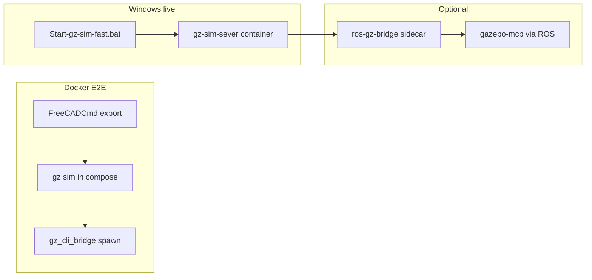

# Gazebo lifecycle (live + E2E)

Canonical Python module: [`bridge/gazebo_lifecycle.py`](../bridge/gazebo_lifecycle.py).

Shared shell: [`scripts/gazebo_lifecycle_common.sh`](../scripts/gazebo_lifecycle_common.sh).

## Quick start (Windows + WSL)

| Step | Command |
| --- | --- |
| 1. Export robot (once) | `.\scripts\run_freecad_script.ps1 .\scripts\export_arm_2dof_fcstd.py` |
| 2. Start gz-sim (fast) | `Start-gz-sim-fast.bat` **or** source build: `Start-gz-sim.bat` |
| 3. Start ros_gz (optional MCP pause/reset) | `Start-gazebo-bridge.bat` |
| 4. Live pytest / handoff | `set GAZEBO_MCP_DOCKER=1` + `set RUN_GAZEBO_LIVE=1` |
| Stop / cleanup | `Stop-gz-stack.bat` |

Smoke (no containers required):

```bash
bash scripts/smoke_gz_lifecycle.sh
bash scripts/smoke_gz_lifecycle.sh --docker   # after stack is up
```

## World naming (normalized)

| Artifact | World name | SDF path |
| --- | --- | --- |
| Project default | **`empty_world`** | `worlds/empty_world.sdf` |
| Legacy OSRF only | `empty` | `/usr/share/gz/gz-sim*/worlds/empty.sdf` |

**Rule:** `GZ_SIM_WORLD_NAME` and `GAZEBO_WORLD_NAME` must match the `<world name="…">` in the loaded SDF.

Fast/source live stacks now load **`worlds/empty_world.sdf`** when present (same as Docker E2E).

## Stack profiles



| Profile | Entry | gz world | Spawn path | ros_gz |
| --- | --- | --- | --- | --- |
| **e2e** | `docker compose -f docker/compose.e2e.yml up …` | `empty_world` | `gz_cli_bridge` in container | No |
| **live_fast** | `Start-gz-sim-fast.bat` | `empty_world` | `gazebo_gz_docker` + `gz service` | Optional sidecar |
| **live_source** | `Start-gz-sim.bat` | `empty_world` (or `empty` fallback) | Same | Optional sidecar |

## Environment variables

See [`config/gazebo-lifecycle.env.example`](../config/gazebo-lifecycle.env.example).

| Variable | Default | Purpose |
| --- | --- | --- |
| `GZ_SIM_CONTAINER_NAME` | `gz-sim-sever` | gz-sim Docker container |
| `ROS_GZ_BRIDGE_CONTAINER` | `ros-gz-bridge` | ros_gz sidecar |
| `GZ_SIM_WORLD_NAME` | `empty_world` | gz service namespace |
| `GAZEBO_WORLD_NAME` | `empty_world` | ros_gz bridge namespace |
| `GAZEBO_MCP_DOCKER` | unset | Run gazebo-mcp attached to gz container network |
| `GAZEBO_SPAWN_VIA_GZ_CLI` | `1` when docker MCP | Spawn via `docker exec gz …` |
| `GZ_SIM_RESOURCE_PATH` | `/models` | RobotCAD package mount in container |
| `E2E_VERSION_STRICT` | `1` in compose | Fail E2E on version drift |

## ros_gz vs gz CLI

| Operation | Preferred path | Why |
| --- | --- | --- |
| **Spawn URDF** | **gz CLI** (`gazebo_gz_docker`, `gz_cli_bridge`) | ros_gz `create` often hangs from Windows→WSL |
| **Unpause / remove** | gz CLI | Same reliability |
| **MCP pause / reset / step** | ros_gz via `gazebo-mcp` | When `Start-gazebo-bridge.bat` is healthy |
| **Docker E2E** | gz CLI only | No ros_gz in single E2E container |

Default when `GAZEBO_MCP_DOCKER=1`: `GAZEBO_SPAWN_VIA_GZ_CLI=1` (see `bridge/gazebo_gz_docker.use_gz_docker_spawn`).

## Restart behavior

| Script | When to use |
| --- | --- |
| `scripts/ensure_gz_sim_headless.sh` | After RobotCAD re-export; syncs `/models`, restarts gz with `empty_world.sdf`, recreates bridge |
| `scripts/restart_ros_gz_bridge.sh` | Bridge hung; kills `parameter_bridge`, re-bridges, unpauses |
| `scripts/stop_gz_stack.sh` / `Stop-gz-stack.bat` | Full cleanup before a fresh `run_gz_sim_fast` or E2E |

`Start-gz-sim.sh` removes a **stopped** `gz-sim-sever` before rebuild; if already **running**, it exits 0 (no duplicate container).

## Related docs

- [freecad_gazebo_mcp_task_breakdown.md](freecad_gazebo_mcp_task_breakdown.md) — phase checklist
- [docker-e2e-reproducibility.md](docker-e2e-reproducibility.md) — image/apt pins
